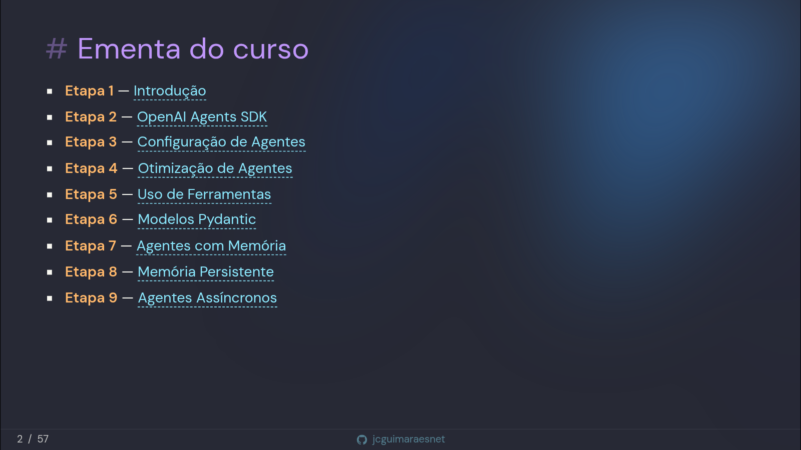

<div align="center">

# 🤖 Curso: Agentes de IA com Python

Apresentação (slides) do curso <br/>
**Fundamentos de Agentes com Python e APIs — Desenvolvimento de Agentes Inteligentes**

<br/>

[](https://jcguimaraesnet.github.io/course-intelligent-agents/ai-agents/)
[](https://sli.dev)
[](https://www.python.org)
[](https://github.com/jcguimaraesnet)

</div>

<br/>

## 📚 Ementa do curso

<div align="center">
  
</div>

<br/>

## 🖥️ Rodando os decks no VS Code

O repositório tem mais de um deck na raiz (`slides-*.md`). A extensão
[antfu.slidev](https://marketplace.visualstudio.com/items?itemName=antfu.slidev)
trabalha com **um projeto ativo por vez**, então a primeira execução de cada deck
exige três passos no Command Palette (`Ctrl+Shift+P`):

| # | Comando | Quando usar |
|---|---------|-------------|
| 1 | `Slidev: Choose active slides entry` | escolhe o deck ativo |
| 2 | `Slidev: Configure preview port` | define a porta **desse** deck |
| 3 | `Slidev: Start slidev dev server` | sobe o servidor do deck ativo |

Portas em uso neste repo:

| Deck | Porta |
|------|-------|
| `slides-ai-agents.md` | 3030 |
| `slides-n8n.md` | 3131 |

**Para alternar entre os decks depois que ambos já estão rodando, basta o passo 1.**
Cada deck tem seu próprio terminal, então trocar o ativo não derruba o outro
servidor — o preview apenas re-aponta, sem rebuild. Os passos 2 e 3 são
necessários só uma vez por deck, a cada sessão.

Se quiser os dois decks visíveis ao mesmo tempo, use o navegador em
`localhost:3030` e `localhost:3131` — a janela de preview do VS Code é única e
sempre segue o projeto ativo.

<br/>

### ⚠️ Duas armadilhas

**A porta não é persistida.** A extensão só guarda qual é o projeto ativo; a porta
definida no passo 2 vive em memória. Depois de um *Reload Window*, todo deck volta
ao default `slidev.port` (3030) — e o segundo a subir escorrega para 3031 sozinho,
porque o Vite auto-incrementa quando a porta está ocupada. O preview continua
apontando para a porta que a extensão *acha* que atribuiu, e mostra o deck errado.
Por isso o passo 2 vem **antes** do 3: a porta é injetada no comando quando o
terminal é criado.

**Servidores órfãos sobrevivem ao fechamento dos terminais.** Se o preview mostrar
conteúdo desatualizado, verifique o que está de pé antes de investigar qualquer
outra coisa:

```bash
ss -ltnp | grep -E ':3[01][0-9][0-9]'
```

<br/>

### Alternativa sem a extensão

Determinístico e versionado, ao custo de perder o preview inline:

```bash
pnpm exec slidev slides-ai-agents.md --port 3030 --strictPort --open
pnpm exec slidev slides-n8n.md       --port 3131 --strictPort --open
```

O `--strictPort` faz o Slidev falhar em vez de trocar de porta silenciosamente.

<br/>

## ⚙️ Configuração da extensão

A extensão procura `**/slides.md` por padrão — nome que este repo não usa. O glob
está ampliado em [`.vscode/settings.json`](.vscode/settings.json):

```json
{ "slidev.include": ["**/slides-*.md"] }
```

> **Atenção:** `slidev.include` é *window-scoped*. Em workspace multi-root o VS Code
> **ignora** esse arquivo — nesse caso a configuração precisa estar no `.code-workspace`.

<br/>

---

<div align="center">

### ⭐ Gostou do conteúdo?

Deixe uma **star** no repositório! <br/>
É o que me incentiva a manter o material atualizado e a publicar as próximas etapas.

[](https://github.com/jcguimaraesnet/course-intelligent-agents)

</div>
