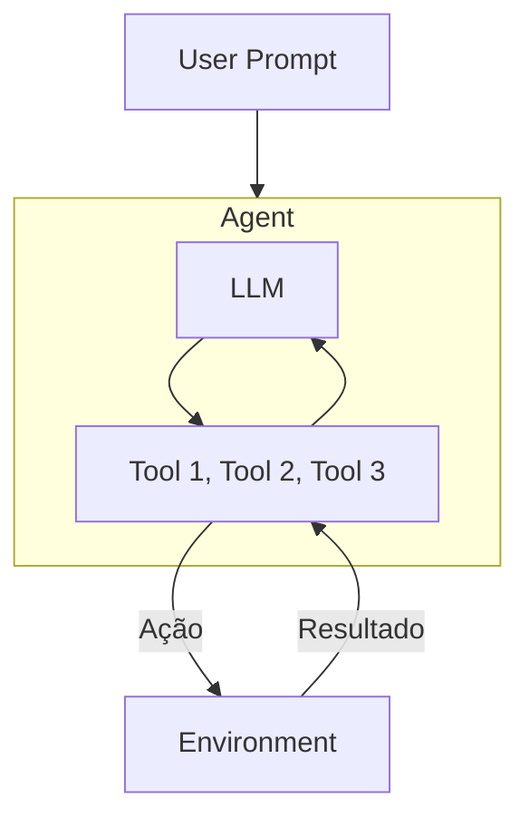

## **Etapa 5:** Uso de Ferramentas

---
layout: two-cols-header
layoutClass: gap-8
class: flex items-start justify-center
---

# O que é chamada de ferramenta (tool calling)

#### **O conceito de _tool calling_ também é conhecido como _function calling_**

::left::

> [!IMPORTANT]
> O LLM não executa a ferramenta: ele **decide** chamá-la e devolve os argumentos; quem executa é a **aplicação**, que retorna o resultado ao modelo.

::right::

<Transform :scale="0.70" origin="top">

</Transform>

<!--
# tool calling = function calling: o modelo indica qual função chamar e com quais argumentos (em JSON), mas NÃO roda a função.

# quem executa a função é a aplicação (nosso código); o retorno é devolvido ao modelo como observação.

# o modelo pode encadear várias chamadas antes de produzir a resposta final ao usuário.
-->
