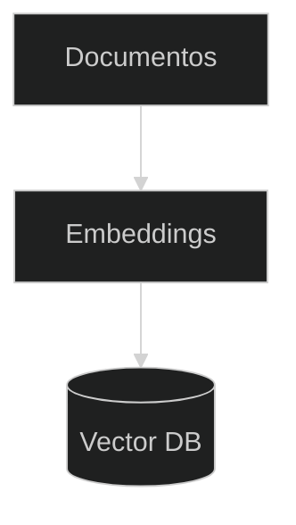

## **Etapa 7:** Agentes com Memória

---
layout: two-cols-header
layoutClass: gap-8
class: flex items-center justify-center
---

# Padrões de memória e conhecimento

#### **Agentes possuem memória e conhecimento com padrões bem conhecidos**

<div class="h-1" />

::left::

<div class="text-17px w-full self-start [&_ul]:my-6 [&_li]:mb-4">

- **Memória de curto prazo** — histórico da conversa dentro da sessão.
- **Memória de longo prazo** — persistência entre sessões.
- **Conhecimento de treinamento** — o que o modelo guarda nos seus pesos internos.
- **Conhecimento recuperado** — dados em tempo real com recuperação de informação (RAG).

</div>

::right::

<div class="h-full flex items-start justify-center">
    <AssetImg src="agent-memory-knowledge-pattern.png" class="w-full max-w-[380px] rounded-lg mt-[30px]" />
</div>

---
layout: two-cols-header
layoutClass: gap-8
sourceLabel: Conversations
source: https://openai.github.io/openai-agents-python/running_agents/
---

# Agente com histórico de mensagens (manual)

#### **Exemplo de histórico de mensagens gerenciando manualmente**

<div class="h-2" />

::left::

```python [main.py] {16,19,22-23|all}{maxHeight:'320px',at:+1}
import asyncio
from dotenv import load_dotenv
from agents import (Agent, Runner,
                    set_default_openai_api, set_tracing_disabled)

agent = Agent(
    name="Assistente",
    instructions="Você é um assistente pessoal",
)

async def main():
    load_dotenv()
    set_default_openai_api("chat_completions")
    set_tracing_disabled(True)

    messages = []
    while True:
        question = input("You: ")
        messages.append({"role": "user", "content": question})
        result = await Runner.run(starting_agent=agent, input=messages)
        print("Agent: ", result.final_output)
        messages.append(
            {"role": "assistant", "content": result.final_output})

if __name__ == "__main__":
    asyncio.run(main())
```

::right::

> [!IMPORTANT]
> O array **messages** é uma lista de **Response InputItem**, construída manualmente.
> 
> Cada mensagem é escrita de forma **verbosa**: as chaves role, content, user, assistant, estrutura do objeto, tudo na mão.

<!--
## sem histórico, cada Runner.run é isolado: o agente não lembra do turno anterior. Acumular messages dá memória de curto prazo à conversa.

## o input do Runner aceita uma lista de ResponseInputItem (o mesmo formato de messages[] do chat completions).

## a cada volta: acrescenta a pergunta do usuário, roda, imprime, e acrescenta a resposta do assistente ao histórico.

## verboso e propenso a erro: você monta na mão cada dict com "role"/"content"; esquecer de anexar a resposta quebra a memória.

## input() é bloqueante; num serviço real troque o while True por um handler de requisições.
-->

---
layout: two-cols-header
layoutClass: gap-8
sourceLabel: Conversations
source: https://openai.github.io/openai-agents-python/running_agents/
---

# Agente com histórico de mensagens (polido)

#### **Exemplo de histórico de mensagens melhor gerenciado com `to_input_list()`**

<div class="h-2" />

::left::

```python [main.py] {16,22|all}{maxHeight:'320px',at:+1}
import asyncio
from dotenv import load_dotenv
from agents import (Agent, Runner, TResponseInputItem,
                    set_default_openai_api, set_tracing_disabled)

agent = Agent(
    name="Assistente",
    instructions="Você é um assistente pessoal",
)

async def main():
    load_dotenv()
    set_default_openai_api("chat_completions")
    set_tracing_disabled(True)

    messages: list[TResponseInputItem] = []
    while True:
        question = input("You: ")
        messages.append({"role": "user", "content": question})
        result = await Runner.run(starting_agent=agent, input=messages)
        print("Agent: ", result.final_output)
        messages = result.to_input_list()

if __name__ == "__main__":
    asyncio.run(main())
```

::right::

> [!IMPORTANT]
> `result.to_input_list()` devolve **todo o histórico** já no formato **ResponseInputItem**.
> 
> Inclui o que você enviou **e tudo que o agente gerou**, evitando o acúmulo manual e propenso a erro.

<!--
## to_input_list() reconstrói a lista de entrada a partir do resultado: entrada original + todos os itens novos gerados no run.

## substitui o append manual da resposta: menos código, sem esquecer campos, e captura mais do que só texto (ex.: chamadas de ferramenta).

## a pergunta do usuário ainda é anexada antes do run; o to_input_list cuida do resto do histórico após o run.

## é o padrão recomendado para manter conversas multi-turno no Agents SDK sem gerenciar o formato à mão.
-->

---
layout: two-cols-header
layoutClass: gap-8
sourceLabel: Sessions
source: https://openai.github.io/openai-agents-python/sessions/
---

# Agente com histórico de mensagens (sessão)

#### **Exemplo de histórico gerenciado automaticamente com `SQLiteSession`**

<div class="h-2" />

::left::

```python [main.py] {16,20|all}{maxHeight:'320px',at:+1}
import asyncio
from dotenv import load_dotenv
from agents import (Agent, Runner, SQLiteSession,
                    set_default_openai_api, set_tracing_disabled)

agent = Agent(
    name="Assistente",
    instructions="Você é um assistente pessoal",
)

async def main():
    load_dotenv()
    set_default_openai_api("chat_completions")
    set_tracing_disabled(True)

    session = SQLiteSession("first_session", db_path="messages.db")
    while True:
        question = input("You: ")
        result = await Runner.run(starting_agent=agent,
                                  input=question, session=session)
        print("Agent: ", result.final_output)

if __name__ == "__main__":
    asyncio.run(main())
```

::right::

> [!IMPORTANT]
> Com uma `Session`, o SDK grava e recupera o histórico de forma automática.
> 
> Com `SQLiteSession` a conversa é persistida no disco e sobrevive ao reinício do programa.

<!--
## evolução dos 2 slides anteriores: nada de messages, append ou to_input_list. A sessão cuida de armazenar e reinjetar o histórico.

## você passa apenas a pergunta nova (input=question); a Session antepõe automaticamente o histórico salvo antes de chamar o modelo.

## db_path=":memory:" (padrão) guarda em memória e some ao encerrar; com um arquivo (messages.db) a conversa é persistida.

## o session_id ("first_session") isola conversas: sessões diferentes = históricos independentes no mesmo banco.

## há outros backends de Session (ex.: em memória, Redis, etc.); SQLiteSession é o mais simples para persistência local.
-->

---
layout: two-cols-header
layoutClass: gap-8
class: flex items-start justify-center
---

# RAG - Retrieve Augmented Generation

#### **RAG amplia a capacidade de resposta de LLMs usando bases externas**

::left::

<div class="text-left w-full self-start [&_ul]:my-0 [&_li]:mb-3">

<div class="h-5" />

RAG consiste em três etapas:

- **Recuperar:** recupera informações relevantes com base na solicitação do usuário.
- **Aumentar:** adiciona as informações recuperadas como contexto ao prompt do usuário.
- **Gerar:** o LLM produz uma resposta com base no contexto e no prompt do usuário.

</div>

::right::

<div class="flex flex-col items-center">

<div class="h-0" />

<Transform :scale="0.65" origin="top">

```mermaid {theme: 'dark', flowchart: { subGraphTitleMargin: { top: 10, bottom: 10 } }}
---
config:
  theme: dark
  flowchart:
    subGraphTitleMargin:
      top: 10
      bottom: 10
---
flowchart TD
Prompt["Prompt"]
subgraph RAG["RAG"]
  Retrieve["Retrieve"]
  Augment["Augment"]
  Generate["Generate"]
  Retrieve --> Augment --> Generate
end
Answer["Answer"]
Prompt --> Retrieve
Generate --> Answer
```

</Transform>

</div>

<!--
## RAG: Recuperação aumentada por recuperação
-->

---
layout: quote-image
image: /rag-icon.png
---

::title::

# Porque usar RAG?

<div class="h-15" />

::default::

O conhecimento do LLM, que vem do treinamento, é **interno, estático, fixo e público**. O RAG permite adicionar conhecimento **externo, dinâmico, evolutivo e privado**.

&nbsp;

---
layout: two-cols-header
layoutClass: gap-8
class: flex items-start justify-center
---

# RAG: dois tipos de recuperação

#### **A abordagem de recuperar pode mudar quando o dado é estruturado ou não estruturado**

::left::

<div class="text-left w-full self-start [&_ul]:my-0 [&_li]:mb-3">

<div class="h-20" />

- **Dado estruturado:** chamada de ferramenta usando API ou consultas a bancos de dados (já visto na etapa 5).
- **Dado não estruturado:** busca semântica em corpus de textos **(PDF, Docx, HTML)** armazenados como vetores de dados.

</div>

::right::

<div class="flex flex-col items-center">

<div class="h-10" />

```mermaid {theme: 'dark', flowchart: { subGraphTitleMargin: { top: 50, bottom: 10 } }}
---
config:
  theme: dark
  flowchart:
    subGraphTitleMargin:
      top: 10
      bottom: 10
---
flowchart TD
Retriever["Retriever"]
Data{"Data"}
Structured["Structured"]
NotStructured["Not structured"]
DBAPI["Database / API / JSON"]
Embeddings["Embeddings"]
Retriever --> Data
Data --> Structured
Data --> NotStructured
Structured --> DBAPI
NotStructured --> Embeddings
```

</div>

---
layout: two-cols-header
layoutClass: gap-8
sourceLabel: Tools
source: https://openai.github.io/openai-agents-python/tools/
---

# RAG com dados estruturados

#### **Exemplos de dados estruturados: API, banco de dados, arquivo csv, json, xml**

<div class="h-2" />

::left::

```python [main.py] {7-14,19|all}{maxHeight:'320px',at:+1}
import asyncio
import requests
from dotenv import load_dotenv
from agents import (Agent, Runner, function_tool,
                    set_default_openai_api, set_tracing_disabled)

@function_tool
def get_price_of_bitcoin() -> str:
    """Get the price of Bitcoin."""
    url = ("https://api.coingecko.com/api/v3/simple/price"
           "?ids=bitcoin&vs_currencies=usd")
    response = requests.get(url)
    price = response.json()["bitcoin"]["usd"]
    return f"${price:,.2f} USD."

crypto_agent = Agent(
    name="Assistente Cripto",
    instructions=("Você é um assistente de criptomoedas. "
                  "Use ferramentas para obter dados em tempo real."),
    tools=[get_price_of_bitcoin],
)

async def main():
    load_dotenv()
    set_default_openai_api("chat_completions")
    set_tracing_disabled(True)

    result = await Runner.run(starting_agent=crypto_agent,
                              input="Qual é o preço do Bitcoin?")
    print(result.final_output)

if __name__ == "__main__":
    asyncio.run(main())
```

::right::

> [!NOTE]
> O uso de **tool function** não é obrigatório para caracterizar um sistema de RAG, mas simplifica o sistema.
> 
> O resultado da tool function é adicionado como **contexto ao prompt do usuário**.

---
layout: quote-image
image: /embeddings.png
---

::title::

# RAG, dados não estruturados e embeddings

<div class="h-15" />

::default::

**Embeddings** são representações vetoriais de palavras, e é um dos meios mais comuns de se **compreender contexto** e **semântica da linguagem humana** na área de _Natural Language Processing_ (NLP).

&nbsp;

<!--

## Explicação da imagem: Palavras viram vetores de números

## Processamento de linguagem natural (NLP) é um subcampo da ciência da computação e da inteligência artificial (IA) que usa aprendizado de máquina para permitir que computadores entendam e se comuniquem com a linguagem humana.

-->

---
layout: two-cols-header
layoutClass: gap-8
class: flex items-center justify-center
---

# Porque usar embeddings?

#### **Embeddings permite a _busca semântica_ em grandes volumes de textos**

<div class="h-1" />

::left::

<div class="text-17px w-full self-start [&_ul]:my-0 [&_li]:mb-4">

- Quando a resposta a uma pergunta é uma informação **estruturada** em banco de dados/API, basta uma query/request.
- E quando a resposta a uma pergunta está em um **parágrafo** de um documento com centenas de páginas, **como identificar esse parágrafo?**
- Os embeddings são indicados para cenários com **dados não estruturados**, armazenados tipicamente em grandes documentos **(pdf, html, docx, txt)**

</div>

::right::

<Transform :scale="0.6" origin="top">

<div class="h-full flex items-start justify-center">
    <AssetImg src="pdf-page.png" class="w-full max-w-[380px] rounded-lg mt-[10px]" />
</div>

</Transform>

---
layout: two-cols-header
layoutClass: gap-8
class: flex items-center justify-center
---

# Busca semântica por similaridade de cosseno 

#### **A busca por similaridade é o "equivalente" a uma query de igualdade em banco de dados**

<div class="h-2" />

::left::

<div class="text-16px w-full self-start [&_ul]:my-0 [&_li]:mb-4">

- Cada palavra é um **vetor** com centenas de índices (dimensões), onde cada índice representa uma característica.
- As palavras **aeronave** e **avião** têm representações vetoriais com números parecidos, portanto mais **similares**.
- A **similaridade de cosseno** é um dos algoritmos matemáticos mais usados para comparar dois trechos de texto, usando seu significado semântico (os embeddings).

</div>

::right::

<div class="h-full flex items-start justify-center">
    <AssetImg src="embeddings.png" class="w-full max-w-[380px] rounded-lg mt-[8px]" />
</div>

---
layout: default
---

# A similaridade de cosseno (em detalhes)

#### **Similaridade de cosseno calcula a similaridade entre dois vetores, resultando entre 0 e 1**

<br/>

<div class="[&_table]:w-full text-12px leading-tight [&_td]:py-2 [&_th]:py-3">

| User Prompt | Embedding | Frases (de uma notícia) | Embedding | Similaridade Cosseno |
| --- | --- | --- | --- | --- |
| Quem gosta de jogar poker? | `[0.91, 0.12, 0.40, …]` | Neymar aprecia jogos de poker | `[0.89, 0.15, 0.42, …]` | **0.98** |
| Quem gosta de jogar poker? | `[0.91, 0.12, 0.40, …]` | Neymar deve jogar poker amanhã | `[0.74, 0.33, 0.58, …]` | **0.85** |
| Quem gosta de jogar poker? | `[0.91, 0.12, 0.40, …]` | Poker é um jogo difícil | `[0.31, 0.76, 0.54, …]` | **0.71** |
| Quem gosta de jogar poker? | `[0.91, 0.12, 0.40, …]` | Poker exige muita estratégia | `[0.26, 0.81, 0.49, …]` | **0.67** |

</div>

<div class="h-25" />

<Transform :scale="0.7" origin="left bottom">

> [!NOTE]
> **Similaridade próxima de 1:** os textos são muito semelhantes ou têm contexto/significado parecido.
> **Similaridade próxima de 0:** os textos não têm relação.

</Transform>

<!--
## os valores dos embeddings e das similaridades são fictícios, apenas para ilustrar a ideia.

## o mesmo prompt é comparado com cada frase; a frase mais próxima em significado ("aprecia" ≈ "gosta") tem a maior similaridade (0.98).

## "Poker é um jogo difícil" e "exige estratégia" falam de poker, mas não de gostar/jogar → similaridade menor.

## na prática o vetor tem centenas/milhares de dimensões; aqui mostramos só os primeiros índices.
-->

---
layout: two-cols-header
layoutClass: gap-8
class: flex items-start justify-center
---

# RAG: dois fluxos independentes

#### **Sistemas RAG se dividem em dois momentos: indexação e recuperação/geração**

::left::

<div class="text-left w-full self-start [&_ul]:my-0 [&_li]:mb-4">

<div class="h-5" />

- **Indexação:** carrega os documentos, gera os vetores _embeddings_ e guarda em um banco de dados vetorial.
- **Recuperação e geração:** na pergunta do usuário, busca os trechos mais parecidos, junta ao prompt e o LLM gera a resposta.

</div>

::right::

<div class="flex flex-row items-start justify-center gap-2">

<div class="flex flex-col items-center">

<div class="text-center text-sm">Indexação</div>

<Transform :scale="0.6" origin="top">



</Transform>

</div>

<div class="flex flex-col items-center">

<div class="text-center text-sm">Recuperação e Geração</div>

<Transform :scale="0.6" origin="top">

```mermaid {theme: 'dark', flowchart: { subGraphTitleMargin: { top: 10, bottom: 10 } }}
---
config:
  theme: dark
  flowchart:
    subGraphTitleMargin:
      top: 10
      bottom: 10
---
flowchart TD
Prompt["Prompt"]
subgraph RAG["RAG"]
  Retrieve["Retrieve"]
  Augment["Augment"]
  Generate["Generate"]
  Retrieve --> Augment --> Generate
end
Answer["Answer"]
Prompt --> Retrieve
Generate --> Answer
```

</Transform>

</div>

</div>

---
layout: two-cols-header
layoutClass: gap-8
sourceLabel: Tools
source: https://openai.github.io/openai-agents-python/tools/
---

# RAG: exemplo simples

#### **Exemplo abaixo com sistema RAG com ingestão e recuperação**

<div class="h-2" />

::left::

```python [main.py] {8,17,22|all}{maxHeight:'320px',at:+1}
import asyncio
import numpy as np
from dotenv import load_dotenv
from sentence_transformers import SentenceTransformer
from agents import (Agent, Runner, function_tool,
                    set_default_openai_api, set_tracing_disabled)

model = SentenceTransformer("all-MiniLM-L6-v2")  # roda em CPU

# Corpus "não estruturado" indexado em memória (sem DB)
docs = [
    "O Pantanal é a maior planície alagável do mundo.",
    "A capital da França é Paris.",
    "O Bitcoin foi criado por Satoshi Nakamoto em 2009.",
]

doc_vectors = model.encode(docs, normalize_embeddings=True)  # indexação

@function_tool
def buscar_contexto(pergunta: str) -> str:
    """Recupera o trecho mais relevante do corpus para a pergunta."""
    q = model.encode([pergunta], normalize_embeddings=True)[0]
    scores = doc_vectors @ q          # cosseno (vetores já normalizados)
    for doc, score in zip(docs, scores):
        print(f"{score:.3f}  {doc}")
    return docs[int(np.argmax(scores))]

rag_agent = Agent(
    name="Assistente RAG",
    instructions=("Use a ferramenta buscar_contexto para recuperar "
                  "informação e responda apenas com base nela."),
    tools=[buscar_contexto],
)

async def main():
    load_dotenv()
    set_default_openai_api("chat_completions")
    set_tracing_disabled(True)

    result = await Runner.run(starting_agent=rag_agent,
                              input="Quem criou o Bitcoin?")
    print(f"Resposta: {result.final_output}")

if __name__ == "__main__":
    asyncio.run(main())
```

::right::

> [!IMPORTANT]
> A **indexação** e a **recuperação** devem usar o mesmo modelo de embedding.
> 
> Neste exemplo os vetores **embeddings** são gerados com a lib **SentenceTransformer** (local, sem custo), e não pela API da OpenAI (nuvem, com custo).

---
layout: section
---

## Live Coding
📚 **Agente:** bibliotecário que responde sobre políticas de empréstimo e devolução.

##### **1. Crie cinco políticas diferentes (empréstimo/devolução)**
##### **2. Faça a indexação das políticas como embeddings (memória)**
##### **3. Crie o pipeline de recuperação/geração RAG**
##### **4. Execute um prompt sobre um texto que existe nos embeddings**
##### **5. Execute um prompt sobre um texto que NÃO exista (defina um threshold)**
##### **6. Adicione histórico de conversa para respostas com memória (além do RAG)**
##### **7. Teste um prompt que responde a partir da memória, e outro do RAG**

<!--
=================================================================
main.py — RAG de políticas da biblioteca (embeddings em memória)

import asyncio
import numpy as np
from dotenv import load_dotenv
from sentence_transformers import SentenceTransformer
from agents import (Agent, Runner, function_tool,
                    set_default_openai_api, set_tracing_disabled)

model = SentenceTransformer("all-MiniLM-L6-v2")

# 1. Cinco políticas de empréstimo/devolução
policies = [
    "O prazo de empréstimo padrão é de 14 dias corridos.",
    "Cada usuário pode ter no máximo 5 livros emprestados ao mesmo tempo.",
    "A renovação pode ser feita 2 vezes, se não houver reserva do título.",
    "O atraso na devolução gera multa de R$ 1,00 por dia por livro.",
    "Livros de referência só podem ser consultados no local, sem empréstimo.",
]

# 2. Indexação das políticas como embeddings (em memória)
policy_vectors = model.encode(policies, normalize_embeddings=True)

THRESHOLD = 0.35  # similaridade mínima para considerar relevante

# 3. Pipeline de recuperação (a geração fica a cargo do agente)
@function_tool
def buscar_politica(pergunta: str) -> str:
    """Recupera a política mais relevante para a pergunta do usuário."""
    q = model.encode([pergunta], normalize_embeddings=True)[0]
    scores = policy_vectors @ q
    for pol, score in zip(policies, scores):
        print(f"{score:.3f}  {pol}")
    best = int(np.argmax(scores))
    if scores[best] < THRESHOLD:
        return "NENHUMA_POLITICA_RELEVANTE"
    return policies[best]

bibliotecario = Agent(
    name="Bibliotecário",
    instructions=(
        "Responda sobre políticas de empréstimo e devolução usando a "
        "ferramenta buscar_politica. Se ela retornar "
        "'NENHUMA_POLITICA_RELEVANTE', diga que não há política sobre o tema."
    ),
    tools=[buscar_politica],
)

async def perguntar(texto: str):
    result = await Runner.run(starting_agent=bibliotecario, input=texto)
    print(f"\nP: {texto}\nR: {result.final_output}\n")

async def main():
    load_dotenv()
    set_default_openai_api("chat_completions")
    set_tracing_disabled(True)

    # 4. Pergunta cuja resposta EXISTE nos embeddings
    await perguntar("Qual é a multa por atraso na devolução?")
    # 5. Pergunta FORA do corpus (cai no threshold)
    await perguntar("A biblioteca tem uma cafeteria?")

if __name__ == "__main__":
    asyncio.run(main())

=================================================================
## o threshold (0.35) evita "alucinar" contexto: sem política relevante, o agente admite que não sabe.
## ajuste o valor observando os scores impressos pela tool para calibrar o corte.
-->

---
layout: default
---

# Hands-on

<br/>

🛠️ &nbsp;**Exercício \#1:** Crie um corpus com cinco frases e gere seus embeddings em memória.

🛠️ &nbsp;**Exercício \#2:** Implemente a busca por similaridade de cosseno e imprima o score de cada frase.

🛠️ &nbsp;**Exercício \#3:** Monte um agente RAG com uma tool que recupera o trecho mais parecido.

🛠️ &nbsp;**Exercício \#4:** Adicione um threshold para o agente admitir quando não há resposta.

<br/>

- [ ] gere os vetores das frases uma vez e guarde em memória
- [ ] compare a pergunta com cada frase e mostre os scores
- [ ] recupere o trecho mais similar dentro de uma tool
- [ ] defina um corte mínimo e trate a ausência de contexto

<br/>

<!--
# Exercício #1 — Indexação
Crie uma lista de cinco frases e gere os embeddings com SentenceTransformer.
Guarde os vetores em memória para reusar nas buscas seguintes.

# Exercício #2 — Similaridade de cosseno
Vetorize a pergunta e calcule a similaridade contra cada frase.
Imprima o score de todas para entender por que uma vence.

# Exercício #3 — Agente RAG
Coloque a recuperação numa tool e conecte ao agente.
A tool devolve o trecho mais parecido, que vira contexto da resposta.

# Exercício #4 — Threshold
Defina um valor mínimo de similaridade. Abaixo dele, a tool sinaliza
ausência de contexto e o agente responde que não sabe.
-->

