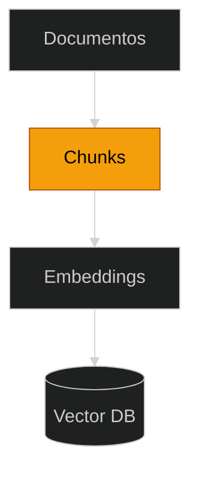

## **Etapa 8:** Memória Persistente

---
layout: two-cols-header
layoutClass: gap-8
class: flex items-start justify-center
---

# RAG: indexação em fragmentos (chunks)

#### **Indexar um documento em fragmentos (chunks) pode melhorar a recuperação**

::left::

<div class="text-lg w-full self-start [&_ul]:my-5 [&_li]:mb-4">

<div class="h-5" />

- Em sistemas RAG, a fragmentação consiste em **dividir um texto** longo em segmentos menores, permitindo injetar contextos menores nos LLMs.
- A fragmentação ajuda LLMs a se concentrar **nas partes mais importantes do texto** e a evitar partes irrelevantes ou repetitivas.
<!--

- Também ajuda a reduzir o custo e a latência nas chamadas dos LLMs, além de aprimorar a qualidade e a relevância das respostas.
-->

</div>

::right::

<div class="flex flex-col items-center justify-center w-full">

<div class="text-center text-sm my-1">Indexação</div>

<Transform :scale="0.75" origin="top">



</Transform>

</div>

---
layout: default
---

# RAG: chunks e janelas de contextos

#### **Uma das razões do uso de chunks se dá pela limitação da janela de contexto dos LLMs**

<br/>

<div class="[&_table]:w-full text-14px">

| LLM | Janela de contexto | Qtde páginas (aprox.) |
| --- | --- | --- |
| Turbo GPT-3.5 | 4 mil tokens | 5 páginas |
| GPT-4 | 8 mil tokens | 10 páginas |
| GPT-4 32K | 32 mil tokens | 40 páginas |
| GPT-4 Turbo, GPT-4o | 128 mil tokens | 300 páginas |

</div>

<div class="h-8" />

<Transform :scale="0.8" origin="left bottom">

> [!NOTE]
> Mesmo embora o tamanho das janelas de contexto tenha aumentado recentemente, o uso de chunks continuará sendo uma boa técnica para gerenciamento de contexto, custo e latência.

</Transform>

---
layout: default
---

# RAG: estratégias de chunks

#### **Existem algumas abordagens comuns para divisão de textos longos em chunks**

<br/>

<div class="[&_table]:w-full text-16px leading-tight [&_td]:py-3 [&_th]:py-3 [&_td:first-child]:whitespace-nowrap [&_th:first-child]:whitespace-nowrap">

| Abordagem | Descrição |
| --- | --- |
| **Comprimento fixo** | Divide o documento em blocos fixos de palavras, mantendo os chunks com o mesmo tamanho. É a abordagem mais simples. |
| **Janela deslizante** | Divide o documento em blocos fixos de palavras, com sobreposição da janela anterior e próxima. |
| **Por pontuação** | Divide o documento com base na pontuação, preservando integridade semântica mas resultando em tamanhos pequenos e variáveis. |
| **Por tópico ou seção** | Divie o documento com base em suas seções ou parágrafos (quando o documentos está estruturado dessa forma). |

</div>

---
layout: two-cols-header
layoutClass: gap-8
class: flex items-start justify-center
---

# RAG: chunk de tamanho fixo

#### **Um exemplo de documento com chunk de tamanho fixo**

::left::

<div class="text-lg w-full self-start [&_ul]:my-5 [&_li]:mb-4">

<div class="h-5" />

- É a abordagem mais simples, mas às vezes pode **fragmentar informações** que, idealmente, deveriam ser mantidas juntas (coesão semântica).
- No exemplo ao lado, um documento (constituição do Reino Unido), onde **cada cor é um chunk** de tamanho fixo, abrangendo parte de parágrafos.

</div>

::right::

<div class="h-full flex items-center justify-center">
    <AssetImg src="chunk-fixed-sizing.png" class="w-full max-w-[420px] rounded-lg" />
</div>

---
layout: two-cols-header
layoutClass: gap-8
sourceLabel: Text Splitters
source: https://python.langchain.com/docs/how_to/character_text_splitter/
---

# RAG: chunk por parágrafo

#### **Usando o pacote do langchain para fazer chunk por parágrafo, tamanho máximo e overlap**

<div class="h-2" />

::left::

```python [chunking.py] {6-7|all}{at:+1}
# uv add langchain-text-splitters
from langchain_text_splitters import (
    CharacterTextSplitter)

splitter = CharacterTextSplitter(
    separator=r"\n\s*\n",
    is_separator_regex=True,
    chunk_size=500,
)
chunks = splitter.split_text(texto)
```

::right::

> [!IMPORTANT]
> O **CharacterTextSplitter** corta o texto em **parágrafos** (regex `\n\s*\n`) e os aglutina em chunks de **até 500 caracteres** (`chunk_size`).
> 
> `is_separator_regex=True` faz o separador ser interpretado como **expressão regular** — aqui, "uma linha em branco entre parágrafos".

---
layout: two-cols-header
layoutClass: gap-8
sourceLabel: Tools
source: https://openai.github.io/openai-agents-python/tools/
---

# RAG: exemplo com chunk

#### **Exemplo abaixo com sistema RAG com ingestão (chunk) e recuperação**

<div class="h-2" />

::left::

```python [main.py] {21,31,34,67-68|all}{maxHeight:'320px',at:+1}
# uv add numpy
# uv add python-dotenv
# uv add datasets
# uv add sentence-transformers
# uv add langchain-text-splitters
# uv add openai-agents

import asyncio
import numpy as np
from dotenv import load_dotenv
from datasets import load_dataset
from sentence_transformers import SentenceTransformer
from langchain_text_splitters import CharacterTextSplitter
from agents import (Agent, Runner, function_tool,
                    set_default_openai_api, set_tracing_disabled)

# carrega o modelo de embeddings local (roda em CPU)
model = SentenceTransformer("all-MiniLM-L6-v2")

# carrega uma notícia pequena do dataset (Hugging Face)
ds = load_dataset("iara-project/news-articles-ptbr-dataset",
                  split="train")
texto = ds[0]["text"]

# chunk pequeno: chunk_size baixo faz cada frase virar um documento
splitter = CharacterTextSplitter(
    separator=r"\. ",
    is_separator_regex=True,
    chunk_size=200,
)
chunks = splitter.split_text(texto)

# fluxo de indexação dos chunks (frases) em embeddings
database_vector = model.encode(chunks, normalize_embeddings=True)

# imprime cada frase indexada
for i, doc in enumerate(chunks):
    print(f"[{i}] {doc}")

@function_tool
def buscar_contexto(pergunta: str) -> str:
    """Recupera o trecho mais relevante do corpus para a pergunta."""
    # gera o embedding da pergunta
    query = model.encode([pergunta], normalize_embeddings=True)[0]
    # similaridade de cosseno entre a pergunta e cada frase
    scores = database_vector @ query
    # percorre cada frase com seu score
    for doc, score in zip(chunks, scores):
        # imprime o score e o texto (apenas para depuração)
        print(f"{score:.3f}  {doc}")
    # retorna a frase de maior similaridade
    return chunks[int(np.argmax(scores))]

rag_agent = Agent(
    name="Assistente RAG",
    instructions=("Use a ferramenta buscar_contexto para recuperar "
                  "informação e responda apenas com base nela."),
    tools=[buscar_contexto],
)

async def main():
    load_dotenv()
    set_default_openai_api("chat_completions")
    set_tracing_disabled(True)

    result = await Runner.run(starting_agent=rag_agent,
                              input="Em que mês Iran Ferreira, "
                "o Luva de Pedreiro, anunciou que seria pai?")
    print(f"Resposta: {result.final_output}")

if __name__ == "__main__":
    asyncio.run(main())
```

::right::

> [!IMPORTANT]
> O documento é uma **notícia fatiada em frases** (chunks): cada frase vira chuncks na forma de embeddings (vetores).
> 
> Na pergunta, o RAG recupera **a frase mais parecida** com a pergunta e o LLM responde com base apenas nela.

<!--
## https://huggingface.co/datasets/iara-project/news-articles-ptbr-dataset/viewer/default/train

## `database_vector @ query` — o `@` é o operador de multiplicação de matrizes do NumPy (produto escalar). Como os vetores estão normalizados, esse produto entre a matriz de chunks e o vetor da pergunta devolve diretamente a similaridade de cosseno de cada chunk.

## `normalize_embeddings=True` — coloca todo embedding com norma 1 (vetor unitário). É isso que permite trocar a similaridade de cosseno por um simples produto escalar (`@`); sem normalizar, seria preciso dividir pela norma dos vetores.

## `zip(chunks, scores)` — junta cada chunk ao seu score correspondente, par a par (chunk[0] com score[0], chunk[1] com score[1]...), permitindo iterar sobre os dois ao mesmo tempo no `for` e imprimir texto + similaridade.

-->

---
layout: two-cols-header
layoutClass: gap-8
class: flex items-center justify-center
---

# Agente integrador: memória e conhecimento

#### **_No cenário de negócio abaixo, que parte do quadrante resolve cada problema?_**

<div class="h-1" />

::left::

<div class="text-left w-full self-start text-18px [&_p]:mb-4">

**Cenário de negócio:**

Um assistente virtual de RH é disponibilizado a todos os funcionários de uma empresa. Os funcionários devem ser capazes de consultar seu histórico de férias, além de políticas de férias. O assistente deve responder contextualmente, além de preservar e retomar conversas antigas.

</div>

::right::

<div class="h-full flex items-start justify-center">
    <AssetImg src="agent-memory-knowledge-pattern.png" class="w-full max-w-[380px] rounded-lg mt-[30px]" />
</div>

<!--
## pergunta 1: quem é o conhecimento interno? como ele foi usado?
## pergunta 2: quem é o conhecimento externo? 
## pergunta 3: o conhecimento externo pode se apresentar de duas formas, quais?
-->

---
layout: section
---

## Live coding
🧑‍💼 **Agente:** assistente de RH que integra memória e conhecimento externo (RAG).

##### **1. RAG estruturado (JSON) — consulta o histórico de férias**
##### **2. RAG não estruturado — recupera trechos das políticas de férias (markdown)**
##### **3. Chat contextual — entende perguntas de acompanhamento no mesmo diálogo**
##### **4. SQLiteSession — persiste e retoma conversas antigas entre sessões**

---
layout: default
layoutClass: gap-8
---

# Live coding: codificação assistida por IA

#### **Prompt para gerar o exercício proposto no live coding**

<div class="h-7" />

<WindowMockup color="dark" padding="0.5rem 0.5rem 0.5rem 0.5rem" title="prompt.md" codeblock>

```md {*}{maxHeight:'320px'}
# Papel
Você é um engenheiro de IA especialista em sistemas agênticos.

# Tarefa
Desenvolva um assistente de RH de férias em Python que combine memória
de conversa e recuperação semântica (RAG), usando o OpenAI Agents SDK.

# Contexto
1. Script principal "main.py" com as classes `Agent` e `Runner`,
   em programação assíncrona; variáveis de ambiente lidas do ".env".
2. Gere um "ferias.json" com o HISTÓRICO DE FÉRIAS de 5 funcionários,
   usando Faker (locale "pt_BR") com SEED FIXA (`Faker.seed(42)` e
   `random.seed(42)`) e salvando com
   `json.dump(..., ensure_ascii=False, indent=2)`. Cada registro tem
   "name" e uma lista de períodos gozados (data_inicio, data_fim, dias).
3. Crie um "politicas.md" com 5 parágrafos apenas sobre a política
   de férias da empresa.
4. Tool 1 (RAG estruturado): @function_tool que consulta o
   "ferias.json" e retorna o histórico de férias de um funcionário.
5. Tool 2 (RAG não estruturado): indexe os parágrafos de
   "politicas.md" como embeddings e recupere o mais relevante.
6. Persista e retome a conversa com SQLiteSession (arquivo em disco).
7. Chat contextual: loop que aceita perguntas de acompanhamento
   mantendo o contexto do diálogo.
8. Demonstre o assistente com perguntas de usuário definidas no
   próprio script, cada uma exercitando um recurso:
   - "Quando foram minhas últimas férias?" -> aciona a Tool 1 (JSON).
   - "Qual a antecedência mínima para solicitar férias?" -> Tool 2 (md).
   - "E para fracionar?" -> usa o histórico da sessão (contexto).

# Saída e Verificação
- Gere main.py, ferias.json e politicas.md.
- O código deve ser totalmente funcional e compilável.
```
</WindowMockup>