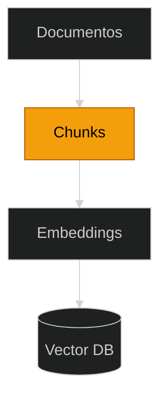

## **Etapa 8:** Memória Persistente

---
layout: two-cols-header
layoutClass: gap-8
class: flex items-start justify-center
---

# RAG: indexação em fragmentos (chunks)

#### **Indexar um documento em fragmentos (chunks) pode melhorar a recuperação**

::left::

- Em sistemas RAG, a fragmentação consiste em **dividir um texto** longo em segmentos menores, permitindo injetar contextos menores nos LLMs.
- A fragmentação ajuda LLMs a se concentrar **nas partes mais importantes do texto** e a evitar partes irrelevantes ou repetitivas.
<!--

- Também ajuda a reduzir o custo e a latência nas chamadas dos LLMs, além de aprimorar a qualidade e a relevância das respostas.
-->

::right::

Indexação

<Transform :scale="0.75" origin="top">

</Transform>

---
layout: default
---

# RAG: chunks e janelas de contextos

#### **Uma das razões do uso de chunks se dá pela limitação da janela de contexto dos LLMs**

 

| LLM | Janela de contexto | Qtde páginas (aprox.) |
| --- | --- | --- |
| Turbo GPT-3.5 | 4 mil tokens | 5 páginas |
| GPT-4 | 8 mil tokens | 10 páginas |
| GPT-4 32K | 32 mil tokens | 40 páginas |
| GPT-4 Turbo, GPT-4o | 128 mil tokens | 300 páginas |

<Transform :scale="0.8" origin="left bottom">

> [!NOTE]
> Mesmo embora o tamanho das janelas de contexto tenha aumentado recentemente, o uso de chunks continuará sendo uma boa técnica para gerenciamento de contexto, custo e latência.

</Transform>
