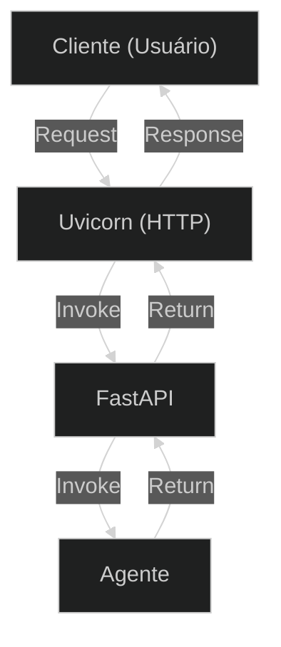

## **Etapa 9:** Agentes Assíncronos

---
layout: two-cols-header
layoutClass: gap-8
class: flex items-center justify-center
sourceLabel: FastAPI
source: https://github.com/fastapi/fastapi
---

# FastAPI: um framework para Web API

#### **FastAPI é um dos frameworks mais usados para construir Web API em Python**

::left::

<div class="text-lg w-full self-start [&_ul]:my-3 [&_li]:mb-4">

- Suporte para **funções assíncronas** e **tarefas em segundo plano**
- Integração com **modelos Pydantic** para validação de dados
- **Documentação automática** no padrão OpenAPI (antigo Swagger)
- Utiliza o **uvicorn** como servidor web básico (escuta conexões HTTP e encaminha)

</div>

::right::

<div class="flex flex-col items-center justify-center w-full">

<Transform :scale="0.70" origin="top">



</Transform>

</div>

---
layout: two-cols-header
layoutClass: gap-8
class: flex items-center justify-center
sourceLabel: FastAPI
source: https://github.com/fastapi/fastapi
---

# FastAPI: documentação automática

#### **O FastAPI gera a documentação da API automaticamente no padrão OpenAPI/Swagger**

<div class="h-5" />

::left::

<div class="text-18px w-full self-start [&_ul]:my-1 [&_li]:mb-4">

- É possível acessar a página de documentação gerada automaticamente acessando a rota `http://localhost:8000/docs`
- Na página de documentação do Swagger é possível enviar requisições à sua API para **testar rapidamente um endpoint**.

</div>

::right::

<div class="h-full flex items-start justify-center">
    <AssetImg src="doc-open-api.png" class="w-full max-w-[350px] rounded-lg mt-[8px]" />
</div>

---
layout: two-cols-header
layoutClass: gap-8
sourceLabel: FastAPI
source: https://github.com/fastapi/fastapi
---

# FastAPI: um exemplo simples

#### **O FastAPI permite criar rotas de Web API facilmente com decoradores**

<div class="h-2" />

::left::

```python [main.py] {1-2,6,8-9,13-14,22-23|all}{maxHeight:'320px',at:+1}
# uv add "fastapi[standard]" uvicorn
# uv run fastapi dev

from fastapi import FastAPI

app = FastAPI()

@app.get("/")
def root_controller():
    return {"status": "healthy"}

@app.get("/agent/chat")
def chat_controller(prompt: str):
    return {
        "messages": [
            {"role": "system", "content": "Você é um assistente"},
            {"role": "user", "content": prompt},
            {"role": "assistant", "content": "Resposta do assistente."},
        ]
    }

@app.post("/agent/indexing")
def indexing_controller(text: str):
    return {"status": "Texto indexado com sucesso"}
```

::right::

> [!NOTE]
> Cada função decorada expõe um **endpoint** (url HTTP) na internet através de verbos (`GET`, `POST`).
