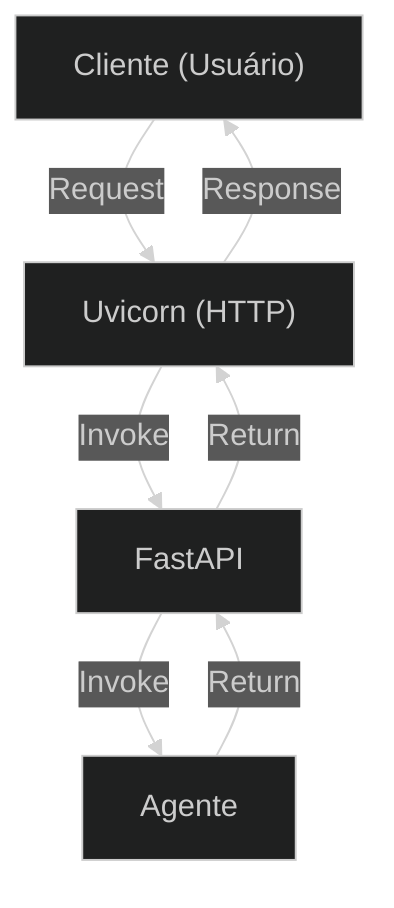

## **Etapa 9:** Agentes Assíncronos

---
layout: two-cols-header
layoutClass: gap-8
class: flex items-center justify-center
sourceLabel: FastAPI
source: https://github.com/fastapi/fastapi
---

# FastAPI: um framework para Web API

#### **FastAPI é um dos frameworks mais usados para construir Web API em Python**

::left::

- Suporte para **funções assíncronas** e **tarefas em segundo plano**
- Integração com **modelos Pydantic** para validação de dados
- **Documentação automática** no padrão OpenAPI (antigo Swagger)
- Utiliza o **uvicorn** como servidor web básico (escuta conexões HTTP e encaminha)

::right::

<Transform :scale="0.70" origin="top">

</Transform>

