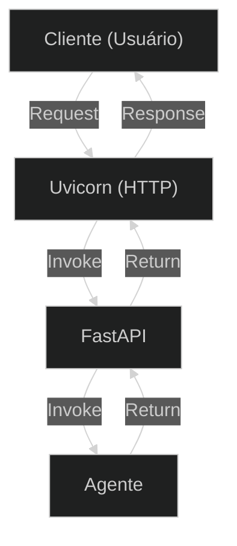

## **Etapa 9:** Agentes Assíncronos

---
layout: two-cols-header
layoutClass: gap-8
class: flex items-center justify-center
sourceLabel: FastAPI
source: https://github.com/fastapi/fastapi
---

# FastAPI: um framework para Web API

#### **FastAPI é um dos frameworks mais usados para construir Web API REST em Python**

::left::

<div class="text-lg w-full self-start [&_ul]:my-3 [&_li]:mb-4">

- Suporte para **funções assíncronas** e **tarefas em segundo plano**
- Integração com **modelos Pydantic** para validação de dados
- **Documentação automática** no padrão OpenAPI (antigo Swagger)
- Utiliza o **uvicorn** como servidor web básico (escuta conexões HTTP e encaminha)

</div>

::right::

<div class="flex flex-col items-center justify-center w-full">

<Transform :scale="0.70" origin="top">



</Transform>

</div>

---
layout: two-cols-header
layoutClass: gap-8
class: flex items-center justify-center
sourceLabel: FastAPI
source: https://github.com/fastapi/fastapi
---

# FastAPI: documentação automática

#### **O FastAPI gera a documentação da API automaticamente no padrão OpenAPI/Swagger**

<div class="h-5" />

::left::

<div class="text-18px w-full self-start [&_ul]:my-1 [&_li]:mb-4">

- É possível acessar a página de documentação gerada automaticamente acessando a rota `http://localhost:8000/docs`
- Na página de documentação do Swagger é possível enviar requisições à sua API para **testar rapidamente um endpoint**.

</div>

::right::

<div class="h-full flex items-start justify-center">
    <AssetImg src="doc-open-api.png" class="w-full max-w-[350px] rounded-lg mt-[8px]" />
</div>

<!--

## na resposta da Swagger, é devolvido um curl - testar o curl

## na resposta da Swagger, é devolvido a URL para testar o get direto no navegador

## testar a rota root com healthy check

-->

---
layout: two-cols-header
layoutClass: gap-8
sourceLabel: FastAPI
source: https://github.com/fastapi/fastapi
---

# FastAPI: um exemplo simples

#### **O FastAPI permite criar rotas de Web API facilmente com decoradores**

<div class="h-2" />

::left::

```python [main.py] {1-2,6,8-9,13-14,22-23|all}{maxHeight:'320px',at:+1}
# uv add "fastapi[standard]" uvicorn
# uv run fastapi dev

from fastapi import FastAPI

app = FastAPI()

@app.get("/")
def root_controller():
    return {"status": "healthy"}

@app.get("/agent/chat")
def chat_controller(prompt: str):
    return {
        "messages": [
            {"role": "system", "content": "Você é um assistente"},
            {"role": "user", "content": prompt},
            {"role": "assistant", "content": "Resposta do assistente."},
        ]
    }

@app.post("/agent/indexing")
def indexing_controller(text: str):
    return {"status": "Texto indexado com sucesso"}
```

::right::

> [!NOTE]
> Cada função decorada expõe um **endpoint** (url HTTP) na internet através de verbos (`GET`, `POST`).

---
layout: two-cols-header
layoutClass: gap-8
sourceLabel: FastAPI
source: https://github.com/fastapi/fastapi
---

# FastAPI: validação Pydantic

#### **FastAPI permite usar Pydantic, para validar dados em formato limpo e conhecido**

<div class="h-2" />

::left::

```python [main.py] {4,6-8,10-12,16-26|all}{maxHeight:'320px',at:+1}
# uv add "fastapi[standard]" uvicorn pydantic
# uv run fastapi dev

from fastapi import FastAPI
from pydantic import BaseModel, Field

class MessageRequest(BaseModel):
    systemPrompt: str = Field(
        min_length=1, max_length=100, description="Instrução do sistema"
    )
    userPrompt: str = Field(
        min_length=1, max_length=100, description="Mensagem do usuário"
    )

class MessageResponse(BaseModel):
    status: str = Field(description="Status do processamento")
    messages: list[dict] = Field(description="Histórico de mensagens")

app = FastAPI()

@app.post("/agent/chat")
def chat_controller(req: MessageRequest) -> MessageResponse:
    return MessageResponse(
        status="success",
        messages=[
            {"role": "system", "content": req.systemPrompt},
            {"role": "user", "content": req.userPrompt},
            {"role": "assistant", "content": "Resposta do assistente."},
        ]
    )
```

::right::

> [!NOTE]
> O FastAPI integra-se ao **Pydantic** para validar automaticamente os dados recebidos em chamadas `POST`, garantindo tipos e campos obrigatórios preenchidos.

---
layout: two-cols-header
layoutClass: gap-8
sourceLabel: FastAPI
source: https://github.com/fastapi/fastapi
---

# FastAPI: configurações adicionais em APIs

#### **Parâmetros de rotas, corpo da requisição e status code são configs em uma Web API**

<div class="h-2" />

::left::

```python [main.py] {4,7-9,11-14,18,20-25,27,29-33|all}{maxHeight:'320px',at:+1}
# uv add "fastapi[standard]" uvicorn pydantic
# uv run fastapi dev

from fastapi import FastAPI, status
from pydantic import BaseModel, Field

class DocumentRequest(BaseModel):
    title: str = Field(
        min_length=1, max_length=100, description="Título do documento"
    )
    text: str = Field(min_length=1, description="Conteúdo do documento")

class DocumentResponse(BaseModel):
    doc_id: str = Field(description="Identificador único do documento")
    status: str = Field(description="Status do processamento de indexação")
    title: str = Field(description="Título do documento")

app = FastAPI()

@app.post("/agent/indexing", status_code=status.HTTP_201_CREATED)
def index_document(req: DocumentRequest) -> DocumentResponse:
    return DocumentResponse(
        doc_id="doc-123",
        status="Documento indexado com sucesso",
        title=req.title
    )

@app.get("/agent/indexing/{doc_id}")
def get_document(doc_id: str) -> DocumentResponse:
    return DocumentResponse(
        doc_id=doc_id,
        status="Documento encontrado",
        title="Título do documento indexado"
    )
```

::right::

> [!NOTE]
> O FastAPI assume **200 OK** como o status code padrão de sucesso para todas as rotas onde o `status_code` não é declarado explicitamente.

---
layout: default
---

# FastAPI: padrão REST para Web API

#### **REST padroniza a comunicação em Web APIs de como usar verbos e status code**

<br/>

<div class="[&_table]:w-full text-14px leading-tight [&_td]:py-2 [&_th]:py-3">

| Status code | Status description | Explicação |
| --- | --- | --- |
| 200 | OK | Requisição processada com sucesso |
| 201 | Created | Recurso criado com sucesso no servidor |
| 202 | Accepted | Requisição aceita para processamento assíncrono em segundo plano |
| 400 | Bad Request | Requisição inválida ou malformada enviada pelo cliente |
| 404 | Not Found | O recurso solicitado não foi encontrado no servidor |
| 422 | Unprocessable Entity | Erro de validação nos dados ou formato do payload (padrão Pydantic/FastAPI) |

</div>

<div class="h-2" />

<Transform :scale="0.8" origin="left bottom">

> [!NOTE]
> A convenção do padrão REST recomenda retornar **202 Accepted** ao aceitar tarefas de longa duração para processamento em segundo plano (em vez do genérico 200 OK ou 201 Created).

</Transform>

---
layout: two-cols-header
layoutClass: gap-8
sourceLabel: FastAPI
source: https://github.com/fastapi/fastapi
---

# FastAPI: Web APIs síncronas e assíncronas

#### **Há uma diferença fundamental de execução em APIs síncronas e assíncronas no Uvicorn**

<div class="h-2" />

::left::

```python [main.py] {8-11,13-16|all}{maxHeight:'320px',at:+1}
import asyncio
import time

from fastapi import FastAPI

app = FastAPI()

# 1. ROTA ASSÍNCRONA: Libera a thread enquanto aguarda o I/O
@app.get("/async-endpoint")
async def async_endpoint():
    await asyncio.sleep(2)  # Não-bloqueante
    return {"message": "Executado assincronamente."}

# 2. ROTA SÍNCRONA: Bloqueia a thread até finalizar
@app.get("/sync-endpoint")
def sync_endpoint():
    time.sleep(2)  # Bloqueante
    return {"message": "Executado de forma síncrona."}
```

::right::

> [!NOTE]
> Em **APIs assíncronas**, quando o servidor encontra um `await`, o servidor libera a thread para atender outras requisições enquanto aguarda a resposta I/O.
> 
> Use Web APIs assíncronas nos cenários de código com `await` (chamada a outras Web APIs e LLMs, banco de dados, arquivos, etc).

---
layout: two-cols-header
layoutClass: gap-8
sourceLabel: Background Tasks
source: https://fastapi.tiangolo.com/tutorial/background-tasks/
---

# FastAPI: Tarefas em segundo plano

#### **FastAPI oferece a classe BackgroundTasks para executar funções demoradas**

<div class="h-2" />

::left::

```python [main.py] {32|all}{maxHeight:'320px',at:+1}
import asyncio
import time
import uuid
from fastapi import BackgroundTasks, FastAPI

app = FastAPI()

# Simulando um banco de dados para guardar o status das tarefas
tarefas_db = {}

# 1. A função de background que atualiza o status
def processar_relatorio(task_id: str):
    # Atualiza o status para "processando"
    tarefas_db[task_id] = "processando"

    # Simula um trabalho demorado
    time.sleep(30)

    # Atualiza o status para "concluida"
    tarefas_db[task_id] = "concluida"

# 2. Endpoint que inicia a tarefa e devolve um ID
@app.post("/gerar-relatorio")
async def iniciar_relatorio(background_tasks: BackgroundTasks):
    # Gera um ID único para a tarefa
    task_id = str(uuid.uuid4())

    # Registra a tarefa como pendente no banco
    tarefas_db[task_id] = "pendente"

    # Adiciona a tarefa ao background passando o ID
    background_tasks.add_task(processar_relatorio, task_id)

    # Devolve o ID imediatamente para o cliente
    return {"task_id": task_id, "mensagem": "Relatório iniciado."}

# 3. Endpoint de polling para o cliente consultar o status
@app.get("/status/{task_id}")
async def verificar_status(task_id: str):
    status = tarefas_db.get(task_id)
    return {"task_id": task_id, "status": status}
```

::right::

> [!NOTE]
> Uma instância de **`BackgroundTasks`** é injetada automaticamente como parâmetro no endpoint.
> 
> O método `add_task()` adiciona a função a ser executada em segundo plano imediatamente após o envio da resposta HTTP ao cliente.

---
layout: two-cols-header
layoutClass: gap-8
sourceLabel: HTTPX
source: https://www.python-httpx.org/
---

# App cliente: exemplo simples usando httpx

#### **HTTPX é um cliente HTTP assíncrono moderno para Python recomendado para consumir Web APIs**

<div class="h-2" />

::left::

```python [client.py] {1,3,10,13,19-25|all}{maxHeight:'320px',at:+1}
# uv add httpx
import asyncio
import httpx

BASE_URL = "http://localhost:8000"

async def main():
    async with httpx.AsyncClient() as client:
        # 1. Solicita a geração do relatório (POST)
        response = await client.post(f"{BASE_URL}/gerar-relatorio")
        data = response.json()
        task_id = data["task_id"]
        print(f"Relatório iniciado. ID: {task_id}")

        # 2. Polling: consulta o status a cada 5 segundos
        while True:
            res = await client.get(f"{BASE_URL}/status/{task_id}")
            status_data = res.json()
            current_status = status_data.get("status")
            print(f"Status atual: {current_status}")

            if current_status == "concluida":
                print("Relatório gerado com sucesso!")
                break

            await asyncio.sleep(5)

if __name__ == "__main__":
    asyncio.run(main())
```

::right::

> [!NOTE]
> A biblioteca **HTTPX** oferece uma API totalmente assíncrona (`httpx.AsyncClient`), sendo o cliente HTTP ideal em Python para integrar Web APIs e microsserviços.

---
layout: default
sourceLabel: PEP 8
source: https://peps.python.org/pep-0008/
---

# PEP 8: Python Enhancement Proposal 8

#### **PEP 8 é o guia de estilo oficial para código Python criado em 2001**

<br/>

<div class="[&_table]:w-full text-14px leading-tight [&_td]:py-2 [&_th]:py-3">

| Regra | Descrição |
| --- | --- |
| `snake_case` | Nomeação de variáveis e funções em minúsculas separadas por underline (`processar_relatorio`). |
| `PascalCase` | Nomeação de classes com a primeira letra de cada palavra maiúscula (`BackgroundTasks`). |
| `Constantes` | Nomeação de valores constantes em maiúsculas separadas por underline (ex: `BASE_URL`). |
| `Indentação` | Uso obrigatório de 4 espaços por nível de bloco de código (nunca misturar com TABs). |
| `Imports` | Agrupados no topo do arquivo em 3 blocos: biblioteca padrão, terceiros e código local. |
| `Linhas` | Tamanho máximo recomendado de 79 a 88 caracteres por linha para manter a legibilidade. |

</div>

<div class="h-2" />

<Transform :scale="0.8" origin="left bottom">

> [!NOTE]
> Ferramentas modernas como o **Ruff** (linter e formatador extremamente rápido escrito em Rust) checam e aplicam as regras do PEP 8 automaticamente no seu código Python.

</Transform>


<!--
## Instalação no projeto:
uv add --dev ruff

## Verificar problemas e violações de regras (Linter):
uv run ruff check .

## Corrigir problemas automaticamente:
uv run ruff check --fix .

## Formatar todo o código automaticamente
uv run ruff format .
-->

---
layout: section
---

## Live coding
🤖 **Agente** com três Web APIs: uma rota POST, GET (status) e GET (resposta).

##### **1. Web API assíncrona — endpoint `async def` que recebe a pergunta do usuário via POST**
##### **2. Modelos Pydantic — validação do request e response com `BaseModel` e `Field`**
##### **3. BackgroundTasks — agente com RAG sobre políticas de férias processa a pergunta em segundo plano**
##### **4. Polling — cliente consulta o status e obtém a resposta quando concluída**

---
layout: default
layoutClass: gap-8
---

# Live coding: codificação assistida por IA

#### **Prompt para gerar o exercício proposto no live coding**

<div class="h-7" />

<WindowMockup color="dark" padding="0.5rem 0.5rem 0.5rem 0.5rem" title="prompt.md" codeblock>

```md {*}{maxHeight:'290px'}
# Papel
Você é um engenheiro de IA especialista em sistemas agênticos e Web APIs.

# Tarefa
Desenvolva uma Web API assíncrona em Python com FastAPI que exponha
um agente de RH com RAG sobre políticas de férias através de três endpoints REST.

# Contexto
1. Script principal "main.py" com FastAPI e Uvicorn, usando `async def`
   em todos os endpoints; variáveis de ambiente lidas do ".env".
2. Crie um "politicas.md" com 5 parágrafos apenas sobre a política
   de férias da empresa. Indexe os parágrafos como embeddings em memória
   usando SentenceTransformer no startup da aplicação.
3. Modelos Pydantic com `BaseModel` e `Field(description=...)` para
   validar request e response de todos os endpoints.
4. Endpoint 1 (POST /agent/ask): recebe a pergunta do usuário no body,
   registra a tarefa como "pendente", adiciona ao `BackgroundTasks`
   e retorna imediatamente o `task_id` com status 202 Accepted.
5. Endpoint 2 (GET /agent/status/{task_id}): retorna o status atual
   da tarefa ("pendente", "processando" ou "concluida").
6. Endpoint 3 (GET /agent/result/{task_id}): retorna a resposta
   gerada pelo agente quando a tarefa estiver concluída.
7. A função de background deve: recuperar o chunk mais similar via
   similaridade de cosseno, montar o prompt com o contexto e invocar
   o agente (OpenAI Agents SDK com `Runner.run`).
8. Crie um "client.py" com httpx que faz POST, polling no status
   a cada 5 segundos e exibe a resposta final.

# Saída e Verificação
- Gere main.py, politicas.md e client.py.
- O código deve ser totalmente funcional e compilável.
- Siga as convenções do PEP 8.
```
</WindowMockup>

