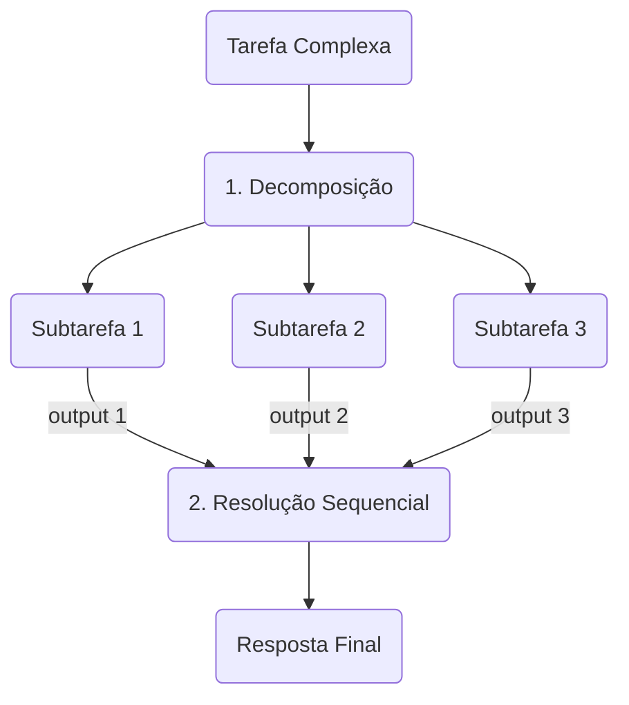

## Etapa 1.3 - Tema Relacionado
<br/>

### **Prompt Engineering e Evals**


---
layout: two-cols-header
layoutClass: gap-8
class: flex items-center justify-center
sourceLabel: Chain-of-Thought Prompting Elicits Reasoning in Large Language Models
source: https://arxiv.org/abs/2201.11903v6
---

# Chain of Thought (CoT)

#### **CoT foi apresentado por pesquisadores Google e sua pesquisa tem mais de 37k citações**

<div class="h-2" />

::left::

<div class="text-18px w-full self-start [&_ul]:my-0 [&_li]:mb-4">

- O CoT é apresentado como **uma técnica** para **aprimorar o raciocínio** em modelos de linguagem
- A técnica consiste em fornecer **cadeias de pensamento** como exemplos no prompt
- Eles **evidenciaram** que o CoT  **melhora o desempenho** em tarefas matemáticas, raciocínio lógico e resposta a perguntas

</div>

::right::

<div class="h-full flex items-start justify-center">
    <AssetImg src="chain-of-thought.png" class="w-full max-w-[320px] rounded-lg mt-[0px]" />
</div>

---
layout: two-cols-header
sourceLabel: Chain-of-Thought Prompting
source: https://promptingguide.ai/techniques/cot
---

# Chain-of-Thought: exemplo

#### **Uso de CoT (a direita) para instruir LLM em mostrar raciocínio e resposta final em Q&A**

<div class="h-10" />

<Transform :scale="0.70" origin="top">
    <AssetImg
    src="chain-of-thought-paper-image.png"
    class="rounded-lg border-0 border-white"
    />
</Transform>

---
layout: two-cols-header
layoutClass: gap-8
class: flex items-center justify-center
sourceLabel: Tree of Thoughts - Deliberate Problem Solving with Large Language Models
source: https://arxiv.org/abs/2305.10601
---

# Tree of Thoughts (ToT)

#### **ToT foi apresentado por Google/Princeton e sua pesquisa tem mais de 8k citações**

<div class="h-8" />

::left::

<div class="text-18px w-full self-start [&_ul]:my-0 [&_li]:mb-4">

- O ToT é apresentado como **uma técnica** que **generaliza o Chain-of-Thought** ao explorar múltiplos caminhos de raciocínio
- A técnica estimula o modelo avaliar os pensamentos intermediários e decidir se deve continuar com um caminho ao invés de outro

</div>

::right::

<div class="h-full flex items-start justify-center">
    <AssetImg src="tree-of-thoughts.png" class="w-full max-w-[250px] rounded-lg mt-[0px]" />
</div>

---
layout: two-cols-header
sourceLabel: Tree of Thoughts (ToT)
source: https://github.com/dave1010/tree-of-thought-prompting
---

# Tree of Thoughts: exemplo

#### **Exemplo de prompt ToT de acordo com proposta simplificada de Hulbert, 2023**

<div class="h-10" />

::code-group

```shell [prompt sem ToT]{maxHeight:'280px'}
Bob está na sala de estar.
Ele vai até a cozinha, carregando um copo.
Ele coloca uma bola no copo e leva o copo para o quarto.
Ele vira o copo de cabeça para baixo e depois vai para o jardim.
Ele coloca o copo no chão do jardim e depois vai para a garagem.
Onde está a bola?
```

```shell [prompt com ToT]{maxHeight:'280px'}
Imagine três especialistas diferentes respondendo a esta pergunta.
Todos os especialistas escreverão uma etapa do seu raciocínio,
e então a compartilharão com o grupo.
Em seguida, todos passarão para a próxima etapa, e assim por diante.
Se algum especialista perceber que está errado em qualquer momento, ele se retira.
A pergunta é:

Bob está na sala de estar.
Ele vai até a cozinha, carregando um copo.
Ele coloca uma bola no copo e leva o copo para o quarto.
Ele vira o copo de cabeça para baixo e depois vai para o jardim.
Ele coloca o copo no chão do jardim e depois vai para a garagem.
Onde está a bola?
```

```shell [resposta]{maxHeight:'280px'}
Especialista 1: A bola está na sala de estar.

Especialista 2: A bola está na cozinha.

Especialista 3: A bola está no quarto.

Especialista 1: Bob leva o copo para o quarto, então a bola deve estar dentro do copo.

Especialista 2: Ah, percebi meu erro. Sim, a bola está dentro do copo.

Especialista 3: Concordo, a bola está dentro do copo, no quarto.

Especialista 1: Em seguida, Bob vira o copo de cabeça para baixo no quarto.

Especialista 2: Depois disso, Bob vai até o jardim e coloca o copo no chão.

Especialista 3: Portanto, a bola deve ter caído do copo quando Bob o virou de cabeça para baixo no quarto. Assim, a bola está no quarto, e não mais dentro do copo.

Especialista 1: Ah, você tem razão. Eu me equivoquei. A bola está no quarto, e não dentro do copo.

Especialista 2: Concordo, a bola está no quarto.

Especialista 3: Bob então vai até a garagem, então a bola permanece no quarto. Ela não está no jardim nem na garagem.

Especialista 1: Com certeza, a bola ainda está no quarto.

Especialista 2: Sim, a bola não saiu do quarto.

Especialista 3: Portanto, a bola está no quarto, e não no jardim ou na garagem.

Os três especialistas concordam que a bola está no quarto.
```


::

---
layout: two-cols-header
layoutClass: gap-8
class: flex items-center justify-center
sourceLabel: PromptChainer
source: https://arxiv.org/html/2203.06566v1
---

# Prompt Chaining

#### **Pesquisadores do Google estabeleceram o Prompt Chaining como um padrão de design**

<div class="h-5" />

::left::

<div class="text-16px w-full self-start [&_ul]:my-0 [&_li]:mb-4">

- A ideia do Prompt Chaining é dividir uma tarefa complexa em subtarefas, onde cada subtarefa é resolvido por um prompt
- A mecânica central é usar o **output (resposta)** gerado por um prompt como o **input para o prompt subsequente**
- O Prompt Chaining emergiu na industria, mas foi a academia que comprovou que pipelines de prompts reduzem alucinações e aumentam a confiabilidade dos modelos.

</div>

::right::

<div class="h-full flex items-start justify-center">
    <AssetImg src="prompt-chaining.png" class="w-full max-w-[250px] rounded-lg mt-[0px]" />
</div>

---
layout: two-cols-header
layoutClass: gap-8
class: flex items-center justify-center
sourceLabel: Least-to-Most Prompting Enables Complex Reasoning in Large Language Models
source: https://arxiv.org/abs/2205.10625
---

# Least-to-Most Prompting

#### **A técnica funciona em duas etapas obrigatórias: decomposição e a resolução sequencial**

<div class="h-5" />

::left::

<div class="text-16px w-full self-start [&_ul]:my-0 [&_li]:mb-4">

- A ideia principal é quebrar a tarefa principal em uma **série de subproblemas menores**, resolvendo um de cada vez
- No primeiro estágio, a tarefa complexa é **dividida em tarefas intermediárias**
- No segundo estágio, as subtarefas são resolvidas em **ordem sequencial**

</div>

::right::

<div class="flex flex-col items-center">

<div class="h-0" />

<Transform :scale="0.85" origin="top">



</Transform>

</div>