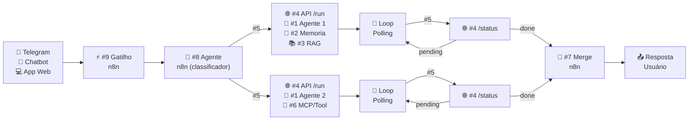

## Etapa 1.5 - Tema Relacionado
 

### **Entregáveis TP2**

---

# Entregáveis do TP2
#### **Principais componentes da segunda entrega**

| **#** | **Entregável** | **Observação** |
| --- | --- | --- |
| 1 | Qual Gatilho n8n? | Telegram, Chatbot, Aplicativo Web, Gmail, Google Sheet, etc |
| 2 | Jornada do Usuário | Qual informação estruturada e não estruturada? Ambos obrigatório |
| 2 | Diagrama de arquitetura | Diagrama no formato de imagem com os 9 componentes |
| 3 | Descrição textual da arquitetura | O que cada um dos 9 componentes devem fazer |
| 4 | Exemplo do fluxo de dados  | Exemplo passo-a-passo da entrada do usuário passando por cada componente até o resultado final  |
| 6 | Dado estrururado | Quais informações serão armazenadas/consultadas (banco de dados, JSON ou API)? |
| 7 | Demais itens do TP2 | Todo o restante do enunciado do TP2 |

---
layout: default
---

# Arquitetura do Projeto de Bloco
#### **Diagrama da arquitetura do projeto de bloco (resumido para caber no slide)**

  

<Transform :scale="3" origin="center">

</Transform>

  

  
  

> [!NOTE]
> **Fluxo:** O usuário fornece uma dúvida, que é classificada como dúvida sobre base de conhecimento (ex: política de reembolso), ou dúvida sobre dado estruturado em API/banco/JSON (ex: pedidos de reembolso). _Pergunta exemplo: "Qual é o prazo para solicitar reembolso e qual é o status atual do meu pedido #9876?"_

  

