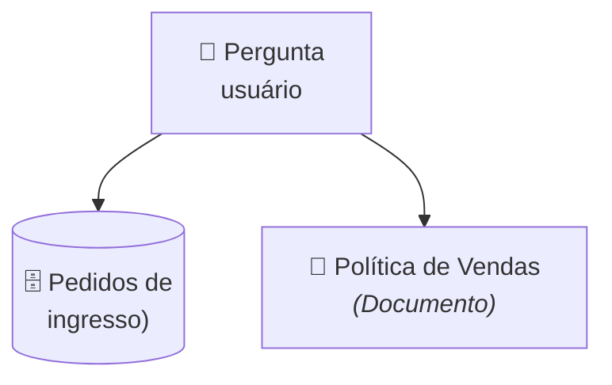
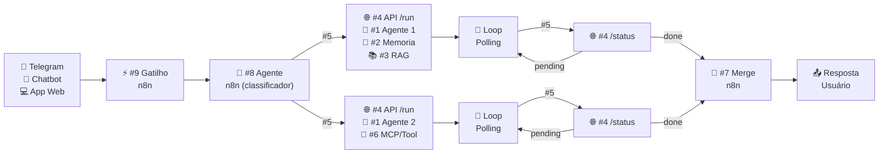

## Etapa 1.5 - Tema Relacionado
 

### **Entregáveis TP2**

---

# Entregáveis do TP2
#### **Principais componentes da segunda entrega**

| **#** | **Entregável** | **Observação** |
| --- | --- | --- |
| 1 | Qual Gatilho n8n | Telegram, Chatbot, Aplicativo Web, Gmail, Google Sheet, etc |
| 2 | Fonte de Informações | Qual informação estruturada (API/DB/JSON) e não estruturada (doc)? Ambas obrigatório |
| 3 | Diagrama de arquitetura | Diagrama no formato de imagem com os 9 componentes |
| 4 | Descrição textual da arquitetura | O que cada um dos 9 componentes devem fazer |
| 5 | Exemplo do fluxo de dados  | Exemplo passo-a-passo da entrada do usuário passando por cada componente até o resultado final  |
| 6 | Dado estruturado | Quais informações serão armazenadas/consultadas (banco de dados, JSON ou API)? |
| 7 | Demais itens do TP2 | Todo o restante do enunciado do TP2 |

---
layout: two-cols-header
layoutClass: gap-8
class: flex items-center justify-center
sourceLabel: integrations n8n
source: https://n8n.io/integrations/
---

# Entregável 1: Qual Gatilho n8n
#### **Analise como você desejar que o usuário interaja com o seu agente**

::left::

- O modo mais comum de interface agentica é um **chatbot** (Telegram, chatbot app), mas você pode pensar em um **aplicativo web de cadastro** (cadastrar perguntas de usuário)
- Ou ainda, você pode pesquisar as **centenas de integrações do n8n**, e receber as perguntas do usuário através dessas integrações (Gmail, Slack, Google Sheet, etc)

::right::

  <AssetImg src="n8n-integracao.png" class="rounded-lg w-[350px] border-0 border-white" />

---
layout: two-cols-header
layoutClass: gap-8
class: flex items-center justify-center
---

# Entregável 2: Fonte de informação
#### **Defina as fontes estruturadas e não estruturadas que alimentarão o sistema**

::left::

- O projeto exige **duas fontes de informação distintas**: um banco de dados estruturado e uma base de conhecimento não estruturada.
- **Exemplo (venda de ingressos):** Consulta de pedidos em tabela de banco de dados com status, valor e data da compra. E documento textual de política de vendas (regras de cancelamento, prazos e exceções).
- Pense na pergunta do usuário: _"Qual é o prazo para solicitar reembolso e qual é o status atual do meu pedido #9876?"_

::right::

<Transform :scale="1.3" origin="center">

</Transform>

---
layout: default
---

# Entregável 3: Diagrama de arquitetura
#### **Diagrama da arquitetura do projeto de bloco _(resumido aqui para caber no slide)_**

  

<Transform :scale="3" origin="center">

</Transform>

  

  
  

> [!NOTE]
> **Fluxo:** O usuário fornece uma dúvida, que é classificada como dúvida sobre base de conhecimento (ex: política de reembolso), ou dúvida sobre dado estruturado em API/banco/JSON (ex: pedidos de reembolso). 

  

---

# Entregável 4: Descrição textual da arquitetura
#### **Exemplo de descrição de arquitetura (resumido pra caber no slide)**

| **#** | **Componente** | **Descrição** |
| --- | --- | --- |
| - | Canal de comunicação (Telegram) | Interface de entrada onde o usuário envia perguntas e recebe as respostas finais do agente. |
| 8 | Agente n8n (Classificador) | Classifica a pergunta do usuário entre dúvida conceitual (base de conhecimento) ou operacional (dados/pedidos). |
| 1 | Agente 1 (Políticas e Dúvidas) | Agente especialista em conhecimento que responde regras, prazos e diretrizes consultando a base de políticas. |
| 1 | Agente 2 (Operações e Pedidos) | Agente especialista em ação/ferramentas que consulta banco de dados/JSON e verifica o status dos pedidos. |
| 7 | Merge n8n | Unifica as respostas dos dois agentes quando houver execução paralela antes de responder ao usuário. |

