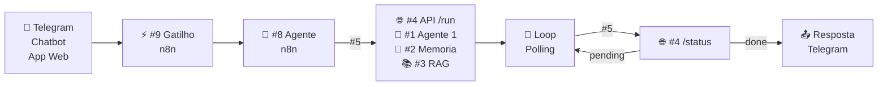
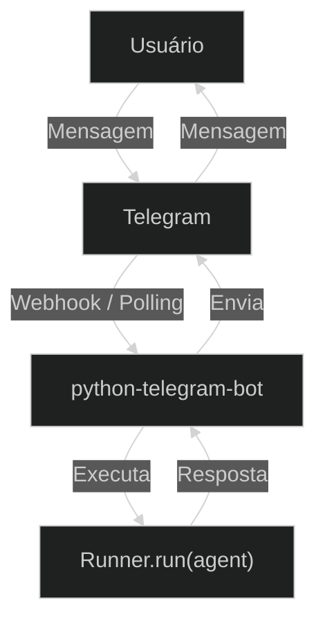

## Etapa 1.5 - Tema Relacionado
<br/>

### **Entregáveis TP2**


---

# Entregáveis do TP2
#### **Principais componentes da segunda entrega**

<div class="h-5" />

<div class="[&_table]:w-full text-12px">

| **#** | **Entregável** | **Observação** |
| --- | --- | --- |
| 1 | Interface de comunicação | Qual? Telegram, Chatbot, Aplicativo Web |
| 2 | Diagrama de arquitetura (9 componentes) | Diagrama no formato de imagem com os 9 componentes |
| 3 | Descrição textual da arquitetura | O que cada um dos 9 componentes devem fazer |
| 4 | Exemplo do fluxo (9 componentes)  | Exemplo passo-a-passo da entrada do usuário por cada componente até o resultado final  |
| 5 | Gatilho do n8n | Com o n8n será iniciado: chatbot? planilha? gmail? |
| 6 | Banco de dados | Quais informações serão armazenadas na base de dados? |
| 7 | Demais itens do TP2 | Todo o restante do enunciado do TP2 |

</div>

---
layout: default
---

# Arquitetura do Projeto de Bloco
#### **Diagrama da arquitetura do projeto de bloco (entrega mínima)**

<div class="h-[calc(100%-80px)] flex flex-col justify-between">

  <div class="flex-1 flex items-center justify-center">

<Transform :scale="3" origin="center">



</Transform>

  </div>
  
  <div class="text-xs w-full">

> [!NOTE]
> **Interface de comunicação:** Um componente de interface de comunicação com o usuário (Telegram, Chatbot web via Gradio/Chainlit ou Aplicativo Web).

  </div>
</div>

---
layout: default
---

# Projetos de Chatbots mais conhecidos

#### **Todos os projetos se enquadram na categoria "Conversational AI Frameworks"**

<br/>

<div class="[&_table]:w-full text-xs">

| Projeto | ⭐&nbsp;GitHub | Facilidade | Foco principal |
| --- | --- | --- | --- |
| [Gradio](https://github.com/gradio-app/gradio) | ~43k | ⭐⭐⭐⭐⭐ | Chat simples, extremamente rápido, indicado para agentes mais simples |
| [Chainlit](https://github.com/Chainlit/chainlit) | ~12k | ⭐⭐⭐⭐ | Chat mais avançado com mecanismos para mostrar etapas da execução (reasoning) antes da resposta final |
| [NiceGUI](https://github.com/zauberzeug/nicegui) | ~16k | ⭐⭐⭐⭐ | Framework web em Python que permite construir chatbots mais personalizados, com parâmetros, escolha de vários agentes, etc. |
| [Panel](https://github.com/holoviz/panel) | ~5.7k | ⭐⭐⭐ | Combinar chat com visualizações (gráficos) e componentes interativos |
| [Mesop](https://github.com/google/mesop) | ~6k | ⭐⭐⭐⭐ | Feito pelo Google, permite construir app web usando Python, sem precisar desenvolver o frontend |

</div>

---
layout: two-cols-header
layoutClass: gap-8
sourceLabel: Gradio Docs
source: https://www.gradio.app/docs
---

# Exemplo usando Gradio

#### **O Gradio se destaca pela simplicidade**

::left::

```python [Gradio + OpenAI Agents SDK]{maxHeight:'320px'}
import asyncio
import gradio as gr
from dotenv import load_dotenv
from agents import (Agent, Runner, set_default_openai_api, 
                set_tracing_disabled)

load_dotenv()
set_default_openai_api("chat_completions")
set_tracing_disabled(True)

agent = Agent(
    name="Professor",
    instructions="Você é um professor de história."
)

async def responder(mensagem, historico):
    result = await Runner.run(agent, mensagem)
    return result.final_output

async def main():
    gr.ChatInterface(responder).launch(inbrowser=False)

if __name__ == "__main__":
    asyncio.run(main())
```

::right::

```bash [instalar o Gradio]
uv add gradio
```

<div class="h-10" />

> [!NOTE]
> O Gradio gera automaticamente a interface de chat — sem necessidade de HTML, CSS ou JavaScript.

---
layout: default
layoutClass: gap-8
---

# Gradio: codificação assistida por IA

#### **Prompt para gerar um agente com Gradio**

<div class="h-7" />

<WindowMockup color="dark" padding="0.5rem 0.5rem 0.5rem 0.5rem" title="prompt.md" codeblock>

```md {*}{maxHeight:'290px'}
# Papel
Você é um engenheiro de IA especialista em sistemas agênticos.

# Tarefa
Desenvolva um chatbot em Python usando Gradio como interface,
com um agente criado com o OpenAI Agents SDK.

# Contexto
1. Script principal "main.py" com programação assíncrona;
   variáveis de ambiente lidas do ".env" via python-dotenv.
2. Configure o SDK para usar a API de chat completions:
   `set_default_openai_api("chat_completions")` e
   `set_tracing_disabled(True)`.
3. Crie um `Agent` com nome e instruções de um especialista
   de sua escolha.
4. Implemente a função `async def responder(mensagem, historico)`
   que usa `Runner.run(agent, mensagem)` e retorna
   `result.final_output`.
5. No `async def main()`, inicie a interface com
   `gr.ChatInterface(responder).launch()`.
6. Use `if __name__ == "__main__": asyncio.run(main())`
   como entry point.

# Saída e Verificação
- Gere apenas o arquivo main.py.
- O código deve ser totalmente funcional e executável com
  `uv run main.py` após `uv add gradio openai-agents python-dotenv`.
```
</WindowMockup>

---
layout: two-cols-header
layoutClass: gap-8
sourceLabel: Chainlit Docs
source: https://docs.chainlit.io
---

# Exemplo usando Chainlit

#### **O Chainlit se destaca por mostrar as etapas da execução (reasoning)**

::left::

```python [Chainlit + OpenAI Agents SDK]{maxHeight:'320px'}
import chainlit as cl
from chainlit.input_widget import Slider
from dotenv import load_dotenv
from agents import (
    Agent, Runner, RunConfig,
    ModelSettings, set_default_openai_api,
    set_tracing_disabled,
)

load_dotenv()
set_default_openai_api("chat_completions")
set_tracing_disabled(True)

agent = Agent(
    name="Professor",
    instructions="Você é um professor de história."
)

@cl.on_chat_start
async def configurar():
    await cl.ChatSettings([
        Slider(
            id="frequency_penalty",
            label="Frequency Penalty",
            min=0, max=2, step=0.1, initial=0,
        ),
    ]).send()

@cl.on_message
async def responder(mensagem: cl.Message):
    settings = cl.user_session.get("settings", {})
    fp = settings.get("frequency_penalty", 0)
    result = await Runner.run(
        agent, mensagem.content,
        run_config=RunConfig(
            model_settings=ModelSettings(
                frequency_penalty=fp,
            )
        )
    )
    await cl.Message(content=result.final_output).send()
```

::right::

```bash [instalar o Chainlit]
uv init meu-projeto --python 3.12
uv add chainlit
```
<div class="h-4" />

```bash [iniciar o Chainlit]
uv run chainlit run main.py --headless
```


<div class="h-4" />

> [!NOTE]
> O Chainlit usa decoradores (`@cl.on_message`) no lugar de funções — e exibe automaticamente as etapas intermediárias do agente.

---
layout: default
layoutClass: gap-8
---

# Chainlit: codificação assistida por IA

#### **Prompt para gerar um agente com Chainlit**

<div class="h-7" />

<WindowMockup color="dark" padding="0.5rem 0.5rem 0.5rem 0.5rem" title="prompt.md" codeblock>

```md {*}{maxHeight:'290px'}
# Papel
Você é um engenheiro de IA especialista em sistemas agênticos.

# Tarefa
Desenvolva um chatbot em Python usando Chainlit como interface,
com um agente criado com o OpenAI Agents SDK, com suporte a
configuração de parâmetros do modelo via painel de settings.

# Contexto
1. Script principal "main.py" sem bloco `if __name__`;
   variáveis de ambiente lidas do ".env" via python-dotenv.
2. Configure o SDK: `set_default_openai_api("chat_completions")`
   e `set_tracing_disabled(True)`.
3. Crie um `Agent` com nome e instruções de um especialista
   de sua escolha.
4. Use `@cl.on_chat_start` para exibir um painel de settings com
   `cl.ChatSettings` contendo um `Slider` do módulo
   `chainlit.input_widget` para o parâmetro `frequency_penalty`
   (min=0, max=2, step=0.1, initial=0).
5. Use `@cl.on_message` com `async def responder(mensagem: cl.Message)`:
   - Leia o valor do slider com
     `cl.user_session.get("settings", {})`.
   - Passe o valor via `RunConfig(model_settings=ModelSettings(
     frequency_penalty=fp))` no `Runner.run`.
   - Responda com
     `await cl.Message(content=result.final_output).send()`.

# Saída e Verificação
- Gere apenas o arquivo main.py.
- O código deve ser totalmente funcional e executável com
  `uv run chainlit run main.py --headless` após
  `uv init meu-projeto --python 3.12` e
  `uv add chainlit openai-agents python-dotenv`.
```
</WindowMockup>

---
layout: two-cols-header
layoutClass: gap-8
class: flex items-center justify-center
sourceLabel: python-telegram-bot
source: https://github.com/python-telegram-bot/python-telegram-bot
---

# Telegram como chatbot

#### **O telegram é conhecido por ser uma plataforma fácil de integrar**

::left::

<div class="text-lg w-full self-start [&_ul]:my-3 [&_li]:mb-4">

- Abra o Telegram e pesquise por **@BotFather**
- Envie o comando `/newbot` para iniciar a criação
- Escolha um **nome** e um **username** único (terminado em `bot`)
- Copie o **Token de Acesso HTTP API** gerado
- Adicione a variável `TELEGRAM_TOKEN` no arquivo `.env`

</div>

::right::

<div class="flex flex-col items-center justify-center w-full">

<Transform :scale="0.70" origin="top">



</Transform>

</div>

---
layout: two-cols-header
layoutClass: gap-8
sourceLabel: python-telegram-bot Docs
source: https://docs.python-telegram-bot.org/
---

# Exemplo usando python-telegram-bot

#### **Integrando o agente do OpenAI Agents SDK com bot do Telegram**

::left::

```python [Telegram + OpenAI Agents SDK]{maxHeight:'320px'}
import os
from dotenv import load_dotenv
from telegram import Update
from telegram.ext import (
    ApplicationBuilder,
    MessageHandler,
    filters,
)
from agents import (
    Agent, Runner, set_default_openai_api,
    set_tracing_disabled,
)

load_dotenv()
set_default_openai_api("chat_completions")
set_tracing_disabled(True)

agent = Agent(
    name="Professor",
    instructions="Você é um professor de história."
)

async def responder(update: Update, context):
    print(f"Usuário: {update.message.text}")
    result = await Runner.run(
        agent, update.message.text
    )
    print(f"Agente: {result.final_output}\n")
    await update.message.reply_text(
        result.final_output
    )

app = (
    ApplicationBuilder()
    .token(os.getenv("TELEGRAM_TOKEN"))
    .build()
)
app.add_handler(
    MessageHandler(filters.TEXT, responder)
)
app.run_polling()
```

::right::

```bash [instalar dependências]
uv add python-telegram-bot openai-agents python-dotenv
```

<div class="h-4" />

```bash [executar o bot]
uv run main.py
```

<div class="h-4" />

> [!NOTE]
> O `python-telegram-bot` gerencia o ciclo de polling e passa o texto da mensagem recebida diretamente para o `Runner.run`.

---
layout: default
layoutClass: gap-8
---

# Telegram: codificação assistida por IA

#### **Prompt para gerar um bot do Telegram com agente**

<div class="h-7" />

<WindowMockup color="dark" padding="0.5rem 0.5rem 0.5rem 0.5rem" title="prompt.md" codeblock>

```md {*}{maxHeight:'290px'}
# Papel
Você é um engenheiro de IA especialista em sistemas agênticos.

# Tarefa
Desenvolva um chatbot em Python integrado ao Telegram,
com um agente criado com o OpenAI Agents SDK.

# Contexto
1. Script principal "main.py"; variáveis de ambiente lidas
   do ".env" via python-dotenv (`TELEGRAM_TOKEN`).
2. Configure o SDK para usar a API de chat completions:
   `set_default_openai_api("chat_completions")` e
   `set_tracing_disabled(True)`.
3. Crie um `Agent` com nome e instruções de um especialista
   de sua escolha.
4. Implemente a função de handler `async def responder(update: Update, context)`:
   - Imprima no console o texto da mensagem do usuário.
   - Execute o agente passando o texto com `Runner.run(agent, update.message.text)`.
   - Imprima no console a resposta do agente.
   - Envie a resposta ao usuário via `await update.message.reply_text(result.final_output)`.
5. Inicialize a aplicação com `ApplicationBuilder().token(...).build()`,
   adicione o handler `MessageHandler(filters.TEXT, responder)` e
   inicie o bot com `app.run_polling()`.

# Saída e Verificação
- Gere apenas o arquivo main.py.
- O código deve ser totalmente funcional e executável com
  `uv run main.py` após `uv add python-telegram-bot openai-agents python-dotenv`.
```
</WindowMockup>

