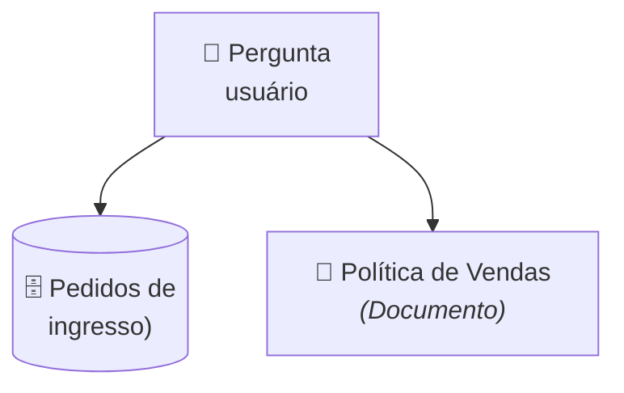
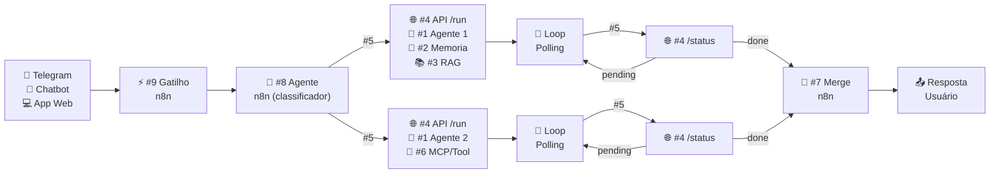

## Etapa 1.5 - Tema Relacionado
 

### **Entregáveis TP2**

---

# Entregáveis do TP2
#### **Principais componentes da segunda entrega**

| **#** | **Entregável** | **Observação** |
| --- | --- | --- |
| 1 | Qual Gatilho n8n | Telegram, Chatbot, Aplicativo Web, Gmail, Google Sheet, etc |
| 2 | Fonte de Informações | Qual informação estruturada (API/DB/JSON) e não estruturada (doc)? Ambas obrigatório |
| 3 | Diagrama de arquitetura | Diagrama no formato de imagem com os 9 componentes |
| 4 | Descrição textual da arquitetura | O que cada um dos 9 componentes devem fazer |
| 5 | Exemplo do fluxo de dados  | Exemplo passo-a-passo da entrada do usuário passando por cada componente até o resultado final  |
| 6 | Dado estruturado | Quais informações serão armazenadas/consultadas (banco de dados ou API)? |
| 7 | Demais itens do TP2 | Todo o restante do enunciado do TP2 |

---
layout: two-cols-header
layoutClass: gap-8
class: flex items-center justify-center
sourceLabel: integrations n8n
source: https://n8n.io/integrations/
---

# Entregável 1: Qual Gatilho n8n
#### **Analise como você desejar que o usuário interaja com o seu agente**

::left::

- O modo mais comum de interface agentica é um **chatbot** (Telegram, chatbot app), mas você pode pensar em um **aplicativo web de cadastro** (cadastrar perguntas de usuário)
- Ou ainda, você pode pesquisar as **centenas de integrações do n8n**, e receber as perguntas do usuário através dessas integrações (Gmail, Slack, Google Sheet, etc)

::right::

  <AssetImg src="n8n-integracao.png" class="rounded-lg w-[350px] border-0 border-white" />

---
layout: two-cols-header
layoutClass: gap-8
class: flex items-center justify-center
---

# Entregável 2: Fonte de informação
#### **Defina as fontes estruturadas e não estruturadas que alimentarão o sistema**

::left::

- O projeto exige **duas fontes de informação distintas**: um banco de dados estruturado e uma base de conhecimento não estruturada.
- **Exemplo (venda de ingressos):** Consulta de pedidos em tabela de banco de dados com status, valor e data da compra. E documento textual de política de vendas (regras de cancelamento, prazos e exceções).
- Pense na pergunta do usuário: _"Qual é o prazo para solicitar reembolso e qual é o status atual do meu pedido #9876?"_

::right::

<Transform :scale="1.3" origin="center">

</Transform>

---
layout: default
---

# Entregável 3: Diagrama de arquitetura
#### **Diagrama da arquitetura do projeto de bloco _(resumido aqui para caber no slide)_**

  

<Transform :scale="3" origin="center">

</Transform>

  

  
  

> [!NOTE]
> **Fluxo:** O usuário fornece uma dúvida, que é classificada como dúvida sobre base de conhecimento (ex: política de reembolso), ou dúvida sobre dado estruturado em API/banco/JSON (ex: pedidos de reembolso). 

  

---

# Entregável 4: Descrição textual da arquitetura
#### **Exemplo de descrição de arquitetura (resumido pra caber no slide)**

| **#** | **Componente** | **Descrição** |
| --- | --- | --- |
| - | Canal de comunicação (Telegram) | Interface de entrada onde o usuário envia perguntas e recebe as respostas finais do agente. |
| 8 | Agente n8n (Classificador) | Classifica a pergunta do usuário entre dúvida conceitual (base de conhecimento) ou operacional (dados/pedidos). |
| 1 | Agente 1 (Políticas e Dúvidas) | Agente especialista em conhecimento que responde regras, prazos e diretrizes consultando a base de políticas. |
| 1 | Agente 2 (Operações e Pedidos) | Agente especialista em ação/ferramentas que consulta banco de dados/API e verifica o status dos pedidos. |
| 7 | Merge n8n | Unifica as respostas dos dois agentes quando houver execução paralela antes de responder ao usuário. |

---

# Entregável 5: Exemplo do fluxo de dados
#### **Exemplo de fluxo de dados (resumido pra caber no slide)**

| **Etapa / Ator** | **Componente** | **Ação / Dado Trafegado no Fluxo** |
| --- | --- | --- |
| 1. Usuário | Canal de Comunicação | _"Qual é o prazo para solicitar reembolso e qual é o status atual do meu pedido #9876?"_ |
| 2. n8n Router | Agente n8n (Classificador) | Detecta dupla intenção (conceitual + operacional) e aciona ambos os agentes em paralelo. |
| 3. Agente 1 | Políticas (Python) | Consulta base de conhecimento e retorna que o prazo de reembolso é de até 7 dias. |
| 4. Agente 2 | Tools + Pedidos (Python) | Executa ferramenta de busca no banco/JSON e retorna que o pedido #9876 está "Em análise". |
| 5. n8n Merge | Merge & Consolidação | Combina as duas respostas e envia ao Telegram: prazo de 7 dias + status em análise. |

---

# Entregável 6: Dado estruturado
#### **Exemplo de modelo de dados estruturado (banco de dados ou API)**

| **Nome do Campo** | **Descrição** |
| --- | --- |
| `id_pedido` | Identificador único do pedido/compra (ex: `#9876`). |
| `nome_cliente` | Nome completo do comprador associado à transação. |
| `evento` | Nome do show, partida ou evento referente ao ingresso adquirido. |
| `data_compra` | Data e horário em que o pedido foi emitido e confirmado. |
| `valor_total` | Valor total pago em reais pelo ingresso e taxas de serviço. |
| `status` | Situação atual do pedido (ex: `Aprovado`, `Em análise`, `Reembolsado`, `Cancelado`). |

---

# Outros cenários de negócio
#### **Pense na pergunta do usuário e nos dados (estruturado e não estruturado) do seu tema**

| **Cenário de Negócio** | **Pergunta do Usuário** | **Dados (Estruturado vs. Não Estruturado)** |
| --- | --- | --- |
| **Portal de RH** | _"Quais as regras para licença-paternidade e quantos dias de férias ainda tenho de saldo?"_ | **Não estruturado:** Guia de benefícios/CLT (doc) **Estruturado:** Tabela de saldo de férias/colaborador (banco/API) |
| **Clínica Médica** | _"Qual o preparo para o exame de sangue e tem horário livre amanhã com dr. Carlos?"_ | **Não estruturado:** Manual de instruções de preparo (doc) **Estruturado:** Agenda de consultas e horários vagos (banco/API) |
| **Suporte de TI** | _"Como configurar a VPN no Linux e qual o status do meu chamado #4521?"_ | **Não estruturado:** Base de conhecimento / FAQ técnico (doc) **Estruturado:** Tabela de tickets e chamados de TI (banco/API) |
| **Secretaria Acadêmica** | _"Qual o prazo para trancar matéria e tranque 'Banco de Dados' para mim?"_ | **Não estruturado:** Regimento e calendário acadêmico (doc) **Estruturado:** Tabela de matrículas e status de disciplina (banco/API) |
| **Hotelaria / Turismo** | _"Qual o horário do café da manhã e estenda minha reserva #H-4321 por mais 1 dia?"_ | **Não estruturado:** Guia de serviços e regras do hotel (doc) **Estruturado:** Tabela de reservas e disponibilidade de quartos (banco/API) |

---
layout: default
---

# Hands-on

 

🛠️ &nbsp;**Exercício \#1:** Defina o gatilho de entrada n8n (canal/interface) para o seu tema.

🛠️ &nbsp;**Exercício \#2:** Especifique a fonte estruturada (banco/API) e a não estruturada (documento).

🛠️ &nbsp;**Exercício \#3:** Elabore o diagrama de arquitetura contendo os 9 componentes interligados.

🛠️ &nbsp;**Exercício \#4:** Escreva a descrição textual detalhando o papel de cada um dos componentes.

🛠️ &nbsp;**Exercício \#5:** Mapeie um exemplo de fluxo de dados com pergunta de dupla intenção.

🛠️ &nbsp;**Exercício \#6:** Modele os campos e tipos do dado estruturado da sua aplicação.

 

- [ ] &nbsp;Versione o entregável no seu projeto de bloco atual
- [ ] &nbsp;Faça o seu TP2 normalmente, e entregue também os exercícios do 1 ao 6 no TP2
