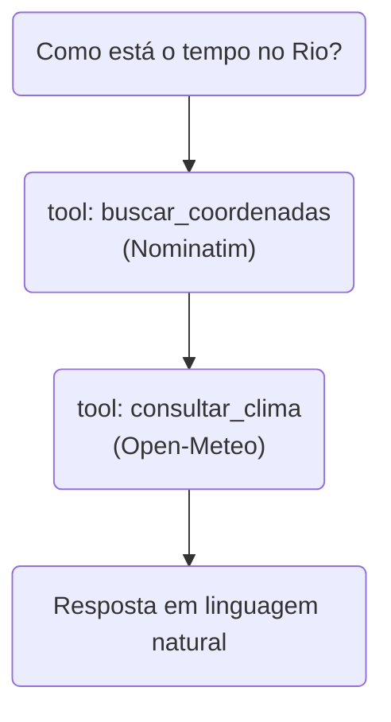

## Etapa 1.7 - Tema Relacionado
<br/>

### **Repositório de APIs Públicas**


---
layout: two-cols-header
layoutClass: gap-8
class: flex items-center justify-center
sourceLabel: public-apis
source: https://github.com/public-apis/public-apis
---

# O repositório `public-apis`

#### **Um dos repositórios mais estrelados do GitHub — e não tem uma linha de código**

<div class="h-2" />

::left::

<div class="text-17px w-full self-start [&_ul]:my-0 [&_li]:mb-4">

- É apenas um **README gigante**: uma lista de APIs públicas e gratuitas, organizada por assunto
- Mantido pela **comunidade** — qualquer pessoa propõe uma API nova por *pull request*
- Serve como **ponto de partida**: em vez de inventar uma fonte de dados, você procura uma que já existe

</div>

::right::

<div class="w-full self-start">

<div class="text-15px [&_table]:w-full [&_td]:py-2 [&_th]:py-2">

| | |
| --- | --- |
| ⭐ Estrelas | ~481 mil |
| 🍴 Forks | ~53 mil |
| 📚 APIs listadas | ~1.800 |
| 🗂️ Categorias | 51 |
| 📄 Licença | MIT |

</div>

<div class="h-4" />

<Transform :scale="0.8" origin="left top">

> [!NOTE]
> Estrelas no GitHub funcionam como "favoritos": medem popularidade, não qualidade.

</Transform>

</div>

<!--
## perguntar: quantos já deram estrela em algum repositório?

## o valor aqui é curadoria, não código — isso costuma surpreender a turma
-->

---
layout: two-cols-header
layoutClass: gap-8
class: flex items-center justify-center
sourceLabel: public-apis
source: https://github.com/public-apis/public-apis
---

# Como cada API é catalogada

#### **Três colunas respondem, antes de escrever código, se a API serve para você**

<div class="h-2" />

::left::

<div class="text-17px w-full self-start [&_ul]:my-0 [&_li]:mb-4">

- **Auth:** o que a API exige para responder — `No`, `apiKey` ou `OAuth`
- **HTTPS:** se a conexão é criptografada (hoje, `Yes` é obrigatório)
- **CORS:** se um navegador pode chamar direto; para um agente em Python, **não importa**

</div>

::right::

<div class="w-full self-start">

```md [uma linha da tabela]{maxHeight:'150px'}
| API | Description | Auth | HTTPS | CORS |
|-----|-------------|------|-------|------|
| Open-Meteo | Weather | No | Yes | Yes |
```

<div class="h-4" />

<Transform :scale="0.8" origin="left top">

> [!TIP]
> Para começar rápido, filtre por **`Auth: No`**: são as APIs que respondem sem cadastro.

</Transform>

</div>

<!--
## CORS confunde: explicar que é uma regra do navegador, não do servidor Python

## Auth: No é o atalho para o aluno testar algo hoje mesmo
-->

---
sourceLabel: public-apis
source: https://github.com/public-apis/public-apis
---

# Categorias úteis em sistemas agênticos

#### **Cada categoria vira um tipo de ferramenta que o agente pode chamar**

<br/>

<div class="[&_table]:w-full text-13px leading-tight [&_td]:py-2 [&_th]:py-3">

| Categoria | O que o agente ganha |
| --- | --- |
| **Weather** | Responder sobre condições atuais e previsão de um lugar |
| **Geocoding** | Transformar o nome de um lugar em coordenadas |
| **Currency Exchange** | Converter valores e cotar moedas do dia |
| **Finance** | Consultar preços, indicadores e dados de mercado |
| **Government / Open Data** | Buscar dados oficiais e públicos para fundamentar respostas |
| **News** | Trazer fatos recentes, que o modelo não viu no treinamento |

</div>

<div class="h-2" />

<Transform :scale="0.8" origin="left bottom">

> [!IMPORTANT]
> Se o dado **muda com o tempo**, ele vem de uma API — não do modelo.

</Transform>

<!--
## amarrar com a etapa de tools: cada linha dessa tabela é uma function tool possível

## perguntar qual categoria encaixa no tema de projeto de cada aluno
-->

---
layout: two-cols-header
layoutClass: gap-8
class: flex items-center justify-center
sourceLabel: Open-Meteo
source: https://open-meteo.com/
---

# API #1 — Open-Meteo

#### **Previsão do tempo sem cadastro: o exemplo clássico de ferramenta de agente**

<div class="h-2" />

::left::

<div class="text-17px w-full self-start [&_ul]:my-0 [&_li]:mb-4">

- **Categoria:** Weather &nbsp;•&nbsp; **Auth:** `No`
- Recebe **latitude e longitude** e devolve a temperatura atual ou a previsão
- É o caso de uso mais didático: o modelo **não tem** como saber a temperatura de agora

</div>

::right::

<div class="w-full self-start">

```bash [requisição]{maxHeight:'120px'}
curl "https://api.open-meteo.com/v1/forecast\
?latitude=-22.91&longitude=-43.21\
&current=temperature_2m"
```

```json [resposta]{maxHeight:'150px'}
{
  "current": {
    "time": "2026-09-18T01:45",
    "temperature_2m": 18.6
  }
}
```

</div>

<!--
## rodar ao vivo trocando as coordenadas pela cidade de um aluno

## reforçar: dado que muda a cada 15 minutos jamais estaria dentro do modelo
-->

---
layout: two-cols-header
layoutClass: gap-8
class: flex items-center justify-center
sourceLabel: Nominatim (OpenStreetMap)
source: https://nominatim.org/release-docs/latest/api/Overview/
---

# API #2 — Nominatim

#### **Geocodificação: transforma o nome de um lugar em coordenadas**

<div class="h-2" />

::left::

<div class="text-17px w-full self-start [&_ul]:my-0 [&_li]:mb-4">

- **Categoria:** Geocoding &nbsp;•&nbsp; **Auth:** `No`
- É o serviço de busca do **OpenStreetMap**, o "mapa aberto" mantido pela comunidade
- Resolve um problema real: o usuário diz *"Rio de Janeiro"*, mas a API de clima quer números

</div>

::right::

<div class="w-full self-start">

```bash [requisição]{maxHeight:'120px'}
curl "https://nominatim.openstreetmap.org/search\
?q=Rio+de+Janeiro&format=json&limit=1"
```

```json [resposta]{maxHeight:'150px'}
[{
  "lat": "-22.9110137",
  "lon": "-43.2093727",
  "display_name": "Rio de Janeiro, Brasil"
}]
```

</div>

<!--
## o Nominatim pede um User-Agent identificando a aplicação — é regra de uso

## essa API existe para ser encadeada com outra: gancho para o próximo slide
-->

---
layout: two-cols-header
layoutClass: gap-8
class: flex items-center justify-center
sourceLabel: Frankfurter
source: https://www.frankfurter.app/docs
---

# API #3 — Frankfurter

#### **Câmbio do dia a partir de dados de bancos centrais, sem chave de acesso**

<div class="h-2" />

::left::

<div class="text-17px w-full self-start [&_ul]:my-0 [&_li]:mb-4">

- **Categoria:** Currency Exchange &nbsp;•&nbsp; **Auth:** `No`
- Devolve a **cotação do dia** e também séries históricas entre duas moedas
- Útil em qualquer agente que precise falar de **preço, orçamento ou compra**

</div>

::right::

<div class="w-full self-start">

```bash [requisição]{maxHeight:'110px'}
curl "https://api.frankfurter.dev/v1/latest\
?base=USD&symbols=BRL"
```

```json [resposta]{maxHeight:'150px'}
{
  "base": "USD",
  "date": "2026-09-17",
  "rates": { "BRL": 5.1307 }
}
```

</div>

<!--
## a cotação muda todo dia: mais um dado que não pode morar no modelo

## perguntar o que aconteceria se o agente "chutasse" a cotação
-->

---
layout: two-cols-header
layoutClass: gap-8
class: flex items-center justify-center
sourceLabel: Function tools
source: https://openai.github.io/openai-agents-python/tools/
---

# Encadeando duas APIs

#### **O agente decide sozinho a ordem: primeiro as coordenadas, depois o clima**

<div class="h-2" />

::left::

<Transform :scale="0.6" origin="top">



</Transform>

::right::

<div class="w-full self-start">

```python [function tool]{maxHeight:'330px'}
@function_tool
def buscar_coordenadas(cidade: str) -> Coordenada:
    """Latitude e longitude de uma cidade."""

@function_tool
def consultar_clima(lat: float, lon: float) -> Clima:
    """Temperatura atual das coordenadas."""

agent = Agent(
    name="Assistente",
    tools=[buscar_coordenadas, consultar_clima],
)
```

</div>

<!--
## ninguém programou a ordem: o modelo percebe que precisa das coordenadas antes

## é aqui que a turma entende o que "agente" significa na prática
-->

---
layout: two-cols-header
layoutClass: gap-8
class: flex items-center justify-center
sourceLabel: public-apis
source: https://github.com/public-apis/public-apis
---

# Antes de adotar uma API

#### **A lista é um ponto de partida, não uma garantia — confira antes de depender dela**

<div class="h-2" />

::left::

<div class="text-17px w-full self-start [&_ul]:my-0 [&_li]:mb-4">

- A lista é **comunitária**: uma API pode mudar de regra ou sair do ar sem aviso
- Ao preparar esta aula, a **REST Countries** — listada como `Auth: No` — passou a **exigir chave**
- Toda resposta de API é **texto de fora**: trate como dado suspeito, nunca como instrução

</div>

::right::

<div class="w-full self-start">

<div class="text-15px [&_table]:w-full [&_td]:py-2 [&_th]:py-2">

| Verifique | Pergunta |
| --- | --- |
| Documentação | Está viva e atualizada? |
| Limite de uso | Quantas chamadas por minuto? |
| Custo | O plano gratuito basta? |
| Estabilidade | Quem mantém o serviço? |

</div>

<div class="h-4" />

<Transform :scale="0.8" origin="left top">

> [!CAUTION]
> Nunca versione a sua chave de API no GitHub: ela vai para o `.env`, nunca para o código.

</Transform>

</div>

<!--
## o caso da REST Countries aconteceu de verdade preparando esta aula — usar como história

## adiantar que a etapa 1.8 formaliza isso como LLM01 e LLM10 do OWASP
-->

---
layout: two-cols-header
layoutClass: gap-8
class: flex items-center justify-center
sourceLabel: Star History
source: https://star-history.com/
---

# Onde ver repositórios em alta

#### **O Star History mostra a curva de estrelas de um repositório ao longo do tempo**

<div class="h-2" />

::left::

<div class="text-17px w-full self-start [&_ul]:my-0 [&_li]:mb-4">

- Você digita `dono/repositório` e ele desenha o **gráfico de crescimento** das estrelas
- Permite **comparar vários repositórios** na mesma escala — útil para escolher entre bibliotecas
- Tem um **ranking semanal** de quem mais ganhou estrelas: é ali que aparecem os projetos em ascensão

</div>

::right::

<div class="w-full self-start">

<div class="text-15px [&_table]:w-full [&_td]:py-2 [&_th]:py-2">

| Onde olhar | Para quê |
| --- | --- |
| **star-history.com** | Curva e comparação de estrelas |
| **github.com/trending** | Destaques do dia e da semana |
| **Explore do GitHub** | Descobrir por tema e linguagem |

</div>

<div class="h-4" />

<Transform :scale="0.8" origin="left top">

> [!NOTE]
> Curva subindo em linha reta há meses é sinal de projeto vivo; curva que "deitou" merece investigação.

</Transform>

</div>

<!--
## abrir o site ao vivo e plotar public-apis contra um projeto novo de IA

## crescimento repentino às vezes é hype, não qualidade — comentar
-->

---
layout: default
---

# Hands-on

<br/>

🛠️ &nbsp;**Exercício \#1:** Navegue pelo `public-apis` e escolha 2 APIs ligadas ao seu tema.

🛠️ &nbsp;**Exercício \#2:** Teste as duas com `curl` e confira o formato da resposta.

🛠️ &nbsp;**Exercício \#3:** Transforme uma delas em uma function tool do seu agente.

🛠️ &nbsp;**Exercício \#4:** Modele a resposta da API com um modelo Pydantic.

🛠️ &nbsp;**Exercício \#5:** Compare no Star History dois repositórios que você usa.

<br/>

- [ ] prefira APIs com `Auth: No` para não travar no cadastro
- [ ] anote o limite de chamadas de cada API escolhida
- [ ] versione as anotações junto do seu projeto de bloco

<!--
# Exercício #1 — Escolher APIs
Duas APIs do tema: uma que traga dado que muda com o tempo e outra
que complemente a resposta do agente.

# Exercício #2 — Testar com curl
Antes de escrever código, ver a resposta crua. Evita descobrir o
formato errado dentro do agente.

# Exercício #3 — Virar tool
Usar @function_tool do OpenAI Agents SDK, com docstring clara: é ela
que o modelo lê para decidir quando chamar.

# Exercício #4 — Pydantic
A resposta da API é entrada não confiável e precisa ser validada;
a etapa 1.8 volta a esse ponto pelo lado da segurança.

# Exercício #5 — Star History
Plotar dois repositórios juntos e discutir o que a curva revela.
-->
