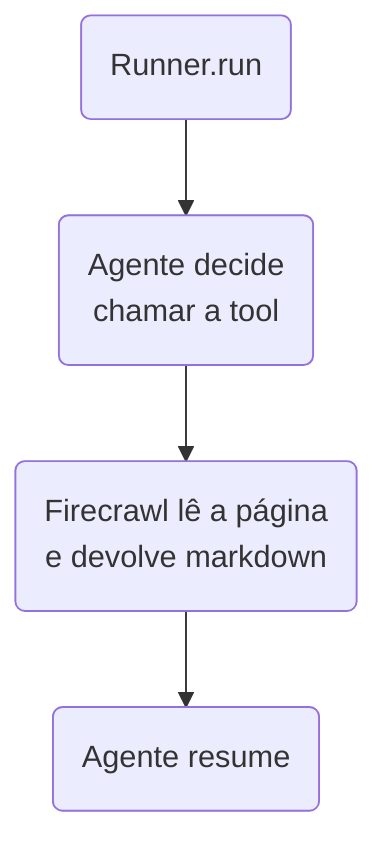

## Etapa 1.9 - Tema Relacionado
<br/>

### **APIs de Scraping (Raspagem)**


---
layout: two-cols-header
layoutClass: gap-8
class: flex items-center justify-center
sourceLabel: Web scraping
source: https://developer.mozilla.org/en-US/docs/Web/HTML
---

# O que é scraping?

#### **Ler uma página feita para humanos e devolver texto que um programa entende**

<div class="h-2" />

::left::

<div class="text-17px w-full self-start [&_ul]:my-0 [&_li]:mb-4">

- **Raspagem** é extrair conteúdo de um site que **não oferece uma API** para aquele dado
- O site devolve **HTML** cheio de menu, banner e script; você quer só o **texto útil**
- Uma API de scraping faz esse trabalho sujo e devolve **markdown limpo**

</div>

::right::

<div class="w-full self-start">

```html [o que o site devolve]{maxHeight:'175px'}
<div class="nav"><a href="/">Home</a></div>
<article>
  <h1>Preço do café sobe 8%</h1>
  <p>A alta foi puxada pela seca...</p>
</article>
<script>ads.load()</script>
```

```md [o que o agente precisa]{maxHeight:'110px'}
# Preço do café sobe 8%

A alta foi puxada pela seca...
```

</div>

<!--
## abrir um site e mostrar "ver código-fonte": o choque visual ajuda

## o agente não aguenta HTML cru — é caro em token e cheio de ruído
-->

---
layout: two-cols-header
layoutClass: gap-8
class: flex items-center justify-center
sourceLabel: Firecrawl no GitHub
source: https://github.com/firecrawl/firecrawl
---

# Por que isso explodiu com IA

#### **O modelo só sabe o que viu no treino — scraping é como ele enxerga o hoje**

<div class="h-2" />

::left::

<div class="text-17px w-full self-start [&_ul]:my-0 [&_li]:mb-4">

- Todo agente precisa de **contexto fresco**: notícia de hoje, preço de agora, página que mudou ontem
- Markdown limpo gasta **muito menos token** do que HTML bruto
- É a porta de entrada de quase todo **pipeline de RAG** que usa a web como fonte

</div>

::right::

<div class="w-full self-start">

<div class="text-15px [&_table]:w-full [&_td]:py-2 [&_th]:py-2">

| Projeto no GitHub | ⭐ Estrelas |
| --- | --- |
| **firecrawl** | ~182 mil |
| **crawl4ai** | ~84 mil |
| **scrapy** | ~64 mil |
| **crawlee** (Apify) | ~26 mil |

</div>

<div class="h-4" />

<Transform :scale="0.8" origin="left top">

> [!NOTE]
> Para comparar: o `public-apis` da etapa 1.7 tem ~481 mil. O tema está entre os mais populares do GitHub.

</Transform>

</div>

<!--
## números consultados na API do GitHub em setembro de 2026 — vão mudar

## a curva de estrelas do firecrawl é um bom exemplo para o Star History da etapa 1.7
-->

---
sourceLabel: public-apis
source: https://github.com/public-apis/public-apis
---

# API pública ou scraping?

#### **A pergunta certa é: o site já oferece esse dado de forma organizada?**

<br/>

<div class="[&_table]:w-full text-13px leading-tight [&_td]:py-2 [&_th]:py-3">

| | API pública | API de scraping |
| --- | --- | --- |
| **Quem define o formato** | O dono do site | Você (ou o modelo) |
| **Estabilidade** | Alta, com versão e contrato | Quebra quando o site muda |
| **Custo** | Muitas vezes gratuito | Quase sempre por página lida |
| **Quando usar** | Existe API para o dado | Só existe a página |

</div>

<div class="h-2" />

<Transform :scale="0.8" origin="left bottom">

> [!IMPORTANT]
> Procure primeiro no `public-apis`. Scraping é o **plano B** — mais caro e mais frágil.

</Transform>

<!--
## retomar a etapa 1.7: o aluno deve esgotar a busca por API antes de raspar

## frágil não quer dizer ruim: às vezes é a única forma de obter o dado
-->

---
sourceLabel: Best Web Scraping APIs
source: https://www.firecrawl.dev/blog/best-web-scraping-api
---

# As APIs de scraping mais usadas

#### **Cada uma resolve bem um problema diferente — não existe a melhor para tudo**

<br/>

<div class="[&_table]:w-full text-13px leading-tight [&_td]:py-2 [&_th]:py-3">

| Serviço | Para que se destaca |
| --- | --- |
| **Firecrawl** | Devolver a página em markdown pronto para o modelo |
| **Apify** | Loja de raspadores prontos (*actors*) para sites específicos |
| **Bright Data** | Escala e rede de proxies para sites que bloqueiam muito |
| **ScrapingBee** | API simples de página única, com plano inicial barato |
| **Crawl4AI** | Alternativa open-source, roda na sua própria máquina |

</div>

<div class="h-4" />

<Transform :scale="0.8" origin="left bottom">

> [!CAUTION]
> Quase toda comparação na internet é publicada por um desses fornecedores — leia sabendo disso.

</Transform>

<!--
## o quadro muda rápido: o valor é entender as categorias, não memorizar nomes

## Crawl4AI é o único da lista que não cobra por página — bom para o projeto de bloco
-->

---
sourceLabel: Apify Store
source: https://apify.com/store
---

# Scraping de redes sociais

#### **Redes sociais quase não têm API aberta — por isso viraram um mercado próprio**

<br/>

<div class="[&_table]:w-full text-13px leading-tight [&_td]:py-2 [&_th]:py-3">

| Rede | Caminho mais usado |
| --- | --- |
| **Instagram** | *Actor* `instagram-scraper` da Apify |
| **TikTok** | *Actor* `tiktok-scraper` da Apify |
| **X (Twitter)** | *Actor* `tweet-scraper`, ou a API oficial (paga) |
| **Reddit** | API oficial, que ainda é aberta e documentada |
| **LinkedIn** | O mais restritivo: exige serviço especializado |

</div>

<div class="h-4" />

<Transform :scale="0.8" origin="left bottom">

> [!CAUTION]
> Raspar rede social costuma **violar os termos de uso** da plataforma e envolve dado pessoal. Verifique antes.

</Transform>

<!--
## explicar o que é um actor: um raspador pronto que roda na nuvem da Apify

## o preço é por resultado, não por mês — mostrar a ordem de grandeza (centavos por 1.000)
-->

---
sourceLabel: YouTube Data API
source: https://developers.google.com/youtube/v3/docs/captions
---

# Scraping de vídeos do YouTube

#### **O que um agente quer de um vídeo quase sempre é a transcrição, não a imagem**

<br/>

<div class="[&_table]:w-full text-13px leading-tight [&_td]:py-2 [&_th]:py-3">

| Opção | Quando faz sentido |
| --- | --- |
| **`youtube-transcript-api`** | Biblioteca Python gratuita, ideal para estudar e testar |
| **API oficial (Data API v3)** | Legendas de canais que são **seus**; estável e suportada |
| **Supadata / TranscriptAPI** | Produção: transcreve até vídeo sem legenda, via IA |
| ***Actor* da Apify** | Legenda com fallback de transcrição automática |

</div>

<div class="h-4" />

<Transform :scale="0.8" origin="left bottom">

> [!TIP]
> Transcrição é **texto puro**: entra direto no seu RAG, com chunking, como qualquer documento.

</Transform>

<!--
## a biblioteca gratuita é bloqueada quando roda de IP de nuvem — comentar

## um vídeo de 20 minutos vira um documento de texto: gancho perfeito para RAG
-->

---
layout: two-cols-header
layoutClass: gap-8
class: flex items-center justify-center
sourceLabel: robots.txt
source: https://developers.google.com/search/docs/crawling-indexing/robots/intro
---

# Até onde é permitido raspar

#### **Ser tecnicamente possível não significa ser permitido — nem legal**

<div class="h-2" />

::left::

<div class="text-17px w-full self-start [&_ul]:my-0 [&_li]:mb-4">

- Todo site publica um **`robots.txt`** dizendo o que aceita que seja lido por robôs
- Os **termos de uso** podem proibir raspagem mesmo de página pública
- Dado pessoal é regido pela **LGPD** — nome, foto e perfil não são "dado livre"

</div>

::right::

<div class="w-full self-start">

<div class="text-15px [&_table]:w-full [&_td]:py-2 [&_th]:py-2">

| Antes de raspar | Pergunta |
| --- | --- |
| `robots.txt` | O site permite? |
| Termos de uso | Há proibição escrita? |
| Dado pessoal | Envolve gente identificável? |
| Ritmo | Vou sobrecarregar o servidor? |

</div>

<div class="h-4" />

<Transform :scale="0.8" origin="left top">

> [!IMPORTANT]
> No projeto de bloco, prefira **dado público e institucional**: sem login e sem dado pessoal.

</Transform>

</div>

<!--
## não é slide de advogado: é para o aluno não levar a faculdade a um problema

## mostrar o robots.txt de um site grande ao vivo, é só somar /robots.txt na URL
-->

---
layout: two-cols-header
layoutClass: gap-8
class: flex items-center justify-center
sourceLabel: Firecrawl Docs
source: https://docs.firecrawl.dev/
---

# Firecrawl em uma chamada

#### **Você manda a URL, ele devolve a página inteira já convertida em markdown**

<div class="h-2" />

::left::

<div class="text-17px w-full self-start [&_ul]:my-0 [&_li]:mb-4">

- `scrape` lê **uma página**; `crawl` percorre **o site todo** a partir de um link
- A saída padrão já é **markdown**, o formato que o modelo lê melhor
- Tem plano gratuito com créditos, o suficiente para os testes da disciplina

</div>

::right::

<div class="w-full self-start">

```python [scrape simples]{maxHeight:'200px'}
from firecrawl import Firecrawl

firecrawl = Firecrawl(api_key="fc-...")

resultado = firecrawl.scrape(
    url="https://example.com",
    formats=["markdown"],
)

print(resultado.markdown)
```

</div>

<!--
## crawl consome muito crédito: avisar antes que alguém aponte para um site grande

## o SDK se instala com: uv add firecrawl-py
-->

---
layout: two-cols-header
layoutClass: gap-8
class: flex items-center justify-center
sourceLabel: Firecrawl Docs
source: https://docs.firecrawl.dev/
---

# A ferramenta com Firecrawl

#### **A função Python vira uma tool, e a chave fica no `.env` — nunca no código**

<div class="h-2" />

::left::

```python [main.py — parte 1]{maxHeight:'340px'}
import asyncio, os
from dotenv import load_dotenv
from firecrawl import Firecrawl
from agents import (Agent, Runner, function_tool,
                    set_default_openai_api,
                    set_tracing_disabled)

@function_tool
def ler_pagina(url: str) -> str:
    """Lê a página e devolve o texto em markdown."""
    firecrawl = Firecrawl(
        api_key=os.getenv("FIRECRAWL_API_KEY"))
    doc = firecrawl.scrape(url=url, formats=["markdown"])
    return doc.markdown
```

::right::

<div class="w-full self-start">

```bash [.env]{maxHeight:'110px'}
FIRECRAWL_API_KEY=
OPENAI_API_KEY=
```

<div class="h-4" />

<Transform :scale="0.8" origin="left top">

> [!TIP]
> A **docstring** é o que o modelo lê para decidir quando chamar a ferramenta. Escreva com clareza.

</Transform>

</div>

<!--
## preencher a chave do Firecrawl ao vivo, pegando no painel gratuito deles

## o .env nunca vai para o Git: lembrar do .gitignore
-->

---
layout: two-cols-header
layoutClass: gap-8
class: flex items-center justify-center
sourceLabel: OpenAI Agents SDK
source: https://openai.github.io/openai-agents-python/tools/
---

# O agente e o runner

#### **O agente recebe a tool e o `Runner` executa a conversa até a resposta final**

<div class="h-2" />

::left::

<div class="w-full self-start">

```python [main.py — parte 2]{maxHeight:'340px'}
leitor = Agent(name="Leitor de Sites",
               instructions="Leia e resuma.",
               tools=[ler_pagina])

async def main():
    load_dotenv()
    set_default_openai_api("chat_completions")
    set_tracing_disabled(True)
    result = await Runner.run(
        starting_agent=leitor,
        input="Resuma https://example.com")
    print(result.final_output)

asyncio.run(main())
```

</div>

::right::

<div class="w-full self-start">

<Transform :scale="0.6" origin="top">



</Transform>

</div>

<!--
## ninguém programou "chame o Firecrawl": o modelo decidiu pela docstring

## rodar ao vivo com uv run main.py e mostrar a resposta final
-->

---
layout: default
---

# Hands-on

<br/>

🛠️ &nbsp;**Exercício \#1:** Crie uma conta gratuita no Firecrawl e pegue a sua chave de API.

🛠️ &nbsp;**Exercício \#2:** Rode o `scrape` em uma página do seu tema e veja o markdown.

🛠️ &nbsp;**Exercício \#3:** Transforme o `scrape` em uma tool de um agente com `Runner`.

🛠️ &nbsp;**Exercício \#4:** Confira o `robots.txt` do site que você escolheu raspar.

🛠️ &nbsp;**Exercício \#5:** Compare o tamanho em texto do HTML bruto e do markdown.

<br/>

- [ ] mantenha a chave apenas no `.env`, fora do Git
- [ ] escolha site público, sem login e sem dado pessoal
- [ ] versione as anotações junto do seu projeto de bloco

<!--
# Exercício #1 — Chave
O plano gratuito tem créditos suficientes para a disciplina.

# Exercício #2 — Primeiro scrape
Ver o markdown antes de escrever agente nenhum. Entender a saída
evita depurar às cegas depois.

# Exercício #3 — Virar tool
Reaproveitar o código dos dois slides anteriores, trocando a URL.

# Exercício #4 — robots.txt
Basta somar /robots.txt à URL do site. Discutir o que encontraram.

# Exercício #5 — Economia de token
A diferença de tamanho explica por que markdown sai mais barato.
-->
