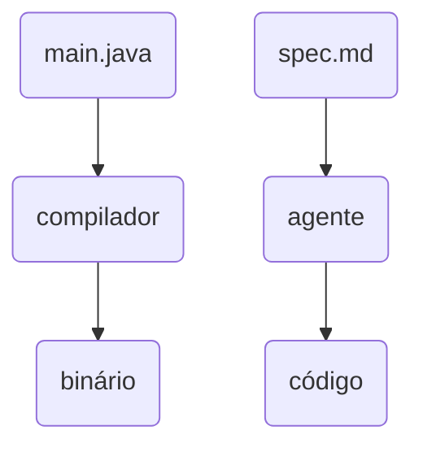
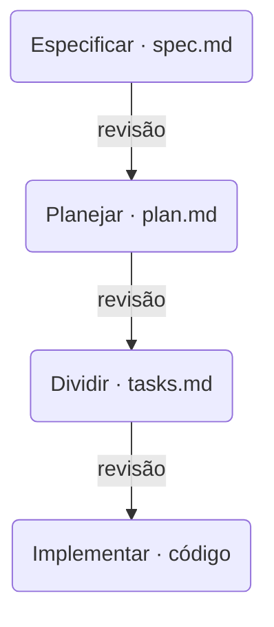

## Etapa 12 - Tema Relacionado
<br/>

### **Spec Driven Development**

---
layout: two-cols-header
layoutClass: gap-8
class: flex items-center justify-center
---

# Vibe coding: funciona até parar de funcionar

#### **"Vibe coding" foi cunhado por Andrej Karpathy (cofounder OpenAI) em fev de 2025.**


<div class="h-2" />

::left::

<div class="text-17px w-full self-start [&_ul]:my-0 [&_li]:mb-4">

- **Vibe coding** é conhecido pelos ciclos repetidos de conversas com agentes de codificação, aceite e correção, **sem preocupação técnica mínima** sobre o que o agente produz como código.
- Pode funcionar bem para **protótipação** e cenários mais simples
- O principal problema do Vibe Coding é o agente **não saber o que deveria ser escrito**.

</div>

::right::

<div class="w-full self-start">

<div class="text-15px [&_table]:w-full [&_td]:py-2 [&_th]:py-2">

| **Tamanho da tarefa** | **Vibe coding** |
| --- | --- |
| Script de 50 linhas | Ótimo |
| Um endpoint novo | Bom |
| Feature com 5 arquivos | Começa a derrapar |
| Projeto inteiro | Vira retrabalho |

</div>

<div class="h-4" />


</div>

<!--
## perguntar: quem já pediu uma coisa e recebeu outra? todo mundo levanta a mão

## a causa quase nunca é o modelo — é o pedido
-->

---
layout: two-cols-header
layoutClass: gap-8
class: flex items-center justify-center
sourceLabel: GitHub Blog
source: https://github.blog/ai-and-ml/generative-ai/spec-driven-development-with-ai-get-started-with-a-new-open-source-toolkit/
---

# O que é Spec Driven Development

#### **A especificação vira a fonte da verdade; o código vira produto dela**

<div class="h-2" />

::left::

<div class="text-17px w-full self-start [&_ul]:my-0 [&_li]:mb-4">

- Em vez de descrever o que você quer **no chat**, você escreve num documento — a **spec**
- Você revisa e corrige a spec **antes** de existir uma linha de código
- A pergunta que o SDD faz é: **e se o código fosse o binário?**

</div>

::right::

<div class="w-full self-start">

<Transform :scale="0.85" origin="top">



</Transform>


</div>

<!--
## a analogia é imperfeita de propósito: gcc é determinístico, o agente não é

## guardar essa ressalva, ela volta no slide do waterfall
-->

---
layout: two-cols-header
layoutClass: gap-8
class: flex items-center justify-center
---

# Vocês já escreveram uma spec

#### **Os entregáveis do TP1 servem de contexto para outras specs**

<div class="h-2" />

::left::

<div class="text-17px w-full self-start [&_ul]:my-0 [&_li]:mb-4">

- Nem toda spec contém **todos os detalhes** a respeito de uma funcionalidade
- **Os entregáveis do TP1** de bloco fazem parte do contexto (context engineering) para as próximas especificações
- **Documentos de alto nível são fontes da verdade ou âncoras**, são uma parte da especificação


</div>

::right::

<div class="w-full self-start">

<div class="text-14px [&_table]:w-full [&_td]:py-2 [&_th]:py-2">

| **Entregável do TP1** | **Seção da spec** |
| --- | --- |
| Descrição do problema | Contexto e objetivo |
| Requisitos funcionais | Critérios de aceite |
| Inputs, outputs, restrições | Contratos e limites |
| Arquitetura inicial | Plano técnico |
| Prompts documentados | Instruções do agente |

</div>

</div>

<!--
## esse slide existe para tirar o ar de novidade: eles já fazem, só que uma vez só

## pedir para abrirem o TP1 agora e olharem enquanto você fala
-->

---
layout: two-cols-header
layoutClass: gap-8
class: flex items-center justify-center
sourceLabel: GitHub Blog
source: https://github.blog/ai-and-ml/generative-ai/spec-driven-development-with-ai-get-started-with-a-new-open-source-toolkit/
---

# O ciclo em quatro fases

#### **Entre uma fase e a seguinte existe sempre uma revisão humana**

<div class="h-2" />

::left::

<div class="text-17px w-full self-start [&_ul]:my-0 [&_li]:mb-4">

- **Especificar** — o quê e para quem, sem decidir tecnologia ainda
- **Planejar** — a stack, a arquitetura e as restrições técnicas
- **Dividir** — o plano vira uma lista ordenada de tarefas pequenas
- **Implementar** — o agente executa tarefa por tarefa e você revisa

</div>

::right::

<Transform :scale="0.72" origin="top">



</Transform>

<!--
## o valor do método está nas setas, não nas caixas

## sem revisão entre as fases, o erro da primeira é amplificado nas outras três
-->

---
layout: two-cols-header
layoutClass: gap-8
sourceLabel: GitHub Spec Kit
source: https://github.com/github/spec-kit
---

# GitHub Spec Kit

#### **A implementação de referência: aberta e independente de agente**

<div class="h-2" />

::left::

<div class="text-17px w-full self-start [&_ul]:my-0 [&_li]:mb-4">

- Lançado pelo **GitHub** como projeto de código aberto, hoje compatível com mais de 30 agentes
- Instala como ferramenta de linha de comando e adiciona **comandos de barra** ao seu agente
- Cada comando produz um arquivo markdown que **você revisa** antes do próximo

</div>

::right::

<div class="w-full self-start">

```bash [terminal]{maxHeight:'110px'}
uv tool install specify-cli
specify init meu-projeto
```

```text [comandos no agente]{maxHeight:'220px'}
/speckit-constitution  princípios do projeto
                       (uma vez só)

/speckit-specify    ->  spec.md
/speckit-plan       ->  plan.md
/speckit-tasks      ->  tasks.md
/speckit-implement  ->  o código
/speckit-converge   ->  compara código x spec
                        e reabre tarefas
```

</div>

<!--
## o converge é o passo que mais falta nas outras ferramentas: ele fecha o laço

## mostrar a pasta specs/ criada no projeto, com uma subpasta por feature
-->

---
layout: two-cols-header
layoutClass: gap-8
class: flex items-center justify-center
---

# A constituição do projeto

#### **As regras que valem para o projeto inteiro, escritas uma vez só**

<div class="h-2" />

::left::

<div class="text-17px w-full self-start [&_ul]:my-0 [&_li]:mb-4">

- A **constituição** guarda o que **não muda** de funcionalidade para funcionalidade: padrão de código, política de teste, limite de arquitetura
- O **`CLAUDE.md`** e **`AGENTS.md`** também podem ser entendidos como arquivos de constituição
- O uso do **SDK Agents da OpenAI** é um bom exemplo de definição para incluir em um arquivo de constituição para os exercícios dos TPs da disciplina de Agentes de IA

</div>

::right::

<div class="w-full self-start">

```md [constitution.md]{maxHeight:'230px'}
# Princípios

1. Todo endpoint tem modelo Pydantic de
   entrada e de saída.
2. Nenhuma chave de API no código —
   sempre via .env.
3. Toda função de negócio tem teste
   antes de ser considerada pronta.
4. O agente nunca escreve direto no
   banco: sempre pela camada de tool.
```

</div>

<!--
## amarrar com a etapa 3: eles já escreveram CLAUDE.md, é a mesma função

## a constituição é o único documento que NÃO é por feature
-->

---
layout: two-cols-header
layoutClass: gap-8
sourceLabel: EARS
source: https://en.wikipedia.org/wiki/Easy_Approach_to_Requirements_Syntax
---

# Escrevendo requisito que o agente entende

#### **EARS: um requisito por frase, sempre no mesmo molde**

<div class="h-2" />

::left::

<div class="text-17px w-full self-start [&_ul]:my-0 [&_li]:mb-4">

- **EARS** — *Easy Approach to Requirements Syntax* — nasceu na **Rolls-Royce, em 2009**, para requisitos de motor de avião
- Restringe o texto a poucos moldes fixos: legível por pessoa, previsível para o modelo
- O molde mais usado é **QUANDO** 〈evento〉 **O SISTEMA DEVE** 〈comportamento〉

</div>

::right::

<div class="w-full self-start">

```text [requisitos em EARS]{maxHeight:'230px'}
QUANDO o formulário for enviado com dados
inválidos, O SISTEMA DEVE exibir a mensagem
de erro ao lado do campo correspondente.

QUANDO o pedido não existir, O SISTEMA DEVE
responder 404 com o campo "error".

ENQUANTO o processamento estiver em curso,
O SISTEMA DEVE responder "processando" na
rota de status.
```

<div class="h-2" />

<Transform :scale="0.8" origin="left top">

> [!TIP]
> Cada uma dessas frases vira um **teste**.

</Transform>

</div>

<!--
## a notação é de 2009 e veio de aviação — não é moda de IA

## pedir para a turma traduzir um requisito do TP1 deles para EARS, ao vivo
-->

---
layout: two-cols-header
layoutClass: gap-8
---

# Uma spec ruim e uma spec boa

#### **A diferença não é o tamanho: é o que dá para verificar depois**

<div class="h-2" />

::left::

```md [spec ruim]{maxHeight:'250px'}
# Busca de pedidos

O sistema deve ter uma busca de pedidos
rápida e fácil de usar, que funcione bem
e retorne resultados relevantes para o
cliente.
```

::right::

<div class="w-full self-start">

```md [spec boa]{maxHeight:'250px'}
# Busca de pedidos

QUANDO o cliente informar um código de
pedido existente, O SISTEMA DEVE retornar
status, data e transportadora em até 2 s.

QUANDO o código não existir, O SISTEMA DEVE
responder 404 com {"error": "..."}.

Fora de escopo: busca por nome do cliente.
```

<div class="h-2" />

<Transform :scale="0.8" origin="left top">

> [!CAUTION]
> "Rápida", "fácil" e "relevante" **não são verificáveis** — o agente vai inventar o que elas significam.

</Transform>

</div>

<!--
## o "fora de escopo" é metade da spec: dizer o que NÃO fazer evita invenção

## perguntar à turma: como você testaria "fácil de usar"?
-->

---
sourceLabel: Birgitta Böckeler
source: https://martinfowler.com/articles/exploring-gen-ai/sdd-3-tools.html
---

# Os três degraus de Böckeler

#### **Adotar SDD não é tudo ou nada — existem três graus diferentes**

<br/>

<div class="[&_table]:w-full text-13px leading-tight [&_td]:py-2 [&_th]:py-3">

| Nível | O que significa | Custo Spec |
| --- | --- | --- |
| **Spec-first** | Você escreve a spec antes de pedir código. Depois da entrega, a vida segue normalmente | Baixo |
| **Spec-anchored** | A spec **sobrevive** à entrega e passa a guiar toda mudança seguinte | Médio |
| **Spec-as-source** | **Ninguém edita o código** gerado à mão: para mudar o sistema, muda-se a spec (fonte da verdade) | Alto |

</div>

<div class="h-4" />

<Transform :scale="0.8" origin="left bottom">

> [!NOTE]
> A maior parte do ganho está já no **primeiro** nível. O terceiro é o que mais lembra o *model-driven development* dos anos 2000 — que prometeu a mesma coisa e não emplacou.

</Transform>

<!--
## quase todo mundo que diz "uso SDD" está no nível 1

## o nível 3 só fecha a conta em domínio muito estável e bem delimitado
-->

---
sourceLabel: Vimal Dwarampudi
source: https://vimal-dwarampudi.medium.com/spec-driven-ai-bmad-speckit-gsd-superpowers-2cae4512819a
---

# As ferramentas

#### **Cada uma aposta num grau diferente de formalidade**

<br/>

<div class="[&_table]:w-full text-13px leading-tight [&_td]:py-2 [&_th]:py-3">

| Ferramenta | Quem fez | Fluxo | Observação |
| --- | --- | --- | --- |
| **Spec Kit** | GitHub | constitution → specify → plan → tasks → implement | Aberto, funciona com +30 agentes |
| **GSD** | open-gsd | discutir → planejar → executar → verificar → entregar | Cada fase roda num subagente de contexto limpo |
| **BMAD** | BMad Code | esclarecer → planejar → construir e verificar → ajustar | Você entra no ponto que o tamanho da tarefa pedir |
| **Superpowers** | Jesse Vincent | brainstorm → plano → execução → revisão | Impõe TDD e um subagente por tarefa |
| **Plan mode** | Claude Code | planeja, você aprova, só então executa | Já vem junto, sem instalar nada |

</div>

<div class="h-4" />

<Transform :scale="0.8" origin="left bottom">

> [!TIP]
> O **plan mode** pré-existente em agentes de codificação (claude, codex, cursor) é um tipo de Spec Driven Development em menor escala: planejar, aprovar, executar.

</Transform>

<!--
## começar pelo plan mode é o caminho mais barato de experimentar a ideia

## as quatro primeiras são abertas e instaláveis no Claude Code que eles já usam

## o GSD nasceu como gsd-build/get-shit-done e hoje segue como GSD Core, no open-gsd
-->

---
layout: two-cols-header
layoutClass: gap-8
class: flex items-center justify-center
sourceLabel: Thoughtworks
source: https://thoughtworks.medium.com/spec-driven-development-d85995a81387
---

# Isso não é waterfall de novo?

#### **A crítica mais comum ao método — e ela tem fundamento**

<div class="h-2" />

::left::

<div class="text-17px w-full self-start [&_ul]:my-0 [&_li]:mb-4">

- **A acusação:** desenhar tudo antes de codar é o *waterfall* que o ágil passou vinte anos combatendo
- **A defesa:** o veneno do waterfall era o ciclo de feedback de **meses**; aqui ele é de **minutos**
- **O risco real:** usar a spec para não precisar mudar de ideia no meio. Aí vira *"waterfall com mais tokens"*

</div>

::right::

<div class="w-full self-start">

<div class="text-15px [&_table]:w-full [&_td]:py-2 [&_th]:py-2">

| Quando | A mesma ideia se chamava |
| --- | --- |
| Anos 1960 | Métodos formais |
| 2001 | Model-Driven Architecture |
| 2003 | Test-Driven Development |
| 2006 | Behavior-Driven Development |
| 2025 | Spec-Driven Development |

</div>

<div class="h-4" />

<Transform :scale="0.8" origin="left top">

> [!NOTE]
> "Especificar antes" não é invenção de 2025. O que mudou foi **quem implementa** a partir da spec.

</Transform>

</div>

<!--
## não vender o método: apresentar a controvérsia e deixar o aluno escolher

## a diferença honesta em relação ao MDD: lá o gerador era determinístico, aqui não é
-->

---
sourceLabel: Scott Logic / Marmelab
source: https://blog.scottlogic.com/2025/11/26/putting-spec-kit-through-its-paces-radical-idea-or-reinvented-waterfall.html
---

# O que mediram na prática

#### **Os poucos relatos públicos com números não são animadores**

<br/>

<div class="[&_table]:w-full text-13px leading-tight [&_td]:py-2 [&_th]:py-3">

| Experimento | Resultado medido |
| --- | --- |
| Uma feature com Spec Kit | **2.577 linhas de markdown** geradas; 33 min de agente + **3,5 h de revisão**, contra ~8 min no fluxo habitual |
| Exibir a data atual num app | **8 arquivos e 1.300 linhas** de especificação |
| Um bug simples no Kiro | Virou **4 user stories e 16 critérios** de aceite |
| Verificação automática | O agente marcou "verificar implementação" como concluída **sem escrever um único teste** |

</div>

<div class="h-4" />

<Transform :scale="0.8" origin="left bottom">

> [!CAUTION]
> Nenhum deles é estudo controlado — são relatos de quem usou e publicou. Mas apontam todos para o mesmo lado: **o processo inteiro é desproporcional para tarefa pequena**.

</Transform>

<!--
## mesma lição da etapa 11: número de fornecedor x número de quem mediu

## o 3,5 h de revisão é o dado mais importante da tabela — o custo migrou, não sumiu
-->

---
layout: two-cols-header
layoutClass: gap-8
class: flex items-center justify-center
---

# Quando vale e quando não vale

#### **O erro mais comum é aplicar SDD para qualquer tarefa**

<div class="h-2" />

::left::

<div class="w-full self-start">

<div class="text-15px [&_table]:w-full [&_td]:py-2 [&_th]:py-2">

| ✅ Vale a pena |
| --- |
| Feature nova, com várias regras |
| Mais de uma pessoa no mesmo código |
| Regra de negócio que não pode falhar |
| Projeto começando do zero |

</div>

</div>

::right::

<div class="w-full self-start">

<div class="text-15px [&_table]:w-full [&_td]:py-2 [&_th]:py-2">

| ❌ Não vale |
| --- |
| Correção de um bug |
| Mudança de uma linha |
| Protótipo que será jogado fora |
| Código legado grande e mal mapeado |

</div>

</div>

<!--
## a pergunta prática: o custo de explicar é menor que o custo de refazer?

## se a resposta for não, escreva o prompt e siga em frente
-->

---
sourceLabel: Allegro Tech
source: https://blog.allegro.tech/2026/06/spec-driven-development-best-practices.html
---

# Boas práticas de quem usa de verdade

#### **O que um time de engenharia aprendeu depois de alguns meses**

<br/>

<div class="[&_table]:w-full text-13px leading-tight [&_td]:py-2 [&_th]:py-3">

| Prática | Por quê |
| --- | --- |
| Uma spec **por feature**, nunca uma do sistema inteiro | Spec monolítica estoura o contexto e ninguém mantém |
| Separe o **o quê** (spec, estável) do **como** (plano, descartável) | São coisas que mudam em ritmos diferentes |
| Cada tarefa cabe em **uma sessão** do agente e tem critério de aceite | Dá ao agente um alvo concreto e um sinal de pronto |
| **Atualize a spec** depois de implementar | Decisão tomada no código que não voltou para a spec vira dívida |
| Avalie numa **sessão nova**, de contexto limpo | Enxerga o que o autor da spec já não enxerga |

</div>

<div class="h-4" />

<Transform :scale="0.8" origin="left bottom">

> [!IMPORTANT]
> Quem assina o código continua sendo **você**. A spec move o trabalho de revisão, não elimina.

</Transform>

<!--
## a última linha é a que mais se esquece: spec desatualizada é pior que spec nenhuma

## "pare de iterar quando o agente só apontar firula" — regra prática do time
-->

---
layout: default
---

# Hands-on

<br/>

🛠️ &nbsp;**Exercício \#1:** Instale o Spec Kit do Github no seu agente de codificação.

🛠️ &nbsp;**Exercício \#2:** Reescreva um dos exercícios do TP de bloco e use no Spec Kit do Github.

🛠️ &nbsp;**Exercício \#3:** Reescreva um dos exercícios do TP de bloco no formato EARS.

🛠️ &nbsp;**Exercício \#4:** Escreva princípios (constituição) para o seu TP de bloco em um `AGENTS.md`.


<br/>

- [ ] todo requisito em EARS precisa ser verificável
- [ ] registre quantas linhas de markdown o Spec Kit gerou na sua feature
- [ ] conclua: para o seu projeto, compensou ou não? justifique

<!--
# Exercício #1 — EARS
Quase todo requisito de TP1 começa vago; traduzir expõe isso na hora.

# Exercício #2 — Fora de escopo
O mais difícil do exercício e o que mais evita invenção do agente.

# Exercício #3 — Constituição
Retomar a etapa 3: eles já têm um CLAUDE.md, basta elevá-lo a princípios.

# Exercício #4 — Spec Kit
Feature pequena de propósito, para sentirem a desproporção na pele.

# Exercício #5 — A comparação
Não existe resposta certa. O objetivo é formarem opinião com dado próprio.
-->
