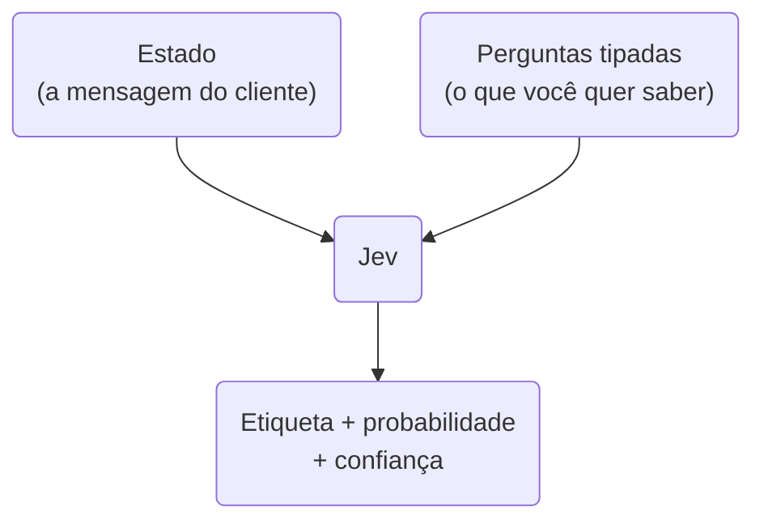

## **Etapa 2.0**

<br/>

### Modelos Classificadores e o Jev

---
layout: two-cols-header
layoutClass: gap-8
class: flex items-center justify-center
---

# Sistemas agênticos e tomada de decisão

#### **Geralmente fluxos agênticos tem dezenas e centenas de decisões**

<div class="h-2" />

::left::

<div class="text-17px w-full self-start [&_ul]:my-0 [&_li]:mb-4">

- Sistemas agênticos precisam **decidir** para qual agente deve ser enviada a mensagem do cliente
- Sistemas agênticos precisam **decidir** **qual tool chamar**, antes de executar uma tool
- Sistemas agênticos precisam **decidir** se uma mensagem é segura, antes de enviar uma resposta ao cliente

</div>

::right::

<div class="w-full self-start">

<div class="text-15px [&_table]:w-full [&_td]:py-2 [&_th]:py-2">

| **Decisão no fluxo** | **Resposta possível** |
| --- | --- |
| É dúvida ou consulta de pedido? | Atendente / Rastreador |
| O texto do cliente é ofensivo? | sim / não |
| Quão urgente é este chamado? | baixa / média / alta |

</div>


</div>

<!--
## perguntar: quantas decisões dessas o sistema de vocês toma por mensagem?

## a conta: 5 decisões x 1 chamada de LLM cada = 5x o custo e 5x a espera
-->

---
layout: two-cols-header
layoutClass: gap-8
class: flex items-center justify-center
---

# O que é um modelo classificador

#### **Um modelo que escolhe uma etiqueta de uma lista fixa em vez de escrever**

<div class="h-2" />

::left::

<div class="text-17px w-full self-start [&_ul]:my-0 [&_li]:mb-4">

- Um **classificador** recebe uma entrada e devolve **uma etiqueta** de um conjunto que **você** definiu
- É a tarefa mais antiga do aprendizado de máquina: o **filtro de spam** do e-mail de vocês é um classificador
- A saída não é uma frase, é **uma escolha** — e por isso o programa consegue usá-la direto num `if`

</div>

::right::

<div class="w-full self-start">

<div class="text-15px [&_table]:w-full [&_td]:py-2 [&_th]:py-2">

| **Modelo gerador (LLM)** | **Modelo classificador** |
| --- | --- |
| Escreve texto livre | Escolhe uma opção da lista |
| A saída varia a cada vez | A saída é sempre válida |
| Quem lê é uma pessoa | Quem lê é o código |
| Explica o porquê | Apenas decide |

</div>


</div>


<!--
## exemplo que todo mundo conhece: spam / não spam, aprovado / reprovado

## o classificador clássico precisava de dados rotulados e treino; aqui não
-->

---
layout: two-cols-header
layoutClass: gap-8
class: flex items-center justify-center
---

# Hoje a gente classifica com LLM

#### **Funciona — mas você paga preço de redação para receber uma palavra**

<div class="h-2" />

::left::

<div class="text-17px w-full self-start [&_ul]:my-0 [&_li]:mb-4">

- O jeito comum hoje é pedir ao LLM: *"responda apenas SIM ou NÃO"*
- Dois problemas: é **caro** e **lento**
- Cada perguntinha dessas gasta **uma chamada de LLM inteira** — e o agente faz várias por mensagem.

</div>

::right::

<div class="w-full self-start">

```python [o jeito frágil]{maxHeight:'230px'}
resposta = await Runner.run(
    starting_agent=classificador,
    input=f"O cliente pede reembolso? "
          f"Responda SIM ou NAO.\n\n{mensagem}",
)

# e agora torcer para o modelo ter obedecido
if resposta.final_output.strip().upper() == "SIM":
    abrir_reembolso()
```


</div>

<!--
## esse é o padrão que todo mundo escreve hoje, inclusive nos projetos de vocês

## o output_type do Agents SDK resolve o formato, mas não resolve custo nem latência
-->

---
layout: two-cols-header
layoutClass: gap-8
class: flex items-center justify-center
sourceLabel: Thinking, Fast and Slow
source: https://en.wikipedia.org/wiki/Thinking,_Fast_and_Slow
---

# Sistema 1 e Sistema 2

#### **Kahneman: pensar rápido e automático, ou devagar e deliberado**

<div class="h-2" />

::left::

<div class="text-17px w-full self-start [&_ul]:my-0 [&_li]:mb-4">

- **Sistema 1** é rápido e automático: reconhecer um rosto, ler a palavra "casa", saber que 2 + 2 = 4
- **Sistema 2** é lento e esforçado: multiplicar 17 × 24, planejar uma viagem, escrever uma redação
- O LLM é excelente no Sistema 2 — e a gente vinha usando ele **também** para tudo do Sistema 1

</div>

::right::

<div class="w-full self-start">

<div class="text-15px [&_table]:w-full [&_td]:py-2 [&_th]:py-2">

| **Sistema 1** | **Sistema 2** |
| --- | --- |
| Reconhecer um rosto | Multiplicar 17 × 24 |
| "Isso é spam?" | "Escreva a resposta ao cliente" |
| Milissegundos | Segundos |
| Decidir | Raciocinar |

</div>

</div>

::bottom::

<Transform :scale="0.8" origin="left top">

> [!IMPORTANT]
> A TypeSafe chama o Jev de **System One model**: um modelo feito só para a parte rápida.

</Transform>


<!--
## fazer o teste ao vivo: mostrar uma foto (S1 instantâneo) e pedir 17x24 (S2 travado)

## o ponto: usar o cérebro do S2 para tarefa de S1 é desperdício — vale para modelo também
-->

---
layout: two-cols-header
layoutClass: gap-8
class: flex items-center justify-center
sourceLabel: TypeSafe AI
source: https://typesafe.ai/blog/introducing-system-one-models-and-jev
---

# De onde veio o Jev

#### **Uma empresa de dois anos em silêncio, fundada por um ex-OpenAI**

<div class="h-2" />

::left::

<div class="text-17px w-full self-start [&_ul]:my-0 [&_li]:mb-4">

- A **TypeSafe AI** nasceu em 2024, em São Francisco, e passou cerca de **dois anos em stealth**
- O CEO **Diogo Almeida** passou 4 anos na OpenAI trabalhando em RLHF, InstructGPT e GPT-4
- O treino usa só **dados sintéticos** e um método próprio: **RLCD**, que treina o modelo a acertar a própria confiança

</div>

::right::

<div class="w-full self-start">

<div class="text-15px [&_table]:w-full [&_td]:py-2 [&_th]:py-2">

| **Quando** | **O quê** |
| --- | --- |
| 2024 | Fundação da TypeSafe AI |
| 2024 – 2026 | Dois anos em stealth |
| 15/09/2026 | Lançamento + US$ 40 mi (DCVC) |
| 21/09/2026 | Fim da lista de espera |

</div>

<div class="h-4" />

<Transform :scale="0.8" origin="left top">

> [!NOTE]
> O nome vem de **William Stanley Jevons**: quando uma coisa fica muito mais barata, o consumo dela explode.

</Transform>

</div>

<!--
## RLHF treina o modelo a agradar quem avalia; RLCD treina a calibrar a confiança

## é um modelo muito novo: menos de duas semanas de vida quando este slide foi escrito
-->

---
layout: two-cols-header
layoutClass: gap-8
class: flex items-center justify-center
sourceLabel: TypeSafe AI
source: https://docs.typesafe.ai/models
---

# Como o Jev funciona

#### **Você manda um estado e perguntas tipadas; ele devolve respostas tipadas**

<div class="h-2" />

::left::

<div class="text-17px w-full self-start [&_ul]:my-0 [&_li]:mb-4">

- Você envia um **estado** (o que deve ser julgado) e uma ou mais **perguntas tipadas**
- Ele responde **todas de uma vez**, num único passe paralelo — não token por token
- Cada resposta vem com **probabilidade** e **confiança**. Ele **nunca** escreve texto

</div>

::right::

<Transform :scale="1.3" origin="top">



</Transform>

<!--
## comparar com o LLM: lá a resposta sai palavra por palavra, aqui sai de uma vez

## por isso a latência é de 70 a 500 ms, e não de segundos
-->

---
sourceLabel: TypeSafe AI
source: https://docs.typesafe.ai/models
---

# Os três primitivos

#### **Só existem três tipos de pergunta — todo o resto se monta com eles**

<br/>

<div class="[&_table]:w-full text-14px leading-tight [&_td]:py-2 [&_th]:py-3">

| Primitivo | A pergunta que ele responde | O que volta | Exemplo |
| --- | --- | --- | --- |
| **Noul** | Isso é verdade? | Um número de 0 a 1 — a probabilidade de "sim" | `0.96` |
| **Choice** | Qual destas opções? | A opção escolhida + a probabilidade de **cada** uma | `"payments"` |
| **Score** | Onde isso cai na régua? | A posição na escala, que pode ficar entre dois níveis | `1.99` |

</div>

<div class="h-4" />

<Transform :scale="0.8" origin="left bottom">

> [!IMPORTANT]
> Além da resposta, o `Choice` e o `Score` devolvem uma **confiança** separada: o quanto o modelo ficou seguro da escolha. É ela que decide se você automatiza ou chama um humano.

</Transform>

<!--
## 255 opções é o limite de um Choice — na prática ninguém chega perto

## Score é útil para urgência, gravidade, satisfação: coisas que têm ordem
-->

---
layout: two-cols-header
layoutClass: gap-8
class: flex items-center justify-center
sourceLabel: TypeSafe AI
source: https://docs.typesafe.ai/models
---

# Exemplo 1 — Noul: uma pergunta de sim ou não

#### **A pergunta de sim ou não vira um número entre 0 e 1**

<div class="h-2" />

::left::

```json [a pergunta]{maxHeight:'250px'}
"questions": {
  "pede_reembolso": {
    "type": "noul",
    "instructions": "O cliente está pedindo
                     reembolso?",
    "criteria": {
      "true": "Pede o dinheiro de volta.",
      "false": "Só reclama ou tira dúvida."
    }
  }
}
```

::right::

<div class="w-full self-start">

```json [a resposta]{maxHeight:'130px'}
"pede_reembolso": {
  "type": "noul",
  "noul": 0.96
}
```

<div class="h-2" />

<Transform :scale="0.8" origin="left top">

> [!NOTE]
> Não veio "sim": veio **0.96**. Quem escolhe o corte é você — `0.9` para abrir chamado, `0.99` para devolver dinheiro sozinho.

</Transform>

</div>

<!--
## o "criteria" é a parte que mais erra: descrever mal o true/false estraga tudo

## perguntar à turma: que corte vocês usariam para cada uma das duas ações?
-->

---
layout: two-cols-header
layoutClass: gap-8
class: flex items-center justify-center
sourceLabel: TypeSafe AI
source: https://docs.typesafe.ai/models
---

# Exemplo 2 — Choice: o roteador do projeto

#### **A decisão mais comum de todas: para qual agente vai esta mensagem?**

<div class="h-2" />

::left::

```json [a pergunta]{maxHeight:'250px'}
"questions": {
  "destino": {
    "type": "choice",
    "instructions": "Qual agente atende?",
    "criteria": {
      "atendente": "Dúvida sobre política,
                    troca ou catálogo.",
      "rastreador": "Quer o status de um
                     pedido específico.",
      "ambos": "Pergunta as duas coisas."
    }
  }
}
```

::right::

<div class="w-full self-start">

```json [a resposta]{maxHeight:'180px'}
"destino": {
  "type": "choice",
  "choice": "rastreador",
  "confidence": 0.67,
  "probabilities": {
    "atendente": 0.19,
    "rastreador": 0.78,
    "ambos": 0.03
  }
}
```

<div class="h-2" />

<Transform :scale="0.8" origin="left top">

> [!TIP]
> O `probabilities` mostra **o quanto ele hesitou**. Confiança 0.67 num roteamento é caso de mandar para os dois agentes.

</Transform>

</div>

<!--
## esse slide é o gancho direto com os dois agentes do projeto de bloco

## sem isso, sobra pedir a um LLM para escolher — mais caro e mais lento
-->

---
layout: two-cols-header
layoutClass: gap-8
sourceLabel: OpenRouter
source: https://openrouter.ai/docs/guides/community/jev
---

# Usando o Jev pelo OpenRouter

#### **Uma requisição HTTP POST com JSON — igual às Web APIs de sempre**

<div class="h-2" />

::left::

::code-group

```bash [cURL]{maxHeight:'300px'}
curl https://openrouter.ai/api/alpha/decisions \
  -H "Authorization: Bearer $OPENROUTER_API_KEY" \
  -H "Content-Type: application/json" \
  -d '{
    "model": "typesafe/jev-1.13",
    "state": {
      "mensagem": "Onde está meu pedido A-104?"
    },
    "questions": {
      "destino": {
        "type": "choice",
        "instructions": "Qual agente atende?",
        "criteria": {
          "atendente": "Dúvida sobre política.",
          "rastreador": "Status de um pedido."
        }
      }
    }
  }'
```

```python [client.py]{maxHeight:'300px'}
# uv add requests
import os
import requests

resposta = requests.post(
    url="https://openrouter.ai/api/alpha/decisions",
    headers={
        "Authorization":
            f"Bearer {os.environ['OPENROUTER_API_KEY']}",
        "Content-Type": "application/json",
    },
    json={
        "model": "typesafe/jev-1.13",
        "state": {
            "mensagem": "Onde está meu pedido A-104?",
        },
        "questions": {
            "destino": {
                "type": "choice",
                "instructions": "Qual agente atende?",
                "criteria": {
                    "atendente": "Dúvida sobre política.",
                    "rastreador": "Status de um pedido.",
                },
            },
        },
    },
)

print(resposta.json()["answers"]["destino"]["choice"])
```

::

::right::

<div class="w-full self-start">

```json [resposta completa]{maxHeight:'250px'}
{
  "model": "typesafe/jev-1.13-20260917",
  "provider": "TypeSafe",
  "answers": {
    "destino": {
      "type": "choice",
      "choice": "rastreador",
      "confidence": 0.67,
      "probabilities": {
        "atendente": 0.22,
        "rastreador": 0.78
      }
    }
  },
  "usage": {
    "input_tokens": 476,
    "cost": 0.000019992
  }
}
```

<div class="h-2" />

<Transform :scale="0.75" origin="left top">

> [!NOTE]
> A rota é `/api/alpha/decisions`, **não** a de chat. Repare no `cost` da resposta.

</Transform>

</div>

<!--
## usar a mesma chave do OpenRouter que já está no .env de vocês

## a API é alpha: vale reconferir o formato antes da aula
-->

---
layout: two-cols-header
layoutClass: gap-8
sourceLabel: OpenAI Agents SDK
source: https://openai.github.io/openai-agents-python/
---

# Usando o Jev junto com o Agents SDK

#### **O Jev decide qual agente roda; o Agents SDK faz o trabalho**

<div class="h-2" />

::left::

```python [main.py]{4-23|25-32|34-42|all}{maxHeight:'320px',at:+1}
import os, requests
from agents import Agent, Runner

def rotear(mensagem: str) -> tuple[str, float]:
    """Pergunta ao Jev qual agente deve atender."""
    r = requests.post(
        url="https://openrouter.ai/api/alpha/decisions",
        headers={"Authorization":
                 f"Bearer {os.environ['OPENROUTER_API_KEY']}"},
        json={
            "model": "typesafe/jev-1.13",
            "state": {"mensagem": mensagem},
            "questions": {"destino": {
                "type": "choice",
                "instructions": "Qual agente atende?",
                "criteria": {
                    "atendente": "Dúvida sobre política.",
                    "rastreador": "Status de um pedido."},
            }},
        },
    )
    d = r.json()["answers"]["destino"]
    return d["choice"], d["confidence"]

atendente = Agent(
    name="Atendente",
    instructions="Responda dúvidas sobre políticas da loja.",
)
rastreador = Agent(
    name="Rastreador",
    instructions="Consulte o status do pedido do cliente.",
)

async def responder(mensagem: str):
    destino, confianca = rotear(mensagem)

    if confianca < 0.7:          # inseguro: não automatiza
        return encaminhar_para_humano(mensagem)

    agente = atendente if destino == "atendente" else rastreador
    resultado = await Runner.run(starting_agent=agente, input=mensagem)
    return resultado.final_output
```

::right::

<div class="w-full self-start text-15px">

<div class="h-2" />

> [!IMPORTANT]
> O **Jev** escolhe o caminho em ~100 ms e por quase nada; o **LLM** entra depois, uma vez só, para o que ele faz bem.

<div class="h-2" />

> [!TIP]
> A **confiança** virou regra de negócio: abaixo de `0.7`, ninguém automatiza.

</div>

<!--
## esse é o padrão "cascata": decidir barato antes de gastar caro

## o mesmo rotear() pode virar um guardrail: perguntar se a tool é destrutiva
## antes de executá-la — conecta com LLM03 da etapa 1.8
-->

---
sourceLabel: Benchmarks
source: https://thecherrycreeknews.com/jev-typesafe-benchmark-checked-explainer-wave-cherry_creek/
---

# O que prometem × o que foi medido

#### **Todo benchmark de fabricante merece a mesma pergunta: medido como?**

<br/>

<div class="[&_table]:w-full text-13px leading-tight [&_td]:py-2 [&_th]:py-3">

| Origem do número | Ganho de velocidade |
| --- | --- |
| **Divulgado pela TypeSafe** (página inicial) | **193,6x** mais rápido, 444,6x mais barato |
| Teste externo em 50 decisões de moderação | 4,9x |
| Pipeline de documentos fiscais em produção | 6x |
| Pipeline real medido por um **funcionário da própria TypeSafe** | **1,16x** (custo −30%) |

</div>

<div class="h-4" />

<Transform :scale="0.8" origin="left bottom">

> [!CAUTION]
> No benchmark da empresa, a resposta "certa" de cada pergunta é **a média do que dois LLMs responderam**. Ou seja: mede o quanto o Jev **concorda** com eles, não o quanto ele **acerta**.

</Transform>

<!--
## esse slide não é sobre o Jev: é sobre ler benchmark de fornecedor

## o 193,6x compara UMA chamada isolada; num pipeline real as outras chamadas dominam
-->

---
sourceLabel: Estudo de calibração
source: https://www.beri.net/article/typesafe-jev-typed-decision-model-calibration-decomposition-shadow-eval
---

# Três armadilhas já documentadas

#### **A pergunta que você escreve é o programa — escrever mal inverte o resultado**

<br/>

<div class="[&_table]:w-full text-13px leading-tight [&_td]:py-2 [&_th]:py-3">

| Armadilha | O que aconteceu no estudo |
| --- | --- |
| **Pergunta larga demais** | "Isso é phishing?" acertou **62,6%**. As mesmas mensagens, quebradas em 5 perguntas pequenas: **95%** |
| **Confiança não é universal** | Numa tarefa impossível de responder, acertou **44,7%** dizendo ter **74%** de certeza |
| **Critério mal escrito** | Quando a descrição não bate com a regra real: **16,7%** — abaixo do chute aleatório de 25% |

</div>

<div class="h-4" />

<Transform :scale="0.8" origin="left bottom">

> [!TIP]
> Antes de automatizar, rode o Jev **em paralelo** com o que já existe e compare com os seus dados reais. O estudo inteiro, com 5.721 chamadas, custou **US$ 0,18**.

</Transform>

<!--
## a lição da primeira linha: uma pergunta = um sinal. Combine os sinais no seu código

## a terceira linha é a mais importante: errar a descrição não piora, inverte
-->

---
layout: two-cols-header
layoutClass: gap-8
class: flex items-center justify-center
sourceLabel: TypeSafe AI
source: https://docs.typesafe.ai/models
---

# O que o Jev não faz

#### **Ele decide. Para todo o resto, o LLM continua sendo a ferramenta**

<div class="h-2" />

::left::

<div class="text-17px w-full self-start [&_ul]:my-0 [&_li]:mb-4">

- **Não escreve nem resume texto** — nenhuma palavra sai dele
- Erra **aritmética, contagem e datas**, e não lida bem com referência indireta
- Não lê **imagem, áudio nem vídeo**; aceita no máximo 255 opções e 64 mil tokens

</div>

::right::

<div class="w-full self-start">

<div class="text-15px [&_table]:w-full [&_td]:py-2 [&_th]:py-2">

| Use o Jev para | Use o LLM para |
| --- | --- |
| Rotear entre agentes | Escrever a resposta |
| Barrar uma tool perigosa | Explicar uma política |
| Classificar um chamado | Resumir um documento |
| Medir urgência | Raciocinar em várias etapas |

</div>

<div class="h-4" />

<Transform :scale="0.8" origin="left top">

> [!IMPORTANT]
> O Jev **não substitui** o LLM do projeto de vocês. Ele tira do LLM as decisões que nunca precisaram dele.

</Transform>

</div>

<!--
## fechar retomando o Sistema 1 e Sistema 2: cada modelo no seu papel

## perguntar: em que ponto do fluxo de vocês entraria uma decisão dessas?
-->

---
layout: default
---

# Hands-on

<br/>

🛠️ &nbsp;**Exercício \#1:** Liste 3 decisões que o seu projeto precisa tomar antes de responder.

🛠️ &nbsp;**Exercício \#2:** Escreva cada uma como `Noul`, `Choice` ou `Score`, com os `criteria`.

🛠️ &nbsp;**Exercício \#3:** Chame o Jev pelo OpenRouter e confira a `confidence` de cada resposta.

🛠️ &nbsp;**Exercício \#4:** Compare o resultado com o mesmo julgamento feito por um LLM.

🛠️ &nbsp;**Exercício \#5:** Defina o corte de confiança abaixo do qual um humano decide.

<br/>

- [ ] justifique por que cada decisão virou Noul, Choice ou Score
- [ ] registre tempo e custo das duas abordagens (Jev × LLM)
- [ ] versione as anotações junto do seu projeto de bloco

<!--
# Exercício #1 — As decisões do fluxo
Roteamento, moderação, urgência e "já posso responder?" são as mais comuns.

# Exercício #2 — Traduzir para primitivos
O aluno erra aqui escrevendo criteria vagos — é o ponto de aprendizado.

# Exercício #3 — Chamar de verdade
Usar a chave do OpenRouter que já está no .env do projeto.

# Exercício #4 — Comparar
Medir com time.perf_counter() e olhar o campo usage.cost da resposta.

# Exercício #5 — O corte
Abaixo do corte, quem decide é uma pessoa — essa é a regra de negócio.
-->
