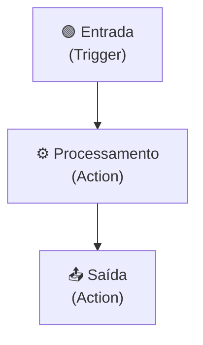

## **Etapa 1:** introdução


---
layout: quote-image-without-quotation-marks
image: /n8n.mp4
---

::title::

# O que é o n8n?

::default::

"O n8n é uma **plataforma de automação** de processos de negócio (_workflow_), com flexibilidade de _uso de código_ e a rapidez do _no-code_."


— n8n.io

---
layout: quote-image-without-quotation-marks
image: /n8n-integracao.png
---

::title::

# n8n e um ecosistema de integrações

::default::

<div class="h-15" />

Com mais de **1300 integrações disponíveis**, o n8n se destaca pela flexibilidade e adaptabilidade, permitindo que você configure automações sob medida.


&nbsp;


---
layout: quote-image-without-quotation-marks
image: /n8n-sample-intro.svg
---

::title::

# n8n e uma interface intuitiva

::default::

<div class="h-15" />

Com uma **interface visual** de arrastar e soltar (drag and drop), o n8n se destaca pela facilidade de uso, mesmo para **profissionais sem experiências em programação**. 

&nbsp;


---
layout: quote-image-without-quotation-marks
image: /n8n-code.png
---

::title::

# n8n e a flexibilidade do código

::default::

<div class="h-15" />

O n8n permite **adicionar blocos de código** (javascript ou python) para manipular dados, criar condições ou **executar lógica complexa** dentro do próprio fluxo.

&nbsp;

---
layout: quote-image-without-quotation-marks
image: /n8n/deployment-type.png
---

::title::

# n8n: código aberto, gratuito e autohospedado

::default::

<div class="h-15" />

O n8n é **open source**, permite ser **usado comercialmente** de forma **gratuita**, e pode ser executado **localmente** ou na **nuvem oficial** (n8n Cloud). 

&nbsp;

---
layout: quote-image-without-quotation-marks
image: /n8n-popularity.png
sourceLabel: JavaScript Rising Stars
source: https://risingstars.js.org/2025/en
---

::title::

# n8n: popularidade em crescimento

::default::

<div class="h-15" />

O n8n é um dos projetos de maior crescimento no **GitHub (+200k)**, tendo **alcançado mais de 100 mil estrelas em um único ano (2025)**, liderando o reconhecido ranking JS Rising Stars na categoria geral.

&nbsp;

---
layout: quote-image-without-quotation-marks
image: /n8n-ia.png
---

::title::

# Agentes de IA com n8n

::default::

<div class="h-15" />

O n8n permite **criar sistemas agênticos** de inteligência artificial, com possibilidade de **conectar com diversos LLMs**, combinando com aprovação humana.

&nbsp;

---
layout: default
layoutClass: gap-8
sourceLabel: n8n alternatives
source: https://n8n.io/vs
---

# Ferramentas de automação

<div class="text-sm leading-tight [&_td]:py-2.5 [&_th]:py-5.5 [&_td]:px-2 [&_th]:px-2">

| **Rank** | **Ferramenta** | **Ano** | **Licença** | **Hospedagem** | **Low-Code** | **Suporte Código** |
| --- | --- | --- | --- | --- | --- | --- |
| #1 | Zapier | 2011 | SaaS | Cloud | Sim | Sim (Javascript) |
| #2 | Make (Integromat) | 2016 | SaaS | Cloud | Sim | Sim (limitado) |
| #3 | MS Power Automate | 2016 | SaaS | Cloud | Sim | Sim (expressões, Azure Functions) |
| #4 | **n8n** | 2019 | Gratuito <br/>(self-host) | Self-host<br/>Cloud | Sim | Sim (Javascript/Python) |

</div>


---
layout: section
---

## Instalação e configuração de **ambiente**

---
layout: two-cols-header
layoutClass: gap-8
class: flex items-center justify-center
sourceLabel: WSL
source: https://learn.microsoft.com/windows/wsl/
---

# Windows Subsystem for Linux (WSL)

#### **Linux e mac oferecem ambientes de desenvolvimento rápidos e o WSL também**

::left::

<div class="text-left w-full [&_li]:mb-5">

- **Experência semelhante com linux/mac** — WSL usa shell bash para linha de comando.
- **Ambiente rápido e leve** — Sistema de arquivo baseado em linux rápido e leve.
- **Integração com o Windows** — arquivos, terminal e o editor (VS Code/Antigravity) acessam o WSL.

</div>

::right::

<div class="h-full flex items-center justify-center">
    <AssetImg src="wsl.jpg" class="w-full max-w-[440px] rounded-lg" />
</div>


---
layout: two-cols-header
layoutClass: gap-8
class: flex items-center justify-center
sourceLabel: Docker
source: https://docs.docker.com
---

# Docker

#### **Plataforma de conteinerização para padronizar e isolar ambientes**

::left::

<div class="text-left w-full [&_li]:mb-5">

- **Ambiente padronizado** — executa o n8n e dependências de forma idêntica em qualquer máquina.
- **Isolamento e controle** — sem conflitos de portas, versões ou pacotes com o sistema host.
- **Pronto para produção** — facilidade de deploy em qualquer lugar e persistência de dados via volumes.

</div>

::right::

<Transform :scale="0.9" origin="center">
    <AssetImg
    src="docker.png"
    class="rounded-lg"
    />
</Transform>

---
layout: two-cols-header
layoutClass: gap-8
sourceLabel: Install Docker Engine
source: https://docs.docker.com/engine/install/ubuntu
---

# Instalação docker no WSL

#### **Existem várias maneiras de instalar o docker no WSL**

<br/>

::left::

```sh [via apt]
# baixa o catálogo de pacotes mais recente
sudo apt-get update
# instala o docker
sudo apt install -y docker.io
# concede permissão para rodar sem 'sudo'
sudo usermod -aG docker $USER
# atualizar o grupo na sessão atual
newgrp docker
# inicia o serviço do Docker
sudo service docker start
# baixa a imagem de teste e faz o teste
docker run hello-world
```

::right::

> [!NOTE]
> Após a instalação, reinicie o WSL e teste novamente o docker:
> ```sh
> wsl --shutdown
> wsl
> docker run hello-world
> ```

---
layout: default
sourceLabel: Docker CLI Reference
source: https://docs.docker.com/engine/reference/commandline/cli
---

# Principais comandos do docker

#### **Existem muitos comandos do docker, mas alguns poucos são os mais usados**

<br/>

<div class="[&_table]:w-full text-16px">

| Comando | Descrição |
| --- | --- |
| `docker ps -a` | Lista todos os containers no sistema (em execução e parados) |
| `docker start <id>` | Reinicia a execução de um container específico |
| `docker volume ls` | Lista todos os volumes de dados criados localmente |
| `docker volume create` | Cria um novo volume persistente para ser usado por containers |
| `docker pull docker.n8n.io/n8nio/n8n` | Atualiza a imagem oficial mais recente do n8n para o ambiente local |

</div>

---
layout: two-cols-header
layoutClass: gap-8
sourceLabel: n8n Docker
source: https://docs.n8n.io/deploy/host-n8n/install-options/install-with-docker
---

# Instalação do n8n usando docker

#### **Essa é uma forma simples de instalar o n8n com docker**

<br/>

::left::

```sh [Docker Run]
# Criar volume persistente para salvar workflows e credenciais
docker volume create n8n_data

# Executar o container do n8n
docker run -d \
 --name n8n \
 -p 5678:5678 \
 -e GENERIC_TIMEZONE="America/Sao_Paulo" \
 -e TZ="America/Sao_Paulo" \
 -e N8N_ENFORCE_SETTINGS_FILE_PERMISSIONS=true \
 -v n8n_data:/home/node/.n8n \
 docker.n8n.io/n8nio/n8n
```

::right::

> [!NOTE]
> Após executar o comando, o n8n estará acessível no navegador em **`http://localhost:5678`**.
>
> O volume **`n8n_data`** garante a persistência dos seus fluxos e dados mesmo se o container for removido.
> 
> Configure seu usuário e senha e o pedido de licença free

---
layout: section
---

## Meu primeiro **workflow** n8n
**Implementação de um fluxo básico**


---
layout: two-cols-header
layoutClass: gap-8
class: flex items-center justify-center
---

# Principais componentes do n8n
#### **Principais elementos para construção de automações no n8n**


::left::

<div class="[&_table]:w-full text-sm mt-0">

| **Componente** | **Descrição** |
| --- | --- |
| _Workflow_ | Fluxo de trabalho é uma coleção de nós conectados para automatizar um processo. |
| _Nodes_ | Nós são os principais componentes de um fluxo de trabalho |
| _Connection_ | Uma conexão estabelece um vínculo entre nós para rotear dados pelo fluxo de trabalho. |

</div>

::right::

<div class="flex items-center justify-center h-full">
    <AssetImg src="n8n/n8n-workflow.png" class="rounded-lg w-full max-w-[380px]" />
</div>

---
layout: two-cols-header
layoutClass: gap-8
class: flex items-center justify-center
---

# Tipos de nós (node)
#### **Fundamentalmente, há dois tipos de nós: triggers e actions**


::left::

<div class="[&_table]:w-full text-base mt-0">

| **Tipo** | **Descrição** |
| --- | --- |
| _Triggers_ | iniciam um **workflow** em resposta a eventos ou condições específicas. |
| _Actions_ | representam tarefas como manipular dados, executar operações, acionar eventos, etc. |

</div>

::right::

<div class="flex items-center justify-center h-full">
    <AssetImg src="n8n/node.png" class="rounded-lg w-full max-w-[280px]" />
</div>


---
layout: two-cols-header
layoutClass: gap-8
class: flex items-start justify-center
---

# Fluxo conceitual de um Workflow do n8n
#### **Embora todo workflow deva ter uma saída, não existe uma categoria de nós de saída**


::left::

<div class="[&_table]:w-full text-sm mt-18 [&_td]:whitespace-nowrap [&_th]:whitespace-nowrap">

| **Posição no fluxo** | **Tipo do nó** | **Conceito** |
| --- | :---: | --- |
| Entrada | _Trigger_ | Responsável pelo disparo do fluxo  |
| Processamento (**ou função**) | `Action` | Processa os dados no fluxo |
| Saída | `Action` | Finaliza o fluxo com um resultado final |

</div>

::right::

<Transform :scale="0.8" origin="center">



</Transform>


---
layout: two-cols-header
layoutClass: gap-8
class: flex items-center justify-center
---

# Core nodes, App nodes e Community nodes
#### **Os `nós` também podem ser categorizados como: _interno_, de _aplicativo_ e _comunitário_**


::left::

<div class="[&_table]:w-full text-sm mt-0">

| **Tipo** | **Descrição** |
| --- | --- |
| _Core_ | **nós nativos** de controle de fluxo, gatilhos internos e manipulação de dados. |
| _App_ | nós de integrações com serviços e **aplicativos externos** (ex.: Slack, Gmail, OpenAI). |
| _Community_ | nós personalizados e compartilhados pela comunidade (**instalável** no n8n). |

</div>

::right::

<div class="flex items-center justify-center h-full">
    <AssetImg src="n8n/node-core-app.png" class="rounded-lg w-full max-w-[320px]" />
</div>


---
layout: two-cols-header
layoutClass: gap-8
class: flex items-center justify-center
---

# Triggers (gatilhos)
#### **Todo workflow _exige pelo menos um gatilho_ para funcionar e ser executado**


::left::

<div class="text-base w-full self-start [&_ul]:my-15 [&_li]:mb-6">

- Existem os **gatilhos internos**, os quais _não dependem_ de um serviço ou aplicativo específico, e podem ser usados de forma genérica.
- Existem os **gatilhos de aplicativos**, os quais _dependem de um serviço_ específico (API da empresa: Google Gmail, Telegram, etc) pra funcionar.

</div>

::right::

<div class="flex items-center justify-center h-full">
    <AssetImg src="n8n/trigger-list-types.png" class="rounded-lg w-full max-w-[190px]" />
</div>

---

# Core triggers (gatilhos internos)

#### **Abaixo uma listagem dos principais gatilhos internos do n8n**

<div class="h-5" />

<div class="[&_table]:w-full text-xs">

| **Gatilho** | **Descrição** |
| --- | --- |
| _Trigger Manually_ | executa o workflow sob demanda, bom para testes iniciais. |
| _Webhook_ | dispara ao receber uma requisição HTTP externa (GET, POST, etc.). |
| _Schedule_ | executa automaticamente em intervalos definidos (cron ou tempo fixo). |
| _Form Submission_ | dispara quando um formulário gerado pelo n8n é preenchido e enviado. |
| _Another Workflow_ | acionado por outro workflow, permitindo composição modular de fluxos. |
| _Chat Received_ | dispara ao receber uma mensagem de chat (usado em agentes de IA). |
| _Error Trigger_ | executa quando outro workflow falha, permitindo tratamento de erros. |
| _n8n Trigger_ | reage a eventos internos do n8n (ex.: workflow ativado, atualizado). |

</div>

---

# App triggers (gatilhos de aplicativo)

#### **Abaixo uma listagem dos gatilhos de aplicativo mais populares do n8n**

<div class="h-8" />

<div class="[&_table]:w-full text-sm">

| **Gatilho** | **Descrição** |
| --- | --- |
| _Gmail Trigger_ | dispara ao receber, enviar ou atualizar um e-mail no Gmail. |
| _Slack Trigger_ | dispara ao receber uma mensagem, reação ou evento em um canal do Slack. |
| _Google Sheets Trigger_ | dispara quando uma linha é adicionada ou atualizada em uma planilha. |
| _Telegram Trigger_ | dispara ao receber uma mensagem ou comando em um bot do Telegram. |
| _GitHub Trigger_ | dispara em eventos de repositório como push, pull request ou issue. |

</div>

---
layout: two-cols-header
layoutClass: gap-8
class: flex items-center justify-center
---

# Diferença entre Gatilhos de Polling e de Webhook
#### **Os gatilhos internos e de aplicativo podem operar de duas formas**


::left::

<div class="text-base w-full self-start [&_ul]:my-10 [&_li]:mb-6">

- Gatilhos baseados em **webhooks** — o evento é recebido instantaneamente, comum em sistemas mais modernos, favorecendo automações com reatividade e sem delay. Ex: _Telegram Trigger_.
- Gatilhos baseados em **polling** — realiza uma consulta periódica que verifica a cada X minutos se há alguma novidade no serviço externo. Ex: _Gmail Trigger_.

</div>

::right::

<div class="flex items-center justify-center h-full">
    <AssetImg src="n8n/n8n-gmail-telegram-webhook-polling.png" class="rounded-lg w-full max-w-[220px]" />
</div>

---
layout: two-cols-header
layoutClass: gap-8
class: flex items-center justify-center
---

# Trigger manually (gatilho manual)
#### **Ideal para a fase de desenvolvimento e testes rápidos de novos fluxos**

::left::

<div class="text-sx w-full self-start [&_ul]:my-20 [&_li]:mb-6">

- Dispara o workflow **manualmente** pelo botão _Execute workflow_ no editor
- Não recebe entrada externa de dados, iniciando o fluxo com dados definidos nos nós seguintes

</div>

::right::

<div class="flex items-center justify-center h-full">
  <AssetImg src="n8n/nodes/manual-trigger.svg" class="w-48 h-48" />
</div>