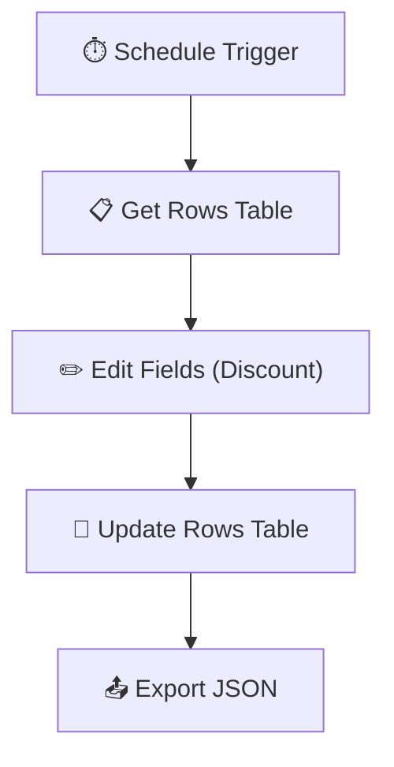
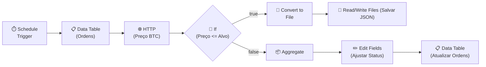

## **Etapa 2:** Construção de Workflows Avançados

---
layout: two-cols-header
layoutClass: gap-8
class: flex items-center justify-center
---

# Ativando URL de produção de webhook
#### **Existem diferenças entre o modo de teste e o fluxo ativo em produção**

::left::

<div class="text-sx w-full self-start [&_ul]:my-10 [&_li]:mb-6">

- A **Test URL** só funciona enquanto você estiver com o n8n aberto aguardando eventos com o botão _Listen for test event_.
- A **Production URL** só responde após o workflow ser **publicado** no canto superior do editor.

</div>

::right::

<div class="flex items-center justify-center h-full">
  <AssetImg src="n8n/webhook-url-test-production.png" class="rounded-lg shadow-md max-w-[380px]" />
</div>

<!--
## notes slides

### Durante o desenvolvimento, utilize a Test URL para inspecionar os dados recebidos em tempo real no editor
### Para integrações reais e chamadas de sistemas externos em produção, ative o workflow e aponte para a Production URL
-->

---
layout: two-cols-header
layoutClass: gap-8
class: flex items-center justify-center
---

# Visualizando as execuções de um workflow
#### **O painel de execuções permite visualizar o histórico de disparos e os dados processados**

::left::

<div class="text-sx w-full self-start [&_ul]:my-10 [&_li]:mb-6">

- O painel **Executions** lista todas as execuções (manuais, agendadas ou de produção) com status de sucesso, erro ou em andamento.
- Permite abrir qualquer execução passada para **inspecionar os dados de entrada e saída nó a nó**, facilitando a auditoria e correção de erros.

</div>

::right::

<div class="flex items-center justify-center h-full">
  <AssetImg src="n8n/execution-panel.png" class="rounded-lg shadow-md max-w-[400px]" />
</div>

<!--
## notes slides

### Por padrão, o n8n salva execuções com erro; nas configurações do workflow é possível definir se execuções com sucesso também devem ser salvas
### Você pode reexecutar (retry) execuções com falha diretamente a partir do painel de histórico
-->

---
layout: two-cols-header
layoutClass: gap-8
class: flex items-center justify-center
---

# If node (action node)
#### **O nó If permite criar roteamento condicional de dados em um workflow**

::left::

<div class="text-sx w-full self-start [&_ul]:my-10 [&_li]:mb-6">

- Avalia condições lógicas (igualdade, comparações numéricas, texto, existência) dividindo o fluxo em duas saídas: **true** e **false**.
- Suporta **múltiplas condições combinadas** com operadores lógicos (_AND / OR_) para validar regras complexas sobre o payload de entrada.

</div>

::right::

<div class="flex items-center justify-center h-full">
  <N8nNode
    icon-src="n8n/nodes/if.svg"
    label="If Node"
    type="action"
    scale="1.4"
  />
</div>

<!--
## notes slides

### Cada item recebido é avaliado individualmente, podendo rotear itens da mesma lista para saídas diferentes
### O nó If possui duas saídas de conexão: a superior representa a condição verdadeira (true) e a inferior a falsa (false)
-->

---
layout: two-cols-header
layoutClass: gap-8
class: flex items-center justify-center
---

# HTTP (action node)
#### **O nó HTTP permite fazer requisições a Web APIs de qualquer serviço web**

::left::

<div class="text-sx w-full self-start [&_ul]:my-10 [&_li]:mb-6">

- Envia requisições HTTP (**GET, POST, PUT, DELETE, PATCH**) para qualquer API externa com headers, query params e body JSON.
- Suporta diversos tipos de **autenticação** (Bearer Token, OAuth2, API Key, Basic) e encaminha as respostas como saída para o próximo nó do fluxo.

</div>

::right::

<div class="flex items-center justify-center h-full">
  <N8nNode
    icon-src="n8n/nodes/http-request.svg"
    label="HTTP Request"
    type="action"
    scale="1.4"
  />
</div>

<!--
## notes slides

### Permite configurar paginação automática e controle de erros HTTP (ex: ignorar 404/500 ou tentar novamente)
### Pode enviar e receber tanto dados JSON tabulares quanto arquivos binários (imagens, PDFs, áudio)
-->

---
layout: default
---

# Entendendo os itens individuais do n8n
#### **Se a tabela tem 10 registros, quantos e-mails serão enviados?**

<div class="h-[calc(100%-80px)] flex items-center justify-center -translate-x-6">
  <div class="flex items-center justify-center gap-21">
    <N8nNode
      icon-src="n8n/nodes/manual-trigger.svg"
      label="Trigger"
      subtitle="Trigger Manually"
      type="trigger"
      connector="arrow"
      scale="1.1"
    />
    <N8nNode
      icon-src="n8n/nodes/data-table.svg"
      label="Get Rows"
      subtitle="Data Table"
      type="action"
      connector="arrow"
      scale="1.1"
    />
    <N8nNode
      icon-src="n8n/nodes/gmail.svg"
      label="Send a message"
      subtitle="Gmail"
      type="action"
      scale="1.1"
    />
  </div>
</div>

<!--
## notes slides

### Resposta: 10 e-mails! No n8n, cada item de entrada faz o nó subsequente rodar uma vez para cada item (loop implícito).
### Se o objetivo for enviar apenas 1 e-mail com a lista dos 10 itens, é necessário usar o nó Aggregate antes do Gmail.
-->

---
layout: default
---

# Nó Aggregate para agrupar itens individuais
#### **O nó Aggregate é útil para agrupar itens individuais em um único lote**

<div class="h-[calc(100%-80px)] flex items-center justify-center -translate-x-6">
  <div class="flex items-center justify-center gap-21">
    <N8nNode
      icon-src="n8n/nodes/manual-trigger.svg"
      label="Trigger"
      subtitle="Trigger Manually"
      type="trigger"
      connector="arrow"
      scale="1.1"
    />
    <N8nNode
      icon-src="n8n/nodes/data-table.svg"
      label="Get Rows"
      subtitle="Data Table"
      type="action"
      connector="arrow"
      scale="1.1"
    />
    <N8nNode
      icon-src="n8n/nodes/aggregate.svg"
      label="Group Data"
      subtitle="Aggregate"
      type="action"
      connector="arrow"
      scale="1.1"
    />
    <N8nNode
      icon-src="n8n/nodes/gmail.svg"
      label="Send a message"
      subtitle="Gmail"
      type="action"
      scale="1.1"
    />
  </div>
</div>

<!--
## notes slides

### Resposta: 10 e-mails! No n8n, cada item de entrada faz o nó subsequente rodar uma vez para cada item (loop implícito).
### Se o objetivo for enviar apenas 1 e-mail com a lista dos 10 itens, é necessário usar o nó Aggregate antes do Gmail.
-->

---
layout: two-cols-header
layoutClass: gap-8
class: flex items-center justify-center
---

# Aggregate (action node)
#### **O nó Aggregate permite agrupar itens individuais em um único item (lote)**

::left::

<div class="text-sx w-full self-start [&_ul]:my-10 [&_li]:mb-6">

- Combina **múltiplos itens recebidos em um único item com array**, permitindo enviar lotes completos para o nó seguinte.
- O nó realiza apenas **agrupamento estrutural**; para métricas estatísticas/matemáticas (como _Sum, Avg, Min, Max, etc_), deve-se usar o nó **Summarize**.

</div>

::right::

<div class="flex items-center justify-center h-full">
  <N8nNode
    icon-src="n8n/nodes/aggregate.svg"
    label="Aggregate"
    type="action"
    scale="1.4"
  />
</div>

<!--
## notes slides

### O n8n processa cada item individualmente por padrão; o Aggregate serve para unificar esses itens antes de nós que esperam lotes
### Complementa o nó Split Out / Item Lists, que faz a operação inversa (desmembra uma lista em itens individuais)
-->

---
layout: two-cols-header
layoutClass: gap-8
---

# Aggregate (action node): antes e depois
#### **O aggregate abaixo agrupa o JSON array de dois para um único elemento**

<br/>

::left::

<WindowMockup color="dark" padding="0.5rem 0.5rem 0.5rem 0.5rem" title="entrada: 2 itens" codeblock>

```json {*}{maxHeight:'260px'}
[
  {
    "produto": "Camiseta",
    "valor": 99.99,
    "id": 1
  },
  {
    "produto": "Bermuda",
    "valor": 149.90,
    "id": 2
  }
]
```

</WindowMockup>

::right::

<WindowMockup color="dark" padding="0.5rem 0.5rem 0.5rem 0.5rem" title="saída agregada: 1 item" codeblock>

```json {*}{maxHeight:'260px'}
[
  {
    "produto": ["Camiseta", "Bermuda"],
    "valor": [99.99, 149.90]
  }
]
```

</WindowMockup>

<!--
## notes slides

### Observe que na entrada temos 2 itens independentes; após o Aggregate temos 1 único item cujos campos viraram arrays com os valores agrupados
### Isso permite que o próximo nó seja executado apenas 1 vez recebendo todo o lote de dados
-->

---
layout: two-cols-header
layoutClass: gap-8
class: flex items-center justify-center
---

# Usando trigger agendado para polling
#### **O trigger de agendamento premite criar workflows com polling, para tarefas recorrentes**

::left::

<div class="text-base w-full self-start [&_ul]:my-5 [&_li]:mb-6">

- O **Schedule Trigger** dispara o workflow em intervalos recorrentes, úteis para busca periódica de novos registros.
- **Não existe gatilho de polling**, mas o gatilho de agendamento permite criar workflows com polling.
- O polling é **ideal para integrar sistemas legados**, que não possuem capacidade de notificação em tempo real.

</div>

::right::

<div class="flex items-center justify-center h-full">
<Transform :scale="0.65" origin="center top">



</Transform>
</div>

<!--
## notes slides

### O polling periódico é uma solução eficaz para conectar bancos legados ou planilhas que não emitem eventos HTTP
### Permite automatizar rotinas de ETL e sincronização de dados entre múltiplos sistemas
-->

---
layout: two-cols-header
layoutClass: gap-8
class: flex items-center justify-center
---

# Exportação e importação de Workflow
#### **O n8n permite exportar e importar workflows entre instâncias diferentes**

::left::

<div class="text-sx w-full self-start [&_ul]:my-10 [&_li]:mb-6">

- O n8n exporta o workflow no formato **JSON**, que reflete o "código" e a estrutura declarativa usada pelo n8n para orquestrar e executar o fluxo.
- É útil para **backup, versionamento em Git, compartilhamento entre equipes** e migração rápida de fluxos entre ambientes de desenvolvimento e produção.

</div>

::right::

<div class="flex items-center justify-center h-full">
  <AssetImg src="n8n/workflow-export-import.png" class="rounded-lg shadow-md max-w-[340px]" />
</div>

<!--
## notes slides

### O JSON contém nós, conexões e parâmetros configurados no canvas
### Ao importar em outra instância, certifique-se de remapear credenciais e recursos internos (como Data Tables e caminhos de arquivos locais)
-->

---
layout: two-cols-header
layoutClass: gap-8
---

# Ajustes pós exportação de Workflow (1)
#### **Exportação e importação de workflows exige cuidado e ajustes no JSON exportado**

<br/>

::left::

```json [workflow.json] {9,12}{maxHeight:'300px'}
{
  "name": "workflow-export-report",
  "nodes": [
    {
      "parameters": {
        "operation": "get",
        "dataTableId": {
          "__rl": true,
          "value": "qn5qQ7",
          "mode": "list",
          "cachedResultName": "teste",
          "cachedResultUrl": "/projects/60Olck/datatables/qn5qQ7"
        }
      },
      "type": "n8n-nodes-base.dataTable",
      "typeVersion": 1.1,
      "position": [-64, -80],
      "id": "7466512f-7909-47ff-a490-cf906c575835",
      "name": "Get row(s)"
    },
    {
      "parameters": {
        "operation": "toJson",
        "options": {}
      },
      "type": "n8n-nodes-base.convertToFile",
      "typeVersion": 1.1,
      "position": [384, -80],
      "id": "600fdfdd-d133-4b54-9abc-0d4684d9b265",
      "name": "Convert to File"
    },
    {
      "parameters": {
        "operation": "write",
        "fileName": "/home/node/.n8n-files/teste.json",
        "options": {}
      },
      "type": "n8n-nodes-base.readWriteFile",
      "typeVersion": 1.1,
      "position": [608, -80],
      "id": "559e92eb-2531-4403-a681-42178d467631",
      "name": "Read/Write Files from Disk"
    },
    {
      "parameters": {},
      "type": "n8n-nodes-base.manualTrigger",
      "typeVersion": 1,
      "position": [-272, -80],
      "id": "d3ac6284-22a3-47ad-ac7e-ee3dedee4a71",
      "name": "When clicking ‘Execute workflow’"
    },
    {
      "parameters": {
        "fieldsToAggregate": {
          "fieldToAggregate": [
            { "fieldToAggregate": "nome" },
            { "fieldToAggregate": "idade" },
            { "fieldToAggregate": "=" }
          ]
        },
        "options": {}
      },
      "type": "n8n-nodes-base.aggregate",
      "typeVersion": 1,
      "position": [160, -80],
      "id": "9e674c50-c3b6-49f8-bac9-d6ca4fa3adc6",
      "name": "Aggregate"
    }
  ],
  "pinData": {},
  "connections": {
    "Get row(s)": {
      "main": [[{ "node": "Aggregate", 
                    "type": "main", "index": 0 }]]
    },
    "Convert to File": {
      "main": [[{ "node": "Read/Write Files from Disk", 
                "type": "main", "index": 0 }]]
    },
    "When clicking ‘Execute workflow’": {
      "main": [[{ "node": "Get row(s)", 
                "type": "main", "index": 0 }]]
    },
    "Aggregate": {
      "main": [[{ "node": "Convert to File", 
      "type": "main", "index": 0 }]]
    }
  },
  "active": false,
  "settings": {
    "executionOrder": "v1",
    "binaryMode": "separate",
    "availableInMCP": false
  },
  "versionId": "8144c7e8-964a-4514-bfbf-01c8769d9667",
  "meta": {
    "instanceId": "b4fa16778588d84c4894fdf26a1c6bb8"
  },
  "nodeGroups": [],
  "id": "7rYKO97uchKhkWLa",
  "tags": []
}
```

::right::

> [!CAUTION]
> O identificador `value` e `cachedResultUrl` pertencem exclusivamente ao Data Table da instância origem.
> 
> **Ação necessária:** apagar os campos `value` e `cachedResultUrl`, e ajustá-lo depois de importar na nova instância n8n.

<!--
## notes slides

### Data Tables e credenciais não são portadas automaticamente no JSON do workflow
### Na nova instância, o nó apresentará aviso de recurso não encontrado até ser reconfigurado
-->

---
layout: two-cols-header
layoutClass: gap-8
---

# Ajustes pós exportação de Workflow (2)
#### **Exportação e importação de workflows exige cuidado e ajustes no JSON exportado**

<br/>

::left::

```json [workflow.json] {35}{maxHeight:'300px'}
{
  "name": "workflow-export-report",
  "nodes": [
    {
      "parameters": {
        "operation": "get",
        "dataTableId": {
          "__rl": true,
          "value": "qn5qQ7",
          "mode": "list",
          "cachedResultName": "teste",
          "cachedResultUrl": "/projects/60Olck/datatables/qn5qQ7"
        }
      },
      "type": "n8n-nodes-base.dataTable",
      "typeVersion": 1.1,
      "position": [-64, -80],
      "id": "7466512f-7909-47ff-a490-cf906c575835",
      "name": "Get row(s)"
    },
    {
      "parameters": {
        "operation": "toJson",
        "options": {}
      },
      "type": "n8n-nodes-base.convertToFile",
      "typeVersion": 1.1,
      "position": [384, -80],
      "id": "600fdfdd-d133-4b54-9abc-0d4684d9b265",
      "name": "Convert to File"
    },
    {
      "parameters": {
        "operation": "write",
        "fileName": "/home/node/.n8n-files/arquivo.json",
        "options": {}
      },
      "type": "n8n-nodes-base.readWriteFile",
      "typeVersion": 1.1,
      "position": [608, -80],
      "id": "559e92eb-2531-4403-a681-42178d467631",
      "name": "Read/Write Files from Disk"
    },
    {
      "parameters": {},
      "type": "n8n-nodes-base.manualTrigger",
      "typeVersion": 1,
      "position": [-272, -80],
      "id": "d3ac6284-22a3-47ad-ac7e-ee3dedee4a71",
      "name": "When clicking ‘Execute workflow’"
    },
    {
      "parameters": {
        "fieldsToAggregate": {
          "fieldToAggregate": [
            { "fieldToAggregate": "nome" },
            { "fieldToAggregate": "idade" },
            { "fieldToAggregate": "=" }
          ]
        },
        "options": {}
      },
      "type": "n8n-nodes-base.aggregate",
      "typeVersion": 1,
      "position": [160, -80],
      "id": "9e674c50-c3b6-49f8-bac9-d6ca4fa3adc6",
      "name": "Aggregate"
    }
  ],
  "pinData": {},
  "connections": {
    "Get row(s)": {
      "main": [[{ "node": "Aggregate", 
                    "type": "main", "index": 0 }]]
    },
    "Convert to File": {
      "main": [[{ "node": "Read/Write Files from Disk", 
                "type": "main", "index": 0 }]]
    },
    "When clicking ‘Execute workflow’": {
      "main": [[{ "node": "Get row(s)", 
                "type": "main", "index": 0 }]]
    },
    "Aggregate": {
      "main": [[{ "node": "Convert to File", 
      "type": "main", "index": 0 }]]
    }
  },
  "active": false,
  "settings": {
    "executionOrder": "v1",
    "binaryMode": "separate",
    "availableInMCP": false
  },
  "versionId": "8144c7e8-964a-4514-bfbf-01c8769d9667",
  "meta": {
    "instanceId": "b4fa16778588d84c4894fdf26a1c6bb8"
  },
  "nodeGroups": [],
  "id": "7rYKO97uchKhkWLa",
  "tags": []
}
```

::right::

> [!CAUTION]
> O caminho `/home/node/.n8n-files/arquivo.json` pode não existir na instância n8n onde será importado o workflow.
> 
> **Ação necessária:** verifique o caminho do nó **Read/Write Files** e adapte-o à estrutura de diretórios do ambiente de destino.

<!--
## notes slides

### Em ambientes locais com npm o caminho costuma ser relativo ou absoluto no SO do usuário (ex: /tmp ou C:\)
### Certifique-se de que o container tenha permissão de escrita na pasta mapeada
-->

---
layout: two-cols-header
layoutClass: gap-8
---

# Ajustes pós exportação de Workflow (3)
#### **Exportação e importação de workflows exige cuidado e ajustes no JSON exportado**

<br/>

::left::

```json [workflow.json] {95,97,100}{maxHeight:'300px'}
{
  "name": "workflow-export-report",
  "nodes": [
    {
      "parameters": {
        "operation": "get",
        "dataTableId": {
          "__rl": true,
          "value": "qn5qQ7",
          "mode": "list",
          "cachedResultName": "teste",
          "cachedResultUrl": "/projects/60Olck/datatables/qn5qQ7"
        }
      },
      "type": "n8n-nodes-base.dataTable",
      "typeVersion": 1.1,
      "position": [-64, -80],
      "id": "7466512f-7909-47ff-a490-cf906c575835",
      "name": "Get row(s)"
    },
    {
      "parameters": {
        "operation": "toJson",
        "options": {}
      },
      "type": "n8n-nodes-base.convertToFile",
      "typeVersion": 1.1,
      "position": [384, -80],
      "id": "600fdfdd-d133-4b54-9abc-0d4684d9b265",
      "name": "Convert to File"
    },
    {
      "parameters": {
        "operation": "write",
        "fileName": "/home/node/.n8n-files/arquivo.json",
        "options": {}
      },
      "type": "n8n-nodes-base.readWriteFile",
      "typeVersion": 1.1,
      "position": [608, -80],
      "id": "559e92eb-2531-4403-a681-42178d467631",
      "name": "Read/Write Files from Disk"
    },
    {
      "parameters": {},
      "type": "n8n-nodes-base.manualTrigger",
      "typeVersion": 1,
      "position": [-272, -80],
      "id": "d3ac6284-22a3-47ad-ac7e-ee3dedee4a71",
      "name": "When clicking ‘Execute workflow’"
    },
    {
      "parameters": {
        "fieldsToAggregate": {
          "fieldToAggregate": [
            { "fieldToAggregate": "nome" },
            { "fieldToAggregate": "idade" },
            { "fieldToAggregate": "=" }
          ]
        },
        "options": {}
      },
      "type": "n8n-nodes-base.aggregate",
      "typeVersion": 1,
      "position": [160, -80],
      "id": "9e674c50-c3b6-49f8-bac9-d6ca4fa3adc6",
      "name": "Aggregate"
    }
  ],
  "pinData": {},
  "connections": {
    "Get row(s)": {
      "main": [[{ "node": "Aggregate", 
                    "type": "main", "index": 0 }]]
    },
    "Convert to File": {
      "main": [[{ "node": "Read/Write Files from Disk", 
                "type": "main", "index": 0 }]]
    },
    "When clicking ‘Execute workflow’": {
      "main": [[{ "node": "Get row(s)", 
                "type": "main", "index": 0 }]]
    },
    "Aggregate": {
      "main": [[{ "node": "Convert to File", 
      "type": "main", "index": 0 }]]
    }
  },
  "active": false,
  "settings": {
    "executionOrder": "v1",
    "binaryMode": "separate",
    "availableInMCP": false
  },
  "versionId": "8144c7e8-964a-4514-bfbf-01c8769d9667",
  "meta": {
    "instanceId": "b4fa16778588d84c4894fdf26a1c6bb8"
  },
  "nodeGroups": [],
  "id": "7rYKO97uchKhkWLa",
  "tags": []
}
```

::right::

> [!CAUTION]
> As propriedades `versionId`, `meta.instanceId` e `id` identificam exclusivamente o workflow na instância onde o workflow foi criado.
> 
> **Ação necessária:** ao versionar JSON exportado de workflows, é recomendado remover identificadores de instância.

<!--
## notes slides

### A interface do n8n trata a duplicidade gerando novo ID, mas em pipelines automatizados de CI/CD esses metadados devem ser sanitizados
### Permite manter repositórios de workflows reutilizáveis e agnósticos de ambiente
-->

---
layout: section
---

## Codificação assistida por IA
**Usando o MCP do n8n em agentes de codificação para construir workflows**

---
layout: two-cols-header
layoutClass: gap-8
class: flex items-center justify-center
sourceLabel: n8n Docs
source: https://docs.n8n.io/connect/connect-to-n8n-mcp-server
---

# Codificação assistida por IA - parte 1
#### **Um servidor n8n fornece também um MCP para integração em agentes**

::left::

<div class="text-sx w-full self-start [&_ul]:my-15 [&_li]:mb-4">

- **Acesse as configurações do n8n:** no menu lateral esquerdo, vá em **Settings > MCP Server** para visualizar as opções do servidor de contexto de modelo nativo.
- **Habilite o MCP de instância:** ative a opção **Enable MCP server**. O MCP fica ativado na URL `http://localhost:5678/mcp-server/http`

</div>

::right::

<div class="flex items-center justify-center h-full">
  <AssetImg src="n8n/n8n-mcp-instance.png" class="rounded-lg shadow-md max-w-[340px]" />
</div>

<!--
## notes slides

### O servidor MCP do n8n permite que agentes de IA inspecionem documentação de nós, validem esquemas e manipulem workflows
### A conexão via MCP facilita a prototipação e manutenção de nós diretamente pelo chat ou assistente de código
-->

---
layout: two-cols-header
layoutClass: gap-8
class: flex items-center justify-center
sourceLabel: n8n Docs
source: https://docs.n8n.io/connect/connect-to-n8n-mcp-server
---

# Codificação assistida por IA - parte 2
#### **Existem dois modos de configurar a autenticação do MCP Server do n8n**

::left::

<div class="text-sx w-full self-start [&_ul]:my-10 [&_li]:mb-4">

- Na mesma tela de ativação do MCP, clique no botão **Connect your client**, depois escolha **API Key** para proteger o MCP Server do n8n.
- Na aba **API Key**, regere o token e **copie a sugestão de configuração JSON** para colar na configuração do seu agentet de codificação (Antigravity, Claude, Codex).

</div>

::right::

<div class="flex items-center justify-center h-full">
  <AssetImg src="n8n/n8n-mcp-connect-client.png" class="rounded-lg shadow-md max-w-[220px]" />
</div>

<!--
## notes slides

### A autenticação com API Key garante que apenas clientes e agentes autorizados possam consultar esquemas e gerenciar workflows
### O client MCP deve enviar o token de autenticação via header nas requisições HTTP para a URL do endpoint do n8n
-->

---
layout: two-cols-header
layoutClass: gap-8
class: flex items-center justify-center
sourceLabel: n8n Docs
source: https://docs.n8n.io/connect/connect-to-n8n-mcp-server
---

# Codificação assistida por IA - parte 3
#### **Escolha o agente de codificação para conectar o MCP Server do n8n**

::left::

<div class="text-15px w-full self-start [&_ul]:my-5 [&_li]:mb-4">

- **Abra o gerenciador de MCP do agente:** acione a tela de **MCP Manage** (no Antigravity) e configure o JSON no antigravity.
- **Ajuste o atributo da URL de conexão:** note que o atributo `url` sugerido pelo n8n deve ser ajustado para `serverUrl` quando configurado no Antigravity.

</div>

::right::

<div class="flex items-center justify-center h-full mt-2">

```json [mcp.json]
{
  "mcpServers": {
    "n8n-infnet": {
      "serverUrl": "http://localhost:5678/mcp-server/http",
      "headers": {
        "Authorization": "Bearer <YOUR_TOKEN>",
        "Content-Type": "application/json"
      }
    }
  }
}
```

</div>

::bottom::
<div class="w-full text-10px">


> [!NOTE]
> Para o claude code: `claude mcp add --transport http n8n-infnet <URL> --header "Authorization: Bearer <TOKEN>` e `claude mcp list`


</div>

<!--
## notes slides

### a linha de comando no claude code deve ser executado no WSL
### sempre reinicie o VS Code/Antigravity quando estiver usando a extensão do Claude Code
-->


---
layout: default
---

# Codificação assistida por IA - Live coding
#### **Workflow para ordem de compra de bitcoin, disparado quando o preço-alvo diminui**

<div class="h-[calc(100%-80px)] flex flex-col justify-between">
  <div class="flex-1 flex items-center justify-center">

<Transform :scale="3" origin="center">



</Transform>

  </div>
  
  <div class="text-base w-full">

> [!NOTE]
> **Enunciado:** Consultar ordens de compra e cotação do BTC via polling agendado. Se o preço atingir o alvo, salvar a ordem executada em JSON; caso contrário, agregar as ordens pendentes e atualizar seus status na tabela.

  </div>
</div>

<!--
## notes slides

### Demonstra na prática o uso conjunto de polling com Schedule Trigger, chamadas HTTP, ramificação condicional com If e manipulação em lote com Aggregate
### Mostra os dois fluxos de saída (true e false) com ações distintas: gravação em disco e atualização de tabela
-->


