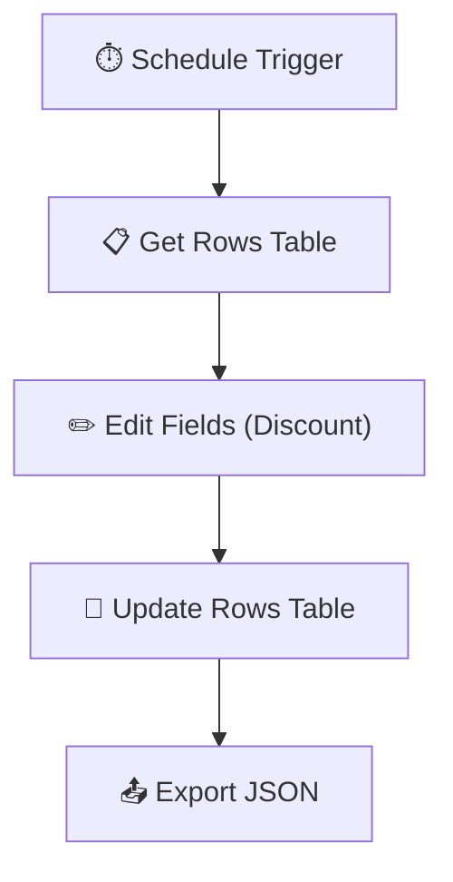

## **Etapa 2:** Construção de Workflows Avançados

---
layout: two-cols-header
layoutClass: gap-8
class: flex items-center justify-center
---

# Ativando URL de produção de webhook
#### **Existem diferenças entre o modo de teste e o fluxo ativo em produção**

::left::

- A **Test URL** só funciona enquanto você estiver com o n8n aberto aguardando eventos com o botão _Listen for test event_.
- A **Production URL** só responde após o workflow ser **publicado** no canto superior do editor.

::right::

  <AssetImg src="n8n/webhook-url-test-production.png" class="rounded-lg shadow-md max-w-[380px]" />

<!--
## notes slides

### Durante o desenvolvimento, utilize a Test URL para inspecionar os dados recebidos em tempo real no editor
### Para integrações reais e chamadas de sistemas externos em produção, ative o workflow e aponte para a Production URL
-->

---
layout: two-cols-header
layoutClass: gap-8
class: flex items-center justify-center
---

# Visualizando as execuções de um workflow
#### **O painel de execuções permite visualizar o histórico de disparos e os dados processados**

::left::

- O painel **Executions** lista todas as execuções (manuais, agendadas ou de produção) com status de sucesso, erro ou em andamento.
- Permite abrir qualquer execução passada para **inspecionar os dados de entrada e saída nó a nó**, facilitando a auditoria e correção de erros.

::right::

  <AssetImg src="n8n/execution-panel.png" class="rounded-lg shadow-md max-w-[400px]" />

<!--
## notes slides

### Por padrão, o n8n salva execuções com erro; nas configurações do workflow é possível definir se execuções com sucesso também devem ser salvas
### Você pode reexecutar (retry) execuções com falha diretamente a partir do painel de histórico
-->

---
layout: two-cols-header
layoutClass: gap-8
class: flex items-center justify-center
---

# If node (action node)
#### **O nó If permite criar roteamento condicional de dados em um workflow**

::left::

- Avalia condições lógicas (igualdade, comparações numéricas, texto, existência) dividindo o fluxo em duas saídas: **true** e **false**.
- Suporta **múltiplas condições combinadas** com operadores lógicos (_AND / OR_) para validar regras complexas sobre o payload de entrada.

::right::

  <N8nNode
    icon-src="n8n/nodes/if.svg"
    label="If Node"
    type="action"
    scale="1.4"
  />

<!--
## notes slides

### Cada item recebido é avaliado individualmente, podendo rotear itens da mesma lista para saídas diferentes
### O nó If possui duas saídas de conexão: a superior representa a condição verdadeira (true) e a inferior a falsa (false)
-->

---
layout: two-cols-header
layoutClass: gap-8
class: flex items-center justify-center
---

# HTTP (action node)
#### **O nó HTTP permite fazer requisições a Web APIs de qualquer serviço web**

::left::

- Envia requisições HTTP (**GET, POST, PUT, DELETE, PATCH**) para qualquer API externa com headers, query params e body JSON.
- Suporta diversos tipos de **autenticação** (Bearer Token, OAuth2, API Key, Basic) e encaminha as respostas como saída para o próximo nó do fluxo.

::right::

  <N8nNode
    icon-src="n8n/nodes/http-request.svg"
    label="HTTP Request"
    type="action"
    scale="1.4"
  />

<!--
## notes slides

### Permite configurar paginação automática e controle de erros HTTP (ex: ignorar 404/500 ou tentar novamente)
### Pode enviar e receber tanto dados JSON tabulares quanto arquivos binários (imagens, PDFs, áudio)
-->

---
layout: default
---

# Entendendo os itens individuais do n8n
#### **Se a tabela tem 10 registros, quantos e-mails serão enviados?**

  

    <N8nNode
      icon-src="n8n/nodes/manual-trigger.svg"
      label="Trigger"
      subtitle="Trigger Manually"
      type="trigger"
      scale="1.1"
    />
    <N8nNode
      icon-src="n8n/nodes/data-table.svg"
      label="Get Rows"
      subtitle="Data Table"
      type="action"
      scale="1.1"
    />
    <N8nNode
      icon-src="n8n/nodes/gmail.svg"
      label="Send a message"
      subtitle="Gmail"
      type="action"
      scale="1.1"
    />
  

<!--
## notes slides

### Resposta: 10 e-mails! No n8n, cada item de entrada faz o nó subsequente rodar uma vez para cada item (loop implícito).
### Se o objetivo for enviar apenas 1 e-mail com a lista dos 10 itens, é necessário usar o nó Aggregate antes do Gmail.
-->

---
layout: two-cols-header
layoutClass: gap-8
class: flex items-center justify-center
---

# Aggregate (action node)
#### **O nó Aggregate permite agrupar itens individuais em um único item (lote)**

::left::

- Combina **múltiplos itens recebidos em um único item com array**, permitindo enviar lotes completos para o nó seguinte.
- O nó realiza apenas **agrupamento estrutural**; para métricas estatísticas/matemáticas (como _Sum, Avg, Min, Max, etc_), deve-se usar o nó **Summarize**.

::right::

  <N8nNode
    icon-src="n8n/nodes/aggregate.svg"
    label="Aggregate"
    type="action"
    scale="1.4"
  />

<!--
## notes slides

### O n8n processa cada item individualmente por padrão; o Aggregate serve para unificar esses itens antes de nós que esperam lotes
### Complementa o nó Split Out / Item Lists, que faz a operação inversa (desmembra uma lista em itens individuais)
-->

---
layout: two-cols-header
layoutClass: gap-8
class: flex items-center justify-center
---

# Usando trigger agendado para polling
#### **O trigger de agendamento premite criar workflows com polling, para tarefas recorrentes**

::left::

- O **Schedule Trigger** dispara o workflow em intervalos recorrentes, úteis para busca periódica de novos registros.
- **Não existe gatilho de polling**, mas o gatilho de agendamento permite criar workflows com polling.
- O polling é **ideal para integrar sistemas legados**, que não possuem capacidade de notificação em tempo real.

::right::

<Transform :scale="0.65" origin="center top">

</Transform>

