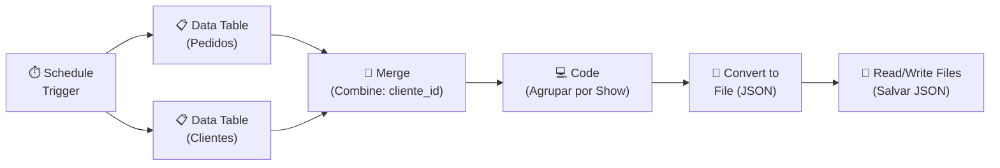
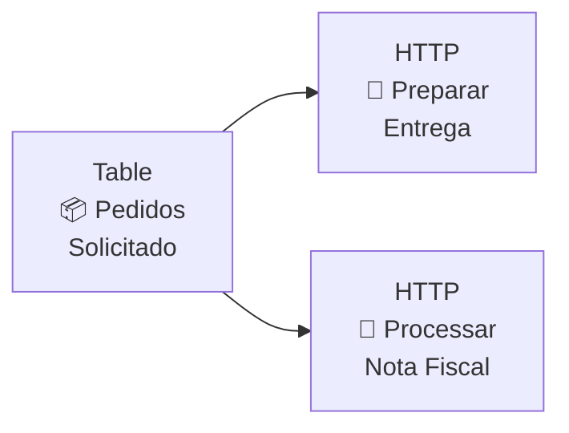

## **Etapa 3:** Gestão Avançada de Erros

---
layout: default
---

# Codificação assistida por IA - Live coding (1)
#### **Workflow para exportar pedidos de cliente agrupado por show**

<div class="h-[calc(100%-80px)] flex flex-col justify-between">
  <div class="flex-1 flex items-center justify-center">

<Transform :scale="3" origin="center">



</Transform>

  </div>
  
  <div class="text-base w-full">

> [!NOTE]
> **Cenário de negócio:** workflow é disparado em horário específico, consulta tabelas de pedidos de ingressos e de clientes, mergeia os dados com Merge Combine, agrupar pedidos por show, e gera relatório de pediso por show em arquivo JSON. Em caso de erro, um workflow de tratamento de erros é disparado para armazenar os erros em log.

  </div>
</div>

<!--
## notes slides

### Demonstra a combinação de dados de múltiplas fontes com Merge Combine e agrupamento estruturado via nó Code
### Finaliza persistindo o JSON agrupado no diretório local via nós Convert to File e Read/Write Files from Disk
-->

---
layout: default
layoutClass: gap-8
---

# Codificação assistida por IA - Live coding (2)
#### **Workflow para exportar pedidos de cliente agrupado por show**

<div class="h-7" />

<WindowMockup color="dark" padding="0.5rem 0.5rem 0.5rem 0.5rem" title="prompt.md" codeblock>

```md {*}{maxHeight:'290px'}
# Papel
Você é um engenheiro de automação especialista em n8n e construção de workflows.

# Tarefa
Crie dois workflows no n8n-infnet:
1. Um workflow principal que consulte pedidos de ingressos e clientes em Data Tables, combine os dados, agrupe por show via nó Code e salve o resultado em arquivo JSON.
2. Um workflow de tratamento de erro que capture falhas de execução e registre em uma tabela de log de erros.

# Contexto
## 1. Workflow Principal (Relatório por Show)
1. Use o nó Schedule Trigger para agendar a execução do workflow.
2. Crie/consulte duas Data Tables com 4 registros cada:
   - Tabela `pedidos_ingressos`: colunas `id`, `cliente_id`, `show` (2 registros para o "Show Rock in Rio" e 2 para o "Show Lollapalooza"), `valor`.
   - Tabela `clientes`: colunas `id`, `nome`, `email`, `cidade` (1 registro correspondente para cada cliente_id 1 a 4).
3. Conecte o Schedule Trigger em Fan-out para ler ambas as tabelas (dois nós Data Table).
4. Use o nó Merge no modo Combine para unir os dados de Pedidos com Clientes baseado na chave `cliente_id` (Input 1) e `id` (Input 2).
5. Adicione um nó Code (JavaScript no modo Run Once for All Items) que:
   - Agrupe os pedidos combinados pelo nome do show.
   - Calcule a quantidade total de ingressos e valor total por show.
6. Converta a lista agrupada em arquivo com o nó Convert to File (opção To JSON).
7. Salve o arquivo JSON em disco com o nó Read/Write Files from Disk no caminho `/home/node/.n8n-files/pedidos_por_show.json`.
8. Configure o workflow principal para apontar para o workflow de erro em _Workflow Settings > Error Workflow_.

## 2. Workflow de Tratamento de Erro (Logs de Falhas)
1. Crie um segundo workflow chamado `Error Handler - Logs de Erro`.
2. Use o nó Error Trigger para capturar dados do erro (`workflow.name`, `execution.lastNodeExecuted`, `execution.error.message`).
3. Crie/consulte uma Data Table `logs_erros` com as colunas `workflow_name`, `last_node_executed`, `error_message`, `data_erro`.
4. Conecte o Error Trigger a um nó Data Table para inserir um novo registro na tabela `logs_erros`.
5. Publique (ative) o workflow de erro para que fique disponível para seleção.

# Regras de Expressões e Boas Práticas
- Sempre use aspas simples (') ao referenciar nomes de nós em expressões n8n para evitar barras e caracteres escapados.
- No nó Code, retorne um array no formato `[{ json: { ... } }]` com a estrutura agrupada por show.

# Saída e Verificação
- Crie o workflow diretamente na instância n8n via MCP.
- Certifique-se de que o workflow seja funcional e com nós conectados corretamente.
```
</WindowMockup>

<!--
## notes slides

### 1 - para gerar workflows corretos, é preciso detalhar a estrutura das tabelas e chaves de combinação
### 2 - o nó Code consolida a agregação por show antes da conversão para arquivo binário JSON
-->

---
layout: two-cols-header
layoutClass: gap-8
class: flex items-center justify-center
sourceLabel: Error Trigger
source: https://docs.n8n.io/integrations/builtin/core-nodes/n8n-nodes-base.errortrigger
---

# Error Trigger (Gatilho de erro)
#### **O nó Error Trigger permite criar workflows de tratamento de erro em outros workflows**

::left::

<div class="text-sx w-full self-start [&_ul]:my-15 [&_li]:mb-6">

- O **Error Trigger** é disparado toda vez que um erro ocorre no workflow principal.
- O workflow que usa um **Error Trigger** se torna um workflow de tratamento de erro, e pode ser usado para registrar em log (ex: tabela) o nome do workflow, último nó e mensagem de erro.


</div>

::right::

<div class="flex items-center justify-center h-full">
  <N8nNode
    icon-src="n8n/nodes/error-trigger.svg"
    label="Error Trigger"
    type="trigger"
    scale="1.4"
  />
</div>

<!--
## notes slides

### O workflow de tratamento de erro precisa estar publicado (ativo) para poder ser selecionado nas configurações do workflow principal
### O Error Trigger é acionado apenas em execuções de produção (quando o workflow principal está ativo e falha)
-->

---
layout: two-cols-header
layoutClass: gap-8
class: flex items-center justify-center
sourceLabel: Error Trigger
source: https://docs.n8n.io/integrations/builtin/core-nodes/n8n-nodes-base.errortrigger
---

# Error Trigger - pré-requisitos
#### **Alguns pré-requisitos para nó Error Trigger funcionar:**

::left::

<div class="text-sx w-full self-start [&_ol]:my-10 [&_li]:mb-4">

1. Ambos os workflows (principal e de erro) devem estar **publicados (ativos)**.
2. O **workflow principal** deve ser configurado para usar o workflow de erro em caso de falha (_Workflow Settings > Error Workflow_).
3. Para simular erros, **não podem ser usadas execuções manuais** no editor, apenas execuções reais que acionem o gatilho em produção.

</div>

::right::

<div class="flex items-center justify-center h-full">
  <N8nNode
    icon-src="n8n/nodes/error-trigger.svg"
    label="Error Trigger"
    type="trigger"
    scale="1.4"
  />
</div>

<!--
## notes slides

### Se o Error Workflow estiver inativo, ele não aparecerá disponível para seleção nas configurações do workflow principal
### O n8n suprime o Error Workflow em execuções manuais de teste porque o erro já é exibido na tela para o usuário
### erros forçados de exemplo: URL de HTTP errado. Nome de tabela errada. Diretório de Write file errado.
-->

---
layout: two-cols-header
layoutClass: gap-8
class: flex items-center justify-center
sourceLabel: Depuração
source: https://docs.n8n.io/build/understand-workflows/understand-executions/debug-executions#load-data
---

# Depuração de workflows
#### **O n8n permite depurar workflows executados com sucesso e com erro**

::left::

<div class="text-sx w-full self-start [&_ul]:my-10 [&_li]:mb-6">

- O recurso de depuração de workflows pode ser encontrado na área de execuções, no botões **Copy to editor** (sucesso) ou **Debug in editor** (erro).
- Ambos os botões abrem o workflow com **os dados da execução carregados nas entradas e saídas dos nós**.

</div>

::right::

<div class="flex items-center justify-center h-full">
  <AssetImg src="n8n/workflow-debug.png" class="rounded-lg shadow-md max-w-[380px]" />
</div>

<!--
## notes slides

### A partir do histórico em Executions ou no botão 'Debug', o n8n carrega as entradas e saídas registradas na execução selecionada
### Permite reexecutar nós individuais com os mesmos dados que causaram o erro em produção
-->

---
layout: two-cols-header
layoutClass: gap-8
class: flex items-center justify-center
sourceLabel: Histórico de versões
source: https://docs.n8n.io/build/manage-workflows/view-change-history#view-workflow-history
---

# Histórico de versões de workflow
#### **O n8n permite visualizar o histórico de alterações de workflow**

::left::

<div class="text-sx w-full self-start [&_ul]:my-5 [&_li]:mb-6">

- O histórico de versões de um workflow pode ser acessado a partir das **configurações do workflow**, no item de menu **"History version"**.
- Permite abrir versões anteriores (para comparar), inspecionar a estrutura de nós do passado, **restaurar** ou **clonar** uma versão de workflow qualquer.

</div>

::right::

<div class="flex items-center justify-center h-full">
  <AssetImg src="n8n/workflow-version-history.png" class="rounded-lg shadow-md max-w-[180px]" />
</div>

<!--
## notes slides

### O histórico de versões ajuda a identificar regressões e reverter alterações indevidas de forma rápida
### Cada salvamento cria um registro imutável que pode ser visualizado ou restaurado como a versão atual
-->

---
layout: two-cols-header
layoutClass: gap-8
class: flex items-center justify-center
sourceLabel: API REST n8n
source: https://docs.n8n.io/connect/n8n-api/authentication
---

# API REST do n8n
#### **O n8n fornece uma API REST completa para gerenciar e inspecionar workflows**

<div class="h-5" />

::left::

<div class="text-15px w-full self-start [&_ul]:my-5 [&_li]:mb-3">

- A API REST do n8n permite entre outras operações, **listar, criar, atualizar, ativar e consultar execuções** de workflows.
- Para habilitar a API do n8n, é necessário criar a API KEY do n8n: **Settings > n8n API > Create an API key**. 
- Todas as chamadas a API REST do n8n devem usar o token `X-N8N-API-KEY`.

</div>

::right::

<div class="flex items-center justify-center h-full">

<WindowMockup color="dark" padding="0.5rem 0.5rem 0.5rem 0.5rem" title="Terminal" codeblock>

```bash {*}{maxHeight:'260px'}
curl -X 'GET' \
  'http://localhost:5678/api/v1/workflows' \
  -H 'accept: application/json' \
  -H 'X-N8N-API-KEY: <your-api-key>' \
  | jq '.data[] | {id, name, active, updatedAt}'
```

</WindowMockup>

</div>

<!--
## notes slides

### A API REST é essencial para pipelines de CI/CD, deploys automatizados e monitoramento externo de instâncias n8n
### O cabeçalho X-N8N-API-KEY é obrigatório em todas as chamadas autenticadas aos endpoints administrativos da API
### para instalar o pacote jq `sudo apt  install jq`
-->

---
layout: two-cols-header
layoutClass: gap-8
class: flex items-center justify-center
---

# Fan-out
#### **O Fan-out é um padrão clássico da EngSoft que distribui um dado em múltiplos destinos**

::left::

<div class="text-sx w-full self-start [&_ul]:my-5 [&_li]:mb-6">

- No n8n, o **Fan-out** ocorre nativamente quando um mesmo nó de saída é conectado simultaneamente à entrada de **dois ou mais nós subsequentes**.
- Todos os ramos recebem a **mesma cópia idêntica dos dados** de entrada e executam suas operações de forma paralela e independente.

</div>

::right::

<div class="flex items-center justify-center h-full">
  <Transform :scale="1.2" origin="center">



  </Transform>
</div>

<!--
## notes slides

### O Fan-out é ideal para executar ações paralelas desacopladas a partir de um mesmo evento (ex: gerar NF e avisar expedição)
### Para juntar novamente os resultados dessas ramificações paralelas mais à frente no fluxo, utiliza-se o nó Merge (Fan-in)
-->

---
layout: two-cols-header
layoutClass: gap-8
class: flex items-center justify-center
sourceLabel: Merge node
source: https://docs.n8n.io/integrations/builtin/core-nodes/n8n-nodes-base.merge
---

# Merge (action node)
#### **O nó Merge permite combinar dados de duas ramificações diferentes em um único fluxo**

::left::

<div class="text-sx w-full self-start [&_ul]:my-10 [&_li]:mb-6">

- Une dados de **duas entradas independentes** (Input 1 e Input 2), permitindo sincronizar e cruzar informações de ramificações paralelas.
- Oferece diferentes **modos de combinação**: _Append_, _Combine_ e _Choose_.

</div>

::right::

<div class="flex items-center justify-center h-full">
  <N8nNode
    icon-src="n8n/nodes/merge.svg"
    label="Merge"
    type="action"
    scale="1.4"
  />
</div>

<!--
## notes slides

### O nó Merge aguarda a chegada de dados de ambas as entradas antes de prosseguir com a execução
### Útil para enriquecer um conjunto de dados primário com informações complementares obtidas em APIs distintas
-->

---
layout: two-cols-header
layoutClass: gap-8
sourceLabel: Merge node
source: https://docs.n8n.io/integrations/builtin/core-nodes/n8n-nodes-base.merge
---

# Merge (action node): modo Append
#### **O modo Append empilha os itens do Input 1 e Input 2 em uma única lista**

<div class="h-2" />

::left::

<div class="space-y-2">

<WindowMockup color="dark" padding="0.3rem 0.5rem 0.3rem 0.5rem" title="input 1: 1 item" codeblock>

```json {*}{maxHeight:'115px'}
[
  { "id": 1, 
    "produto": "Geladeira", 
    "valor": 5000.00 
  }
]
```

</WindowMockup>

<WindowMockup color="dark" padding="0.3rem 0.5rem 0.3rem 0.5rem" title="input 2: 1 item" codeblock>

```json {*}{maxHeight:'115px'}
[
  { "id": 2, 
    "produto": "Televisão", 
    "valor": 3000.00 
  }
]
```

</WindowMockup>

</div>

::right::

<WindowMockup color="dark" padding="0.5rem 0.5rem 0.5rem 0.5rem" title="saída: 2 itens (concatenados)" codeblock>

```json {*}{maxHeight:'260px'}
[
  {
    "id": 1,
    "produto": "Geladeira",
    "valor": 5000.00
  },
  {
    "id": 2,
    "produto": "Televisão",
    "valor": 3000.00
  }
]
```

</WindowMockup>

<!--
## notes slides

### O modo Append simplesmente empilha os dados: todos os itens da Entrada 1 seguidos por todos os itens da Entrada 2
### Não faz casamento de chaves nem cruzamento de colunas, apenas unifica as listas em uma única saída
-->

---
layout: two-cols-header
layoutClass: gap-8
sourceLabel: Merge node
source: https://docs.n8n.io/integrations/builtin/core-nodes/n8n-nodes-base.merge
---

# Merge (action node): modo Combine
#### **O modo Combine mescla as propriedades de ambas as entradas por chaves**

<div class="h-2" />

::left::

<div class="space-y-2">

<WindowMockup color="dark" padding="0.3rem 0.5rem 0.3rem 0.5rem" title="input 1: dados do produto" codeblock>

```json {*}{maxHeight:'115px'}
[
  { "id": 1, 
    "produto": "Geladeira", 
    "valor": 5000.00 
  }
]
```

</WindowMockup>

<WindowMockup color="dark" padding="0.3rem 0.5rem 0.3rem 0.5rem" title="input 2: dados complementares (id: 1)" codeblock>

```json {*}{maxHeight:'115px'}
[
  { "id": 1, 
    "categoria": "Eletrodomésticos", 
    "estoque": 12 
  }
]
```

</WindowMockup>

</div>

::right::

<WindowMockup color="dark" padding="0.5rem 0.5rem 0.5rem 0.5rem" title="saída: 1 item (mesclado por id)" codeblock>

```json {*}{maxHeight:'260px'}
[
  {
    "id": 1,
    "produto": "Geladeira",
    "valor": 5000.00,
    "categoria": "Eletrodomésticos",
    "estoque": 12
  }
]
```

</WindowMockup>

<!--
## notes slides

### O modo Combine permite fazer 'join' entre duas fontes de dados cruzando por um campo comum (ex: id)
### É ideal para enriquecer registros (ex: dados de cliente + histórico de compras de outra API)
-->

---
layout: two-cols-header
layoutClass: gap-8
sourceLabel: Merge node
source: https://docs.n8n.io/integrations/builtin/core-nodes/n8n-nodes-base.merge
---

# Merge (action node): modo Choose
#### **O modo Choose repassa os dados de apenas uma das entradas**

<div class="h-2" />

::left::

<div class="space-y-2">

<WindowMockup color="dark" padding="0.3rem 0.5rem 0.3rem 0.5rem" title="input 1: produto principal" codeblock>

```json {*}{maxHeight:'115px'}
[
  { "id": 1, 
    "produto": "Geladeira", 
    "valor": 5000.00 
  }
]
```

</WindowMockup>

<WindowMockup color="dark" padding="0.3rem 0.5rem 0.3rem 0.5rem" title="input 2: produto alternativo" codeblock>

```json {*}{maxHeight:'115px'}
[
  { "id": 2, 
    "produto": "Televisão", 
    "valor": 3000.00 
  }
]
```

</WindowMockup>

</div>

::right::

<WindowMockup color="dark" padding="0.5rem 0.5rem 0.5rem 0.5rem" title="saída: escolhe apenas Input 1" codeblock>

```json {*}{maxHeight:'260px'}
[
  {
    "id": 1,
    "produto": "Geladeira",
    "valor": 5000.00
  }
]
```

</WindowMockup>

<!--
## notes slides

### O modo Choose (ou Choose Branch / Keep Non-Empty) decide qual entrada repassar adiante no fluxo
### Muito usado em cenários de fallback: repassa a entrada 1 se ela tiver dados, caso contrário repassa a entrada 2
-->

---
layout: two-cols-header
layoutClass: gap-8
class: flex items-center justify-center
sourceLabel: Code node
source: https://docs.n8n.io/integrations/builtin/core-nodes/n8n-nodes-base.code
---

# Code (action node)
#### **O nó Code permite usar código javascript/python no workflow**

<div class="h-0" />

::left::

<div class="text-sx w-full self-start [&_ul]:my-2 [&_li]:mb-6">

- **JavaScript** é a opção mais recomendada por ser suportada desde a primeira versão do n8n e oferecer maior ecossistema e suporte nativo que o Python.
- **Use nó do tipo Código quando** os tipos de nós existente do n8n (Limit, Aggregate, Sort, etc) não são suficientes para resolver um determinado problema.

</div>

::right::

<div class="flex items-center justify-center h-full">
  <N8nNode
    icon-src="n8n/nodes/code.svg"
    label="Code"
    type="action"
    scale="1.4"
  />
</div>

<!--
## notes slides

### O modo Run Once for All Items ($input.all()) é ideal para agregações, ordenações customizadas e manipulação de lotes
### O modo Run Once for Each Item ($input.item) processa e transforma cada item individualmente em loop implícito
-->

---
layout: two-cols-header
layoutClass: gap-8
class: flex items-center justify-center
sourceLabel: Code node
source: https://docs.n8n.io/integrations/builtin/core-nodes/n8n-nodes-base.code
---

# Code: adicionando código javascript
#### **O sinal de `$` permite usar variáveis e métodos injetados em nó do tipo Code**

<div class="h-0" />

::left::

<div class="text-sx w-full self-start [&_ul]:my-2 [&_li]:mb-6">

- O código pode ser executado uma única vez para todos os itens recebidos do nó anterior (**Run Once for All Items**) ou executado individualmente para cada item (**Run Once for Each Item**).
- O nó do tipo código deve usar `return` para gerar uma saída para o próximo nó.

</div>

::right::

<div class="flex items-center justify-center h-full">

<WindowMockup color="dark" padding="0.5rem 0.5rem 0.5rem 0.5rem" title="JavaScript Code" codeblock>

```javascript {*}{maxHeight:'260px'}
// Diminui 7 dias a partir da data atual ($today)
const seteDiasAtras = $today.minus({ days: 7 });

return {
  data_atual: $today.toISODate(),
  sete_dias_atras: seteDiasAtras.toISODate()
};
```

</WindowMockup>

</div>

<!--
## notes slides

### $today e $now utilizam internamente a biblioteca Luxon (DateTime), fornecendo métodos como .minus(), .plus() e .toFormat()
### Objetos auxiliares como $input, $json, $item e $jmespath facilitam o acesso e manipulação da estrutura de dados
-->

---
layout: two-cols-header
layoutClass: gap-8
class: flex items-center justify-center
sourceLabel: Code node
source: https://docs.n8n.io/integrations/builtin/core-nodes/n8n-nodes-base.code
---

# Code: objeto $json
#### **O objeto `$json` dá acesso direto às propriedades e valores do item atual**

<div class="h-12" />

::left::

<div class="text-sx w-full self-start [&_ul]:my-0 [&_li]:mb-6">

- No modo **Run Once for Each Item**, `$json` representa o conteúdo JSON do item recebido na iteração atual.
- Qualquer **propriedade adicionada** ou modificada em $json é repassada como saída para o próximo nó.

</div>

::right::

<div class="flex items-center justify-center h-full">

<WindowMockup color="dark" padding="0.5rem 0.5rem 0.5rem 0.5rem" title="JavaScript Code" codeblock>

```javascript {*}{maxHeight:'260px'}
// Acessa campos existentes e calcula novo valor
const preco = $json.preco;
const qtd = $json.quantidade;

$json.total = preco * qtd;
$json.processado_em = $today.toISODate();

return $json;
```

</WindowMockup>

</div>

<!--
## notes slides

### No modo 'Run Once for Each Item', $json é um atalho prático para $input.item.json
### Qualquer propriedade adicionada ou modificada em $json é repassada como saída para o próximo nó
-->

---
sourceLabel: Expression Ref
source: https://docs.n8n.io/build/work-with-data/transform-data/expression-reference
---

# Code: variáveis e métodos disponível
#### **As variáveis e métodos abaixo podem ser usados em expressões e nó do tipo código**

<div class="h-4" />

<div class="[&_table]:w-full text-xs">

| **Operação** | **Variável** | **Descrição** |
| --- | --- | --- |
| Criar string | `let rightNow = "Today's date is";` | Cria uma variável de texto (string). |
| Hora atual | `let hourCurrent = $now;` | Retorna a data e hora atual como objeto DateTime (Luxon). |
| Data de 7 dias atrás | `let sevenDaysAgo = $today.minus({days: 7});` | Subtrai 7 dias a partir da data atual. |
| Converter data | `DateTime.fromFormat("23-06-2019", "dd-MM-yyyy");` | Converte uma string de data para objeto DateTime formatado. |
| Obter itens | `let allItems = $("<node-name>").all();` | Obtém todos os itens de um nó executado anteriormente. |

</div>

<!--
## notes slides

### Variáveis como $now e $today utilizam a biblioteca Luxon internamente
### $("<node-name>").all() permite acessar o array completo de itens emitidos por qualquer nó anterior no fluxo
-->


