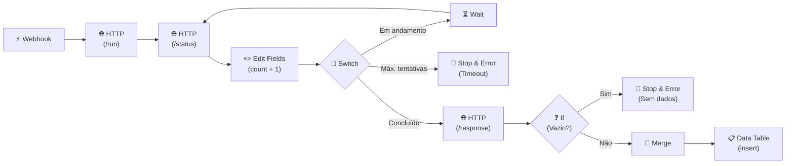
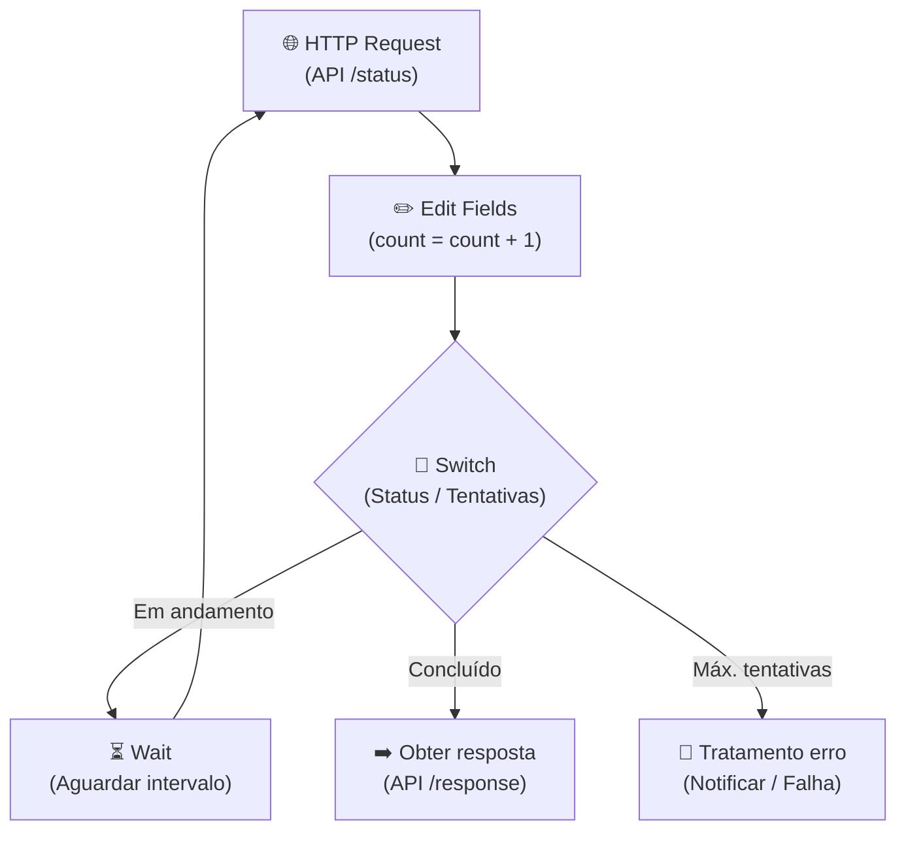
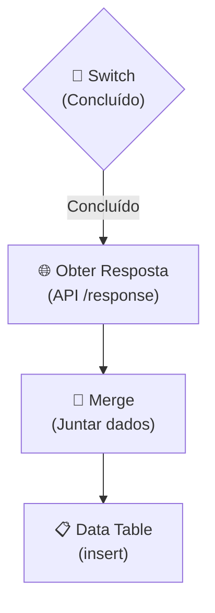
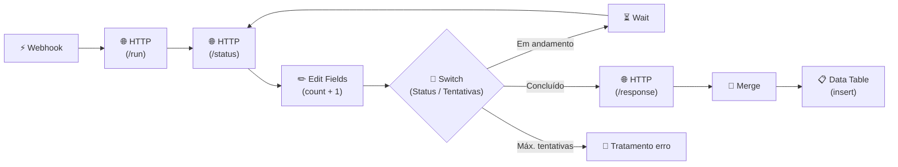

## **Etapa 4:** Integração HTTP com n8n

---
layout: default
---

# Codificação assistida por IA - Live coding (1)
#### **Workflow com padrão de polling HTTP, validação de resposta e log de erros**

<div class="h-[calc(100%-80px)] flex flex-col justify-between">
  <div class="flex-1 flex items-center justify-center">

<Transform :scale="2.2" origin="center">



</Transform>

  </div>
  
  <div class="text-base w-full">

> [!NOTE]
> **Cenário de negócio:** O webhook inicia o processo disparando uma tarefa assíncrona em `/run`. O workflow realiza polling em `/status` com retentativas via `Wait`. Ao concluir, busca o resultado em `/response` e valida o conteúdo: se a resposta for vazia ou o limite de tentativas for atingido, aciona o `Stop and Error`. Se válida, mergeia os dados e grava na `Data Table`. Todas as falhas disparam o workflow de tratamento de erro (`Error Trigger`) para registrar logs na tabela.

  </div>
</div>

<!--
## notes slides

### Demonstra o ciclo completo de integração assíncrona: disparo (/run), polling com retentativas controladas (/status) e obtenção do payload final (/response)
### O nó Switch orquestra o loop de espera e o nó Stop and Error interrompe o fluxo com erro tratado caso atinja o limite ou receba resposta vazia
-->

---
layout: default
layoutClass: gap-8
---

# Codificação assistida por IA - Live coding (2)
#### **Workflow com padrão de polling HTTP, validação de resposta e log de erros**

<div class="h-7" />

<WindowMockup color="dark" padding="0.5rem 0.5rem 0.5rem 0.5rem" title="prompt.md" codeblock>

```md {*}{maxHeight:'290px'}
# Papel
Você é um engenheiro de automação especialista em n8n e construção de workflows.

# Tarefa
Crie dois workflows no n8n-infnet:
1. Um workflow principal que execute uma tarefa assíncrona via Webhook e HTTP Request (/run), realize polling de status com nós Switch e Wait, valide a resposta em /response (com Stop and Error se vazia), combine os dados via Merge e salve o resultado em uma Data Table.
2. Um workflow de tratamento de erro com Error Trigger que capture falhas de execução (incluindo Stop and Error) e registre em uma tabela de log de erros (mensagem de erro, nó e nome do workflow).

# Contexto
## 1. Workflow Principal (Integração HTTP com Polling e Validação)
1. Use o nó Webhook como gatilho do workflow para receber a requisição inicial.
2. Adicione um nó HTTP Request (POST /run) para disparar a tarefa assíncrona na API externa e obter o `job_id`.
3. Adicione um nó HTTP Request (GET /status) consultando o status da execução com base no `job_id`.
4. Adicione um nó Edit Fields para incrementar a contagem de tentativas (`count = count + 1`).
5. Conecte a um nó Switch com 3 regras de saída:
   - "Em andamento" (status = "in_progress" e count < 5): conecta ao nó Wait (aguardar 10 segundos) e retorna ao nó HTTP Request (/status).
   - "Máx. tentativas" (count >= 5): conecta a um nó Stop and Error com mensagem de timeout ("Limite de tentativas de polling excedido").
   - "Concluído" (status = "completed"): conecta ao nó HTTP Request (GET /response) para buscar o payload final.
6. Após o HTTP Request (/response), conecte a um nó If para validar se o retorno possui dados:
   - Se vazio: conecta a um nó Stop and Error com mensagem amigável ("Resposta da API vazia ou inválida").
   - Se válido: conecta a um nó Merge (modo Combine) para mesclar o payload da resposta com os dados originais do Webhook.
7. Grave o resultado final em uma Data Table `execucoes_processadas`.
8. Configure o workflow principal para apontar para o workflow de erro em _Workflow Settings > Error Workflow_.

## 2. Workflow de Tratamento de Erro (Logs de Falhas)
1. Crie um segundo workflow chamado `Error Handler - Logs de Erro`.
2. Use o nó Error Trigger para capturar dados do erro (`workflow.name`, `execution.lastNodeExecuted`, `execution.error.message`).
3. Crie/consulte uma Data Table `logs_erros` com as colunas `workflow_name`, `last_node_executed`, `error_message`, `data_erro`.
4. Conecte o Error Trigger a um nó Data Table para inserir um novo registro na tabela `logs_erros`.
5. Publique (ative) o workflow de erro para que fique disponível para seleção.

# Regras de Expressões e Boas Práticas
- Sempre use aspas simples (') ao referenciar nomes de nós em expressões n8n para evitar barras e caracteres escapados.
- Nos nós Stop and Error, defina o tipo como Error Message ou JSON com mensagens claras para diagnóstico.
- Assegure que as rotas de polling e retentativas não gerem loops infinitos.

# Saída e Verificação
- Crie o workflow diretamente na instância n8n via MCP.
- Certifique-se de que o workflow seja funcional e com nós conectados corretamente.
```
</WindowMockup>

<!--
## notes slides

### 1 - o prompt instrui a criação do workflow de polling com validações de timeout e payload vazio usando Stop and Error
### 2 - o workflow de erro com Error Trigger captura falhas e registra logs estruturados na Data Table
-->

---
layout: two-cols-header
layoutClass: gap-8
class: flex items-center justify-center
sourceLabel: HTTP Request
source: https://docs.n8n.io/integrations/builtin/core-nodes/n8n-nodes-base.httprequest
---

# HTTP Request (action node)
#### **O nó de requisição HTTP permite fazer requisições HTTP em uma Web API REST**

<div class="h-3" />

::left::

<div class="text-sx w-full self-start [&_ul]:my-0 [&_li]:mb-6">

- Permite realizar todas as configurações para uma chamada HTTP, incluindo envio dos parâmetros de **verbo, cabeçalho, corpo**, além de **receber a resposta** para encaminhar para o fluxo seguinte.
- É possível importar chamadas HTTP em curl diretamente no nó HTTP Request (opção Import cURL).

</div>

::right::

<div class="flex items-center justify-center h-full">
  <N8nNode
    icon-src="n8n/nodes/http-request.svg"
    label="HTTP Request"
    type="action"
    scale="1.4"
  />
</div>

<!--
## notes slides

### O nó HTTP Request é o principal nó de integração do n8n com APIs REST externas
### A utilização de Credenciais separadas do workflow garante segurança e reutilização entre múltiplos fluxos
-->

---
layout: two-cols-header
layoutClass: gap-8
class: flex items-center justify-center
sourceLabel: Wait node
source: https://docs.n8n.io/integrations/builtin/core-nodes/n8n-nodes-base.wait
---

# Wait (action node)
#### **O nó de Espera permite interromper o workflow e retomar a execução após uma condição**

<div class="h-12" />

::left::

<div class="text-sx w-full self-start [&_ul]:my-0 [&_li]:mb-6">

- O nó de espera é útil para usar em chamadas HTTP com padrão de **polling** (retentativas).
- O nó de espera pode retomar a execução do workflow com base em **intervalo de tempo**, em um **horário específico**, **callback de webhook** e ao **receber resposta de um forms**.

</div>

::right::

<div class="flex items-center justify-center h-full">
  <N8nNode
    icon-src="n8n/nodes/wait.svg"
    label="Wait"
    type="action"
    scale="1.4"
  />
</div>

<!--
## notes slides

### Em produção, o nó Wait descarrega a execução da memória e persiste no banco até o momento da retomada
### Suporta diferentes modos de espera: After time interval, At specified time, On webhook call e On form submission
-->

---
layout: two-cols-header
layoutClass: gap-8
class: flex items-center justify-center
sourceLabel: Switch
source: https://docs.n8n.io/integrations/builtin/core-nodes/n8n-nodes-base.switch
---

# Switch (action node)
#### **O nó Switch permite rotear para mais de um ramo com base em comparação**

<div class="h-12" />

::left::

<div class="text-sx w-full self-start [&_ul]:my-0 [&_li]:mb-6">

- Diferentemente do nó If que permite rotear para dois ramos, o nó Switch permite rotear para **mais de dois ramos**.
- O switch permite escolher o modo regra, baseada em **comparação com cada entrada recebida**, ou por **expressão n8n**.

</div>

::right::

<div class="flex items-center justify-center h-full">
  <N8nNode
    icon-src="n8n/nodes/switch.svg"
    label="Switch"
    type="action"
    scale="1.4"
  />
</div>

<!--
## notes slides

### O nó Switch avalia múltiplos caminhos de saída substituindo cadeias complexas de nós If
### Suporta modos de roteamento por regras condicionais ou avaliação dinâmica via expressões
-->

---
layout: two-cols-header
layoutClass: gap-2
class: flex items-center justify-center
---

# Padrão de polling: parte 1
#### **O padrão de polling é útil em cenários de tarefas em segundo plano**

<div class="h-0" />

::left::

<div class="text-sx w-full self-start [&_ul]:my-15 [&_li]:mb-6">

- É comum adotar a boa prática de um **máximo de retentativas** para evitar um cenário de **loop infinito**.
- O padrão de polling normalmente exige **três requisições HTTP (run, status e response)**. O fluxo ao lado apresenta a parte mais complexa, o polling na API `/status`.

</div>

::right::

<div class="flex items-center justify-center h-full">
  <Transform :scale="1.3" origin="center">



  </Transform>
</div>

<!--
## notes slides

### O padrão de polling combina HTTP Request, Edit Fields para controle de tentativas, Switch e Wait para criar ciclos seguros
### O nó Switch avalia o término da tarefa externa, o ciclo de espera e o limite de retentativas direcionando para tratamento de erro
-->

---
layout: two-cols-header
layoutClass: gap-2
class: flex items-center justify-center
---

# Padrão de polling: parte 2
#### **Depois do status retornar conclusão, a resposta é obtida e mergeada**

<div class="h-3" />

::left::

<div class="text-sx w-full self-start [&_ul]:my-10 [&_li]:mb-6">

- Após o status indicar sucesso, é necessário utilizar o nó **Merge** para consolidar a resposta final da API com o fluxo de dados e contexto anteriores.
- Dependendo da estrutura dos dados, utiliza-se o modo **Combine** (para mesclar propriedades em um único registro) ou **Append** (para empilhar novas linhas) antes da persistência na **Data Table**.

</div>

::right::

<div class="flex items-center justify-center h-full">
  <Transform :scale="0.6" origin="top">



  </Transform>
</div>

<!--
## notes slides

### Após a conclusão do polling, o workflow realiza a requisição final para extrair o resultado consolidado
### O nó Merge unifica os dados da resposta final aos dados originais do fluxo para gravação na Data Table
-->

---
layout: default
---

# Padrão de polling: workflow completo
#### **O padrão de polling normalmente exige três requisições HTTP (run, status e response)**

<div class="h-[calc(100%-80px)] flex flex-col justify-between">
  <div class="flex-1 flex items-center justify-center">

<Transform :scale="3" origin="center">



</Transform>

  </div>
  
  <div class="text-base w-full">

> [!NOTE]
> **Fluxo de execução:** O webhook inicia o processo disparando um agente assíncrono em `/run`. Em seguida, o fluxo entra em um loop de polling consultando `/status` com retentativas via `Wait` até a conclusão. Ao finalizar, busca o resultado em `/response`, mergeia e grava os dados na `Data Table`. Caso atinja o limite máximo de retentativas, o `Switch` direciona para o ramo de tratamento de erro.

  </div>
</div>

<!--
## notes slides

### Demonstra o ciclo de vida completo de uma integração assíncrona via HTTP: disparo (/run), monitoramento com polling (/status) e obtenção do payload final (/response)
### O nó Switch orquestra o ciclo de espera, o avanço para persistência dos dados na Data Table ou o desvio para tratamento de erro
-->

---
layout: two-cols-header
layoutClass: gap-8
class: flex items-center justify-center
sourceLabel: Data pinning
source: https://docs.n8n.io/build/work-with-data/pin-and-mock-data#data-pinning
---

# Fixação de dados (Data pinning)
#### **Fixar dados em nós permite testar workflows sem reexecutar nós anteriores**

<div class="h-3" />

::left::

<div class="text-sx w-full self-start [&_ul]:my-15 [&_li]:mb-6">

- O **Data pinning** congela a saída de um nó específico durante o desenvolvimento, evitando chamadas repetidas a APIs externas e consumo desnecessário de cotas.
- Dados fixados são utilizados apenas em testes manuais no editor e são ignorados automaticamente em execuções de produção.

</div>

::right::

<div class="flex items-center justify-center h-full">
  <AssetImg src="n8n/workflow-pin-data.png" class="rounded-lg shadow-md max-w-[280px]" />
</div>

<!--
## notes slides

### O Data Pinning simula respostas estáticas em nós intermediários acelerando o ciclo de testes e depuração
### Ideal para testar nós posteriores sem gerar novas requisições em APIs pagas ou com rate limit
-->

---
layout: two-cols-header
layoutClass: gap-8
class: flex items-center justify-center
sourceLabel: Stop and Error
source: https://docs.n8n.io/integrations/builtin/core-nodes/n8n-nodes-base.stopanderror
---

# Stop and Error (action node)
#### **O nó Stop and Error permite exibir mensagens personalizadas em casos de erros tratados**

<div class="h-8" />

::left::

<div class="text-sx w-full self-start [&_ul]:my-5 [&_li]:mb-6">

- Para um nó **Stop and Error** funcionar, é necessário que exista um workflow adicional de tratamento de erro com **Error Trigger**.
- Permite configurar o tipo de erro personalizado: **_Error Message_** para mensagem simples no formato string ou um **Objeto JSON**.
- O nó Stop and Error precisa ser um **nó final dentro do seu ramo**.

</div>

::right::

<div class="flex items-center justify-center h-full">
  <N8nNode
    icon-src="n8n/nodes/stop-and-error.svg"
    label="Stop and Error"
    type="action"
    scale="1.4"
  />
</div>

<!--
## notes slides

### Interrompe intencionalmente a execução do workflow disparando o tratamento de falhas configurado
### Permite customizar a carga do erro com mensagens em texto ou estruturas JSON para auditoria e alertas
-->


