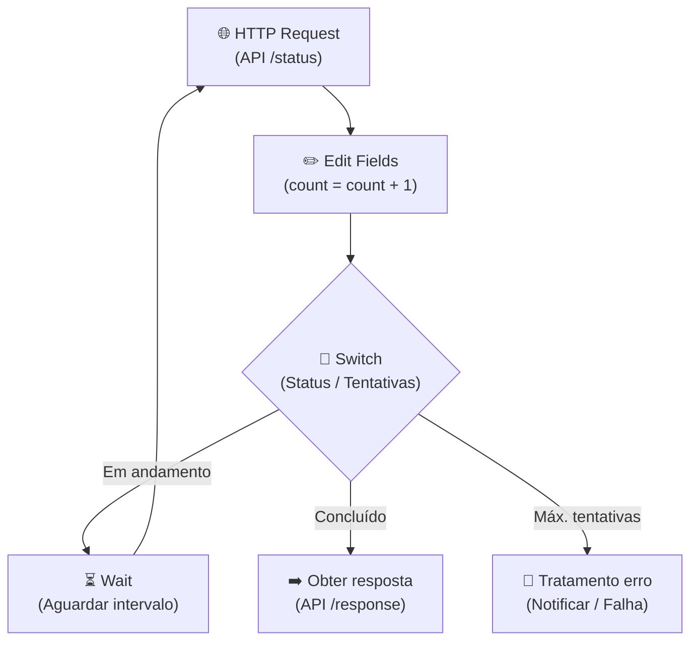
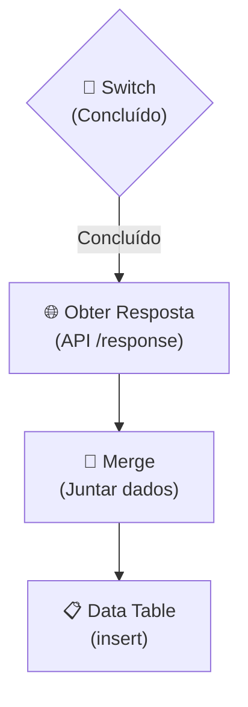
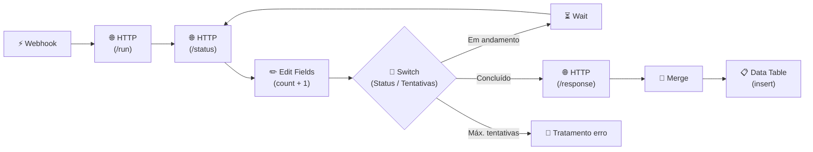

## **Etapa 4:** Integração HTTP com n8n

---
layout: two-cols-header
layoutClass: gap-8
class: flex items-center justify-center
sourceLabel: HTTP Request
source: https://docs.n8n.io/integrations/builtin/core-nodes/n8n-nodes-base.httprequest
---

# HTTP Request (action node)
#### **O nó de requisição HTTP permite fazer requisições HTTP em uma Web API REST**

::left::

- Permite realizar todas as configurações para uma chamada HTTP, incluindo envio dos parâmetros de **verbo, cabeçalho, corpo**, além de **receber a resposta** para encaminhar para o fluxo seguinte.
- É possível importar chamadas HTTP em curl diretamente no nó HTTP Request (opção Import cURL).

::right::

  <N8nNode
    icon-src="n8n/nodes/http-request.svg"
    label="HTTP Request"
    type="action"
    scale="1.4"
  />

<!--
## notes slides

### O nó HTTP Request é o principal nó de integração do n8n com APIs REST externas
### A utilização de Credenciais separadas do workflow garante segurança e reutilização entre múltiplos fluxos
-->

---
layout: two-cols-header
layoutClass: gap-8
class: flex items-center justify-center
sourceLabel: Wait node
source: https://docs.n8n.io/integrations/builtin/core-nodes/n8n-nodes-base.wait
---

# Wait (action node)
#### **O nó de Espera permite interromper o workflow e retomar a execução após uma condição**

::left::

- O nó de espera é útil para usar em chamadas HTTP com padrão de **polling** (retentativas).
- O nó de espera pode retomar a execução do workflow com base em **intervalo de tempo**, em um **horário específico**, **callback de webhook** e ao **receber resposta de um forms**.

::right::

  <N8nNode
    icon-src="n8n/nodes/wait.svg"
    label="Wait"
    type="action"
    scale="1.4"
  />

<!--
## notes slides

### Em produção, o nó Wait descarrega a execução da memória e persiste no banco até o momento da retomada
### Suporta diferentes modos de espera: After time interval, At specified time, On webhook call e On form submission
-->

---
layout: two-cols-header
layoutClass: gap-8
class: flex items-center justify-center
sourceLabel: Switch
source: https://docs.n8n.io/integrations/builtin/core-nodes/n8n-nodes-base.switch
---

# Switch (action node)
#### **O nó Switch permite rotear para mais de um ramo com base em comparação**

::left::

- Diferentemente do nó If que permite rotear para dois ramos, o nó Switch permite rotear para **mais de dois ramos**.
- O switch permite escolher o modo regra, baseada em **comparação com cada entrada recebida**, ou por **expressão n8n**.

::right::

  <N8nNode
    icon-src="n8n/nodes/switch.svg"
    label="Switch"
    type="action"
    scale="1.4"
  />

<!--
## notes slides

### O nó Switch avalia múltiplos caminhos de saída substituindo cadeias complexas de nós If
### Suporta modos de roteamento por regras condicionais ou avaliação dinâmica via expressões
-->

---
layout: two-cols-header
layoutClass: gap-2
class: flex items-center justify-center
---

# Padrão de polling: parte 1
#### **O padrão de polling é útil em cenários de tarefas em segundo plano**

::left::

- É comum adotar a boa prática de um **máximo de retentativas** para evitar um cenário de **loop infinito**.
- O padrão de polling normalmente exige **três requisições HTTP (run, status e response)**. O fluxo ao lado apresenta a parte mais complexa, o polling na API `/status`.

::right::

  <Transform :scale="1.3" origin="center">

  </Transform>

<!--
## notes slides

### O padrão de polling combina HTTP Request, Edit Fields para controle de tentativas, Switch e Wait para criar ciclos seguros
### O nó Switch avalia o término da tarefa externa, o ciclo de espera e o limite de retentativas direcionando para tratamento de erro
-->

---
layout: two-cols-header
layoutClass: gap-2
class: flex items-center justify-center
---

# Padrão de polling: parte 2
#### **Depois do status retornar conclusão, a resposta é obtida e mergeada**

::left::

- Após o status indicar sucesso, é necessário utilizar o nó **Merge** para consolidar a resposta final da API com o fluxo de dados e contexto anteriores.
- Dependendo da estrutura dos dados, utiliza-se o modo **Combine** (para mesclar propriedades em um único registro) ou **Append** (para empilhar novas linhas) antes da persistência na **Data Table**.

::right::

  <Transform :scale="0.6" origin="top">

  </Transform>

<!--
## notes slides

### Após a conclusão do polling, o workflow realiza a requisição final para extrair o resultado consolidado
### O nó Merge unifica os dados da resposta final aos dados originais do fluxo para gravação na Data Table
-->

---
layout: default
---

# Padrão de polling: workflow completo
#### **O padrão de polling normalmente exige três requisições HTTP (run, status e response)**

  

<Transform :scale="3" origin="center">

</Transform>

  

  
  

> [!NOTE]
> **Fluxo de execução:** O webhook inicia o processo disparando um agente assíncrono em `/run`. Em seguida, o fluxo entra em um loop de polling consultando `/status` com retentativas via `Wait` até a conclusão. Ao finalizar, busca o resultado em `/response`, mergeia e grava os dados na `Data Table`. Caso atinja o limite máximo de retentativas, o `Switch` direciona para o ramo de tratamento de erro.

  

<!--
## notes slides

### Demonstra o ciclo de vida completo de uma integração assíncrona via HTTP: disparo (/run), monitoramento com polling (/status) e obtenção do payload final (/response)
### O nó Switch orquestra o ciclo de espera, o avanço para persistência dos dados na Data Table ou o desvio para tratamento de erro
-->

