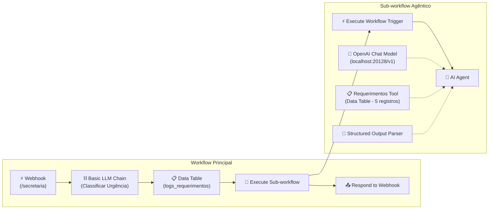
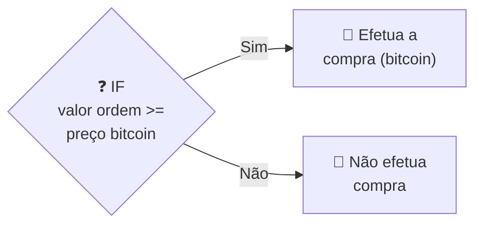
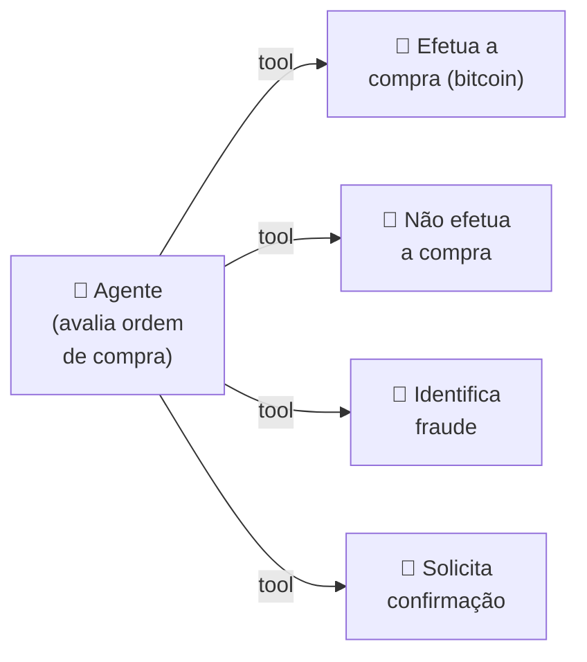
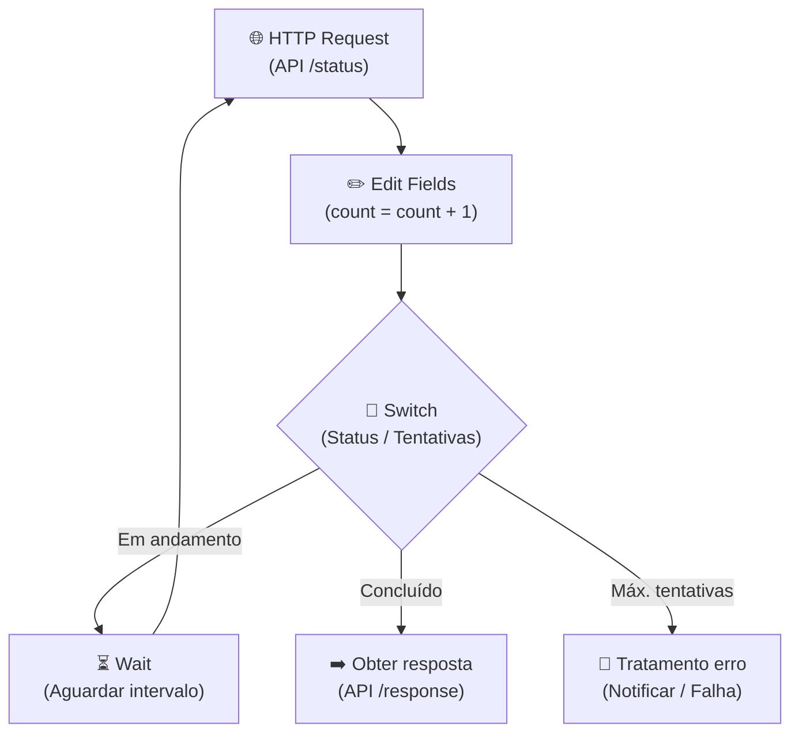
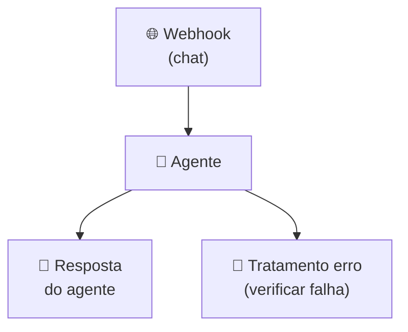

## **Etapa 5:** Integração de Agentes Inteligentes


---
layout: default
---

# Codificação assistida por IA - Live coding (1)
#### **Workflow de secretaria acadêmica para responder sobre requerimentos**

<div class="h-[calc(100%-80px)] flex flex-col justify-between">

<div class="flex-1 flex items-center justify-center">

<Transform :scale="2.3" origin="center">



</Transform>

</div>
  
</div>

<!--
## notes slides

### O workflow principal captura a mensagem do aluno via Webhook, registra a urgência classificada por um Basic LLM Chain em log e aciona um subworkflow agêntico
### O subworkflow utiliza um AI Agent com OpenAI Chat Model (Base URL local), Data Table Tool filtrando a tabela Requerimentos por ID e Structured Output Parser

curl -X POST http://localhost:5678/webhook/secretaria \
  -H "Content-Type: application/json" \
  -d '{"mensagem": "Qual o status do meu requerimento REQ-001?"}'

-->

---
layout: default
layoutClass: gap-8
---

# Codificação assistida por IA - Live coding (2)
#### **Workflow de secretaria acadêmica com classificação de urgência e subworkflow agêntico**

<div class="h-7" />

<WindowMockup color="dark" padding="0.5rem 0.5rem 0.5rem 0.5rem" title="prompt.md" codeblock>

```md {*}{maxHeight:'290px'}
# Papel
Você é um engenheiro de automação especialista em n8n e construção de workflows agênticos.

# Tarefa
Crie dois workflows no n8n-infnet para atendimento de secretaria acadêmica:
1. Workflow Principal: Recebe perguntas de alunos via Webhook (POST /secretaria), classifica a urgência via Basic LLM Chain em 'alta', 'média' ou 'baixa', registra a pergunta e a classificação na Data Table `logs_requerimentos`, executa o Sub-workflow de atendimento agêntico e responde ao Webhook.
2. Sub-workflow de Atendimento: Inicia com Execute Workflow Trigger, executa um AI Agent acoplado a um OpenAI Chat Model (Base URL: http://localhost:20128/v1, responsesApiEnabled: false), consulta a Data Table `requerimentos` via Data Table Tool (filtro por `requerimento_id` via `$fromAI()`) e formata a resposta com Structured Output Parser.

# Contexto
## 1. Tabela de Dados (`requerimentos`)
Crie/simule a Data Table `requerimentos` com 5 registros:
- REQ-001: Aluno "João Silva", Tipo "Trancamento", Status "Em análise"
- REQ-002: Aluna "Maria Oliveira", Tipo "Isenção de Disciplina", Status "Aprovado"
- REQ-003: Aluno "Carlos Souza", Tipo "Emissão de Histórico", Status "Concluído"
- REQ-004: Aluna "Ana Costa", Tipo "Revisão de Nota", Status "Pendente de Documento"
- REQ-005: Aluno "Lucas Lima", Tipo "Segunda Chamada", Status "Indeferido"

## 2. Workflow Principal
1. Use o nó Webhook (POST /secretaria) como gatilho.
2. Conecte a um nó Basic LLM Chain para classificar a urgência da mensagem em 'alta', 'média' ou 'baixa'.
3. Conecte a um nó Data Table (`logs_requerimentos`) para gravar `mensagem`, `classificacao_urgencia` e `data`.
4. Conecte ao nó Execute Sub-workflow para invocar o Sub-workflow de atendimento passando a mensagem e a classificação.
5. Conecte ao nó Respond to Webhook para retornar a resposta final do subworkflow ao aluno.

## 3. Sub-workflow de Atendimento (Agente IA)
1. Use o nó Execute Workflow Trigger para receber os parâmetros (`mensagem`, `classificacao`).
2. Conecte ao nó AI Agent (System Message configurado como assistente de secretaria acadêmica).
3. Acople o subnó OpenAI Chat Model:
   - Base URL: `http://localhost:20128/v1`
   - Credencial: `openAiApi` (necessário configurar a API Key na credencial no n8n)
   - `responsesApiEnabled`: false
4. Acople a ferramenta Data Table Tool (`requerimentos`):
   - Condição de filtro em `requerimento_id`: `={{ $fromAI('conditions0_Value', 'ID do requerimento (ex: REQ-001)', 'string') }}`.
5. Acople o subnó Structured Output Parser com o esquema de resposta (`requerimento_id`, `aluno`, `tipo`, `status`, `resposta_aluno`).

## 4. Exemplo de Teste via cURL
- Olá, gostaria de saber o status do meu requerimento REQ-001

# Regras de Expressões e Boas Práticas
- Sempre use aspas simples (') ao referenciar nomes de nós em expressões n8n.
- Certifique-se de configurar a API Key na credencial OpenAI utilizada pelo nó OpenAI Chat Model.
```
</WindowMockup>

<!--
## notes slides

### O prompt orienta a criação completa da solução em dois workflows modulares no n8n (principal e subworkflow de atendimento)
### Define a estrutura da Data Table Requerimentos com 5 registros, parâmetros do LLM local, filtro dinâmico $fromAI() e teste via cURL
-->

---
layout: two-cols-header
layoutClass: gap-8
class: flex items-center justify-center
---

# Automação tradicional x automação com IA
#### **Os dois tipos de automação são complementares um ao outro, e não substitutos**


::left::

<div class="h-10" />

<div class="text-base w-full self-start [&_ul]:my-3 [&_li]:mb-6">

- A **automação tradicional** baseia-se em **regras determinísticas**, executando instruções **lógicas estáticas** (como `se-então` e rotinas imperativas de código).
- A **automação com agentes de IA** introduz **capacidade cognitiva** e probabilística, permitindo raciocínio flexível, **tomada de decisão** adaptativa, **interpretação de contexto** e uso dinâmico de ferramentas.

</div>

::right::

<div class="h-10" />

<div class="flex items-center justify-center [&_table]:w-[65%] text-10px">

| **Característica** | **Automação Tradicional** | **Agente de IA** |
| --- | :---: | :---: |
| Executa tarefas previsíveis | ✅ | ✅ |
| Responde perguntas | ❌ | ✅ |
| Toma decisões | ❌ | ✅ |
| Interpreta diferentes contextos | ❌ | ✅ |
| Aprende com dados | ❌ | ✅ |

</div>

<!--
## notes slides

### Automações tradicionais executam fluxos previsíveis baseados em regras rígidas pré-programadas
### Agentes de IA adicionam autonomia e adaptabilidade ao interpretar contexto e tomar decisões dinâmicas
-->


---
layout: two-cols-header
layoutClass: gap-8
class: flex items-center justify-center
sourceLabel: AI Agent node
source: https://docs.n8n.io/integrations/builtin/cluster-nodes/root-nodes/n8n-nodes-langchain.agent/
---

# AI Agent (root node)
#### **O n8n disponibiliza o Agent Node (root node) para contrução de workflows agênticos**

<div class="h-2" />

::left::

<div class="text-sx w-full self-start [&_ul]:my-0 [&_li]:mb-6">

- O nó **AI Agent** permite construir agentes com uso de todos os conceitos possíves: uso de LLMs, memória e ferramenta (*tools*).
- O AI Agent é um tipo de nó especial, categorizado como um **nó do tipo raiz**, que **exige um ou mais sub-nodes** para funcionar.
- Neste nó é possível configurar o **System prompt** e o **User prompt**.

</div>

::right::

<div class="flex items-center justify-center h-full">
  <N8nAgentNode
    label="AI Agent"
    scale="1.1"
  />
</div>

<!--
## notes slides

### O nó AI Agent encapsula a complexidade do ciclo de execução agêntica diretamente na interface visual do n8n
### Permite acoplar sub-nós de modelo (LLM), memória e ferramentas de forma modular sem código externo adicional
-->

---
layout: two-cols-header
layoutClass: gap-8
class: flex items-center justify-center
sourceLabel: OpenAI Chat Model
source: https://docs.n8n.io/integrations/builtin/cluster-nodes/sub-nodes/n8n-nodes-langchain.lmchatopenai
---

# OpenAI Chat Model (sub-node)
#### **O OpenAI Chat Model suporta provedores compatíveis com a API Chat Completions**

<div class="h-5" />

::left::

<div class="text-sx w-full self-start [&_ul]:my-5 [&_li]:mb-6">

- Funciona como um **subnó** para conexões do tipo **Chat Model**, sendo acoplado obrigatoriamente à entrada correspondente de nós raiz (como o **AI Agent**).
- Permite configurar o **modelo LLM** e os **hiperparâmetros** (temperatura, top_p, max_retries, frequency_penalty, etc).

</div>

::right::

<div class="flex items-center justify-center h-full">
  <N8nNode
    icon-src="n8n/nodes/openai.svg"
    label="OpenAI Chat Model"
    type="action"
    scale="1.4"
  />
</div>

<!--
## notes slides

### O subnó OpenAI Chat Model conecta o motor de raciocínio LLM ao nó raiz do Agente no n8n
### Permite ajustar hiperparâmetros como temperatura, max tokens e selecionar diferentes modelos da OpenAI ou compatíveis
-->

---
layout: two-cols-header
layoutClass: gap-8
class: flex items-center justify-center
sourceLabel: OpenAI Credential
source: https://docs.n8n.io/integrations/builtin/credentials/openai
---

# OpenAI Credential
#### **O subnó OpenAI Chat Model exige uma credencial para configurar base url e API KEY**

<div class="h-5" />

::left::

<div class="text-sx w-full self-start [&_ul]:my-5 [&_li]:mb-6">

- Armazena de forma segura a **API Key** e o **Base URL** necessários para autenticação na API da OpenAI ou em provedores compatíveis.
- Permite redirecionar requisições para gateways de IA, modelos locais (como Ollama/LM Studio) ou provedores de nuvem alternativos alterando o parâmetro **URL**.

</div>

::right::

<div class="flex items-center justify-center h-full">
  <AssetImg src="n8n/openai-credential.png" class="max-h-[300px] object-contain rounded-lg border border-gray-700 shadow-lg" />
</div>

<!--
## notes slides

### A credencial da OpenAI gerencia de forma segura as chaves de API e URLs de conexão no n8n
### Permite rotear chamadas de LLM para provedores locais ou gateways alterando a URL base de destino
-->

---
layout: default
sourceLabel: Custom Code Tool
source: https://docs.n8n.io/integrations/builtin/cluster-nodes/sub-nodes/n8n-nodes-langchain.toolcode
---

# Tool node (sub-nodes)
#### **O n8n oferece dezenas de nós do tipo Tool (sub-node) para conectar com nós de Agentes**

<div class="h-2" />

<div class="[&_table]:w-full text-10px">

| **Nó** | **Descrição** |
| --- | --- |
| **Code Tool** | Executa scripts customizados em JavaScript ou Python como ferramentas do agente |
| **HTTP Request Tool** | Permite ao agente realizar chamadas a APIs REST externas dinamicamente |
| **Call n8n Workflow Tool** | Invoca outro fluxo de trabalho do n8n como uma sub-rotina agêntica |
| **AI Agent Tool** | Permite ao agente invocar outro Agente de IA (arquitetura multi-agente) |
| **Data Table Tool** | Consulta e manipula tabelas de dados internas do n8n |
| **Human Review Tool** | Pausa a execução para aprovação ou intervenção humana (*Human-in-the-Loop*) |
| **Action in App Tool** | Executa ações em serviços integrados (Gmail, Calendar, Drive, Sheets, etc.) |

</div>

<!--
## notes slides

### O n8n disponibiliza diversas ferramentas nativas e customizadas que estendem a capacidade de ação do Agente de IA
### As ferramentas vão desde execuções de código e chamadas de API até interações com aplicativos e intervenção humana
-->

---
layout: two-cols-header
layoutClass: gap-8
class: flex items-center justify-center
sourceLabel: Sub-nodes Tool
source: https://docs.n8n.io/integrations/builtin/cluster-nodes/sub-nodes
---

# Exemplo de tool node (Data Table Tool)
#### **Data Table Tool permite um agente consultar uma tabela como ferramenta**

<div class="h-5" />

::left::

<div class="text-sx w-full self-start [&_ul]:my-0 [&_li]:mb-6">

- É importante que o **System Prompt** do nó Agente IA **contenha uma regra explícita** para usar o nome do nó (usado no Data Table) como ferramenta.
- Toda ferramenta, incluindo um Data Table Tool, **pode receber input de dados estruturados** usando a função `{{ $fromAI() }}` nas condições de filtro da tabela.

</div>

::right::

<div class="flex items-center justify-center h-full">
  <N8nNode
    icon-src="n8n/nodes/data-table.svg"
    label="Data Table Tool"
    type="action"
    scale="1.4"
  />
</div>

<!--
## notes slides

### A função $fromAI() instrui o agente de IA a extrair dinamicamente parâmetros do prompt para os filtros da ferramenta
### A função $fromAI() possui três parâmetros: o nome do parâmetro gerado pelo n8n enviado ao LLM, descrição em linguagem natural e o tipo do parâmetro
-->

---
layout: two-cols-header
layoutClass: gap-8
class: flex items-center justify-center
---

# Observabilidade agêntica com logs (parte 1)
#### **O nó OpenAI Chat Model permite acompanhar o loop agêntico**

<div class="h-5" />

::left::

<div class="text-sx w-full self-start [&_ul]:my-0 [&_li]:mb-6">

- O detalhe do nó **OpenAI Chat Model** permite acompanhar na íntegra tanto o input quanto o output **de cada chamada ao LLM** (Loop Agêntico).
- O parâmetro `finish_reason` indica se a resposta do LLM solicita uma invocação de uma tool (`tool_calls`) ou é uma resposta final (`stop`).

</div>

::right::

<div class="flex items-center justify-center h-full">
  <AssetImg src="n8n/openai-chat-model-logs.png" class="max-h-[300px] object-contain rounded-lg border border-gray-700 shadow-lg" />
</div>

<!--
## notes slides

### O detalhe do nó OpenAI Chat Model registra os dados completos de entrada e saída de cada iteração do LLM
### O parâmetro finish_reason determina se o ciclo agêntico prossegue com chamadas de ferramentas ou se foi concluído
-->

---
layout: two-cols-header
layoutClass: gap-8
class: flex items-center justify-center
sourceLabel: AI Agent node
source: https://docs.n8n.io/integrations/builtin/cluster-nodes/root-nodes/n8n-nodes-langchain.agent/
---

# Observabilidade agêntica com logs (parte 2)
#### **O nó AI Agent permite acompanhar o loop agêntico, inclusive da chamada da ferramenta**

<div class="h-5" />

::left::

<div class="text-sx w-full self-start [&_ul]:my-0 [&_li]:mb-6">

- O detalhe do nó **AI Agent** permite acompanhar exatamente na íntegra o input e o output do loop agêntico, **inclusive das ferramentas (Loop Agêntico)**.
- No detalhe do nó, nos logs, também é possível visualizar a **quantidade de tokens de input e output**.

</div>

::right::

<div class="flex items-center justify-center h-full">
  <AssetImg src="n8n/ai-agent-node-logs.png" class="max-h-[300px] object-contain rounded-lg border border-gray-700 shadow-lg" />
</div>

<!--
## notes slides

### O detalhe do nó AI Agent oferece visão completa do fluxo de raciocínio e da execução das ferramentas chamadas
### Permite auditabilidade detalhada do consumo de tokens em cada etapa de entrada e saída da execução
-->

---
layout: two-cols-header
layoutClass: gap-8
class: flex items-center justify-center
sourceLabel: Basic LLM Chain
source: https://docs.n8n.io/integrations/builtin/cluster-nodes/root-nodes/n8n-nodes-langchain.chainllm
---

# Basic LLM Chain (root node)
#### **O nó Basic LLM Chain permite fazer uma chamada simples a um LLM**

<div class="h-5" />

::left::

<div class="text-sx w-full self-start [&_ul]:my-0 [&_li]:mb-6">

- O nó **Basic LLM Chain** é categorizado como um **nó do tipo raiz**, exigindo a conexão de um subnó de modelo de linguagem (**Chat Model**) para funcionar.
- É ideal para executar tarefas diretas e pontuais (como classificação, sumarização ou tradução) em uma **única chamada ao LLM**, sem *loop* agêntico ou uso de ferramentas (*tools*).

</div>

::right::

<div class="flex items-center justify-center h-full">
  <N8nNode
    icon-src="n8n/nodes/basic-llm-chain.svg"
    label="Basic LLM Chain"
    type="action"
    scale="1.4"
  />
</div>

<!--
## notes slides

### O nó Basic LLM Chain realiza chamadas diretas de prompt para conclusão ao modelo LLM acoplado
### Diferente do AI Agent, não possui ciclo de tomada de decisão agêntica nem suporte a ferramentas ou memória integrada
-->

---
layout: two-cols-header
layoutClass: gap-8
class: flex items-center justify-center
sourceLabel: Text Classifier node
source: https://docs.n8n.io/integrations/builtin/cluster-nodes/root-nodes/n8n-nodes-langchain.text-classifier
---

# Text Classifier (root node)
#### **O nó Text Classifier permite categorizar entradas de texto usando um LLM**

<div class="h-5" />

::left::

<div class="text-sx w-full self-start [&_ul]:my-0 [&_li]:mb-6">

- O nó **Text Classifier** é um **nó do tipo raiz** que exige a conexão de um subnó de **Chat Model** para realizar a classificação de textos.
- Permite definir **múltiplas categorias pré-determinadas** e rotear automaticamente o fluxo do workflow com base na classe identificada pelo LLM.

</div>

::right::

<div class="flex items-center justify-center h-full">
  <N8nNode
    icon-src="n8n/nodes/text-classifier.svg"
    label="Text Classifier"
    type="action"
    scale="1.4"
  />
</div>

<!--
## notes slides

### O nó Text Classifier analisa o texto de entrada e o atribui a uma das categorias especificadas na configuração do nó
### Atua como um nó de roteamento inteligente no canvas, direcionando o fluxo de automação conforme a categoria selecionada pelo LLM
-->

---
layout: two-cols-header
layoutClass: gap-8
class: flex items-center justify-center
sourceLabel: Information Extractor node
source: https://docs.n8n.io/integrations/builtin/cluster-nodes/root-nodes/n8n-nodes-langchain.information-extractor
---

# Information Extractor (root node)
#### **O nó Information Extractor extrai dados estruturados a partir de textos não estruturados**

<div class="h-5" />

::left::

<div class="text-sx w-full self-start [&_ul]:my-0 [&_li]:mb-6">

- O nó **Information Extractor** é um **nó do tipo raiz** que exige a conexão de um subnó de **Chat Model** para extrair dados estruturados.
- Permite definir um **esquema de atributos (JSON Schema)** para converter textos não estruturados (e-mails, documentos, chats) em dados de saída no formato JSON.

</div>

::right::

<div class="flex items-center justify-center h-full">
  <N8nNode
    icon-src="n8n/nodes/information-extractor.svg"
    label="Information Extractor"
    type="action"
    scale="1.4"
  />
</div>

<!--
## notes slides

### O nó Information Extractor utiliza um LLM para analisar textos livres e extrair campos estruturados de acordo com um schema definido
### É ideal para transformar e-mails, relatórios ou mensagens desestruturadas em dados JSON validados para outros nós do workflow
-->

---
layout: two-cols-header
layoutClass: gap-8
class: flex items-center justify-center
sourceLabel: Structured Output Parser node
source: https://docs.n8n.io/integrations/builtin/cluster-nodes/sub-nodes/n8n-nodes-langchain.outputparserstructured
---

# Structured Output Parser (sub-node)
#### **O nó Structured Output Parser força a saída do LLM em formato JSON estruturado**

<div class="h-2" />

::left::

<div class="text-base w-full self-start [&_ul]:my-0 [&_li]:mb-6">

- Funciona como um **subnó** do tipo **Output Parser**, acoplado a nós raiz como **Basic LLM Chain** ou **AI Agent**.
- Permite definir um **esquema de saída em JSON**, garantindo que a resposta gerada pelo LLM siga rigorosamente a estrutura de atributos especificada.
- Precisa habilitar a opção **Require Specific Output Format** nos nós **Basic LLM Chain** ou **AI Agent** para permitir a conexão com o **Output Parser**.

</div>

::right::

<div class="flex items-center justify-center h-full">
  <N8nNode
    icon-src="n8n/nodes/structured-output-parser.svg"
    label="Structured Output Parser"
    type="action"
    scale="1.4"
  />
</div>

<!--
## notes slides

### O subnó Structured Output Parser injeta instruções de formatação de esquema no prompt e valida a resposta JSON do modelo
### Garante previsibilidade e integridade nos dados retornados pelo LLM para consumo direto em nós subsequentes do n8n
### A opção Auto-Fix Format permite fazer uma outra chamada para corrigir o formato do output, se a primeira vez responder fora do formato (exige um OpenAI Chat Model)
-->

---
layout: two-cols-header
layoutClass: gap-8
class: flex items-center justify-center
sourceLabel: Execute Sub-workflow node
source: https://docs.n8n.io/integrations/builtin/core-nodes/n8n-nodes-base.executeworkflow
---

# Execute Sub-workflow node (action node)
#### **O nó Execute Sub-workflow permite invocar outros fluxos de trabalho no n8n**

<div class="h-5" />

::left::

<div class="text-sx w-full self-start [&_ul]:my-0 [&_li]:mb-6">

- Permite **modularizar arquiteturas complexas**, delegando etapas específicas para sub-workflows independentes.
- O sub-workflow chamado deve iniciar com o nó gatilho **Execute Workflow Trigger**, permitindo a passagem de parâmetros e o retorno de dados ao fluxo principal.

</div>

::right::

<div class="flex items-center justify-center h-full">
  <N8nNode
    icon-src="n8n/nodes/execute-sub-workflow.svg"
    label="Execute Sub-workflow"
    type="action"
    scale="1.4"
  />
</div>

<!--
## notes slides

### O nó Execute Sub-workflow permite reutilizar lógicas e dividir fluxos extensos em sub-rotinas modulares no n8n
### Transmite dados de entrada para o sub-workflow e aguarda a conclusão da execução para receber os resultados de volta
-->

---
layout: two-cols-header
layoutClass: gap-8
class: flex items-center justify-center
---

# Automação inteligente de regra determinística(1)
#### **As automações tradicionais são boas e baratas em executar regras determinísticas**

<div class="h-0" />

::left::

<div class="text-sx w-full self-start [&_ul]:my-18 [&_li]:mb-6">

- O fluxo ao lado avalia o limite numérico rígido: `valor ordem compra >= preço atual bitcoin` e executa a tarefa (realizar a compra).
- É uma **regra cega baseada em uma única variável** numérica, uma regra `if-else`.

</div>

::right::


<div class="flex items-center justify-center h-full">
  <Transform :scale="1.5" origin="center">




</Transform>
</div>

<!--
## notes slides

### Automações tradicionais executam checagens numéricas diretas de forma rápida e determinística
### A limitação desse modelo é ignorar o contexto de mercado ao tomar a decisão de compra
-->

---
layout: two-cols-header
layoutClass: gap-8
class: flex items-center justify-center
---

# Automação inteligente de regra determinística(2)
#### **As automações inteligentes são boas em compreender contexto e tomar decisão**

<div class="h-0" />

::left::

<div class="text-sx w-full self-start [&_ul]:my-4 [&_li]:mb-6">

- O agente **avalia o contexto** (análise multi-fatorial) com base em dados (histórico do cliente, patrimônio, histórico de fraudes, etc).
- A **linguagem natural é a base das regras**, e não mais o `if-else`, e o agente **toma a decisão de qual ferramenta** (*tool*) acionar.
- Regras determinísticas no n8n podem ser: **Edit Fields (set)**, **Code**, **HTTP Request**, etc.

</div>

::right::

<div class="flex items-center justify-center h-full">
  <Transform :scale="1.1" origin="center">



</Transform>
</div>

<!--
## notes slides

### muito importante enfatizar os tipos de nós que podem ser substituídos por agentes (Code, HTTP, Edit Fields)
### O agente utiliza raciocínio probabilístico e contexto para escolher dinamicamente qual ferramenta (tool) executar
### Elimina a rigidez das estruturas if-else tradicionais permitindo ramificações flexíveis baseadas em intenção e dados
-->

---
layout: two-cols-header
layoutClass: gap-8
class: flex items-center justify-center
---

# Automação inteligente de agent python (parte 1)
#### **As automações tradicionais pode reutilizar agentes expostos em API REST**

<div class="h-0" />

::left::

<div class="text-sx w-full self-start [&_ul]:my-8 [&_li]:mb-6">

- A depender de como o agente foi exposto e projetado via API REST, **pode ser mais complexo invocá-lo a partir de um fluxo de automação**.
- Se o agente exposto via API REST for projetado para invocá-lo **com polling, a complexidade pode ser ainda maior**.

</div>

::right::

<div class="flex items-center justify-center h-full">
  <Transform :scale="1.3" origin="center">



</Transform>
</div>

<!--
## notes slides

### Invocação de agentes externos via polling exige construção de infraestrutura de controle de estado no fluxo n8n
### O padrão com retentativas, contagem de loops e checagem de status aumenta a complexidade de manutenção do workflow
-->

---
layout: two-cols-header
layoutClass: gap-8
class: flex items-center justify-center
sourceLabel: AI Agent node
source: https://docs.n8n.io/integrations/builtin/cluster-nodes/root-nodes/n8n-nodes-langchain.agent/
---

# Automação inteligente de agent python (parte 2)
#### **É possível implementar fluxos agênticos no n8n com o nó AI Agent Node**

<div class="h-5" />

::left::

<div class="text-sx w-full self-start [&_ul]:my-0 [&_li]:mb-6">

- O nó **Agente de IA** elimina a necessidade de fluxos complexos de polling, executando a lógica agêntica de forma nativa e integrada dentro do próprio fluxo de automação.
- O nó **Agente de IA** oferece possibilidade avançadas de integrar em webhooks, requisições HTTP ou qualquer outro tipo integração que o n8n oferece.

</div>

::right::

<div class="flex items-center justify-center h-full">
  <Transform :scale="1.3" origin="center">



</Transform>
</div>

<!--
## notes slides

### O nó AI Agent encapsula a complexidade do ciclo de execução agêntica diretamente na interface visual do n8n
### Permite acoplar sub-nós de modelo (LLM), memória e ferramentas de forma modular sem código externo adicional
-->

---
layout: default
---

# Níveis de Complexidade de Agentes de IA
#### **Há muitas propostas de taxonomia de nível de agentes, embora nenhuma consolidada**

<div class="h-2" />

<div class="[&_table]:w-full text-10px">

| **Nível** | **Categoria** | **Descrição** |
| :---: | --- | --- |
| **Nível 1** | Agentes com Instruções | Executam tarefas simples baseadas em prompts e regras contextuais predefinidas (zero-shot/few-shot). |
| **Nível 2** | Agentes com Saída Determinística | Garantem previsibilidade com saídas estruturadas (ex.: JSON/Pydantic) e validação de schema. |
| **Nível 3** | Agentes com Memória | Mantêm contexto de conversas passadas e estados intermediários entre interações (memória de curto/longo prazo). |
| **Nível 4** | Agentes com Ferramentas | Expandem a capacidade de ação interagindo com APIs, bancos de dados, funções e sistemas externos (*tool calling*). |
| **Nível 5** | Agentes com Conhecimento Externo | Consultam fontes dinâmicas de dados privados ou corporativos via RAG e bases vetoriais. |
| **Nível 6** | Agentes em Colaboração (Multiagentes) | Orquestram múltiplos agentes especializados com divisão de papéis, *handoff*, consenso e workflows complexos. |

</div>

<div class="mt-4 text-xs">

> [!NOTE]
> Atualmente não há um modelo de taxonomia de níveis de complexidade de agentes consolidado ou amplamente adotado. A tabela acima apresenta uma taxonomia de níveis de complexidade de agentes baseada na ementa deste curso, usando termos bem compreendidos na indústria.

</div>

<!--
## notes slides

### A taxonomia apresentada organiza a evolução progressiva de complexidade em sistemas agênticos
### Vai desde agentes básicos orientados a prompt até ecossistemas colaborativos multiagentes orquestrados
-->

---
layout: two-cols-header
layoutClass: gap-8
class: flex items-center justify-center
sourceLabel: Prompt Engineering
source: https://developers.openai.com/api/docs/guides/prompt-engineering
---

# Prompt com Inferência Guiada (parte 1)
#### **A inferência guiada direciona como LLMs devem processar os tokens durante a inferência.**

<div class="h-5" />

::left::

<div class="text-base w-full self-start [&_ul]:my-10 [&_li]:mb-6">

- A **inferência guiada** pode ocorrer no nível de **esquema** (saída estruturada), **lógico** ou ambos.
- No nível de esquema, o prompt contém instruções direcionadas para gerar uma saída de acordo com um **formato ou valores esperados** (Ex: *dê uma nota de 1 a 5*).
- O modelo é **forçado matematicamente** a escolher apenas tokens permitidos no formato esperado.

</div>

::right::

<div class="flex items-center justify-center h-full">
  <AssetImg src="n8n/prompt-engineering-guided-inference.jpg" class="rounded-lg shadow-md max-w-[240px]" />
</div>

<!--
## notes slides

### A inferência guiada restringe o espaço de tokens do modelo para garantir saídas compatíveis com o formato esperado
### Combinar instruções de esquema no prompt com restrições matemáticas nos tokens aumenta a previsibilidade da resposta do agente
-->

---
layout: two-cols-header
layoutClass: gap-8
class: flex items-center justify-center
sourceLabel: Prompt Engineering
source: https://developers.openai.com/api/docs/guides/prompt-engineering
---

# Prompt com Inferência Guiada (parte 2)
#### **O nível lógico conduz o raciocínio do LLM passo-a-passo antes de chegar à resposta final.**

<div class="h-5" />

::left::

<div class="text-base w-full self-start [&_ul]:my-5 [&_li]:mb-6">

- A **redução de alucinações** é um dos principais benefícios, ao forçar etapas intermediárias de raciocínio, melhorando a **precisão lógica**.
- Também entrega possibilidade de **menor latência e custo**, evitando a geração de texto prolixo ou desnecessário, reduzindo o **consumo de tokens**.
- Algumas técnicas de inferência guiada: Chain-of-Thought **(CoT)**, Reasoning and Acting **(ReAct)**, Skeleton-of-Thought **(SoT)** e Least-to-Most Prompting

</div>

::right::

<div class="flex items-center justify-center h-full">
  <AssetImg src="n8n/prompt-engineering-guided-inference.jpg" class="rounded-lg shadow-md max-w-[240px]" />
</div>

<!--
## notes slides

### Forçar etapas intermediárias de raciocínio reduz alucinações e aumenta a precisão das respostas do agente
### A inferência guiada no nível lógico também otimiza latência e custo ao restringir a geração de tokens desnecessários
-->

---
layout: two-cols-header
layoutClass: gap-8
class: flex items-center justify-center
sourceLabel: Chain-of-Thought
source: https://arxiv.org/abs/2201.11903
---

# Prompt com Inferência Guiada: CoT
#### **Publicação com contribuição da Google Research na NeurIPS 2022**

<div class="h-5" />

::left::

<div class="text-sx w-full self-start [&_ul]:my-15 [&_li]:mb-6">

- Demonstrou que gerar uma sequência de **etapas lógicas intermediárias de raciocínio** (*reasoning steps*) melhora drasticamente o desempenho de LLMs.
- O estudo considerou vários tipos de tarefas como **raciocínio aritmético**, **simbólico** e de **senso comum**.

</div>

::right::

<div class="flex items-center justify-center h-full">

<WindowMockup color="dark" padding="0.5rem 0.5rem 0.5rem 0.5rem" title="prompt.md" codeblock>

```md
Pense passo a passo.
Primeiro analise as premissas,
depois deduza as consequências
e, por fim, apresente a conclusão.
```
</WindowMockup>

</div>

<!--
## notes slides

### O Chain-of-Thought força o modelo a externalizar etapas intermediárias de raciocínio antes de produzir a resposta final
### A técnica mostrou ganhos significativos em tarefas de raciocínio aritmético, simbólico e de senso comum em LLMs de grande escala
-->

---
layout: two-cols-header
layoutClass: gap-8
class: flex items-center justify-center
sourceLabel: ReAct
source: https://arxiv.org/abs/2210.03629
---

# Prompt com Inferência Guiada: ReAct
#### **Publicação com contribuição da Google na ICLR 2023**

<div class="h-5" />

::left::

<div class="text-sx w-full self-start [&_ul]:my-10 [&_li]:mb-6">

- Propôs a combinação de **rastros de raciocínio verbal** (*Reasoning/Thoughts*) com chamadas a ferramentas e ambientes externos (*Acting/Actions*).
- Essa técnica estabeleceu o uso de ferramentas e é a **base da maioria dos agentes autônomos modernos** atualmente.

</div>

::right::

<div class="flex items-center justify-center h-full">

<WindowMockup color="dark" padding="0.5rem 0.5rem 0.5rem 0.5rem" title="prompt.md" codeblock>

```md
Você é um assistente de criptoativos. 
Siga este fluxo para responder:
1. PENSAMENTO: 
- Entenda se usuário precisa calcular ou decidir.
2. AÇÃO: 
- Consulte as ferramenta disponíveis.
3. OBSERVAÇÃO: 
- Analise o resultado da ferramenta.
4. RESPOSTA FINAL: 
- Conclua com base na ferramenta.

Ferramentas disponíveis:
- consultar_preco_bitcoin()
- checar_saldo_usuario()
```
</WindowMockup>

</div>

<!--
## notes slides

### ReAct intercala pensamentos explícitos (Thought) com ações concretas (Action) e observações do ambiente (Observation)
### Essa estrutura de raciocínio + ação é a base arquitetural dos agentes autônomos modernos com uso de ferramentas
-->

---
layout: two-cols-header
layoutClass: gap-8
class: flex items-center justify-center
sourceLabel: Least-to-Most Prompting
source: https://arxiv.org/abs/2205.10625
---

# Prompt com Inferência Guiada: Least-to-Most
#### **Publicação com contribuição da Google na ICLR 2023**

<div class="h-5" />

::left::

<div class="text-sx w-full self-start [&_ul]:my-15 [&_li]:mb-6">

- Introduziu a estratégia de **decompor problemas mais difíceis** em uma progressão de subproblemas menores.
- A resposta do subproblema mais simples é usada como contexto para resolver o próximo subproblema, até resolver o **problema principal**.

</div>

::right::

<div class="flex items-center justify-center h-full">

<WindowMockup color="dark" padding="0.5rem 0.5rem 0.5rem 0.5rem" title="prompt.md" codeblock>

```md
Problema principal: Calcular o imposto
total sobre uma carteira de cripto.

1. Decomposição:
- Subproblema 1: Qual o lucro total?
- Subproblema 2: Qual a alíquota aplicável?

2. Resolução progressiva:
- Resp 1: Lucro = R$ 15.000
- Resp 2 (usando Resp 1): Alíquota = 15%
- Conclusão: Imposto = R$ 2.250
```
</WindowMockup>

</div>

<!--
## notes slides

### Least-to-Most divide problemas complexos em subproblemas sequenciais encadeando respostas intermediárias
### Garante que problemas complexos sejam resolvidos incrementalmente do mais simples ao mais avançado
-->

