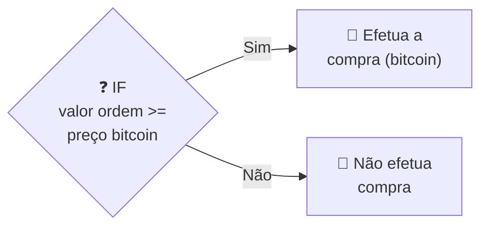
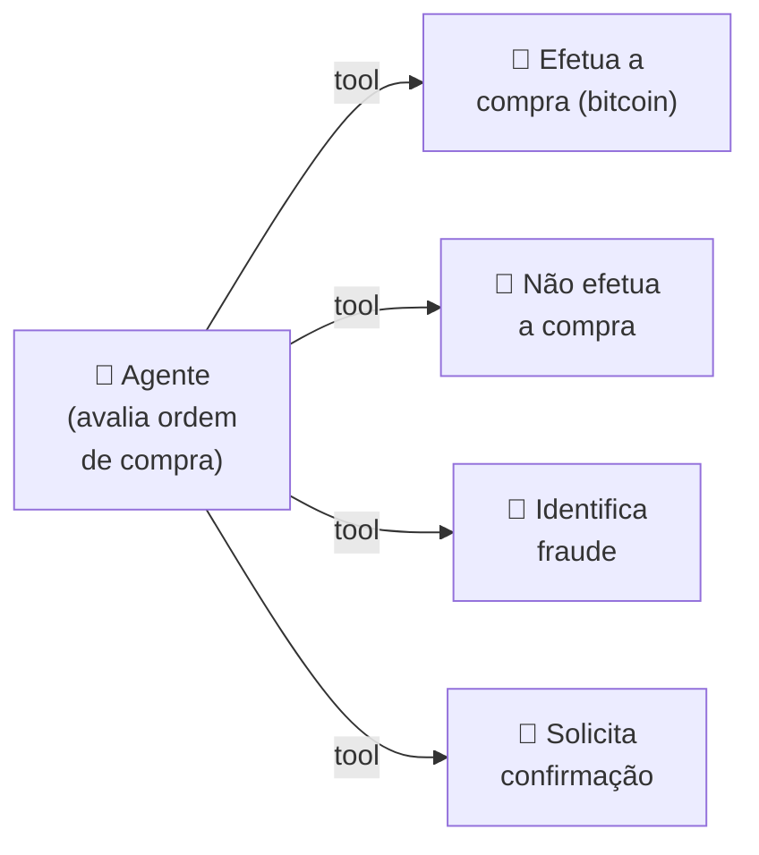
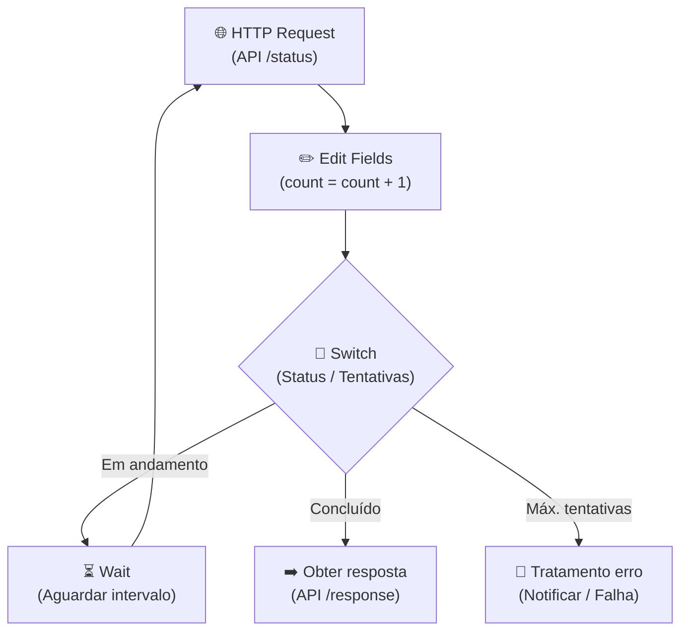

## **Etapa 5:** Integração de Agentes Inteligentes

---
layout: two-cols-header
layoutClass: gap-8
class: flex items-center justify-center
---

# Automação tradicional x automação com IA
#### **Os dois tipos de automação são complementares um ao outro, e não substitutos**

::left::

- A **automação tradicional** baseia-se em **regras determinísticas**, executando instruções **lógicas estáticas** (como `se-então` e rotinas imperativas de código).
- A **automação com agentes de IA** introduz **capacidade cognitiva** e probabilística, permitindo raciocínio flexível, **tomada de decisão** adaptativa, **interpretação de contexto** e uso dinâmico de ferramentas.

::right::

| **Característica** | **Automação Tradicional** | **Agente de IA** |
| --- | :---: | :---: |
| Executa tarefas previsíveis | ✅ | ✅ |
| Responde perguntas | ❌ | ✅ |
| Toma decisões | ❌ | ✅ |
| Interpreta diferentes contextos | ❌ | ✅ |
| Aprende com dados | ❌ | ✅ |

<!--
## notes slides

### Automações tradicionais executam fluxos previsíveis baseados em regras rígidas pré-programadas
### Agentes de IA adicionam autonomia e adaptabilidade ao interpretar contexto e tomar decisões dinâmicas
-->

---
layout: two-cols-header
layoutClass: gap-8
class: flex items-center justify-center
---

# Automação inteligente de regra determinística(1)
#### **As automações tradicionais são boas e baratas em executar regras determinísticas**

::left::

- O fluxo ao lado avalia o limite numérico rígido: `valor ordem compra >= preço atual bitcoin` e executa a tarefa (realizar a compra).
- É uma **regra cega baseada em uma única variável** numérica, uma regra `if-else`.

::right::

  <Transform :scale="1.5" origin="center">

</Transform>

<!--
## notes slides

### Automações tradicionais executam checagens numéricas diretas de forma rápida e determinística
### A limitação desse modelo é ignorar o contexto de mercado ao tomar a decisão de compra
-->

---
layout: two-cols-header
layoutClass: gap-8
class: flex items-center justify-center
---

# Automação inteligente de regra determinística(2)
#### **As automações inteligentes são boas em compreender contexto e tomar decisão**

::left::

- O agente **avalia o contexto** (análise multi-fatorial) com base em dados (histórico do cliente, patrimônio, histórico de fraudes, etc).
- A **linguagem natural é a base das regras**, e não mais o `if-else`, e o agente **toma a decisão de qual ferramenta** (*tool*) acionar.
- Regras determinísticas no n8n podem ser: **Edit Fields (set)**, **Code**, **HTTP Request**, etc.

::right::

  <Transform :scale="1.1" origin="center">

</Transform>

<!--
## notes slides

### muito importante enfatizar os tipos de nós que podem ser substituídos por agentes (Code, HTTP, Edit Fields)
### O agente utiliza raciocínio probabilístico e contexto para escolher dinamicamente qual ferramenta (tool) executar
### Elimina a rigidez das estruturas if-else tradicionais permitindo ramificações flexíveis baseadas em intenção e dados
-->

---
layout: two-cols-header
layoutClass: gap-8
class: flex items-center justify-center
---

# Automação inteligente de agent python (parte 1)
#### **As automações tradicionais pode reutilizar agentes expostos em API REST**

::left::

- A depender de como o agente foi exposto e projetado via API REST, **pode ser mais complexo invocá-lo a partir de um fluxo de automação**.
- Se o agente exposto via API REST for projetado para invocá-lo **com polling, a complexidade pode ser ainda maior**.

::right::

  <Transform :scale="1.3" origin="center">

</Transform>

<!--
## notes slides

### Invocação de agentes externos via polling exige construção de infraestrutura de controle de estado no fluxo n8n
### O padrão com retentativas, contagem de loops e checagem de status aumenta a complexidade de manutenção do workflow
-->

---
layout: two-cols-header
layoutClass: gap-8
class: flex items-center justify-center
sourceLabel: AI Agent node
source: https://docs.n8n.io/integrations/builtin/cluster-nodes/root-nodes/n8n-nodes-langchain.agent/
---

# Automação inteligente de agent python (parte 2)
#### **O n8n disponibiliza o Agent Node (action node) para fluxos agênticos**

::left::

- O nó **AI Agent** permite integrar agentes inteligentes diretamente no canvas do n8n, orquestrando modelos de linguagem (LLMs), memórias e ferramentas (*tools*).
- **Elimina a necessidade de infraestruturas complexas de polling HTTP**, executando a lógica agêntica de forma nativa e integrada à automação.

::right::

  <N8nNode
    icon-src="n8n/nodes/ai-agent.svg"
    label="AI Agent"
    type="action"
    scale="1.4"
  />

<!--
## notes slides

### O nó AI Agent encapsula a complexidade do ciclo de execução agêntica diretamente na interface visual do n8n
### Permite acoplar sub-nós de modelo (LLM), memória e ferramentas de forma modular sem código externo adicional
-->

---
layout: default
---

# Níveis de Complexidade de Agentes de IA
#### **Há muitas propostas de taxonomia de nível de agentes, embora nenhuma consolidada**

| **Nível** | **Categoria** | **Descrição** |
| :---: | --- | --- |
| **Nível 1** | Agentes com Instruções | Executam tarefas simples baseadas em prompts e regras contextuais predefinidas (zero-shot/few-shot). |
| **Nível 2** | Agentes com Saída Determinística | Garantem previsibilidade com saídas estruturadas (ex.: JSON/Pydantic) e validação de schema. |
| **Nível 3** | Agentes com Memória | Mantêm contexto de conversas passadas e estados intermediários entre interações (memória de curto/longo prazo). |
| **Nível 4** | Agentes com Ferramentas | Expandem a capacidade de ação interagindo com APIs, bancos de dados, funções e sistemas externos (*tool calling*). |
| **Nível 5** | Agentes com Conhecimento Externo | Consultam fontes dinâmicas de dados privados ou corporativos via RAG e bases vetoriais. |
| **Nível 6** | Agentes em Colaboração (Multiagentes) | Orquestram múltiplos agentes especializados com divisão de papéis, *handoff*, consenso e workflows complexos. |

> [!NOTE]
> Atualmente não há um modelo de taxonomia de níveis de complexidade de agentes consolidado ou amplamente adotado. A tabela acima apresenta uma taxonomia de níveis de complexidade de agentes baseada na ementa deste curso, usando termos bem compreendidos na indústria.

<!--
## notes slides

### A taxonomia apresentada organiza a evolução progressiva de complexidade em sistemas agênticos
### Vai desde agentes básicos orientados a prompt até ecossistemas colaborativos multiagentes orquestrados
-->

