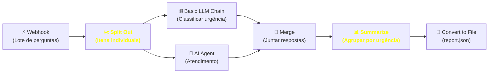
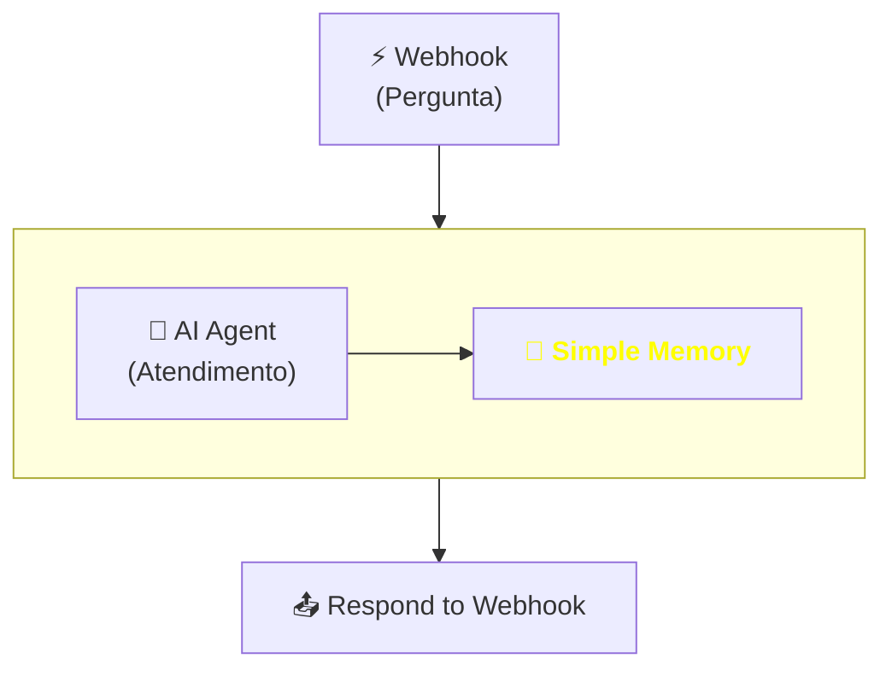
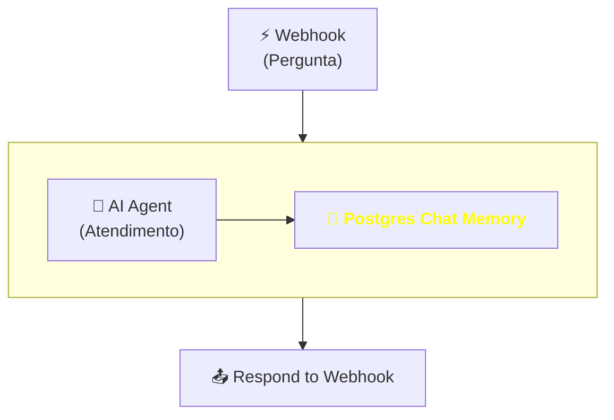

## **Etapa 6:** Gestão Avançada de Agentes

---
layout: default
---

# Codificação assistida por IA - Live coding (1)
#### **Workflow de secretaria acadêmica com processamento em lote**

<div class="h-[calc(100%-80px)] flex flex-col justify-between">

<div class="flex-1 flex items-center justify-center">

<Transform :scale="3" origin="center">



</Transform>

</div>
  
</div>

<!--
## notes slides

### O workflow processa lotes de perguntas via Webhook, dividindo os itens para processamento individual com classificação de urgência (Basic LLM Chain) e consulta agêntica (AI Agent)
### Ao final, as respostas são consolidadas, agrupadas por urgência (Aggregate) e salvas em formato JSON no sistema de arquivos local
-->

---
layout: default
layoutClass: gap-8
---

# Codificação assistida por IA - Live coding (2)
#### **Workflow de secretaria acadêmica com processamento em lote**

<div class="h-7" />

<WindowMockup color="dark" padding="0.5rem 0.5rem 0.5rem 0.5rem" title="prompt.md" codeblock>

```md {*}{maxHeight:'290px'}
# Papel
Você é um engenheiro de automação especialista em n8n e construção de workflows agênticos.

# Tarefa
Crie um workflow no n8n-infnet para atendimento de secretaria acadêmica:
- Workflow: Recebe um lote de perguntas de alunos sobre seus requerimentos, faz split do lote em itens individuais, ramifica na classifica da urgencia e no agente que responde cada pergunta, mergeia todas as duas ramificações, agrega por urgencia e gera um JSON final com as respostas agregadas.

# Contexto
## 1. Tabela de Dados (`requerimentos`)
- Crie/simule a Data Table `requerimentos` com 5 registros (REQ-XXX, nome, tipo, status, data).

## 2. Detalhamento workflow
1. Nó Webhook que receber um lote de perguntas de alunos
2. Nó Split que divide o lote com várias perguntas em itens individuais (destination field name -> pergunta), com opção Include marcada como `No Other Fields`
3. O Split anterior deve bifurcar em duas ramificações para os nós 4 e 5 abaixo:
4. Nó Basic LLM Chain para classificar a urgência de cada pergunta em 'alta', 'média' ou 'baixa'.
4.1 O nó Basic LLM Chain deve estar conectado a um sub-nó Output Strutured Parser com a opção Schema Type `Define using JSON Schema` com JSON schema com um atributo de urgencia e requerimento_id
5. Nó AI Agent e Data Table Tool para consultar o status do requerimento e reponder pergunta do aluno
5.1 O nó AI Agent deve estar conectado a um sub-nó Output Strutured Parser com a opção Schema Type `Define using JSON Schema` com JSON schema com um atributo de pergunta, resposta e requerimento_id
6. Nó Merge que mergeia as duas ramificações com a opção de Combine através do campo `requerimento_id`
7. Nó Summarize para agrupar pela urgência, acrescentando na saída o restante dos campos recebidos na entrada.
8. Nó Convert to File e Read/Write JSON para gerar arquivo JSON agrupado em: `/home/node/.n8n-files/report.json`

## 3. Mais detalhamento do workflow
1. AI Agent (System Message configurado como assistente de secretaria acadêmica).
2. Crie um stick note com a pendencia de criar uma Credential OpenAI com base url (http://localhost:20128/v1) e API KEY
3. Subnó OpenAI Chat Model com `responsesApiEnabled` igual a false
4. Subnó Data Table Tool (`requerimentos`) com condição de filtro usando a coluna `requerimento_id` via `$fromAI()`

## 4. Exemplo de Teste via cURL
- Crie um stick note com o comando cURL para o webhook com um lote de três perguntas de alunos sobre seus requerimentos.

# Regras de Expressões e Boas Práticas
- Sempre use aspas simples (') ao referenciar nomes de nós em expressões n8n.
```
</WindowMockup>

<!--
## notes slides

### O prompt orienta a criação completa da solução em dois workflows modulares no n8n (principal e subworkflow de atendimento)
### Define a estrutura da Data Table Requerimentos com 5 registros, parâmetros do LLM local, filtro dinâmico $fromAI() e teste via cURL
-->

---
layout: two-cols-header
layoutClass: gap-8
class: flex items-center justify-center
sourceLabel: Split Out
source: https://docs.n8n.io/integrations/builtin/core-nodes/n8n-nodes-base.splitout
---

# Split Out (action node)
#### **O nó Split Out desmembra um array de itens em múltiplos itens individuais no fluxo**

<div class="h-5" />

::left::

<div class="text-sx w-full self-start [&_ul]:my-5 [&_li]:mb-6">

- Transforma um **campo que contém uma lista (array)** dentro de um único item em **múltiplos itens individuais** no n8n.
- Permite que cada elemento da lista seja **processado individualmente** pelos nós subsequentes no workflow (ex: envio de e-mails ou chamadas a LLMs em lote).

</div>

::right::

<div class="flex items-center justify-center h-full">
  <N8nNode
    icon-src="n8n/nodes/split-out.svg"
    label="Split Out"
    type="action"
    scale="1.4"
  />
</div>

<!--
## notes slides

### O nó Split Out extrai arrays e desmembra seus elementos em execuções individuais de itens no fluxo do n8n
### É fundamental para iteração e processamento em lote (batch processing) de listas recebidas via Webhook ou APIs
-->

---
layout: two-cols-header
layoutClass: gap-8
sourceLabel: Split Out
source: https://docs.n8n.io/integrations/builtin/core-nodes/n8n-nodes-base.splitout
---

# Split Out (action node): desmembrar array
#### **O nó Split Out transforma uma lista contida em um campo em itens separados**

<div class="h-2" />

::left::

<div class="space-y-2">

<WindowMockup color="dark" padding="0.3rem 0.5rem 0.3rem 0.5rem" title="entrada: 1 item (com array)" codeblock>

```json {*}{maxHeight:'260px'}
[
  {
    "lote_id": "LOTE-101",
    "perguntas": [
      { "aluno": "Maria", 
        "duvida": "Qual o prazo do REQ-001?" 
      },
      { "aluno": "João", 
        "duvida": "Como trancar a matrícula?" 
      }
    ]
  }
]
```

</WindowMockup>

</div>

::right::

<WindowMockup color="dark" padding="0.5rem 0.5rem 0.5rem 0.5rem" title="saída: 2 itens (desmembrados)" codeblock>

```json {*}{maxHeight:'260px'}
[
  {
    "aluno": "Maria",
    "duvida": "Qual o prazo do REQ-001?"
  },
  {
    "aluno": "João",
    "duvida": "Como trancar a matrícula?"
  }
]
```

</WindowMockup>

<!--
## notes slides

### O nó Split Out pega o array presente no campo selecionado (ex: perguntas) e emite cada elemento como um item distinto no n8n
### Facilita o processamento independente de cada elemento pelos nós seguintes no fluxo
-->

---
layout: two-cols-header
layoutClass: gap-8
class: flex items-center justify-center
sourceLabel: Summarize
source: https://docs.n8n.io/integrations/builtin/core-nodes/n8n-nodes-base.summarize
---

# Summarize (action node)
#### **O nó Summarize permite realizar agregações, cálculos e agrupamento de dados**

<div class="h-5" />

::left::

<div class="text-sx w-full self-start [&_ul]:my-5 [&_li]:mb-6">

- Agrupa múltiplos itens de entrada e executa **operações de agregação** (como contar, somar, calcular média, obter min/max ou concatenar textos).
- Permite **agrupar por campos específicos** (ex: por status ou categoria) para consolidar e resumir grandes volumes de dados antes da persistência.

</div>

::right::

<div class="flex items-center justify-center h-full">
  <N8nNode
    icon-src="n8n/nodes/summarize.svg"
    label="Summarize"
    type="action"
    scale="1.4"
  />
</div>

<!--
## notes slides

### O nó Summarize agrega conjuntos de dados executando operações estatísticas ou consolidações por grupos no n8n
### Substitui nós de código complexos quando o objetivo é agrupar e sumarizar informações do fluxo
-->

---
layout: two-cols-header
layoutClass: gap-8
sourceLabel: Summarize
source: https://docs.n8n.io/integrations/builtin/core-nodes/n8n-nodes-base.summarize
---

# Summarize (action node): agrupar e contar
#### **O nó Summarize consolida múltiplos itens em resumos estatísticos ou agrupados**

<div class="h-2" />

::left::

<div class="space-y-2">

<WindowMockup color="dark" padding="0.3rem 0.5rem 0.3rem 0.5rem" title="entrada: 3 itens de atendimento" codeblock>

```json {*}{maxHeight:'260px'}
[
  { "aluno": "Maria", 
    "urgencia": "alta" 
  },
  { "aluno": "João", 
    "urgencia": "alta" 
  },
  { "aluno": "Ana", 
    "urgencia": "baixa" 
  }
]
```

</WindowMockup>

</div>

::right::

<WindowMockup color="dark" padding="0.5rem 0.5rem 0.5rem 0.5rem" title="saída: 2 itens agrupados" codeblock>

```json {*}{maxHeight:'260px'}
[
  {
    "urgencia": "alta",
    "total": 2,
    "appended_output": ["Maria", "João"]
  },
  {
    "urgencia": "baixa",
    "total": 1,
    "appended_output": ["Ana"]
  }
]
```

</WindowMockup>

<!--
## notes slides

### O nó Summarize recebe múltiplos itens e gera relatórios consolidados (ex: contagem de atendimentos agrupados por nível de urgência)
### Facilita a geração de métricas e relatórios agregados no final de fluxos de lote
-->


---
layout: two-cols-header
layoutClass: gap-8
---

# Codificação assistida por IA - Live coding (1)
#### **Workflow de secretaria acadêmica com chat multi-turno e memória**

<div class="h-5" />

::left::

<div class="space-y-5">

<WindowMockup color="dark" padding="0.3rem 0.5rem 0.3rem 0.5rem" title="histórico de mensagens (Simple Memory)" codeblock>

```json {*}{maxHeight:'260px'}
[
  {
    "role": "system",
    "content": "Você é um assistente útil."
  },
  {
    "role": "user",
    "content": "Qual o status do meu requerimento?"
  },
  {
    "role": "assistant",
    "content": "Qual o id do requerimento?"
  },
  {
    "role": "user",
    "content": "O id do requerimento é REQ-001."
  },
  {
    "role": "assistant",
    "content": "Está em andamento."
  },
  {
    "role": "user",
    "content": "E a previsão de solução?"
  },
  {
    "role": "assistant",
    "content": "A previsão é daqui a 5 dias."
  }
]
```

</WindowMockup>

</div>

::right::

<div class="flex-1 flex items-center justify-center">

<Transform :scale="1.05" origin="center">



</Transform>

</div>
  

<!--
## notes slides

### O workflow processa lotes de perguntas via Webhook, dividindo os itens para processamento individual com classificação de urgência (Basic LLM Chain) e consulta agêntica (AI Agent)
### Ao final, as respostas são consolidadas, agrupadas por urgência (Aggregate) e salvas em formato JSON no sistema de arquivos local
-->

---
layout: default
layoutClass: gap-8
---

# Codificação assistida por IA - Live coding (2)
#### **Workflow de secretaria acadêmica com processamento em lote**

<div class="h-7" />

<WindowMockup color="dark" padding="0.5rem 0.5rem 0.5rem 0.5rem" title="prompt.md" codeblock>

```md {*}{maxHeight:'290px'}
# Papel
Você é um engenheiro de automação especialista em n8n e construção de workflows agênticos.

# Tarefa
Crie um workflow no n8n-infnet para atendimento de secretaria acadêmica:
- Workflow: Recebe uma pergunta de aluno sobre seus requerimentos, invoca agente que responde a pergunta e retorna com resposta no webhook.

# Contexto
## 1. Tabela de Dados (`requerimentos`)
- Crie/simule a Data Table `requerimentos` com 5 registros (REQ-XXX, nome, tipo, status, data_previsao).

## 2. Detalhamento workflow
1. Nó Webhook que recebe uma pergunta do aluno
2. Nó AI Agent e Data Table Tool para consultar o status do requerimento e reponder pergunta do aluno
2.1 Nó AI Agent deve estar conectado a um sub-nó Simple Memory
3. Nó Respond to Webhook que devolve resposta ao aluno

## 3. Mais detalhamento do workflow
1. AI Agent (System Message configurado como assistente de secretaria acadêmica).
2. Crie um stick note com a pendencia de criar uma Credential OpenAI com base url (http://localhost:20128/v1) e API KEY
3. Subnó OpenAI Chat Model com `responsesApiEnabled` igual a false
4. Subnó Data Table Tool (`requerimentos`) com condição de filtro usando a coluna `requerimento_id` via `$fromAI()`

## 4. Exemplo de Teste via cURL
- Crie um stick note com três comandos cURL para o webhook do mesmo aluno, onde cada comando deve ter as seguintes perguntas:
1. Qual o status do meu requerimento?
2. O id do meu requerimento é REQ-001
3. E qual é a data de previsão

# Regras de Expressões e Boas Práticas
- Sempre use aspas simples (') ao referenciar nomes de nós em expressões n8n.
```
</WindowMockup>

<!--
## notes slides

### O prompt orienta a criação completa da solução em dois workflows modulares no n8n (principal e subworkflow de atendimento)
### Define a estrutura da Data Table Requerimentos com 5 registros, parâmetros do LLM local, filtro dinâmico $fromAI() e teste via cURL
-->


---
layout: two-cols-header
layoutClass: gap-8
class: flex items-center justify-center
sourceLabel: Simple Memory
source: https://docs.n8n.io/integrations/builtin/cluster-nodes/sub-nodes/n8n-nodes-langchain.memorybufferwindow
---

# Simple Memory (sub-node)
#### **Por padrão, um agente de IA do n8n é stateless, não armazena histórico de mensagens**

<div class="h-5" />

::left::

<div class="text-lg w-full self-start [&_ul]:my-5 [&_li]:mb-6">

- Armazena e gerencia o **histórico de mensagens (chat history)** na memória do servidor n8n.
- A memória do servidor pode acumular com muitas mensagens e não ser escalável.

</div>

::right::

<div class="flex items-center justify-center h-full">
  <N8nNode
    icon-src="n8n/nodes/simple-memory.svg"
    label="Simple Memory"
    type="action"
    scale="1.4"
  />
</div>

<!--
## notes slides

### O sub-nó Simple Memory permite armazenar e recuperar o histórico recente de mensagens de chat no n8n
### É essencial para manter o contexto em conversas multi-turno com o AI Agent
-->


---
layout: two-cols-header
layoutClass: gap-8
---

# Codificação assistida por IA - Live coding (1)
#### **Workflow de secretaria acadêmica com memória persistente**

<div class="h-5" />

::left::

<div class="space-y-5">

<WindowMockup color="dark" padding="0.3rem 0.5rem 0.3rem 0.5rem" title="Comando para criar database" codeblock>

```bash {*}{maxHeight:'260px'}
docker run -d \
  --name postgres \
  --restart always \
  -p 5432:5432 \
  -e POSTGRES_USER=postgres \
  -e POSTGRES_PASSWORD=senha123 \
  -e POSTGRES_DB=postgres \
  postgres:16-alpine

```

</WindowMockup>

</div>

::right::

<div class="flex-1 flex items-center justify-center">

<Transform :scale="1.05" origin="center">



</Transform>

</div>
  

<!--
## notes slides

-->

---
layout: default
layoutClass: gap-8
---

# Codificação assistida por IA - Live coding (2)
#### **Workflow de secretaria acadêmica com memória persistente**

<div class="h-7" />

<WindowMockup color="dark" padding="0.5rem 0.5rem 0.5rem 0.5rem" title="prompt.md" codeblock>

```md {*}{maxHeight:'290px'}
# Papel
Você é um engenheiro de automação especialista em n8n e construção de workflows agênticos.

# Tarefa
Crie um workflow no n8n-infnet para atendimento de secretaria acadêmica:
- Workflow: Recebe uma pergunta de aluno sobre seus requerimentos, invoca agente que responde a pergunta e retorna com resposta no webhook.

# Contexto
## 1. Tabela de Dados (`requerimentos`)
- Crie/simule a Data Table `requerimentos` com 5 registros (REQ-XXX, nome, tipo, status, data_previsao).

## 2. Detalhamento workflow
1. Nó Webhook que recebe uma pergunta do aluno
2. Nó AI Agent e Data Table Tool para consultar o status do requerimento e reponder pergunta do aluno
2.1 Nó AI Agent deve estar conectado a um sub-nó Postgres Chat Memory
3. Nó Respond to Webhook que devolve resposta ao aluno

## 3. Mais detalhamento do workflow
1. AI Agent (System Message configurado como assistente de secretaria acadêmica).
2. Crie um stick note com a pendencia de criar uma Credential OpenAI com base url (http://localhost:20128/v1) e API KEY
3. Crie um stick note com a pendencia de configurar uma credencial para o servidor do postgres (server: postgres, user: postgres, e pwd)
4. Subnó OpenAI Chat Model com `responsesApiEnabled` igual a false
5. Subnó Data Table Tool (`requerimentos`) com condição de filtro usando a coluna `requerimento_id` via `$fromAI()`

## 4. Exemplo de Teste via cURL
- Crie um stick note com três comandos cURL para o webhook do mesmo aluno, onde cada comando deve ter as seguintes perguntas:
1. Qual o status do meu requerimento?
2. O id do meu requerimento é REQ-001
3. E qual é a data de previsão

# Regras de Expressões e Boas Práticas
- Sempre use aspas simples (') ao referenciar nomes de nós em expressões n8n.
```
</WindowMockup>

<!--
## notes slides

-->

---
layout: two-cols-header
layoutClass: gap-8
class: flex items-center justify-center
sourceLabel: Postgres Chat Memory
source: https://docs.n8n.io/integrations/builtin/cluster-nodes/sub-nodes/n8n-nodes-langchain.memorypostgreschat
---

# Postgres Chat Memory (sub-node)
#### **Para cenários escaláveis, armazene o histórico de mensagens em um database**

<div class="h-1" />

::left::

<div class="text-lg w-full self-start [&_ul]:my-5 [&_li]:mb-6">

- Persiste o **histórico de mensagens (chat history)** de forma durável e escalável em uma tabela do PostgreSQL.
- Permite manter sessões conversacionais longas e reutilizáveis entre **reinicializações do servidor n8n** e **cenários escaláveis** envolvendo balanceamento de múltiplos servidores com o mesmo fluxo.

</div>

::right::

<div class="flex items-center justify-center h-full">
  <N8nNode
    icon-src="n8n/nodes/simple-memory.svg"
    label="Postgres Chat Memory"
    type="action"
    scale="1.4"
  />
</div>

<!--
## notes slides

### O sub-nó Postgres Chat Memory armazena e recupera o histórico de conversas diretamente no PostgreSQL
### Garante persistência durável, isolamento por sessão de usuário e alta escalabilidade para aplicações em produção
-->


---
layout: default
---

# Hands-on

<br/>

🛠️ &nbsp;**Exercício \#1:** Crie um workflow que recebe em lote e faz split out.

🛠️ &nbsp;**Exercício \#2:** Crie um workflow que gera relatório com summarize e count.

🛠️ &nbsp;**Exercício \#3:** Crie um workflow com memória de curto prazo.

🛠️ &nbsp;**Exercício \#4:** Crie um workflow com memória de longo prazo.

<br/>

- [ ] &nbsp;processamento em lote com nó Split Out
- [ ] &nbsp;geração de relatórios/sumarização com nó Summarize
- [ ] &nbsp;gestão de contexto conversacional com nó Simple Memory
- [ ] &nbsp;persistência de histórico em banco de dados com nó Postgres Chat Memory

<br/>

<!--
# Exercício #1 — Processamento em lote com Split Out
Crie um workflow no n8n que recebe uma lista de dados em lote e utiliza o nó Split Out (ou Split In Batches) para separar e processar cada item individualmente.

# Exercício #2 — Relatório com Summarize e Count
Construa um workflow que agregue dados de entrada utilizando o nó Summarize para contar e agrupar registros, gerando um relatório consolidado.

# Exercício #3 — Memória de curto prazo com Simple Memory
Crie um workflow agêntico no n8n conectando o sub-nó Simple Memory (Window Buffer) ao nó AI Agent para manter o contexto das últimas mensagens da conversa.

# Exercício #4 — Memória de longo prazo com Postgres Chat Memory
Construa um workflow agêntico no n8n utilizando o sub-nó Postgres Chat Memory conectado ao AI Agent para persistir o histórico de conversas em um banco de dados PostgreSQL.
-->
