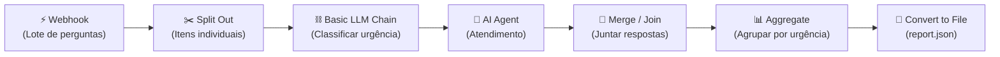

## **Etapa 6:** Gestão Avançada de Agentes

---
layout: default
---

# Codificação assistida por IA - Live coding (1)
#### **Workflow de secretaria acadêmica com processamento em lote**

<div class="h-[calc(100%-80px)] flex flex-col justify-between">

<div class="flex-1 flex items-center justify-center">

<Transform :scale="3" origin="center">



</Transform>

</div>
  
</div>

<!--
## notes slides

### O workflow processa lotes de perguntas via Webhook, dividindo os itens para processamento individual com classificação de urgência (Basic LLM Chain) e consulta agêntica (AI Agent)
### Ao final, as respostas são consolidadas, agrupadas por urgência (Aggregate) e salvas em formato JSON no sistema de arquivos local
-->

---
layout: default
layoutClass: gap-8
---

# Codificação assistida por IA - Live coding (2)
#### **Workflow de secretaria acadêmica com processamento em lote**

<div class="h-7" />

<WindowMockup color="dark" padding="0.5rem 0.5rem 0.5rem 0.5rem" title="prompt.md" codeblock>

```md {*}{maxHeight:'290px'}
# Papel
Você é um engenheiro de automação especialista em n8n e construção de workflows agênticos.

# Tarefa
Crie um workflow no n8n-infnet para atendimento de secretaria acadêmica:
- Workflow: Recebe um lote de perguntas de alunos sobre seus requerimentos, faz split do lote em itens individuais, classifica a urgencia e responde cada pergunta, junta todas as respostas, e agrupa por urgencia e gera um JSON final com as respostas agregadas

# Contexto
## 1. Tabela de Dados (`requerimentos`)
- Crie/simule a Data Table `requerimentos` com 5 registros (REQ-XXX, nome, tipo, status, data):

## 2. Detalhamento workflow
1. Nó Webhook que receber um lote de perguntas de alunos
2. Nó Split da mensagem em itens individuais (com apenas uma única pergunta)
3. Nó Basic LLM Chain para classificar a urgência de cada pergunta em 'alta', 'média' ou 'baixa'.
4. Sub-nó Output Strutured Parser com a opção Schema Type `Define using JSON Schema` com JSON schema com um atributo de classificação
4. Nó AI Agent e Data Table Tool para consultar o status do requerimento e reponder pergunta do aluno
5. Nó Join para juntar todas as perguntas
6. Nó Aggregate para agrupar mensagens por urgência
7. Nó Convert to File e Read/Write JSON para gerar arquivo JSON agrupado em: `/home/node/.n8n-files/report.json`

## 3. Mais detalhamento do workflow
1. AI Agent (System Message configurado como assistente de secretaria acadêmica).
2. Crie um stick note com a pendencia de criar uma Credential OpenAI com base url (http://localhost:20128/v1) e API KEY
3. Subnó OpenAI Chat Model com `responsesApiEnabled` igual a false
4. Subnó Data Table Tool (`requerimentos`) com condição de filtro usando a coluna `requerimento_id` via `$fromAI()`

## 4. Exemplo de Teste via cURL
- Crie um stick note com o comando cURL para o webhook com um lote de três perguntas de alunos sobre seus requerimentos.

# Regras de Expressões e Boas Práticas
- Sempre use aspas simples (') ao referenciar nomes de nós em expressões n8n.
```
</WindowMockup>

<!--
## notes slides

### O prompt orienta a criação completa da solução em dois workflows modulares no n8n (principal e subworkflow de atendimento)
### Define a estrutura da Data Table Requerimentos com 5 registros, parâmetros do LLM local, filtro dinâmico $fromAI() e teste via cURL
-->