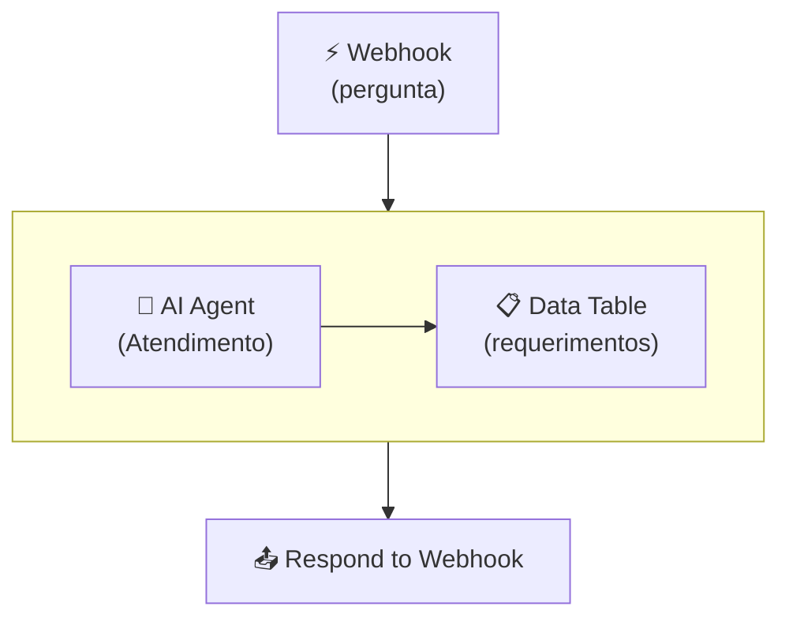
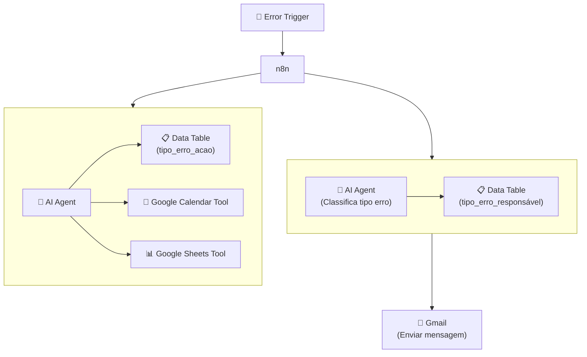

## **Etapa 7:** Gerenciamento de Erros e Integração

---
layout: default
---

# Codificação assistida por IA - Live coding (1)
#### **Workflow de secretaria acadêmica com tratamento de erro avançado**

<div class="w-full h-[calc(100%-80px)] grid grid-cols-2 items-center justify-items-center gap-8">

<div class="w-full flex items-left">

<Transform :scale="0.9" origin="center">



</Transform>

</div>

<div class="w-full flex items-left">

<Transform :scale="1.7" origin="center">



</Transform>

</div>

</div>

<!--
## notes slides

### O workflow processa perguntas via Webhook com consulta agêntica (AI Agent)
### Ao final, a resposta é devolvida ao aluno via nó Respond to Webhook
-->

---
layout: default
layoutClass: gap-8
---

# Codificação assistida por IA - Live coding (2)
#### **Workflow de secretaria acadêmica com tratamento de erro avançado**

<div class="h-7" />

<WindowMockup color="dark" padding="0.5rem 0.5rem 0.5rem 0.5rem" title="prompt.md" codeblock>

```md {*}{maxHeight:'290px'}
# Papel
Você é um engenheiro de automação especialista em n8n, construção de workflows agênticos e gestão avançada de erros.

# Tarefa
Crie dois workflows no n8n para atendimento de secretaria acadêmica com tratamento de erro avançado:
1. **Workflow Principal (Atendimento):** Recebe uma pergunta de aluno via Webhook, processa via AI Agent conectado à Data Table `requerimentos` e responde de volta via Respond to Webhook.
2. **Workflow de Tratamento de Erro (Error Handling):** Acionado por um nó Error Trigger para tratar falhas no workflow principal, dividindo em duas ramificações paralela:
   - **Ramificação 1 (Classificação e Notificação):** AI Agent classifica o tipo de erro, consulta a Data Table `tipo_erro_responsável` e notifica o responsável via Gmail.
   - **Ramificação 2 (Ação Corretiva Agêntica):** AI Agent consulta a Data Table `tipo_erro_acao` e executa ações de correção via ferramentas (Google Calendar Tool e Google Sheets Tool).

# Contexto
## 1. Tabelas de Dados (`Data Tables`)
- `requerimentos`: Armazena os requerimentos dos alunos (REQ-XXX, nome, tipo, status, data).
- `tipo_erro_responsável`: Mapeia os tipos de erro e os e-mails/responsáveis por cada categoria.
- `tipo_erro_acao`: Mapeia os tipos de erro e as ações automatizadas a serem executadas.

## 2. Detalhamento dos Workflows

### Workflow 1: Atendimento Principal
1. Nó Webhook para receber a pergunta do aluno.
2. Subgráfico com nó AI Agent (Atendimento) conectado à Data Table Tool (`requerimentos`).
3. Nó Respond to Webhook para devolver a resposta gerada ao aluno.

### Workflow 2: Error Handling (Tratamento de Erro)
1. Nó Error Trigger escutando falhas do Workflow Principal (recebe mensagem de erro, id do workflow e data)
2. Nó n8n que obtem dados do workflow via API REST do n8n com base no id do workflow recebido do Erro Trigger. Esse nó deve ramificar em duas ramificações:
3. **Ramificação 1:**
   - AI Agent (Classifica tipo erro).
   - Data Table Tool (`tipo_erro_responsável`).
   - Nó Gmail (Enviar mensagem para o responsável).
4. **Ramificação 2:**
   - Subgráfico contendo AI Agent de resolução.
   - Data Table Tool (`tipo_erro_acao`).
   - Ferramentas `Google Calendar Tool` e `Google Sheets Tool`.

## 3. Mais detalhamento do workflow
1. Configure as System Messages dos AI Agents com seus papéis específicos.
2. Simule dados na tabela `requerimentos`.
3. Simule dados nas tabelas `tipo_erro_responsável` e `tipo_erro_acao` considerando os tipos de erro: `falha_conexao` e `fonte_inexistente`.
4. Adicione um Stick Note para explicar os dois tipos de erro que podem ser configurados propositalmente: `falha_conexao` (API KEY errada) e `fonte_inexistente` (ID da tabela errado).
5. Adicione Stick Notes explicativos com instruções de teste e configuração das credenciais e Error Trigger.

# Regras de Expressões e Boas Práticas
- Sempre use aspas simples (') ao referenciar nomes de nós em expressões n8n.
```
</WindowMockup>

<!--
## notes slides

### O prompt orienta a criação completa da solução em dois workflows no n8n: Atendimento Principal e Tratamento de Erros
### Detalha o uso de AI Agents, Data Tables específicas (requerimentos, tipo_erro_responsável, tipo_erro_acao) e ferramentas de integração (Gmail, Calendar, Sheets)
-->

---
layout: default
sourceLabel: Error Handling
source: https://docs.n8n.io/flow-logic/error-handling/
---

# Tool node (sub-nodes)
#### **O n8n oferece dezenas de nós do tipo Tool (sub-node) para realizar uma ação**

<div class="h-2" />

<div class="[&_table]:w-full text-sm">

| **Nó / Recurso** | **Descrição** |
| --- | --- |
| **Gmail (Node / Tool)** | Envia alertas e relatórios formatados de incidentes por e-mail para as equipes responsáveis |
| **Google Calendar Tool** | Executa ações agênticas de reparo, como o agendamento de reuniões/eventos de manutenção técnica |
| **Google Sheets Tool** | Registra logs de auditoria e inconsistências em planilhas para análise de causa raiz |

</div>

<!--
## notes slides

### O n8n integra gatilhos de erro, API de gerenciamento e ferramentas de comunicação e ação para remediação autônoma
### As estratégias abrangem desde a notificação automatizada de incidentes até a execução agêntica de ações corretivas
-->

---
layout: two-cols-header
layoutClass: gap-8
class: flex items-center justify-center
sourceLabel: Google OAuth2
source: https://docs.n8n.io/integrations/builtin/credentials/google/
---

# Google Tool Node (sub-node)
#### **Os nós de action/tool do google exigem algumas configurações externas**

<div class="h-5" />

::left::

<div class="text-sx w-full self-start [&_ul]:my-5 [&_li]:mb-6">

- Exigem a criação de uma aplicação no **Google Cloud Console** para obtenção das credenciais OAuth2 (**Client ID** e **Client Secret**).
- Requerem a habilitação da API desejada (ex: Gmail API) e a configuração dos **OAuth Scopes** e URLs de redirecionamento no n8n.

</div>

::right::

<div class="flex items-center justify-center h-full">
  <N8nNode
    icon-src="n8n/nodes/gmail.svg"
    label="Gmail Tool"
    type="action"
    scale="1.4"
  />
</div>

<!--
## notes slides

### Os nós e ferramentas do Google exigem autenticação OAuth2 configurada externamente via Google Cloud Console
### É necessário registrar um projeto, gerar o Client ID e Client Secret e configurar os escopos de permissão corretos
-->

---
layout: two-cols-header
layoutClass: gap-8
class: flex items-center justify-center
sourceLabel: n8n Node
source: https://docs.n8n.io/integrations/builtin/core-nodes/n8n-nodes-base.n8n/
---

# n8n (action node)
#### **O nó n8n permite usar a API REST do servidor n8n para consultar e gerenciar workflows**

<div class="h-5" />

::left::

<div class="text-sx w-full self-start [&_ul]:my-5 [&_li]:mb-6">

- Permite realizar operações automatizadas na **API REST pública do n8n**, como listar/ativar workflows, buscar dados de execuções e gerenciar audit logs.
- É essencial na **gestão de erros e governança**, permitindo que workflows de observabilidade e AI Agents recuperem informações completas de falhas.

</div>

::right::

<div class="flex items-center justify-center h-full">
  <N8nNode
    icon-src="n8n/nodes/n8n.svg"
    label="n8n"
    type="action"
    scale="1.4"
  />
</div>

<!--
## notes slides

### O nó n8n conecta o fluxo de trabalho à API REST da própria instância do n8n para automação de tarefas administrativas
### É amplamente utilizado no tratamento de erros para consultar detalhes de execuções com falhas e automatizar rotinas de governança
-->

---
layout: default
---

# Hands-on

<br/>

🛠️ &nbsp;**Exercício \#1:** Crie um workflow de erro que usa o nó n8n para obter detalhes do workflow.

🛠️ &nbsp;**Exercício \#2:** Altere o workflow para notificar pessoas no Telegram pelo tipo do erro.

🛠️ &nbsp;**Exercício \#3:** Altere o workflow para tomar ações distintas de acordo com o tipo de erro.

🛠️ &nbsp;**Exercício \#4:** Altere o workflow para usar outro tipo de ação diferente dos da Google.

<br/>

- [ ] &nbsp;consulta de detalhes de execução e workflow com nó n8n (action node)
- [ ] &nbsp;notificação de responsáveis por tipo de erro via Telegram
- [ ] &nbsp;decisão e execução de ações corretivas por categoria de falha
- [ ] &nbsp;uso de ferramentas de ação alternativas fora do ecossistema Google

<br/>

<!--
# Exercício #1 — Obter detalhes do workflow com nó n8n
Crie um workflow de erro acionado por um Error Trigger que utiliza o nó n8n (action node) para buscar informações detalhadas do workflow e da execução que falhou.

# Exercício #2 — Notificação no Telegram por tipo de erro
Altere o workflow para classificar o tipo do erro e enviar mensagens de notificação aos responsáveis através do Telegram.

# Exercício #3 — Ações distintas por tipo de erro
Modifique o fluxo para executar estratégias de remediação específicas e tomadas de decisão parametrizadas conforme cada tipo de erro.

# Exercício #4 — Ações corretivas com ferramentas não-Google
Ajuste as ferramentas do AI Agent de correção para utilizar integrações alternativas (ex: Webhooks, Slack, HTTP Request) em vez das ferramentas da Google.
-->


