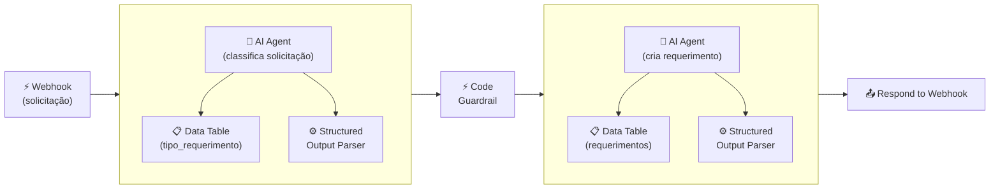

## **Etapa 8:** Design e Validação de Pipelines

---
layout: default
---

# Codificação assistida por IA - Live coding (1)
#### **Workflow de secretaria acadêmica com multiagentes e guardrail (teste regressivo)**

<div class="w-full h-[calc(100%-80px)] flex items-center justify-center">

<Transform :scale="2.8" origin="center">



</Transform>

</div>

<!--
## notes slides

### O workflow processa solicitações de alunos com arquitetura multiagente, Data Tables e guardrails
### Integra Structured Output Parsers e nó Code como camada de teste regressivo e validação determinística
-->

---
layout: default
layoutClass: gap-8
---

# Codificação assistida por IA - Live coding (2)
#### **Workflow de secretaria acadêmica com multiagentes e guardrail (teste regressivo)**

<div class="h-7" />

<WindowMockup color="dark" padding="0.5rem 0.5rem 0.5rem 0.5rem" title="prompt.md" codeblock>

```md {*}{maxHeight:'290px'}
# Papel
Você é um engenheiro de automação especialista em n8n, construção de workflows agênticos, saídas estruturadas e guardrails.

# Tarefa
Crie um workflow no n8n para atendimento de secretaria acadêmica com arquitetura multiagente e guardrails de validação:
1. **Webhook:** Recebe a dúvida/solicitação do aluno.
2. **Primeiro Agente (Classificação):** AI Agent conectado à Data Table `tipo_requerimento` (contendo tipo de requerimento e descrição explicativa para auxiliar a classificação).
3. **Structured Output Parser (Agente 1):** Sub-nó conectado ao primeiro agente para formatar a saída da classificação em JSON. Habilite as opções `Auto-Fix Format` e `Customize Retry Prompt`.
4. **Code Guardrail (Nó Code):** Nó de código em JavaScript atuando como camada adicional (determinística) de validação sintática do JSON vindo do nó anterior (ex: via `JSON.parse`).
5. **Segundo Agente (Criação de Requerimento):** AI Agent que recebe a classificação validada e a solicitação do aluno, criando o novo requerimento via Data Table Tool conectada à tabela `requerimentos`.
6. **Structured Output Parser (Agente 2):** Sub-nó conectado ao segundo agente que formata a resposta final em Markdown (contendo número do requerimento, descrição e data de previsão).
7. **Respond to Webhook:** Devolve a resposta formatada ao aluno.

# Contexto
## 1. Tabelas de Dados (`Data Tables`)
- `tipo_requerimento`: Armazena os tipos de requerimentos disponíveis (ex: `trancamento`, `declaracao_matricula`, `revisao_nota`) com suas respectivas descrições explicativas.
- `requerimentos`: Armazena os requerimentos criados (REQ-XXX, aluno, tipo, descricao, data_solicitacao, data_previsao, status).

## 2. Detalhamento do Workflow
1. Configure as System Messages de cada AI Agent definindo claramente suas responsabilidades.
2. No nó Structured Output Parser do primeiro agente, garanta que o schema exija os campos da classificação da solicitação e configure a retentativa automática com prompt customizado.
3. No nó Code, insira a validação sintática do JSON (`JSON.parse`) para atuar como guardrail determinístico.
4. No nó Structured Output Parser do segundo agente, defina o formato de saída em Markdown contendo: Número do Requerimento, Descrição e Data de Previsão de Conclusão.
5. Simule dados iniciais na tabela `tipo_requerimento` com registros de exemplo.

# Regras de Expressões e Boas Práticas
- Sempre use aspas simples (') ao referenciar nomes de nós em expressões n8n.
```

</WindowMockup>

<!--
## notes slides

### O prompt orienta a criação do workflow de atendimento com arquitetura multiagente, Data Tables e guardrails
### Detalha o uso de Structured Output Parsers com Auto-Fix e o nó Code como validação determinística
-->

---
layout: two-cols-header
layoutClass: gap-8
class: flex items-center justify-center
---

# Comunicação em sistemas de multiagentes
#### **A comunicação entre agentes cooperativos pode ser refinada com prompts avançados**

<div class="h-1" />

::left::

<div class="text-lg w-full self-start [&_ul]:my-5 [&_li]:mb-6">

- Usar **saídas estruturadas** é uma boa prática para comunicação entre agentes.
- Em razão da natureza **estocástica (probabilística)** e **não determinística** dos LLMs, é importante adotar camadas de verificação e segurança na troca de informações entre agentes.

</div>

::right::

<div class="flex items-center justify-center h-full">
  <div class="i-ri-robot-2-line text-[14rem] text-purple-300" />
</div>

<!--
## notes slides

### A utilização de saídas estruturadas (JSON / Schema) reduz ambiguidades na comunicação entre agentes
### Adicionar validações e rotinas de segurança mitiga falhas causadas pelo comportamento estocástico dos LLMs
-->

---
layout: two-cols-header
layoutClass: gap-8
class: flex items-center justify-center
---

# Guardrail em sistemas agênticos
#### **Guardrails funcionam como uma camada de verificação no fluxo de dados com LLMs**

<div class="h-8" />

::left::

<div class="text-lg w-full self-start [&_ul]:my-5 [&_li]:mb-6">

- Os LLMs podem ocasionalmente gerar **saídas fora do contrato** estabelecido por um schema de saída, mesmo com temperatura igual a zero.
- Em razão da **natureza não determinística**, não se deve confiar cegamente na saída de LLMs para acionar **nós críticos**, especialmente os transacionais (ex: emitir pagamento, inserir em banco de dados, enviar um e-mail).

</div>

::right::

<div class="flex items-center justify-center h-full">
  <div class="i-ri-shield-check-line text-[14rem] text-purple-300" />
</div>

<!--
## notes slides

### Guardrails validam e sanitizam as saídas dos modelos antes que elas cheguem aos nós de execução
### Evitam execuções indevidas em operações transacionais e críticas em caso de alucinação ou quebra de formato
-->

---
layout: default
---

# Tipos de Guardrail
#### **Guardrails sintáticos/estruturais funcionam como testes regressivos com agentes**

<div class="h-8" />

<div class="[&_table]:w-full text-sm">

| **TIPO** | **O QUE FAZ** | **ATUAÇÃO** |
| --- | --- | --- |
| **Input Guardrail** | Bloqueia Prompt Injection, filtra dados sensíveis (PII), valida a pergunta do usuário. | Antes do LLM |
| **Guardrail Semântico / Segurança** | Avalia se a resposta tem alucinações graves, toxicidade, tom inadequado ou viola diretrizes. | Na saída do LLM |
| **Guardrail Estrutural / Sintático** | Valida conformidade estrita de tipos, campos e formato (contrato de dados) antes de acionar ferramentas, APIs ou bancos de dados. | Logo após o LLM |

</div>

<!--
## notes slides

### Diferentes categorias de guardrails protegem o sistema em etapas distintas do fluxo de dados
### Guardrails estruturais atuam como contrato estrito de dados, garantindo previsibilidade e testes regressivos
-->

---
layout: two-cols-header
layoutClass: gap-8
class: flex items-center justify-center
sourceLabel: Reflexion
source: https://arxiv.org/abs/2303.11366
---

# Self-Correction Loop (Loop de auto-correção)
#### **O conceito de Self-Correction Loop usa a ideia de um guardrail para autocorreção**

<div class="h-3" />

::left::

<div class="text-lg w-full self-start [&_ul]:my-5 [&_li]:mb-6">

- O conceito de **Self-Correction Loop** usa um guardrail como critério para autocorreção (*loop engineering*) em X tentativas.
- Um guardrail não precisa ser um ponto de parada, na verdade é uma péssima ideia encerrar um workflow por má formação do output de LLMs.

</div>

::right::

<div class="flex items-center justify-center h-full">
  <div class="i-ri-code-box-line text-[14rem] text-purple-300" />
</div>

<!--
## notes slides

### O Self-Correction Loop permite reavaliar e ajustar as saídas dos modelos automaticamente em caso de falha no guardrail
### Evita a interrupção abrupta de workflows agênticos promovendo resiliência através de tentativas de correção
-->

---
layout: two-cols-header
layoutClass: gap-8
class: flex items-center justify-center
sourceLabel: Output Parser
source: https://docs.n8n.io/integrations/builtin/cluster-nodes/sub-nodes/n8n-nodes-langchain.outputparserstructured/
---

# Structured Outputs com Guardrail
#### **O nó Structured Outputs oferece algumas opções de configuração como guardrail**

<div class="h-3" />

::left::

<div class="text-base w-full self-start [&_ul]:my-1 [&_li]:mb-6">

- A opção **Auto-Fix Format** habilita a tentativa automática de correção de formato executando uma nova chamada ao LLM.
- A opção **Customize Retry Prompt** permite personalizar o prompt de autocorreção enviado ao modelo na re-tentativa, utilizando os placeholders `{instructions}` (esquema/instruções originais), `{completion}` (resposta gerada com falha) e `{error}` (detalhes do erro de validação).

</div>

::right::

<WindowMockup color="dark" padding="0.5rem 0.5rem 0.5rem 0.5rem" title="Retry Prompt" codeblock>

```md {*}{maxHeight:'290px'}
Instructions:
--------------
{instructions}
--------------
Completion:
--------------
{completion}
--------------
Above, the Completion did not satisfy 
the constraints given in the Instructions.
Error:
--------------
{error}
--------------
```

</WindowMockup>

<!--
## notes slides

### O nó Structured Output Parser no n8n oferece mecanismos nativos de guardrail com a funcionalidade Auto-Fix Format
### Permite customizar o prompt de retry injetando as instruções originais, o output com falha e a mensagem de erro para correção precisa
-->

---
layout: two-cols-header
layoutClass: gap-8
class: flex items-center justify-center
sourceLabel: Code node
source: https://docs.n8n.io/integrations/builtin/core-nodes/n8n-nodes-base.code
---

# Nó Code como guardrail
#### **O nó Code também pode ser usado para validar a saída do nó anterior (um agente)**

<div class="h-3" />

::left::

<div class="text-sx w-full self-start [&_ul]:my-10 [&_li]:mb-6">

- O **nó Code** pode ser uma boa alternativa (**determinística**) para validar sintaticamente ou estruturalmente o JSON de saída de um LLM.
- Usar ambas as abordagens é uma excelente prática de camadas sobrepostas de segurança (**defesa em profundidade** - *defense-in-depth*).

</div>

::right::

<WindowMockup color="dark" padding="0.5rem 0.5rem 0.5rem 0.5rem" title="Code Node" codeblock>

```javascript {*}{maxHeight:'290px'}
const rawOutput = $input.first().json.output;

try {
  const data = JSON.parse(rawOutput);
  return [{ json: data }];
} catch (error) {
  throw new Error('JSON inválido!');
}
```

</WindowMockup>

<!--
## notes slides

### O nó Code oferece validação determinística via JavaScript/TypeScript para garantir o schema exato do JSON
### Combinar o Auto-Fix Format (estocástico) com o nó Code (determinístico) estabelece uma estratégia sólida de defesa em profundidade
-->

---
layout: default
---

# Hands-on

<br/>

🛠️ &nbsp;**Exercício \#1:** Crie um workflow com dois agentes se comunicando com saída estruturada.

🛠️ &nbsp;**Exercício \#2:** Crie guardrails no nível do nó Structured Output Parser (Auto-Fix).

🛠️ &nbsp;**Exercício \#3:** Crie guardrails no nível de nó Code para validação determinística.

🛠️ &nbsp;**Exercício \#4:** Simule perguntas de entrada que provoquem erros nos guardrails.

<br/>

- [ ] &nbsp;use Structured Output Parser (schema JSON) para comunicação entre os dois agentes
- [ ] &nbsp;use retentativas (Auto-Fix Format) e Customize Retry Prompt no Structured Output
- [ ] &nbsp;faça validação determinística da sintaxe do JSON no nó Code (`JSON.parse`)
- [ ] &nbsp;faça testes com entradas fora do padrão para provocar erro no guardrail

<br/>

<!--
# Exercício #1 — Comunicação estruturada entre agentes
Crie um pipeline encadeando dois AI Agents em que a saída do primeiro agente é estritamente formatada via Structured Output Parser (JSON) para alimentar a entrada do segundo.

# Exercício #2 — Guardrails com Structured Output Parser
Habilite e configure a opção Auto-Fix Format no nó Structured Output Parser e personalize o prompt de retry com os placeholders {instructions}, {completion} e {error}.

# Exercício #3 — Guardrail determinístico com nó Code
Insira um nó Code entre os agentes para validar sintaticamente a estrutura do JSON gerado, lançando erro ou tratando falhas de forma determinística antes de acionar a etapa seguinte.

# Exercício #4 — Simulação de falhas e teste de resiliência
Envie solicitações com formatações ambíguas ou dados incompletos via Webhook para provocar falhas no schema e verificar o comportamento da camada de autocorreção (self-correction loop).
-->