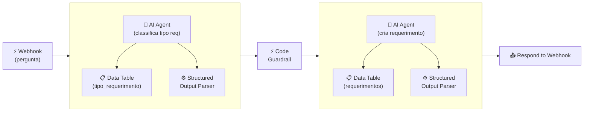

## **Etapa 8:** Design e Validação de Pipelines

---
layout: default
---

# Codificação assistida por IA - Live coding (1)
#### **Workflow de secretaria acadêmica com multiagentes e guardrail (teste regressivo)**

<div class="w-full h-[calc(100%-80px)] flex items-center justify-center">

<Transform :scale="2.8" origin="center">



</Transform>

</div>

<!--
## notes slides

### O workflow de tratamento de erros processa falhas e executa ações corretivas e notificações
-->

---
layout: default
layoutClass: gap-8
---

# Codificação assistida por IA - Live coding (2)
#### **Workflow de secretaria acadêmica com tratamento de erro avançado**

<div class="h-7" />

<WindowMockup color="dark" padding="0.5rem 0.5rem 0.5rem 0.5rem" title="prompt.md" codeblock>

```md {*}{maxHeight:'290px'}
# Papel
Você é um engenheiro de automação especialista em n8n, construção de workflows agênticos e gestão avançada de erros.

# Tarefa
Crie dois workflows no n8n para atendimento de secretaria acadêmica com tratamento de erro avançado:
1. **Workflow Principal (Atendimento):** Recebe uma pergunta de aluno via Webhook, processa via AI Agent conectado à Data Table `requerimentos` e responde de volta via Respond to Webhook.
2. **Workflow de Tratamento de Erro (Error Handling):** Acionado por um nó Error Trigger para tratar falhas no workflow principal, dividindo em duas ramificações paralela:
   - **Ramificação 1 (Classificação e Notificação):** AI Agent classifica o tipo de erro, consulta a Data Table `tipo_erro_responsável` e notifica o responsável via Gmail.
   - **Ramificação 2 (Ação Corretiva Agêntica):** AI Agent consulta a Data Table `tipo_erro_acao` e executa ações de correção via ferramentas (Google Calendar Tool e Google Sheets Tool).

# Contexto
## 1. Tabelas de Dados (`Data Tables`)
- `requerimentos`: Armazena os requerimentos dos alunos (REQ-XXX, nome, tipo, status, data).
- `tipo_erro_responsável`: Mapeia os tipos de erro e os e-mails/responsáveis por cada categoria.
- `tipo_erro_acao`: Mapeia os tipos de erro e as ações automatizadas a serem executadas.

## 2. Detalhamento dos Workflows

### Workflow 1: Atendimento Principal
1. Nó Webhook para receber a pergunta do aluno.
2. Subgráfico com nó AI Agent (Atendimento) conectado à Data Table Tool (`requerimentos`).
3. Nó Respond to Webhook para devolver a resposta gerada ao aluno.

### Workflow 2: Error Handling (Tratamento de Erro)
1. Nó Error Trigger escutando falhas do Workflow Principal (recebe mensagem de erro, id do workflow e data)
2. Nó n8n que obtem dados do workflow via API REST do n8n com base no id do workflow recebido do Erro Trigger. Esse nó deve ramificar em duas ramificações:
3. **Ramificação 1:**
   - AI Agent (Classifica tipo erro).
   - Data Table Tool (`tipo_erro_responsável`).
   - Nó Gmail (Enviar mensagem para o responsável).
4. **Ramificação 2:**
   - Subgráfico contendo AI Agent de resolução.
   - Data Table Tool (`tipo_erro_acao`).
   - Ferramentas `Google Calendar Tool` e `Google Sheets Tool`.

## 3. Mais detalhamento do workflow
1. Configure as System Messages dos AI Agents com seus papéis específicos.
2. Simule dados na tabela `requerimentos`.
3. Simule dados nas tabelas `tipo_erro_responsável` e `tipo_erro_acao` considerando os tipos de erro: `falha_conexao` e `fonte_inexistente`.
4. Adicione um Stick Note para explicar os dois tipos de erro que podem ser configurados propositalmente: `falha_conexao` (API KEY errada) e `fonte_inexistente` (ID da tabela errado).
5. Adicione Stick Notes explicativos com instruções de teste e configuração das credenciais e Error Trigger.

# Regras de Expressões e Boas Práticas
- Sempre use aspas simples (') ao referenciar nomes de nós em expressões n8n.
```
</WindowMockup>

<!--
## notes slides

### O prompt orienta a criação completa da solução em dois workflows no n8n: Atendimento Principal e Tratamento de Erros
### Detalha o uso de AI Agents, Data Tables específicas (requerimentos, tipo_erro_responsável, tipo_erro_acao) e ferramentas de integração (Gmail, Calendar, Sheets)
-->

---
layout: two-cols-header
layoutClass: gap-8
class: flex items-center justify-center
---

# Comunicação em sistemas de multiagentes
#### **A comunicação entre agentes cooperativos pode ser refinada com prompts avançados**

<div class="h-1" />

::left::

<div class="text-lg w-full self-start [&_ul]:my-5 [&_li]:mb-6">

- Usar **saídas estruturadas** é uma boa prática para comunicação entre agentes.
- Em razão da natureza **estocástica (probabilística)** e **não determinística** dos LLMs, é importante adotar camadas de verificação e segurança na troca de informações entre agentes.

</div>

::right::

<div class="flex items-center justify-center h-full">
  <div class="i-ri-robot-2-line text-[14rem] text-purple-300" />
</div>

<!--
## notes slides

### A utilização de saídas estruturadas (JSON / Schema) reduz ambiguidades na comunicação entre agentes
### Adicionar validações e rotinas de segurança mitiga falhas causadas pelo comportamento estocástico dos LLMs
-->

---
layout: two-cols-header
layoutClass: gap-8
class: flex items-center justify-center
---

# Guardrail em sistemas agênticos
#### **Guardrails funcionam como uma camada de verificação no fluxo de dados com LLMs**

<div class="h-8" />

::left::

<div class="text-lg w-full self-start [&_ul]:my-5 [&_li]:mb-6">

- Os LLMs podem ocasionalmente gerar **saídas fora do contrato** estabelecido por um schema de saída, mesmo com temperatura igual a zero.
- Em razão da **natureza não determinística**, não se deve confiar cegamente na saída de LLMs para acionar **nós críticos**, especialmente os transacionais (ex: emitir pagamento, inserir em banco de dados, enviar um e-mail).

</div>

::right::

<div class="flex items-center justify-center h-full">
  <div class="i-ri-shield-check-line text-[14rem] text-purple-300" />
</div>

<!--
## notes slides

### Guardrails validam e sanitizam as saídas dos modelos antes que elas cheguem aos nós de execução
### Evitam execuções indevidas em operações transacionais e críticas em caso de alucinação ou quebra de formato
-->

---
layout: default
---

# Tipos de Guardrail
#### **Guardrails sintáticos/estruturais funcionam como testes regressivos com agentes**

<div class="h-8" />

<div class="[&_table]:w-full text-sm">

| **TIPO** | **O QUE FAZ** | **ATUAÇÃO** |
| --- | --- | --- |
| **Input Guardrail** | Bloqueia Prompt Injection, filtra dados sensíveis (PII), valida a pergunta do usuário. | Antes do LLM |
| **Guardrail Semântico / Segurança** | Avalia se a resposta tem alucinações graves, toxicidade, tom inadequado ou viola diretrizes. | Na saída do LLM |
| **Guardrail Estrutural / Sintático** | Valida conformidade estrita de tipos, campos e formato (contrato de dados) antes de acionar ferramentas, APIs ou bancos de dados. | Logo após o LLM |

</div>

<!--
## notes slides

### Diferentes categorias de guardrails protegem o sistema em etapas distintas do fluxo de dados
### Guardrails estruturais atuam como contrato estrito de dados, garantindo previsibilidade e testes regressivos
-->

---
layout: two-cols-header
layoutClass: gap-8
class: flex items-center justify-center
sourceLabel: Reflexion
source: https://arxiv.org/abs/2303.11366
---

# Self-Correction Loop (Loop de auto-correção)
#### **O conceito de Self-Correction Loop usa a ideia de um guardrail para autocorreção**

<div class="h-3" />

::left::

<div class="text-lg w-full self-start [&_ul]:my-5 [&_li]:mb-6">

- O conceito de **Self-Correction Loop** usa um guardrail como critério para autocorreção (*loop engineering*) em X tentativas.
- Um guardrail não precisa ser um ponto de parada, na verdade é uma péssima ideia encerrar um workflow por má formação do output de LLMs.

</div>

::right::

<div class="flex items-center justify-center h-full">
  <div class="i-ri-code-box-line text-[14rem] text-purple-300" />
</div>

<!--
## notes slides

### O Self-Correction Loop permite reavaliar e ajustar as saídas dos modelos automaticamente em caso de falha no guardrail
### Evita a interrupção abrupta de workflows agênticos promovendo resiliência através de tentativas de correção
-->

---
layout: two-cols-header
layoutClass: gap-8
class: flex items-center justify-center
sourceLabel: Output Parser
source: https://docs.n8n.io/integrations/builtin/cluster-nodes/sub-nodes/n8n-nodes-langchain.outputparserstructured/
---

# Structured Outputs com Guardrail
#### **O nó Structured Outputs oferece algumas opções de configuração como guardrail**

<div class="h-3" />

::left::

<div class="text-base w-full self-start [&_ul]:my-1 [&_li]:mb-6">

- A opção **Auto-Fix Format** habilita a tentativa automática de correção de formato executando uma nova chamada ao LLM.
- A opção **Customize Retry Prompt** permite personalizar o prompt de autocorreção enviado ao modelo na re-tentativa, utilizando os placeholders `{instructions}` (esquema/instruções originais), `{completion}` (resposta gerada com falha) e `{error}` (detalhes do erro de validação).

</div>

::right::

<WindowMockup color="dark" padding="0.5rem 0.5rem 0.5rem 0.5rem" title="Retry Prompt" codeblock>

```md {*}{maxHeight:'290px'}
Instructions:
--------------
{instructions}
--------------
Completion:
--------------
{completion}
--------------
Above, the Completion did not satisfy 
the constraints given in the Instructions.
Error:
--------------
{error}
--------------
```

</WindowMockup>

<!--
## notes slides

### O nó Structured Output Parser no n8n oferece mecanismos nativos de guardrail com a funcionalidade Auto-Fix Format
### Permite customizar o prompt de retry injetando as instruções originais, o output com falha e a mensagem de erro para correção precisa
-->

---
layout: two-cols-header
layoutClass: gap-8
class: flex items-center justify-center
sourceLabel: Code node
source: https://docs.n8n.io/integrations/builtin/core-nodes/n8n-nodes-base.code
---

# Nó Code como guardrail
#### **O nó Code também pode ser usado para validar a saída do nó anterior (um agente)**

<div class="h-3" />

::left::

<div class="text-sx w-full self-start [&_ul]:my-10 [&_li]:mb-6">

- O **nó Code** pode ser uma boa alternativa (**determinística**) para validar sintaticamente ou estruturalmente o JSON de saída de um LLM.
- Usar ambas as abordagens é uma excelente prática de camadas sobrepostas de segurança (**defesa em profundidade** - *defense-in-depth*).

</div>

::right::

<WindowMockup color="dark" padding="0.5rem 0.5rem 0.5rem 0.5rem" title="Code Node" codeblock>

```javascript {*}{maxHeight:'290px'}
const rawOutput = $input.first().json.output;

try {
  const data = JSON.parse(rawOutput);
  return [{ json: data }];
} catch (error) {
  throw new Error('JSON inválido!');
}
```

</WindowMockup>

<!--
## notes slides

### O nó Code oferece validação determinística via JavaScript/TypeScript para garantir o schema exato do JSON
### Combinar o Auto-Fix Format (estocástico) com o nó Code (determinístico) estabelece uma estratégia sólida de defesa em profundidade
-->