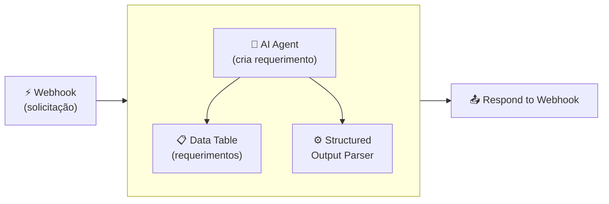
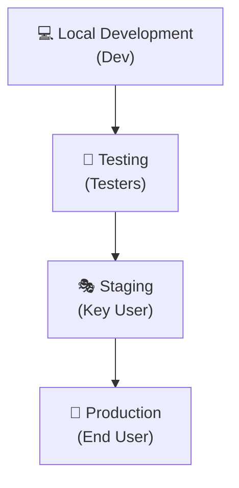
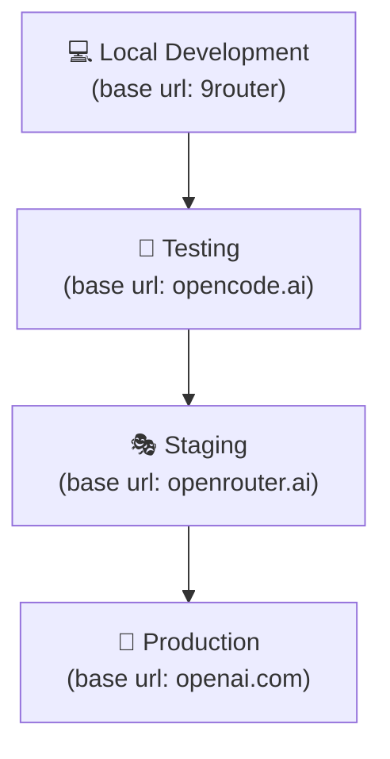
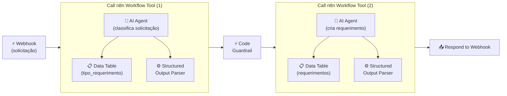

## **Etapa 9:** Preparação para Escala n8n

---
layout: default
---

# Codificação assistida por IA - Live coding (1)
#### **Workflow com agentes simples para promover entre ambientes (DEV e PROD)**

<div class="w-full h-[calc(100%-80px)] flex items-center justify-center">

<Transform :scale="2.5" origin="center">



</Transform>

</div>

<!--
## notes slides

### O workflow processa solicitações de alunos com arquitetura agêntica e Data Tables
### Integra Structured Output Parser para formatação e validação das respostas
-->

---
layout: default
layoutClass: gap-8
---

# Codificação assistida por IA - Live coding (2)
#### **Workflow com agentes simples para promover entre ambientes (DEV e PROD)**

<div class="h-7" />

<WindowMockup color="dark" padding="0.5rem 0.5rem 0.5rem 0.5rem" title="prompt.md" codeblock>

```md {*}{maxHeight:'290px'}
# Papel
Você é um engenheiro de automação especialista em n8n, construção de workflows agênticos, saídas estruturadas e guardrails.

# Tarefa
Crie um workflow agêntico no n8n para atendimento de secretaria acadêmica para criar requerimentos:
1. **Webhook:** Recebe a solicitação do aluno.
5. **Agente (Criação de Requerimento):** AI Agent que recebe a solicitação do aluno, e cria o novo requerimento via Data Table Tool conectada à tabela `requerimentos`.
6. **Structured Output Parser:** Sub-nó conectado ao agente formata a resposta final em Markdown (contendo número do requerimento, descrição e data de previsão).
7. **Respond to Webhook:** Devolve a resposta formatada ao aluno.
8. **Sticky Notes:** Adicione um sticky note com um exemplo de comando cURL com a requisição para o webhook e outro sticky note de pendência de configuração de credencial (Base URL e API Key).

# Contexto
## 1. Tabelas de Dados (`Data Tables`)
- `requerimentos`: Armazena os requerimentos criados (REQ-XXX, aluno, descricao, data_solicitacao, data_previsao, status).

## 2. Detalhamento do Workflow
1. Configure as System Messages do AI Agent definindo claramente suas responsabilidades.
2. No nó OpenAI Chat Model, desligue a opção "Use Responses API".
3. No nó Structured Output Parser, define o formato de saída em Markdown contendo: Número do Requerimento, Descrição e Data de Previsão de Conclusão.

# Regras de Expressões e Boas Práticas
- Sempre use aspas simples (') ao referenciar nomes de nós em expressões n8n.
```

</WindowMockup>

<!--
## notes slides

### O prompt orienta a criação do workflow de atendimento com arquitetura multiagente, Data Tables e guardrails
### Detalha o uso de Structured Output Parsers com Auto-Fix e o nó Code como validação determinística
-->


---
layout: default
sourceLabel: Community Edition Limitation
source: https://docs.n8n.io/deploy/host-n8n/community-edition-features#community-edition
---

# Git, ambientes e variáveis no n8n (1)
#### **Algumas funcionalidades importantes são integradas no n8n somente em alguns planos**

<div class="flex items-center justify-center h-[calc(100%-80px)]">
  <AssetImg src="n8n/n8n-plans.png" class="max-h-[320px] object-contain rounded-lg shadow-md" />
</div>

<!--
## notes slides

### Algumas funcionalidades como gerenciamento de ambientes, integração nativa com Git e variáveis de ambiente avançadas dependem do plano do n8n
### O plano Community Edition possui limitações em relação aos planos enterprise e cloud pagos
-->

---
layout: two-cols-header
layoutClass: gap-8
class: flex items-center justify-center
sourceLabel: The Twelve-Factor App
source: https://12factor.net/dev-prod-parity
---

# Ambientes de implantação
#### **O uso de vários ambientes de implantação é uma boa prática de engenharia (de software)**

<div class="h-3" />

::left::

<div class="text-sx w-full self-start [&_ul]:my-5 [&_li]:mb-6">

- O fluxo de entrega contínua normalmente segue uma ordem de implantação em diferentes estágios: **Local (Dev)**, **Testing (Testers)**, **Staging (Key User)** e **Production (End User)**.
- O princípio de paridade dev/prod (**12-Factor App**) recomenda que os ambientes sejam o **mais parecidos possível com produção** em termos de SO, CPU, memória RAM e configurações de infraestrutura.

</div>

::right::

<div class="flex items-center justify-center h-full">
  <Transform :scale="0.6" origin="top">



</Transform>
</div>

<!--
## notes slides

### A esteira de implantação garante que alterações passem por testes e validações antes de chegarem aos usuários finais
### Manter a paridade entre ambientes reduz bugs causados por divergências de infraestrutura e configurações
-->

---
layout: two-cols-header
layoutClass: gap-8
class: flex items-center justify-center
sourceLabel: n8n Variables
source: https://docs.n8n.io/code/builtin/environment-variables/
---

# Variáveis de ambiente
#### **O uso de variáveis de ambiente permite ter workflows sem configurações fixas no código**

<div class="h-3" />

::left::

<div class="text-sx w-full self-start [&_ul]:my-5 [&_li]:mb-6">

- O uso de **variáveis de ambiente** permite usar o **mesmo workflow com configurações diferentes** por ambiente, isolando valores específicos (como URLs e chaves) do fluxo.
- No n8n, é necessário fazer uso do nome da variável nas configurações de credenciais e nós utilizando o padrão **`$env.NOME_DA_VARIAVEL`** (ex.: `{{ $env.BASE_URL }}`).

</div>

::right::

<div class="flex items-center justify-center h-full">
  <Transform :scale="0.6" origin="top">



</Transform>
</div>

<!--
## notes slides

### Variáveis de ambiente parametrizam credenciais e URLs de acordo com o ambiente de execução do container
### No n8n, a sintaxe $env.NOME_DA_VARIAVEL lê os valores definidos na inicialização da instância
-->

---
layout: two-cols-header
layoutClass: gap-8
class: flex items-center justify-center
sourceLabel: n8n Docker
source: https://docs.n8n.io/deploy/host-n8n/install-options/install-with-docker
---

# Ambientes de implantação com docker
#### **O docker permite criar vários n8n, que seria uma alternativa de ambiente de implatanção**

<div class="h-0" />

::left::

<div class="text-sx w-full self-start [&_ul]:my-5 [&_li]:mb-6">

- Para rodar **múltiplas instâncias de n8n**, é necessário que o **número da porta externa**, o **nome da instância** e o **diretório do n8n** sejam diferentes entre os ambientes.
- Além disso, o comando `docker` deve considerar **variáveis de ambiente** específicas de cada ambiente (exemplos: `BASE_URL` e `API_KEY`).

</div>

::right::

<WindowMockup color="dark" padding="0.5rem 0.5rem 0.5rem 0.5rem" title="Docker Run (Produção)" codeblock>

```bash {*}{maxHeight:'290px'}
# cria o container do n8n
mkdir -p ~/.n8n-<env> && \
docker run -d \
  --name n8n-<env> \
  -p 5679:5678 \
  --add-host=local:host-gateway \
  -e GENERIC_TIMEZONE="America/Sao_Paulo" \
  -e TZ="America/Sao_Paulo" \
  -e BASE_URL="XXXXX" \
  -e API_KEY="XXXXX" \
  -e N8N_BLOCK_ENV_ACCESS_IN_NODE=false \
  -v ~/.n8n-<env>:/home/node/.n8n \
  -v ~/.n8n-files:/home/node/.n8n-files \
  docker.n8n.io/n8nio/n8n
```

</WindowMockup>

<!--
## notes slides

### O Docker permite criar instâncias isoladas do n8n alterando o nome da instância, porta e diretório de configurações (.n8n)
### O diretório de arquivos (.n8n-files) pode ser mantido o mesmo para compartilhamento de dados entre os ambientes
-->

---
layout: two-cols-header
layoutClass: gap-8
class: flex items-center justify-center
sourceLabel: n8n CLI Reference
source: https://docs.n8n.io/hosting/cli/commands/#export-workflows
---

# Controle de versão e CLI n8n
#### **Junto com a instalação do n8n há uma CLI que pode ser usada para automações**

<div class="h-3" />

::left::

<div class="text-sx w-full self-start [&_ul]:my-5 [&_li]:mb-6">

- Em **cenários corporativos**, é fundamental adotar o **controle de versão (Git)** como a **única fonte da verdade** (_Single Source of Truth_) para os workflows.
- A **CLI do n8n** permite **exportar/importar workflows** e **credenciais** de forma programática via terminal, facilitando o versionamento em repositórios Git.

</div>

::right::

<WindowMockup color="dark" padding="0.5rem 0.5rem 0.5rem 0.5rem" title="Terminal" codeblock>

```bash {*}{maxHeight:'270px'}
# 1. Iniciar terminal interativo no shell sh
docker exec -it n8n-<env> sh

# 2. Import/export workflow/credential
n8n export:workflow --all \
  --output=/home/node/.n8n-files/workflows.json

n8n export:credentials --all --decrypted \
 --output=/home/node/.n8n-files/credentials.json

n8n import:credentials \
--input=/home/node/.n8n-files/credentials.json

n8n import:workflow \
  --input=/home/node/.n8n-files/workflows.json

exit #sai do container
```

</WindowMockup>

<!--
## notes slides

### A CLI do n8n vem pré-instalada junto com a aplicação e permite gerenciar workflows e dados diretamente pelo terminal
### A exportação de workflows via CLI facilita a integração com esteiras de CI/CD e versionamento automatizado no Git
-->


---
layout: two-cols-header
layoutClass: gap-8
class: flex items-center justify-center
---

# Ambiente, git e variável: passo-a-passo (1)
#### **(1) Recriar container DEV com variáveis, (2) usar variáveis no workflow**

<div class="h-3" />

::left::

<WindowMockup color="dark" padding="0.5rem 0.5rem 0.5rem 0.5rem" title="(1) recriar container dev" codeblock>

```bash {9,10,11}{maxHeight:'290px'}
# recria o container do n8n
docker rm -f n8n-dev && \
docker run -d \
  --name n8n-dev \
  -p 5678:5678 \
  --add-host=local:host-gateway \
  -e GENERIC_TIMEZONE="America/Sao_Paulo" \
  -e TZ="America/Sao_Paulo" \
  -e BASE_URL="http://local:20128/v1" \
  -e API_KEY="XXXXX" \
  -e N8N_BLOCK_ENV_ACCESS_IN_NODE=false \
  -e N8N_ENCRYPTION_KEY="n8n" \
  -v ~/.n8n-dev:/home/node/.n8n \
  -v ~/.n8n-files:/home/node/.n8n-files \
  docker.n8n.io/n8nio/n8n
```

</WindowMockup>


::right::

<div class="flex items-center justify-center h-[calc(100%-80px)]">
  <AssetImg src="n8n/n8n-env-var.png" class="max-h-[320px] object-contain rounded-lg shadow-md" />
</div>


---
layout: two-cols-header
layoutClass: gap-8
class: flex items-center justify-center
---

# Ambiente, git e variável: passo-a-passo (2)
#### **(3) Exportar workflows e credenciais em DEV, (4) criar ambiente PROD**

<div class="h-3" />

::left::

<WindowMockup color="dark" padding="0.5rem 0.5rem 0.5rem 0.5rem" title="exportação em DEV" codeblock>

```bash {*}{maxHeight:'270px'}
# 1. entra no container
docker exec -it n8n-dev sh

# 2. exporta workflow
n8n export:workflow --all \
  --output=\
/home/node/.n8n-files/workflows.json

# 3. exporta credenciais
n8n export:credentials --all --decrypted \
 --output=\
/home/node/.n8n-files/credentials.json

# 4. exporta tabelas
n8n export:entities --decrypted \
--outputDir=\
/home/node/.n8n-files/database

# 5. sai do container
exit #sai do container
```

</WindowMockup>


::right::

<WindowMockup color="dark" padding="0.5rem 0.5rem 0.5rem 0.5rem" title="criar container prod" codeblock>

```bash {5,9,10,11}{maxHeight:'270px'}
# cria o container do n8n
mkdir -p ~/.n8n-prod && \
docker run -d \
  --name n8n-prod \
  -p 5679:5678 \
  --add-host=local:host-gateway \
  -e GENERIC_TIMEZONE="America/Sao_Paulo" \
  -e TZ="America/Sao_Paulo" \
  -e BASE_URL="https://openrouter.ai/api/v1" \
  -e API_KEY="XXXXX" \
  -e N8N_BLOCK_ENV_ACCESS_IN_NODE=false \
  -e N8N_ENCRYPTION_KEY="n8n" \
  -v ~/.n8n-prod:/home/node/.n8n \
  -v ~/.n8n-files:/home/node/.n8n-files \
  docker.n8n.io/n8nio/n8n
```

</WindowMockup>


---
layout: two-cols-header
layoutClass: gap-8
class: flex items-center justify-center
---

# Ambiente, git e variável: passo-a-passo (3)
#### **(5) Importação das credenciais e workflows em PROD, (6) teste do workflow em PROD**

<div class="h-3" />

::left::

<WindowMockup color="dark" padding="0.5rem 0.5rem 0.5rem 0.5rem" title="importação em PROD" codeblock>

```bash {*}{maxHeight:'270px'}
# 1. entra no container
docker exec -it n8n-dev sh

# 2. importa credencial
n8n import:credentials \
--input=\
/home/node/.n8n-files/credentials.json

# 3. importa tabelas
n8n import:entities --truncateTables \
--inputDir=\
/home/node/.n8n-files/database

# 4. importa workflows
n8n import:workflow \
--input=\
/home/node/.n8n-files/workflows.json

exit #sai do container
```

</WindowMockup>


::right::

<WindowMockup color="dark" padding="0.5rem 0.5rem 0.5rem 0.5rem" title="teste em PROD" codeblock>

```bash {*}{maxHeight:'290px'}
curl -X POST \
http://localhost:5679/webhook-test/atendimento-secretaria \
  -H "Content-Type: application/json" \
  -d '{
    "pergunta": "Qual é o prazo do requerimento 123",
    "aluno": "João Silva",
    "matricula": "20241001",
  }'
```

</WindowMockup>


---
layout: two-cols-header
layoutClass: gap-8
class: flex items-center justify-center
---

# Ambiente, git e variável: passo-a-passo (4)
#### **(7) Alguns ajustes podem ser necessários após a promoção entre ambientes**

<div class="h-0" />

::left::

<div class="text-sx w-full self-start [&_ul]:my-0 [&_li]:mb-6">

- A exportação e importação das tabelas pode ser feita **exportando e importando CSV** na própria interface UI do n8n.
- **Ajustes nas credenciais** para usar as variáveis de ambientes também podem ser necessárias.
- Em cenários empresariais/corporativos, **todo o ciclo de vida** de lançamento de novas versões de software é **realizado de forma automatizada**.

</div>

::right::

<div class="flex items-center justify-center h-[calc(100%-80px)]">
  <AssetImg src="n8n/n8n-datatable-import.png" class="max-h-[320px] object-contain rounded-lg shadow-md" />
</div>


<!--
## notes slides

### A CLI do n8n vem pré-instalada junto com a aplicação e permite gerenciar workflows e dados diretamente pelo terminal
### A exportação de workflows via CLI facilita a integração com esteiras de CI/CD e versionamento automatizado no Git
-->

---
layout: default
---

# Codificação assistida por IA - Live coding (1)
#### **Workflow de secretaria acadêmica com _n8n Workflow Tool (Army of Agents)_**

<div class="w-full h-[calc(100%-80px)] flex items-center justify-center">

<Transform :scale="2.8" origin="center">



</Transform>

</div>

<!--
## notes slides

### O workflow processa solicitações de alunos com arquitetura multiagente, Data Tables e guardrails
### Integra Structured Output Parsers e nó Code como camada de teste regressivo e validação determinística
-->

---
layout: default
layoutClass: gap-8
---

# Codificação assistida por IA - Live coding (2)
#### **Workflow de secretaria acadêmica com _n8n Workflow Tool (Army of Agents)_**

<div class="h-7" />

<WindowMockup color="dark" padding="0.5rem 0.5rem 0.5rem 0.5rem" title="prompt.md" codeblock>

```md {*}{maxHeight:'290px'}
# Papel
Você é um engenheiro de automação especialista em n8n, construção de workflows agênticos modulares (Army of Agents), saídas estruturadas e guardrails.

# Tarefa
Crie 3 workflows no n8n para atendimento de secretaria acadêmica com arquitetura agêntica modular (Army of Agents) utilizando o nó Call n8n Workflow Tool:

1. **Workflow Principal (Orquestrador - Webhook):**
   - **Webhook:** Recebe a solicitação do aluno.
   - **Agente Orquestrador (General):** AI Agent principal responsável por coordenar a triagem e execução dos sub-workflows.
   - **Call n8n Workflow Tool (Ferramenta 1):** Sub-nó conectado ao agente orquestrador para chamar o workflow do Agente de Classificação.
   - **Call n8n Workflow Tool (Ferramenta 2):** Sub-nó conectado ao agente orquestrador para chamar o workflow do Agente de Criação de Requerimento.
   - **Respond to Webhook:** Devolve a resposta final formatada ao aluno.
   - **Sticky Notes:** Adicione um sticky note com exemplo de cURL para o webhook e outro avisando da configuração de credenciais e IDs de sub-workflows.

2. **Sub-workflow 1 (Agente de Classificação):**
   - **Sub-workflow Trigger:** Recebe os dados da solicitação do aluno.
   - **Agente de Classificação:** AI Agent conectado à Data Table `tipo_requerimento` (contendo os tipos de requerimento e descrições para auxiliar a classificação).
   - **Structured Output Parser:** Sub-nó que formata a saída da classificação em JSON, com `Auto-Fix Format` e `Customize Retry Prompt`.
   - **Code Guardrail (Nó Code):** Nó JavaScript para validação sintática determinística do JSON (`JSON.parse`).

3. **Sub-workflow 2 (Agente de Criação de Requerimento):**
   - **Sub-workflow Trigger:** Recebe a classificação validada e os dados do aluno.
   - **Agente de Criação de Requerimento:** AI Agent que cria o novo registro via Data Table Tool na tabela `requerimentos`.
   - **Structured Output Parser:** Sub-nó que formata a resposta final em Markdown (com número do requerimento, descrição e data de previsão).

# Contexto
## 1. Tabelas de Dados (`Data Tables`)
- `tipo_requerimento`: Armazena os tipos de requerimentos disponíveis (ex: `trancamento`, `declaracao_matricula`, `revisao_nota`) com suas respectivas descrições explicativas.
- `requerimentos`: Armazena os requerimentos criados (REQ-XXX, aluno, tipo, descricao, data_solicitacao, data_previsao, status).

## 2. Detalhamento dos Workflows
1. Configure as System Messages do Agente Orquestrador (General) e de cada um dos Agentes especialistas nos sub-workflows.
2. Nos nós OpenAI Chat Model, desligue a opção "Use Responses API".
3. No sub-workflow 1, configure o Structured Output Parser para exigir os campos de classificação e o nó Code para validação sintática.
4. No sub-workflow 2, configure o Structured Output Parser em Markdown contendo Número do Requerimento, Descrição e Data de Previsão.
5. No Workflow Principal, conecte os sub-workflows 1 e 2 como ferramentas (*tools*) do Agente Orquestrador usando nós `Call n8n Workflow Tool`.
6. Simule dados iniciais na tabela `tipo_requerimento` com registros de exemplo.

# Regras de Expressões e Boas Práticas
- Sempre use aspas simples (') ao referenciar nomes de nós em expressões n8n.
```

</WindowMockup>

<!--
## notes slides

### O prompt orienta a criação de 3 workflows modulares com arquitetura Army of Agents e Call n8n Workflow Tool
### Utiliza um Agente Orquestrador no fluxo principal e sub-workflows dedicados para Classificação e Criação de Requerimento
-->

---
layout: two-cols-header
layoutClass: gap-8
class: flex items-center justify-center
---

# Arquitetura Army of Agents
#### **Army of Agents é um paradigma de arquitetura agêntica de IA**

<div class="h-5" />

::left::

<div class="text-lg w-full self-start [&_ul]:my-5 [&_li]:mb-6">

- Em vez de depender de um único **agente de IA monolítico**, o sistema coordena **dezenas, centenas ou milhares de agentes autônomos**, especializados e com escopos restritos.
- A arquitetura **Army of Agents** normalmente trabalha com um **agente orquestrador (General)** de alto raciocínio e dezenas de **agentes workers (soldados)**.

</div>

::right::

<div class="flex items-center justify-center h-full">
  <div class="i-ri-team-line text-[14rem] text-purple-300" />
</div>

<!--
## notes slides

### A arquitetura Army of Agents substitui agentes monolíticos por dezenas de agentes autônomos e especializados
### Utiliza um agente orquestrador (General) para coordenação e múltiplos agentes workers (soldados) para execução
-->

---
layout: two-cols-header
layoutClass: gap-8
class: flex items-center justify-center
sourceLabel: Call n8n Workflow Tool
source: https://docs.n8n.io/integrations/builtin/cluster-nodes/sub-nodes/n8n-nodes-langchain.toolworkflow
---

# n8n Workflow Tool (sub-node)
#### **O nó n8n Workflow Tool permite ser usado como ferramenta por agentes de IA**

<div class="h-5" />

::left::

<div class="text-lg w-full self-start [&_ul]:my-5 [&_li]:mb-6">

- Permite conectar outro **workflow do n8n como uma ferramenta (tool)** acionável por um AI Agent em arquiteturas agênticas modulares e *Army of Agents*.
- Facilita a **encapsulação de lógicas complexas**, integração com sistemas externos e reutilização de sub-workflows com entradas e saídas estruturadas.

</div>

::right::

<div class="flex items-center justify-center h-full">
  <N8nNode
    icon-src="n8n/nodes/call-n8n-sub-workflow-tool.svg"
    label="Call n8n Workflow Tool"
    type="action"
    scale="1.4"
  />
</div>

<!--
## notes slides

### O subnó Call n8n Workflow Tool permite expor um sub-workflow completo como ferramenta para um AI Agent
### Promove a modularidade de arquiteturas agênticas permitindo encapsular lógicas complexas em fluxos dedicados
-->

---
layout: default
---

# Hands-on

<br/>

🛠️ &nbsp;**Exercício \#1:** Crie um sub-workflow agêntico para classificar.

🛠️ &nbsp;**Exercício \#2:** Crie um sub-workflow agêntico para consultar.

🛠️ &nbsp;**Exercício \#3:** Crie um workflow agêntico que use os dois sub-workflows.

🛠️ &nbsp;**Exercício \#4:** Faça a implantação dos workflows de DEV para o ambiente PROD.

<br/>

- [ ] &nbsp;use o nó sub-workflow trigger nos sub-workflows
- [ ] &nbsp;use Structured Output Parser como guardrail
- [ ] &nbsp;use o nó Call n8n Workflow Tool para chamar os sub-workflows
- [ ] &nbsp;use docker para criar uma nova instância n8n para o ambiente PROD

<br/>

<!--
# Exercício #1 — Sub-workflow agêntico de classificação
Crie um sub-workflow com Sub-workflow Trigger, AI Agent conectado à Data Table de tipos de requerimento e Structured Output Parser para classificar as solicitações.

# Exercício #2 — Sub-workflow agêntico de consulta e criação
Crie um sub-workflow com Sub-workflow Trigger, AI Agent conectado à Data Table de requerimentos e Structured Output Parser para consultar e registrar novos requerimentos.

# Exercício #3 — Workflow orquestrador com Call n8n Workflow Tool
Crie o workflow principal com Webhook, Agente Orquestrador (General) e sub-nós Call n8n Workflow Tool para integrar e executar os dois sub-workflows.

# Exercício #4 — Implantação de DEV para PROD
Exporte a estrutura dos 3 workflows do ambiente de desenvolvimento (DEV) e realize a implantação no ambiente de produção (PROD) ajustando variáveis de ambiente e credenciais.
-->