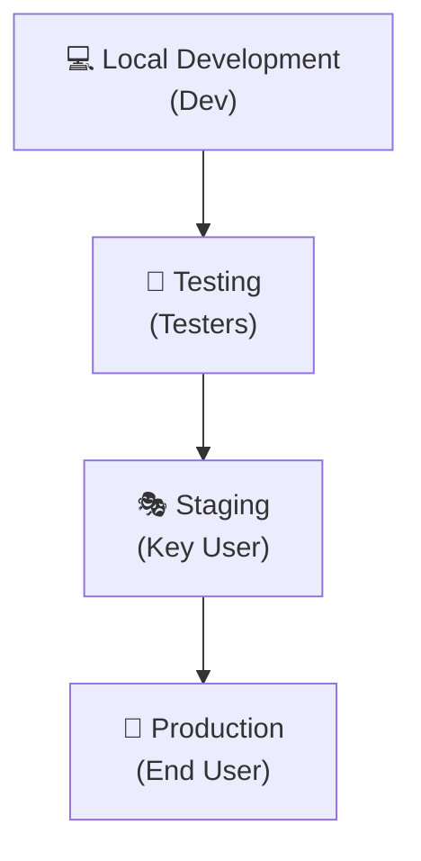
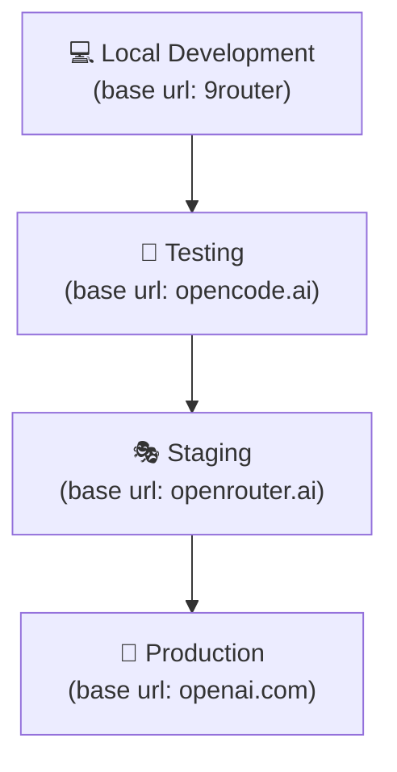

## **Etapa 9:** Preparação para Escala n8n


---
layout: default
sourceLabel: Community Edition Limitation
source: https://docs.n8n.io/deploy/host-n8n/community-edition-features#community-edition
---

# Git, ambientes e variáveis no n8n (1)
#### **Algumas funcionalidades importantes são integradas no n8n somente em alguns planos**

<div class="flex items-center justify-center h-[calc(100%-80px)]">
  <AssetImg src="n8n/n8n-plans.png" class="max-h-[320px] object-contain rounded-lg shadow-md" />
</div>

<!--
## notes slides

### Algumas funcionalidades como gerenciamento de ambientes, integração nativa com Git e variáveis de ambiente avançadas dependem do plano do n8n
### O plano Community Edition possui limitações em relação aos planos enterprise e cloud pagos
-->

---
layout: two-cols-header
layoutClass: gap-8
class: flex items-center justify-center
sourceLabel: The Twelve-Factor App
source: https://12factor.net/dev-prod-parity
---

# Ambientes de implantação
#### **O uso de vários ambientes de implantação é uma boa prática de engenharia (de software)**

<div class="h-3" />

::left::

<div class="text-sx w-full self-start [&_ul]:my-5 [&_li]:mb-6">

- O fluxo de entrega contínua normalmente segue uma ordem de implantação em diferentes estágios: **Local (Dev)**, **Testing (Testers)**, **Staging (Key User)** e **Production (End User)**.
- O princípio de paridade dev/prod (**12-Factor App**) recomenda que os ambientes sejam o **mais parecidos possível com produção** em termos de SO, CPU, memória RAM e configurações de infraestrutura.

</div>

::right::

<div class="flex items-center justify-center h-full">
  <Transform :scale="0.6" origin="top">



</Transform>
</div>

<!--
## notes slides

### A esteira de implantação garante que alterações passem por testes e validações antes de chegarem aos usuários finais
### Manter a paridade entre ambientes reduz bugs causados por divergências de infraestrutura e configurações
-->

---
layout: two-cols-header
layoutClass: gap-8
class: flex items-center justify-center
sourceLabel: n8n Variables
source: https://docs.n8n.io/code/builtin/environment-variables/
---

# Variáveis de ambiente
#### **O uso de variáveis de ambiente permite ter workflows sem configurações fixas no código**

<div class="h-3" />

::left::

<div class="text-sx w-full self-start [&_ul]:my-5 [&_li]:mb-6">

- O uso de **variáveis de ambiente** permite usar o **mesmo workflow com configurações diferentes** por ambiente, isolando valores específicos (como URLs e chaves) do fluxo.
- No n8n, é necessário fazer uso do nome da variável nas configurações de credenciais e nós utilizando o padrão **`$env.NOME_DA_VARIAVEL`** (ex.: `{{ $env.BASE_URL }}`).

</div>

::right::

<div class="flex items-center justify-center h-full">
  <Transform :scale="0.6" origin="top">



</Transform>
</div>

<!--
## notes slides

### Variáveis de ambiente parametrizam credenciais e URLs de acordo com o ambiente de execução do container
### No n8n, a sintaxe $env.NOME_DA_VARIAVEL lê os valores definidos na inicialização da instância
-->

---
layout: two-cols-header
layoutClass: gap-8
class: flex items-center justify-center
sourceLabel: n8n Docker
source: https://docs.n8n.io/deploy/host-n8n/install-options/install-with-docker
---

# Ambientes de implantação com docker
#### **O docker permite criar vários n8n, que seria uma alternativa de ambiente de implatanção**

<div class="h-0" />

::left::

<div class="text-sx w-full self-start [&_ul]:my-5 [&_li]:mb-6">

- Para rodar **múltiplas instâncias de n8n**, é necessário que o **número da porta externa**, o **nome da instância** e o **diretório do n8n** sejam diferentes entre os ambientes.
- Além disso, o comando `docker` deve considerar **variáveis de ambiente** específicas de cada ambiente (exemplos: `BASE_URL` e `API_KEY`).

</div>

::right::

<WindowMockup color="dark" padding="0.5rem 0.5rem 0.5rem 0.5rem" title="Docker Run (Produção)" codeblock>

```bash {*}{maxHeight:'290px'}
# cria o container do n8n
mkdir -p ~/.n8n-<env> && \
docker run -d \
  --name n8n-<env> \
  -p 5679:5678 \
  --add-host=local:host-gateway \
  -e GENERIC_TIMEZONE="America/Sao_Paulo" \
  -e TZ="America/Sao_Paulo" \
  -e BASE_URL="XXXXX" \
  -e API_KEY="XXXXX" \
  -e N8N_BLOCK_ENV_ACCESS_IN_NODE=false \
  -v ~/.n8n-<env>:/home/node/.n8n \
  -v ~/.n8n-files:/home/node/.n8n-files \
  docker.n8n.io/n8nio/n8n
```

</WindowMockup>

<!--
## notes slides

### O Docker permite criar instâncias isoladas do n8n alterando o nome da instância, porta e diretório de configurações (.n8n)
### O diretório de arquivos (.n8n-files) pode ser mantido o mesmo para compartilhamento de dados entre os ambientes
-->

---
layout: two-cols-header
layoutClass: gap-8
class: flex items-center justify-center
sourceLabel: n8n CLI Reference
source: https://docs.n8n.io/hosting/cli/commands/#export-workflows
---

# Controle de versão e CLI n8n
#### **Junto com a instalação do n8n há uma CLI que pode ser usada para automações**

<div class="h-3" />

::left::

<div class="text-sx w-full self-start [&_ul]:my-5 [&_li]:mb-6">

- Em **cenários corporativos**, é fundamental adotar o **controle de versão (Git)** como a **única fonte da verdade** (_Single Source of Truth_) para os workflows.
- A **CLI do n8n** permite **exportar/importar workflows** e **credenciais** de forma programática via terminal, facilitando o versionamento em repositórios Git.

</div>

::right::

<WindowMockup color="dark" padding="0.5rem 0.5rem 0.5rem 0.5rem" title="Terminal" codeblock>

```bash {*}{maxHeight:'270px'}
# 1. Iniciar terminal interativo no shell sh
docker exec -it n8n-<env> sh

# 2. Import/export workflow/credential
n8n export:workflow --all \
  --output=/home/node/.n8n-files/workflows.json

n8n export:credentials --all --decrypted \
 --output=/home/node/.n8n-files/credentials.json

n8n import:credentials \
--input=/home/node/.n8n-files/credentials.json

n8n import:workflow \
  --input=/home/node/.n8n-files/workflows.json

exit #sai do container
```

</WindowMockup>

<!--
## notes slides

### A CLI do n8n vem pré-instalada junto com a aplicação e permite gerenciar workflows e dados diretamente pelo terminal
### A exportação de workflows via CLI facilita a integração com esteiras de CI/CD e versionamento automatizado no Git
-->


---
layout: two-cols-header
layoutClass: gap-8
class: flex items-center justify-center
---

# Ambiente, git e variável: passo-a-passo (1)
#### **(1) Recriar container DEV com variáveis, (2) usar variáveis no workflow**

<div class="h-3" />

::left::

<WindowMockup color="dark" padding="0.5rem 0.5rem 0.5rem 0.5rem" title="(1) recriar container dev" codeblock>

```bash {9,10,11}{maxHeight:'290px'}
# recria o container do n8n
docker rm -f n8n-dev && \
docker run -d \
  --name n8n-dev \
  -p 5678:5678 \
  --add-host=local:host-gateway \
  -e GENERIC_TIMEZONE="America/Sao_Paulo" \
  -e TZ="America/Sao_Paulo" \
  -e BASE_URL="http://local:20128/v1" \
  -e API_KEY="XXXXX" \
  -e N8N_BLOCK_ENV_ACCESS_IN_NODE=false \
  -e N8N_ENCRYPTION_KEY="n8n" \
  -v ~/.n8n-dev:/home/node/.n8n \
  -v ~/.n8n-files:/home/node/.n8n-files \
  docker.n8n.io/n8nio/n8n
```

</WindowMockup>


::right::

<div class="flex items-center justify-center h-[calc(100%-80px)]">
  <AssetImg src="n8n/n8n-env-var.png" class="max-h-[320px] object-contain rounded-lg shadow-md" />
</div>


---
layout: two-cols-header
layoutClass: gap-8
class: flex items-center justify-center
---

# Ambiente, git e variável: passo-a-passo (2)
#### **(3) Exportar workflows e credenciais em DEV, (4) criar ambiente PROD**

<div class="h-3" />

::left::

<WindowMockup color="dark" padding="0.5rem 0.5rem 0.5rem 0.5rem" title="exportação em DEV" codeblock>

```bash {*}{maxHeight:'270px'}
# 1. entra no container
docker exec -it n8n-dev sh

# 2. exporta workflow
n8n export:workflow --all \
  --output=\
/home/node/.n8n-files/workflows.json

# 3. exporta credenciais
n8n export:credentials --all --decrypted \
 --output=\
/home/node/.n8n-files/credentials.json

# 4. exporta tabelas
n8n export:entities --decrypted \
--outputDir=\
/home/node/.n8n-files/database

# 5. sai do container
exit #sai do container
```

</WindowMockup>


::right::

<WindowMockup color="dark" padding="0.5rem 0.5rem 0.5rem 0.5rem" title="criar container prod" codeblock>

```bash {5,9,10,11}{maxHeight:'270px'}
# cria o container do n8n
mkdir -p ~/.n8n-prod && \
docker run -d \
  --name n8n-prod \
  -p 5679:5678 \
  --add-host=local:host-gateway \
  -e GENERIC_TIMEZONE="America/Sao_Paulo" \
  -e TZ="America/Sao_Paulo" \
  -e BASE_URL="https://openrouter.ai/api/v1" \
  -e API_KEY="XXXXX" \
  -e N8N_BLOCK_ENV_ACCESS_IN_NODE=false \
  -e N8N_ENCRYPTION_KEY="n8n" \
  -v ~/.n8n-prod:/home/node/.n8n \
  -v ~/.n8n-files:/home/node/.n8n-files \
  docker.n8n.io/n8nio/n8n
```

</WindowMockup>


---
layout: two-cols-header
layoutClass: gap-8
class: flex items-center justify-center
---

# Ambiente, git e variável: passo-a-passo (3)
#### **(5) Importação das credenciais e workflows em PROD, (6) teste do workflow em PROD**

<div class="h-3" />

::left::

<WindowMockup color="dark" padding="0.5rem 0.5rem 0.5rem 0.5rem" title="importação em PROD" codeblock>

```bash {*}{maxHeight:'270px'}
# 1. entra no container
docker exec -it n8n-dev sh

# 2. importa credencial
n8n import:credentials \
--input=\
/home/node/.n8n-files/credentials.json

# 3. importa tabelas
n8n import:entities --truncateTables \
--inputDir=\
/home/node/.n8n-files/database

# 4. importa workflows
n8n import:workflow \
--input=\
/home/node/.n8n-files/workflows.json

exit #sai do container
```

</WindowMockup>


::right::

<WindowMockup color="dark" padding="0.5rem 0.5rem 0.5rem 0.5rem" title="teste em PROD" codeblock>

```bash {*}{maxHeight:'290px'}
curl -X POST \
http://localhost:5679/webhook-test/atendimento-secretaria \
  -H "Content-Type: application/json" \
  -d '{
    "pergunta": "Qual é o prazo do requerimento 123",
    "aluno": "João Silva",
    "matricula": "20241001",
  }'
```

</WindowMockup>


---
layout: two-cols-header
layoutClass: gap-8
class: flex items-center justify-center
---

# Ambiente, git e variável: passo-a-passo (4)
#### **(7) Alguns ajustes podem ser necessários após a promoção entre ambientes**

<div class="h-0" />

::left::

<div class="text-sx w-full self-start [&_ul]:my-0 [&_li]:mb-6">

- A exportação e importação das tabelas pode ser feita **exportando e importando CSV** na própria interface UI do n8n.
- **Ajustes nas credenciais** para usar as variáveis de ambientes também podem ser necessárias.
- Em cenários empresariais/corporativos, **todo o ciclo de vida** de lançamento de novas versões de software é **realizado de forma automatizada**.

</div>

::right::

<div class="flex items-center justify-center h-[calc(100%-80px)]">
  <AssetImg src="n8n/n8n-datatable-import.png" class="max-h-[320px] object-contain rounded-lg shadow-md" />
</div>


<!--
## notes slides

### A CLI do n8n vem pré-instalada junto com a aplicação e permite gerenciar workflows e dados diretamente pelo terminal
### A exportação de workflows via CLI facilita a integração com esteiras de CI/CD e versionamento automatizado no Git
-->